# Lecture 1 — Introduction

**EECE 7398 — Analysis & Design of Photonic Integrated Circuits (PICs)** · Northeastern University, Dept. of Electrical & Computer Engineering · Spring 2023

---

## Overview

The subject of this course is the **analysis and design of photonic integrated circuits (PICs)**. By definition, PICs operate on and process **optical signals** — coherent light waves that carry information (i.e. digital data).

Similar to their electronic IC counterpart (**EICs**), which are based on electronic-circuit building blocks, PICs are based on **photonic-circuit building blocks**. Some examples of photonic building blocks include:

- Waveguides & couplers
- Phase shifters & delay lines
- Resonators & filters
- Laser sources & amplifiers
- Modulators & switches
- Photodetectors

When these building blocks are integrated on a single chip, the same major benefits as for EICs are reaped: small **size**, lower **cost**, reduced **power** consumption, and high **reliability**.

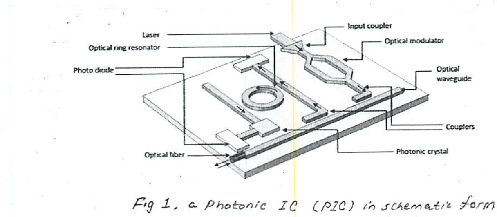

*Fig 1. A photonic IC (PIC) in schematic form.*

### Key building blocks (in reference to Fig 1)

- **Laser:** a semiconductor source of coherent light powering the PIC. It plays the equivalent role to the DC power supply in EICs.
- **Modulator:** an electro-optical device that permits encoding the light with the data.
- **Waveguides & couplers:** permit transport and coupling of optical waves *through* and *between* waveguides, respectively.
- **Resonator:** permits optical wavelength-selective processing.
- **Photodiode:** a semiconductor device capable of detection of optical signals and the extraction of their data content.

---

## Application Areas

Thanks to their high **bandwidth**, low **power** consumption, and low **latency**, PICs have established themselves as a high-speed enabler in numerous **data-intensive** applications.*

Examples of such systems are many:

- Optical networks (LAN, MAN, WAN, Internet)
- Data centers (cloud)
- High-performance computing (HPC)
- Neural networks & AI
- Cellular networks: 4G-LTE, 5G, 6G (future)

**Perspective:** while electronic-processing speeds top out at ~10's Gb/s, for photonic-processing the speed is significantly faster, ~Tb/s and higher.

> \* The persistent "explosion" in the amounts of data being processed and stored today makes the need for PICs even more acute. More data simply demands higher speed.

---

## Material Systems (Technologies)

The following are the various material systems (technologies) used in PICs:

- **"Major":**
  - InP
  - GaAs
  - SiPh (SOI)
- LiNbO₃
- Si₃N₄
- Silica (on Si)

Among the three major technologies, **SiPh** is a "late comer", while the III–V pair (**InP & GaAs**) are viewed as "old players". The technology for silicon photonics (SiPh) is compatible with the **SOI CMOS process**, permitting sharing one Si chip for both electronic and photonic circuit functions. Thus SiPh holds the great promise of providing powerful design solutions through **electronic–photonic mixed design**.

Accordingly, this course's focus will be **silicon photonics**. Attention, however, will also be given to the **III–V** compound semiconductors InP and GaAs. Valuable perspective on these three major technologies can be gleaned from the graph below (Fig 2) showing the evolution of their share of the "high-speed Ethernet market".

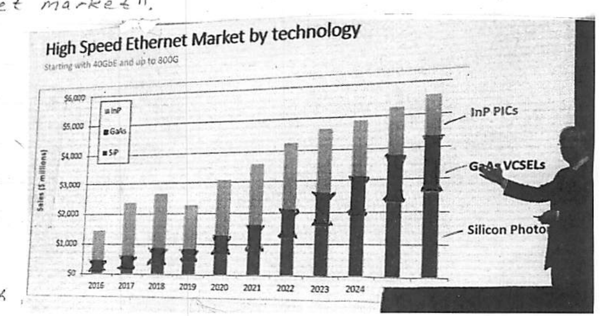

*Fig 2. Market share of SiPh, InP and GaAs.*

---

## Speed and Integration

The evolution of Ethernet speed (b/s) is given below in Fig 3.

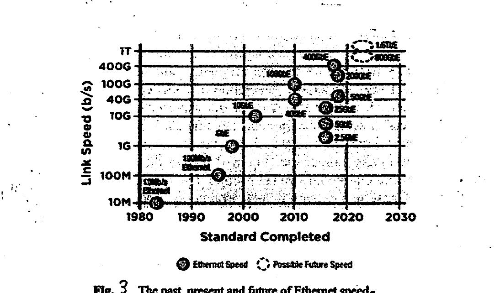

*Fig 3. The past, present and future of Ethernet speed.*

For information purposes, the level of integration of PICs (components/chip) is shown in Fig 4 below.

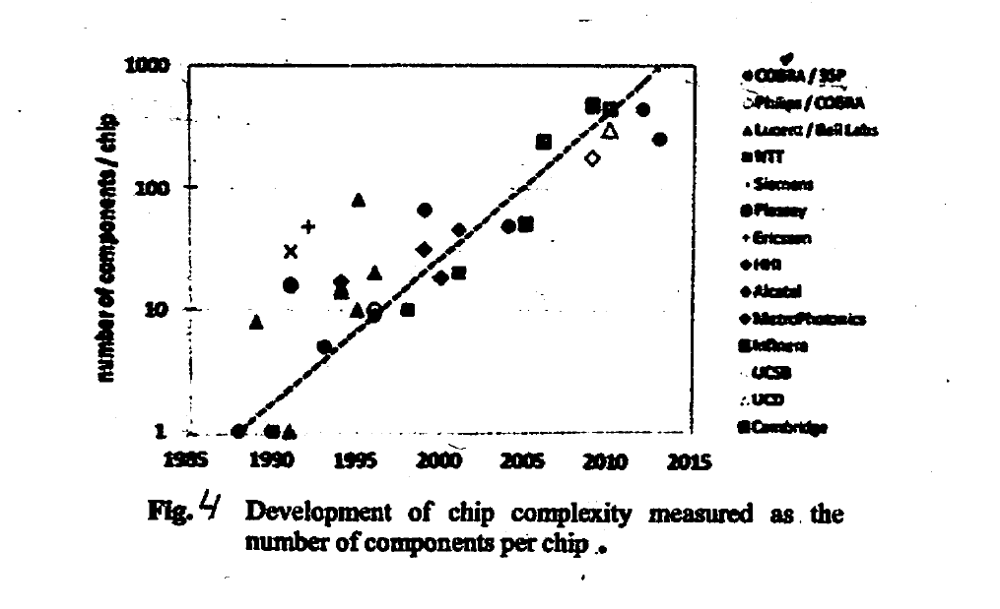

*Fig 4. Development of chip complexity measured as the number of components per chip.*

---

## The Optical Spectrum

As shown below (Fig 5), the optical spectrum is flanked by microwave (μW) and X-rays. It contains the **UV**, **visible**, and **IR** regions and extends over 5 decades, with wavelengths from **10 nm to 1 mm**. Importantly, note the very narrow **visible** part (400–700 nm), and the extra-wide **infrared (IR)** region (700 nm – 1 mm).

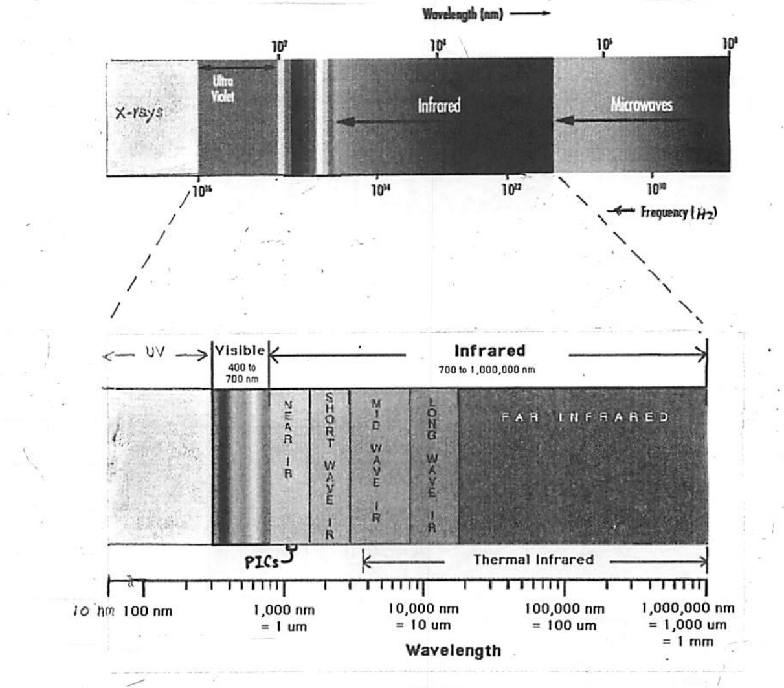

*Fig 5. The optical spectrum.*

> **Important:** two popular wavelengths that find wide use in optical telecommunications are **1310 nm** and **1550 nm**.
> - In optical fiber the **1310 nm** gives minimal *dispersion*.
> - The **1550 nm** gives minimal *attenuation* (loss).

---

## Optical Waveguides

Optical fibers and silicon waveguides serve an essential function in optical telecommunications and networks: a channel or conduit for transporting data-modulated optical carriers (e.g. OOK, PAM4, etc.).

In what follows we shall discuss their:

- Theory of operation
- Structure & characteristics
- Performance

The range of distances spanned by these optical waveguides covers both the **macro scale** (1–1000's km for fiber) and **micro scale** (intra-chip for silicon waveguides). The transported light is usually infrared (IR).

---

## I. Optical Fibers

### 1. Theory of Operation

#### Snell's Law

As depicted in Fig 1, when light incident at an angle $\theta_1$ passes from an "optically-light" material (low index of refraction $n_1$) to an "optically-dense" material (high index of refraction $n_2$), it always bends *toward* the normal to the boundary plane. The behavior is governed by **Snell's law of refraction**.

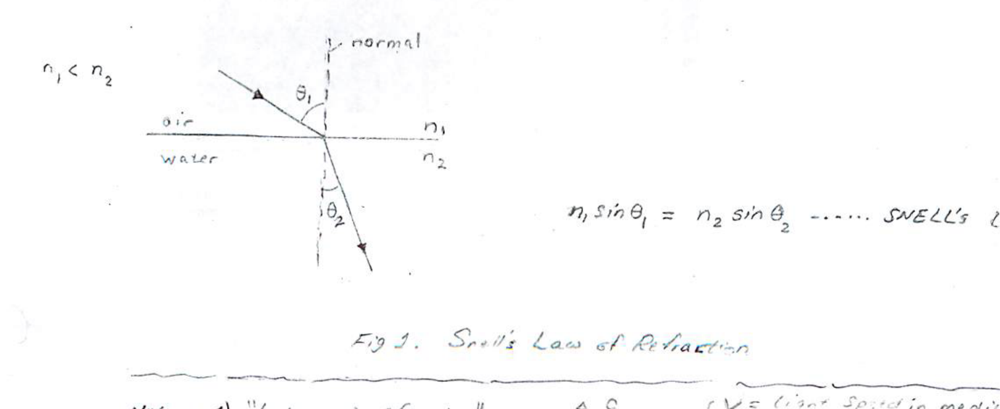

*Fig 1. Snell's Law of Refraction.*

$$n_1 \sin\theta_1 = n_2 \sin\theta_2 \qquad \text{(Snell's Law)}$$

**Notes:**

1. "Index of refraction": $\displaystyle n \triangleq \frac{c}{v}$, where $v$ = light speed in medium and $c$ = light speed in free space.
2. $\displaystyle c = \frac{1}{\sqrt{\varepsilon_0 \mu_0}}, \quad v = \frac{1}{\sqrt{\varepsilon_r \varepsilon_0 \mu_0}} \;\Rightarrow\; n = \sqrt{\varepsilon_r}$

#### Total Internal Reflection

When light passes from an optically "dense" material into an optically "light" material, a specific **critical angle** ($\theta_c$) exists above which there is **no** light transmission into the optically "light" material. Importantly, $\theta_c$ is the angle of incidence at which the refracted light travels along the "boundary interface" (Fig 2).

For angles of incidence $\theta > \theta_c$, the light is **totally reflected** back so as to remain confined to the optically-denser material. This phenomenon of **total internal reflection (TIR)** is the basis for operation of optical fibers and guides.

By definition $\theta_2 = 90°$ when $\theta_1 = \theta_c$, for which, using Snell's law:

$$\theta_c = \arcsin\!\left(\frac{n_2}{n_1}\right) \qquad \text{(critical angle)}$$

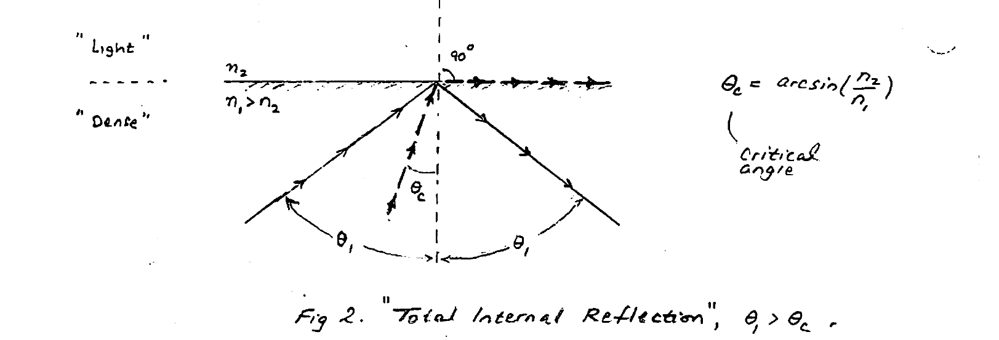

*Fig 2. "Total Internal Reflection", $\theta_1 > \theta_c$.*

**Example:**

1. Consider the glass–air interface for which $n_1 \approx 1.5$ (glass) and $n_2 = 1.0$ (air). Find $\theta_c$.

$$\theta_c = \arcsin\!\left(\frac{1.0}{1.5}\right) = 41.8°$$

2. Consider the silica-core/cladding interface in an optical fiber. Here $n_1 = 1.48$ (silica) and $n_2 = 1.44$ (cladding). Find $\theta_c$.

$$\theta_c = \arcsin\!\left(\frac{1.44}{1.48}\right) = 76.6°$$

### 2. Structure & Characteristics

Typically, an optical fiber is composed of three concentric layers: a **fiber core** at center, a surrounding **cladding**, and an outer **buffer jacket** (coating) made of hard plastic. This jacket provides mechanical protection and flexibility to the fiber (Fig 3).

The fiber core and cladding are made of silica ($\text{SiO}_2$) glass, with a higher refractive index for the core than the cladding to guarantee **total internal reflection** in the core — and hence the guidance of light in the fiber.

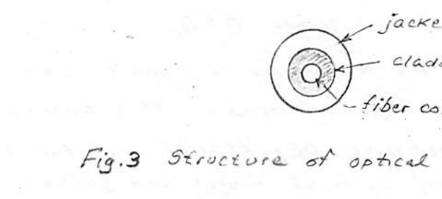

*Fig 3. Structure of optical fiber.*

#### Types of Optical Fibers: Optical Modes

The patterns by which an optical fiber guides light (i.e. rays) are called **"modes"**. These describe the distribution of light energy in the fiber, and depend on the wavelength of the light, core diameter, and the profile of the refractive index of the fiber core.

There are two dominant fiber types: **multi-mode (MM)** and **single-mode (SM)**, with cross-sections as shown in Fig 4. Note the large difference in diameter of the fiber core: ~60 μm in the MM vs. ~10 μm in the SM. (See Appendix A.)

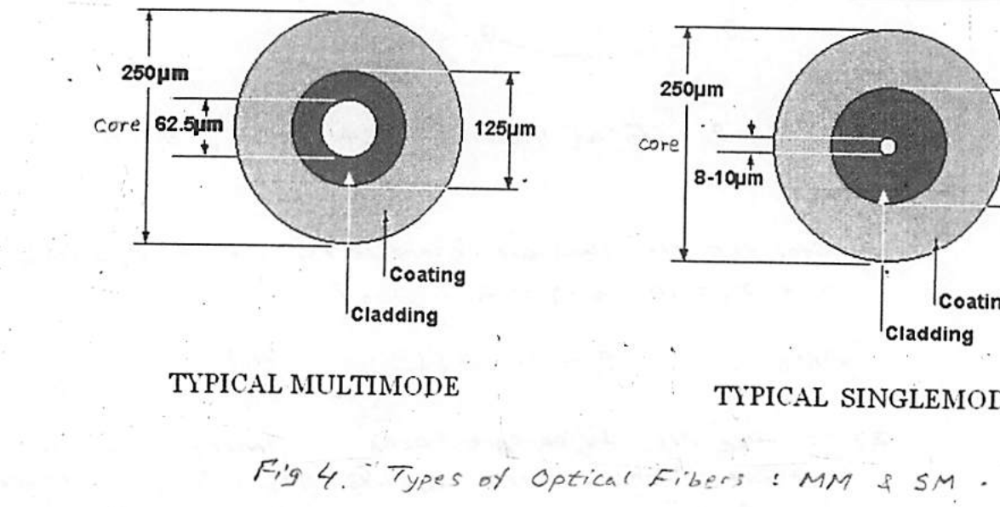

*Fig 4. Types of optical fibers: MM & SM.*

#### Comparison

Because of the extremely-small fiber core diameter, the SM fiber can accommodate only a **single mode** — at its center, coaxial with its axis. This is to be contrasted with the multiple modes in the much-wider MM fiber, which are produced by light rays entering the core over a range of incident angles (Fig 5).

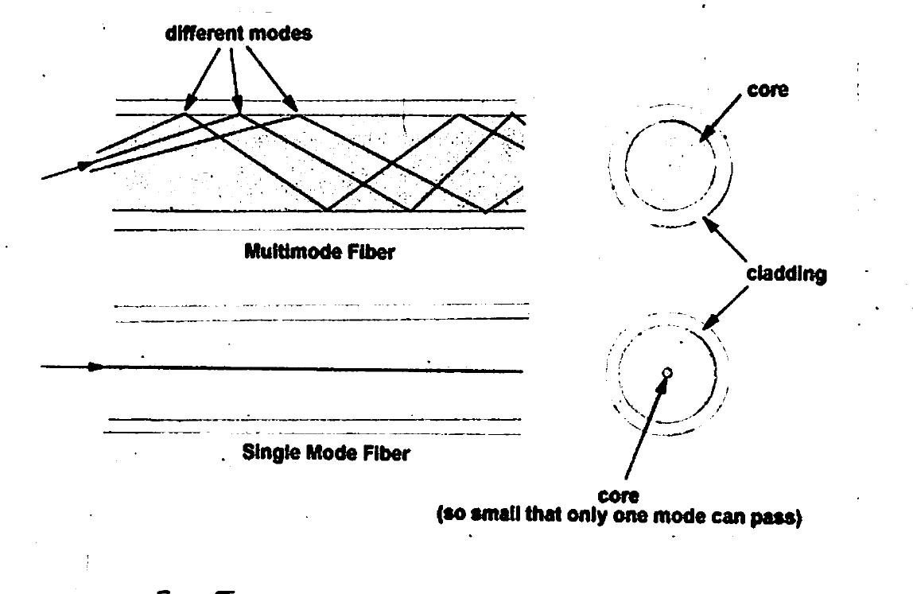

*Fig 5. Single-mode vs. multimode propagation.*

It is noteworthy that single-mode operation is determined by the core diameter ($D$) as well as the wavelength ($\lambda$) of the IR light. The following formula permits estimation of the number of modes in a fiber:

$$\#\,\text{Modes} \approx 0.5\left(\frac{\pi D}{\lambda}\right)^2 \left(n_f^2 - n_c^2\right)$$

where $n_f$ and $n_c$ are, respectively, the fiber core & cladding refractive indices.

The equation above demonstrates that **reducing the core diameter** ($D$) sufficiently can limit the number of modes to a single mode. This is consistent with the SM fiber, which employs a very small core diameter (~10 μm) compared to the ~60 μm large diameter of MM fiber.*

> \* ~60 μm is roughly the thickness of a sheet of paper.

#### Applications

| Single-Mode (SM) | Multi-Mode (MM) |
| --- | --- |
| Standard choice for very high data rates & long distances* | Modest data rates & modest distances (< km's)** |
| Works only with an IR laser | Can also work with IR LEDs |

> \* **SM examples:** metropolitan networks; inter-data-center; intercontinental telephone (telecom) & Internet. Up to ~1000 km range.
> \** **MM:** data rates & distance are limited by "modal distortion" (see Appendix A).
> † **MM example:** intra-data-center, for distances up to ~1 km.

#### Fiber Optic Cable

Typically a fiber-optic cable may contain several hundreds of fibers — thereby allowing for extremely high aggregate data capacity. Cables usually contain strength-imparting members (steel armor) surrounding the bundles of fibers.

### Attenuation & Dispersion

#### Attenuation

One of the great advantages of optical fiber, apart from the high-data-rate carrying capacity, is the **low attenuation** loss — as low as $0.1\ \text{dB/km}$.

A comparison with copper wire is in order: at 10 Gb/s data rate an optical fiber is capable of transmitting data over ~100 km; in comparison, for the same data rate, a copper-based link — due to fundamental EM limitations — can work over a range limited to ~1 meter (e.g. USB cable).

In optical fibers, attenuation originates from two sources: **"material absorption"** and **"light scattering"**. A typical (dB/km) loss vs. wavelength $\lambda$ graph for silica is given in Fig 6 below. Notice the two **low-loss "windows"** at $\lambda = 1.31\ \mu m$ and $\lambda = 1.55\ \mu m$ — two popular IR wavelengths in optical communications. The spike in attenuation between these is due to absorption by the **"OH ion"** (hydroxyl) impurity.

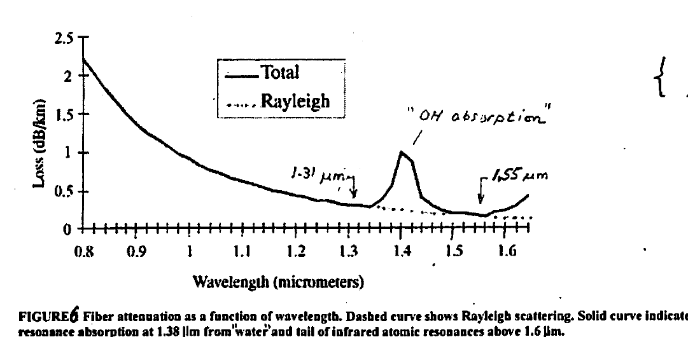

*Fig 6. Fiber attenuation as a function of wavelength. Dashed curve shows Rayleigh scattering; solid curve indicates total attenuation including resonance absorption at 1.38 μm from water and the tail of infrared atomic resonances above 1.6 μm.*

Material absorption loss is the result of impurities still present in the silica. Due to high purity, however, this type of loss is small. The **dominant** type of loss is due to **(Rayleigh) scattering** of light from its interaction with silica atoms in the fiber core. Light scattered at angles that permit forward travel within the core does *not* contribute to loss. On the other hand, light scattered at angles not supporting "total internal reflection" exits the fiber core and results in "attenuation loss". This light-scattering effect contributes to **> 90%** of the attenuation loss in optical fibers.

#### Dispersion

In modern optical fibers the maximum transmission range is more limited by **"dispersion"** than "absorption". Dispersion also limits the max data rate.

**Dispersion** is defined as the variation in light propagation velocity ($v$) with the wavelength ($\lambda$) of the light. This is traceable to variation of the "index of refraction" ($n$) of the material with wavelength ($\lambda$).

Examples of dispersion include the naturally occurring rainbow (water droplets) and the colorful light display from a prism (glass). In optical fibers, variation of the "refractive index" with wavelength (optical frequency) is responsible for the widening (dispersion) of a short light pulse as it travels down the fiber. The spreading of the pulse is simply due to the different arrival times of its various frequency (wavelength) components as a consequence of their different propagation velocities. The given waveforms demonstrate how dispersion limits range and data rate.

Dispersion is more pronounced in **MMF** than **SMF**. The multiple modes travelling in a MMF necessarily have different axial-velocity components during propagation. This is referred to as **"intermodal" dispersion**. In SM fiber, dispersion is referred to as **"chromatic dispersion"** due to the single mode present.

Because dispersion gets worse with increasing distance *or* data rate, a tradeoff exists between the two. Alternatively, the **product** of the two is ≈ constant. Furthermore, a superior performance, such as in SMF, results in a larger constant.

Fig 7 below depicts the speed–distance tradeoff for various transmission media. The three curves belong to three disparate speed–distance products of 10, 100, 1000 Gb/s·meter. Because of the inverted distance axis, note that the uppermost curve describes the lowest 10 Gb/s·m performance.

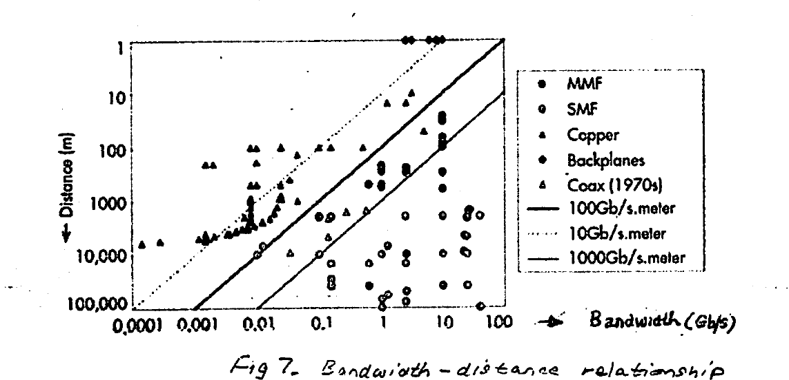

*Fig 7. Bandwidth–distance relationship.*

### Performance

Optical fiber today is capable of supporting data rates in the 100's Gb/s over a single fiber, and an **"aggregated"** > Tb/s using multiple fibers/wavelengths.

Distance (range) covered for long-haul communications — without the need for "regeneration" (by repeaters) — can be as long as several 100's km.

### Optical Bands

The various effects that contribute to "attenuation" and "dispersion" depend on the optical wavelength. There are certain ranges of wavelengths where these effects are weakest. This gives rise to **"transmission windows"** — i.e. **"optical bands"** — which are most favorable for fiber-optic transmission. As an example, the "minimum attenuation" 1.55 μm wavelength falls in one of these bands (band "C"), and the "minimum dispersion" 1.31 μm falls in band "O".

The windows have been standardized and encompass six major bands: **O, E, S, C, L, U** (see Table 1).

| Band | Descriptor | Wavelength range |
| --- | --- | --- |
| O band | Original | 1,260–1,360 nm |
| E band | Extended | 1,360–1,460 nm |
| S band | Short wavelength | 1,460–1,530 nm |
| C band | Conventional | 1,530–1,565 nm |
| L band | Long wavelength | 1,565–1,625 nm |
| U band | Ultralong wavelength | 1,625–1,675 nm |

*Table 1. IR Optical Bands — Telecom & Datacom.*

To show how the above bands are accommodated by optical fiber, Fig 8 gives a composite graph where the telecom bands have been superimposed on the transmission loss curve of a standard silica-based optical fiber.

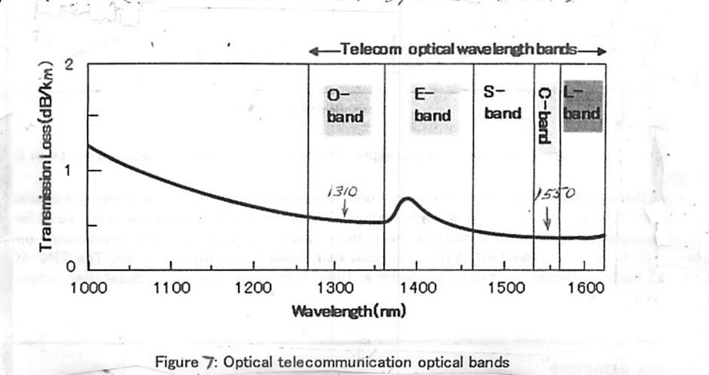

*Fig 8. Optical telecommunication wavelength bands.*

### Regeneration: Repeaters & Amplifiers

Fiber-optic communication links over distances exceeding the limit supported by the technology require **REGENERATION** of the optical signal — typically by an amplifier/repeater. The minimal degradation of optical signals over optical fibers, however, makes this only necessary for long distances above ~100 km.

A striking example is the use of repeaters for long-haul sub-oceanic Internet/telephone optical telecommunication links such as those between continents — for e.g. the trans-atlantic link between the Americas & Europe.

Two techniques are used for optical regeneration:

1. **Electro-optical:** Here the optical signal is converted to an electrical signal with a photodiode, amplified electronically, and then retransmitted as an optical signal using a laser diode.
2. **Purely Optical:** A special optical amplifier based on an **Erbium-doped fiber (EDFA)** is employed for direct regeneration of the optical signal — without the need for opto-electrical and electro-optical conversions. Typically, EDFAs are inserted every 10 or 100 km. *Principle of amplification:* the data-carrying optical wave passes through a short section of erbium-doped fiber "subjected" to shorter-wavelength IR radiation from a laser diode (LD). This "pumping" process excites the erbium atoms to a higher energy state, and upon "collapse" to their ground state, impart energy to the optical signal. (See Appendix B.)

---

## Appendix A — Modal Distortion in Multimode Fiber

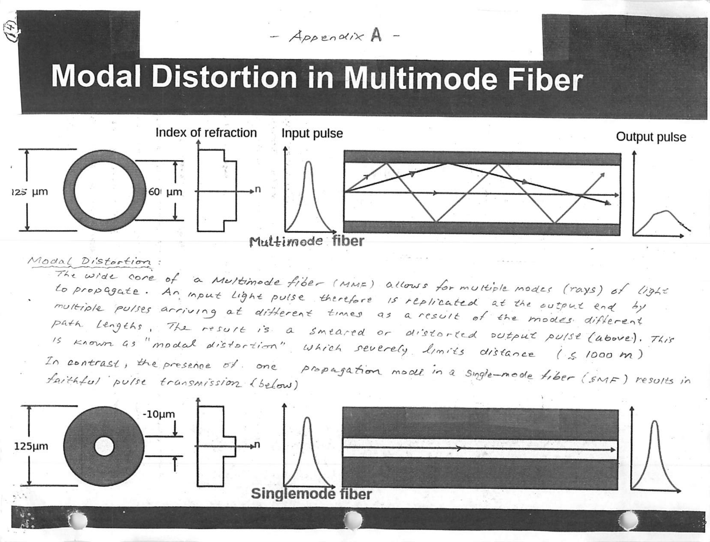

**Modal Distortion:** The wide core of a multimode fiber (MMF) allows for multiple modes (rays) of light to propagate. An input light pulse is therefore replicated at the output end by multiple pulses arriving at different times as a result of the modes' different path lengths. The result is a smeared or distorted output pulse (above). This is known as **"modal distortion"**, which severely limits distance (≤ 1000 m).

In contrast, the presence of one propagation mode in a single-mode fiber (SMF) results in faithful pulse transmission (below).

---

## Appendix B — Erbium-Doped Fiber Amplifier (EDFA)

The **Erbium-Doped Fiber Amplifier (EDFA)** is an optical amplifier used in the **C-band** and **L-band**, where the loss of telecom optical fibers becomes lowest in the entire optical telecommunication wavelength bands. Invented in 1987, an EDFA is now most commonly used to compensate the loss of an optical fiber in long-distance optical communication. Another important characteristic is that an EDFA can amplify **multiple** optical signals simultaneously, and thus can be easily combined with **WDM** technology.

EDFAs are used as a **booster**, **inline**, and **pre-amplifier** in an optical transmission line, as schematically shown in Fig 2. The booster amplifier is placed just after the transmitter to increase the optical power launched to the transmission line. The inline amplifiers are placed in the transmission line, compensating the attenuation induced by the optical fiber. The pre-amplifier is placed just before the receiver, such that sufficient optical power is launched to the receiver. A typical distance between each of the EDFAs is several tens of kilometers.

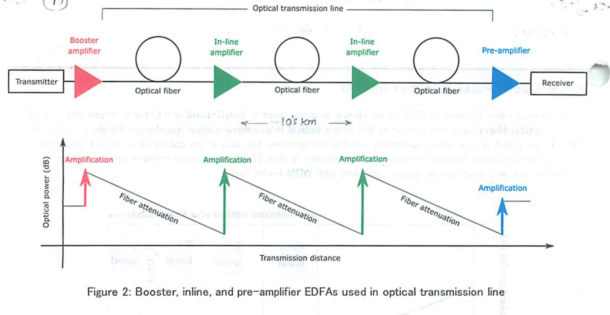

*Fig 2. Booster, inline, and pre-amplifier EDFAs used in an optical transmission line.*

Before the invention of EDFA, a long optical fiber transmission line required complicated optical-to-electrical (O–E) and E–O converters for signal regeneration. The use of EDFA has eliminated the need for such O–E and E–O conversion, significantly simplifying the system. This is especially of use in a submarine optical transmission, where more than a hundred EDFA repeaters may be needed to construct one link. The TPC-5CN (Trans-Pacific Cable 5 Cable Network), which started its operation in 1996, is the first submarine optical fiber network which employed EDFA.

### Working principle

Figure 3 illustrates a simplified energy diagram of Er, showing how amplification takes place at 1550 nm. Two typical wavelengths to pump an EDFA are 980 or 1480 nm (from a laser diode, LD).

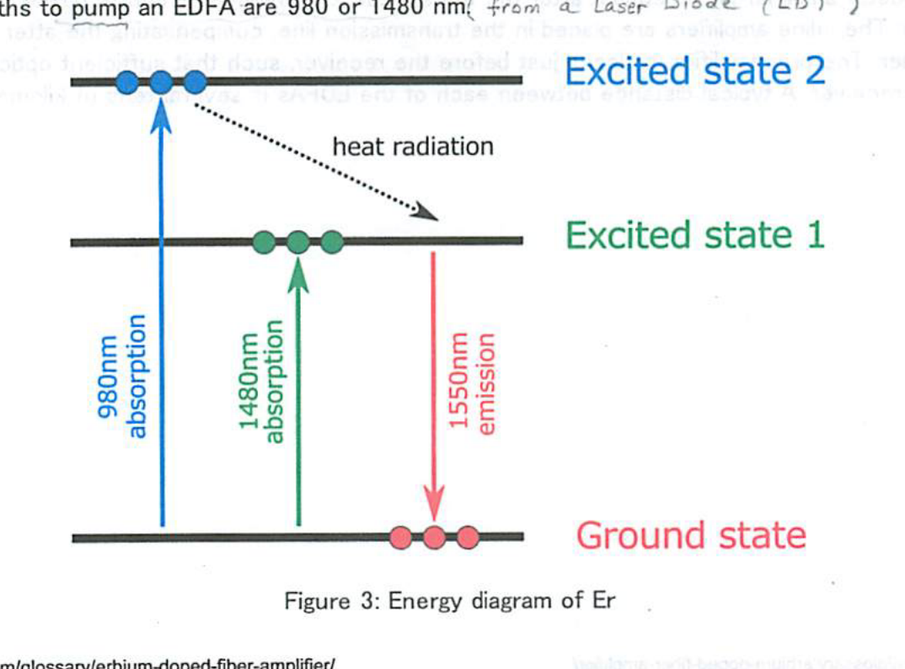

*Fig 3. Energy diagram of Er.*

When an EDFA is pumped at **1480 nm**, the Er ion doped in the fiber absorbs the pump light and is excited to an excited state (Excited state 1). When sufficient pump power is launched to the fiber, population inversion is created between the ground state and Excited state 1, and amplification by **stimulated emission** takes place at around 1550 nm.

When an EDFA is pumped at **980 nm**, the Er ion absorbs the pump light and is excited to another excited state (Excited state 2). The lifetime of the Excited state 2 is relatively short, and as a result, the Er ion is immediately relaxed to Excited state 1 by radiating heat (i.e. no photon emission). This relaxation process creates a **population inversion** between the ground level and Excited state 1, and amplification takes place at around 1550 nm.

Since the first demonstration of a diode-pumped EDFA in 1989, intensive effort has been made to make the pump LD highly reliable. Now high-power pump laser diodes at 980 nm or 1480 nm are both commercially available, and most EDFAs are pumped by laser diodes due to the compactness and robustness.

### Internal configuration

Figure 4 shows one common configuration of EDFA. The input signal is combined with the pump light by a **WDM coupler** and launched to the EDF. The pump light launched to the EDF creates population inversion and the input signal is amplified by stimulated emission. **Isolators** are placed both at the input and output, in order to stabilize signal amplification by eliminating unwanted back reflection from the output port, as well as to prevent the amplifier from operating as a laser. In this common configuration, the wavelength of the pump LD is locked close to the peak absorption wavelength of erbium (by an external fiber Bragg grating); the wavelength range is normally between 974 nm to 980 nm.

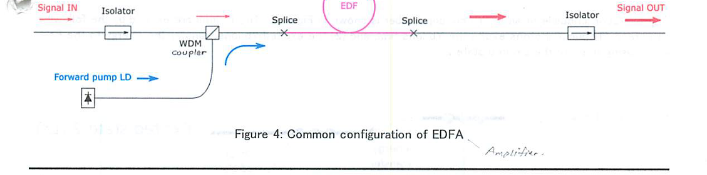

*Fig 4. Common configuration of EDFA.*

### Key optical characteristics

1. **Saturated output power (maximum output power):** the maximum output power from an amplifier when sufficient signal input power (typically around 0 dBm or higher) is launched to the amplifier. A booster amplifier typically operates under this condition.
2. **Small-signal gain:** the gain in an amplifier when the signal power launched to the amplifier is very small (typically around −30 dBm). A pre-amplifier typically operates under this condition.
3. **Noise figure (NF):** amplification by an EDFA adds noise to the original signal — mainly due to amplified spontaneous emission (ASE) from the EDF — and thus decreases the signal-to-noise ratio (S/N). NF is a measure of degradation in the S/N ratio, expressed in dB; lower NF indicates lower noise (theoretical minimum 3 dB). A typical NF value of commercial EDFA at a small signal input power is within 5 to 7 dB.
4. **Gain flatness:** when an EDFA is used for WDM transmission, it would be ideal that all WDM channels have equal gain. In reality each channel has a different gain value, and the variation is referred to as gain flatness. This is particularly important when many EDFAs are concatenated in a transmission line (e.g. submarine), as gain variation accumulates. Gain flatness can be improved by, e.g., modification of glass composition of the EDF (higher aluminium concentration) or the incorporation of an external gain-flattening optical filter.

### References

1. R. J. Mears et al., "Low-noise erbium-doped fibre amplifier operating at 1.54 μm," *Electronics Letters* **23**(19), 1026–1028 (1987).
2. M. Nakazawa, Y. Kimura, and K. Suzuki, "Efficient Er³⁺-doped optical fiber amplifier pumped by a 1.48 μm InGaAsP laser diode," *Appl. Phys. Lett.* **54**(4), 295–297 (1989).
3. J. D. Minelly et al., "Diode-array pumping of Er³⁺/Yb³⁺ Co-doped fiber lasers and amplifiers," *IEEE Photonics Technology Letters* **5**(3), 301–303 (1993).

---

## Supplementary Slides (Fiber Types)

The packet also includes three printed reference slides summarizing fiber types:

**Multi-Mode Fiber**
- Specifically designed for use with "cheaper" light sources: the wide core lets you use incoherent LED light sources or cheaper, less precisely aimed lasers (such as VCSELs), and reduces tolerance requirements for connector alignment.
- This comes at the expense of long-distance reach: the wide core allows multiple modes to propagate, causing "modal distortion" which severely limits distance (typically 20–500 m depending on signal type).
- Recently augmented with "laser optimized" (OM3) MMF — uses aqua-colored cables (rather than traditional orange); designed to achieve 10 Gbps at 300 m with VCSEL lasers.

**Single-Mode Fiber**
- Used in all long-reach applications; the core size is so small it can only carry a single mode of light. Can support distances of up to several thousand km, with appropriate amplification and dispersion compensation.
- Requires more expensive, coherent laser light sources and tighter tolerances for splicing and connector alignment.
- "Classic" SMF is frequently called **SMF-28**. A wide variety of specialty fibers also exist: Low Water Peak Fiber (LWPF), Dispersion Shifted Fiber (DSF), Non-Zero Dispersion Shifted Fiber (NZDSF), etc.
