# Lecture 10 — TIA (Transimpedance Amplifier)

**EECE 7398 — Analysis & Design of Photonic Integrated Circuits (PICs)** · Northeastern University, Dept. of Electrical & Computer Engineering · Spring 2023 · *Transimpedance Amplifiers (TIAs) — CMOS Design*

---

## Overview

TIAs are an indispensable building block in optical receivers employed in silicon photonics to process optical signals carrying data from 10's Gb/s to 100's Gb/s. The function of the TIA is to amplify the small photo-current ($`I_\text{photo}`$) generated by a photodiode in response to an IR optical data stream. The latter is typically delivered by a Si-WG abutting the photodiode.

Input currents as low as µA's or less are amplified to output levels of $`\sim 100\ \text{mV}`$. This is usually followed with further boosting by a **"LIMITER-Amplifier"**. The purpose of the LA is to raise the signal level to the standard logic level ($`\sim 500\ \text{mV}`$) of the digital system (Fig 1).

The CMOS design of the TIA must possess: **broad band**, **low-noise**, good **TZ-gain**, and compliance with **DC power-supply level** and **power consumption** constraints. These are often achieved through trade-offs — e.g. b/w gain, noise, and BW. Furthermore, because in practice the photocurrent may vary WIDELY, an **Automatic Gain Control (AGC)** provision is often added for proper TIA operation over a wide Dynamic Range of inputs.

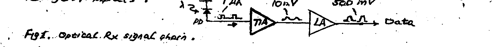

*Fig 1. Optical Rx signal chain (PD → TIA → LA → Data), with signal levels $`\sim 1\ \mu A \rightarrow \sim 10\ \text{mV} \rightarrow \sim 500\ \text{mV}`$.*

- **Noise:** degrades the TIA SNR and hence the BER performance.\*
- **BW:** should be wide enough to accommodate the data rate $`R_b`$ (b/s) as well as result in low ISI (result: noise–ISI tradeoff!).
- **Gain:** the TIA gain $`Z_T`$ ($`V/A`$) must be sufficient to produce an adequate signal level ($`\sim 10\ \text{mV}`$) required by the succeeding LA stage as well as overcoming the noise of the LA. Clearly, the amount of gain required is set by the magnitude of photocurrent being generated (see photodiode **Responsivity** ($`A/W`$)).
- **DC Supply:** its level should be in compliance with the current practice of LOW DC SUPPLY for nano-scale MOSFETs — while maintaining low DC power consumption.
- **AGC:** it is not unusual for the photocurrent to vary widely (e.g. $`1`$–$`100\ \mu A`$!) due to variations in optical signal level (connected w/ laser, PD, path length (fiber)). To avoid possible TIA malfunction (e.g. output saturation), the TIA gain is automatically adjusted downward when a rise in photocurrent occurs. Incorporating an **AUTOMATIC GAIN-CONTROL** feature in the TIA ensures this.

> \* As noise level (and ISI) increases with bandwidth, a low-noise CMOS design is necessary.

---

## TIA Topology

A **"SHUNT–SHUNT"** feedback amplifier configuration (Appendix 1) is commonly employed for the TIA (below) because it offers two important features:

1. **Low Input Resistance ($`R_\text{in}`$)** — for efficient absorption of the photocurrent from the photodiode, and simultaneously ensuring a broad BW thru a small $`RC`$ time constant (with $`C_D`$ of photodiode).
2. **Low Output Resistance ($`R_\text{out}`$)** — for good output drive capability to the next stage (LA), while maintaining broad BW through a small $`RC`$ T.C. with input cap. $`C_\text{in}`$ of the LA.

### PD–R

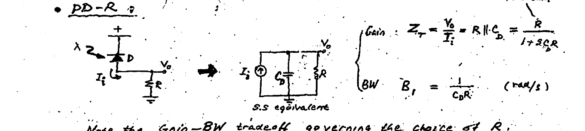

*Fig 2. Photodiode–resistor (PD–R) connection and its small-signal equivalent.*

```math
\text{Gain:} \quad Z_T = \frac{V_o}{I_i} = R \,\|\, C_D = \frac{R}{1 + sRC_D}
```

```math
\text{BW:} \quad B_f = \frac{1}{C_D R} \quad (\text{rad/s})
```

Note the **Gain–BW tradeoff** governing the choice of $`R`$.

**Example:** $`R = 500\ \Omega`$, $`C_D = 100\ \text{fF}`$:

```math
B_f(\text{Hz}) = \frac{1}{2\pi R C_D} = 3.2\ \text{GHz} \;\rightarrow\; R_b(\text{max}) \approx 3\ \text{Gb/s}
```

### Feedback TIA

Use an inverting core amplifier ($`-A`$).

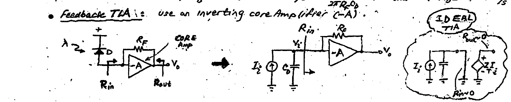

*Fig 3. Feedback TIA — inverting core amplifier ($`-A`$) with feedback resistor $`R_F`$, its small-signal model, and the ideal TIA ($`R_\text{in} \rightarrow 0`$, $`R_\text{out} \rightarrow 0`$).*

**Input resistance:**

```math
I_i = \frac{V_i - V_o}{R_F} = V_i\frac{1+A}{R_F} \;\rightarrow\; R_\text{in} = \frac{R_F}{1+A} \quad \checkmark\ \text{LO!}
```

**Gain:**

```math
\frac{V_o}{-A} = V_i = \frac{I_i\, R_\text{in}}{1 + sC_D R_\text{in}} \;\rightarrow\; Z_T = \frac{V_o}{I_i} = \frac{-R_F\left(\dfrac{A}{1+A}\right)}{1 + sC_D\dfrac{R_F}{1+A}}
```

```math
\underbrace{Z_T(0) = -\frac{R_F A}{1+A} \approx -R_F}_{\text{DC gain}}
```

```math
B = \frac{1+A}{R_F C_D} \;\gg\; B_f \qquad (\textbf{BW extension!})
```

Thanks to feedback, a significant **BW extension** is achieved through use of a **CORE AMPLIFIER** ($`-A`$). Note the conflicting requirements on $`R_F`$ by (DC) gain & BW. (Also, thermal noise in $`R_F`$, $`\overline{S_{i_{R_F}}} = 4kT/R_F`$, clearly points to a large $`R_F`$ for a good TIA SNR.)

---

## Worked Example & Core-Amplifier Model

**Example:** $`C_D \approx 100\ \text{fF}`$, $`R_F = 500\ \Omega`$, $`A = 10`$.

```math
\text{Gain (LF):} \quad Z_T = 500 \times \frac{10}{1+10} \approx 455\ \Omega
```

```math
B = \frac{1+10}{2\pi \cdot 500 \times 10^{-13}} \approx 35\ \text{GHz} \;\leftrightarrow\; 3.2\ \text{GHz} \quad (\text{PD–R } B_f)
```

```math
\text{Data rate:} \quad R_b(\text{max}) \approx \frac{B}{0.75} \approx 47\ \text{Gb/s}
```

### Core Amplifier

```math
A = \frac{A_o}{1 + \dfrac{s}{\omega_o}} \qquad (A_o = \text{DC gain},\ \omega_o = \text{D.P. (dominant pole)})
```

A more realistic model for the "core amplifier" is a first-order (Dominant-Pole) function. This leads to a **2nd-order $`Z_T`$ function**:

```math
Z_T = \frac{V_o}{I_i} = \frac{-R_F \dfrac{A(s)}{1+A(s)}}{1 + \dfrac{sC_D R_F}{1+A(s)}} = \cdots = \frac{-\dfrac{A_o\omega_o}{C_D}}{s^2 + s\left(\omega_o + \dfrac{1}{C_D R_F}\right) + \dfrac{(1+A_o)\omega_o}{C_D R_F}}
```

```math
\therefore\; Z_T = \frac{-Z_T(0)}{1 + 2\zeta\dfrac{s}{\omega_n} + \left(\dfrac{s}{\omega_n}\right)^2}
```

where

```math
Z_T(0) \approx -R_F, \qquad \omega_n^2 \triangleq \frac{(1+A_o)\omega_o}{C_D R_F}
```

```math
\zeta \triangleq \frac{\omega_o + \dfrac{1}{C_D R_F}}{2\omega_n} = \frac{1}{2}\left\{\frac{1 + R_F C_D \omega_o}{\sqrt{(1+A_o)\omega_o C_D R_F}}\right\} \qquad (\text{"damping"})
```

```math
\text{"$`f`$-Peaking"} \triangleq \left|\frac{Z_T(\text{peak})}{Z_T(0)}\right| = \frac{1}{2\zeta\sqrt{1-\zeta^2}}
```

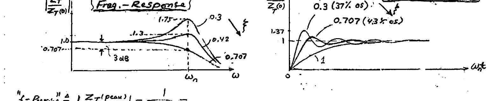

*Fig 4. (Left) Frequency response $`\left|Z_T/Z_T(0)\right|`$ vs $`\omega`$ and (right) step response $`V_o(t)/Z_T(0)`$ vs $`\omega_n t`$, for several damping factors ($`\zeta = 0.3,\ 0.42,\ 0.707,\ 1.0,\ 1.3,\ 1.75`$). Note the $`\zeta = 0.707`$ curve gives a flat (maximally-broad) response with $`4.3\%`$ overshoot; $`\zeta = 0.3`$ gives $`37\%`$ overshoot.*

**Math:**

Unit-step response\* — $`V_o(s) = \dfrac{1}{s} Z_T(s)`$ with $`I(s) = \dfrac{1}{s}`$, so $`v_o(t) = \mathcal{L}^{-1}\!\left[V_o(s)\right]`$:

```math
v_o(t) = Z_T(0)\left[1 - \frac{e^{-\zeta\omega_n t}}{\sqrt{1-\zeta^2}}\sin\!\left(\omega_n\sqrt{1-\zeta^2}\,t + \cos^{-1}\zeta\right)\right]
```

```math
\%\ \text{overshoot} \triangleq 100 \times \frac{v_o(\text{peak}) - v_o(\infty)}{v_o(\infty)} = 100 \times \exp\!\left(\frac{-\zeta\pi}{\sqrt{1-\zeta^2}}\right)
```

**Signal Integrity:** It can be shown that an optimal response is achievable with $`\zeta = 0.707`$ → producing a **FLAT** frequency response $`Z_T`$ (**BROADEST BW** under zero $`f`$-peaking!). This results in a **FAST** (short rise time) step-response with **minimal OVERSHOOT** ($`4.3\%`$). (This is a slightly **UNDERDAMPED** response producing v. small ISI but distinct Hi/Lo logic levels.)

> \* Rising (& falling) edge of a pulse in the data stream.

---

## Optimum Damping & BW Extension

For the optimum ($`\zeta = 0.707`$):

```math
0.707 = \zeta = \frac{1}{2}\cdot\frac{1 + R_F C_D \omega_o}{\sqrt{(1+A_o)\omega_o C_D R_F}}
```

we find:

```math
\omega_o = \frac{A_o \pm \sqrt{A_o^2 - 1}}{R_F C_D} \approx \frac{2A_o}{R_F C_D} \qquad (A_o \gg 1)
```

I.e. the **"open-loop" BW** ($`A\omega`$) of the core amplifier needs to be $`\approx \times 2`$ the **"closed-loop" BW** of the 0th-order TIA ("$`A`$" = const) to ensure optimal response. (Note that a smaller $`\omega_o`$, $`\omega_o < 2A_o/R_F C_D`$, reduces the damping, $`\zeta < 0.707`$, thereby resulting in increased **RINGING** (OS) — hence degraded ISI.)

For the chosen $`\omega_o = 2A_o/R_F C_D`$, the TIA (closed loop) BW is:

```math
BW = \omega_n = \sqrt{\frac{(A_o+1)\omega_o}{R_F C_D}} \approx \frac{\sqrt{2}\,A_o}{R_F C_D}
```

```math
\left(\text{since } BW:\ \left|\frac{Z_T}{Z_T(0)}\right| = \frac{1}{\sqrt{2}} = \left|\frac{\omega_n^2}{-\omega^2 + j2\zeta\omega_n\omega + \omega_n^2}\right|_{\zeta=0.707} \rightarrow \underset{-3\text{dB}}{\omega = \omega_n} = \frac{\sqrt{2}\,A_o}{R_F C_D}\right)
```

**Example:** $`A_o = 10`$, $`R_F = 500\ \Omega`$, $`C_D = 100\ \text{fF}`$.

```math
\therefore\; B = \frac{\sqrt{2}\cdot 10}{2\pi \cdot 500 \times 10^{-13}} \approx 47\ \text{GHz}, \qquad R_b \approx \frac{B}{0.75} = 63\ \text{Gb/s}
```

**Conclusion:** The BW is broader than the 1st-order TIA ($`A`$ = const) by about $`34\%`$. The wider BW is traceable to an **"INDUCTIVE PEAKING"** effect at the input of the TIA. Here, the pole ($`-\omega_o`$) of the core amp can be shown to produce an inductive input impedance that "HF resonates out" the effect of $`C_D`$ of the photodiode.

### Topology (C-S / C-D Cascade)

The use of a **C-S / C-D cascade** for the CORE AMPLIFIER of the TIA imparts to it the desired properties of LO input resistance and LO output resistance. Indeed, with shunt–shunt FB ($`R_F`$), circuit analysis leads to (with $`A_o = g_{m_1} R_D`$):

```math
Z_T(0) = \frac{V_o}{I_i} = \left(\frac{-g_{m_1} R_D}{1 + g_{m_1} R_D}\right)R_F \approx -R_F
```

```math
R_\text{in} \approx \frac{R_F}{1 + g_{m_1} R_D}, \qquad R_\text{out} \approx \frac{1}{g_{m_2}}\,[?]
```

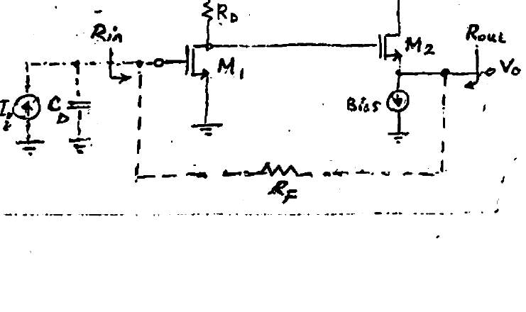

*Fig 5. Common-source ($`M_1`$) / common-drain ($`M_2`$) cascade used as the core amplifier, with feedback resistor $`R_F`$, load $`R_D`$, and bias current source.*

---

## Differential TIA

A **differential output** from a TIA is a highly desirable feature that provides for several advantages: rejection of DC supply and (substrate) noise\*, superior DC bias stability, and interfacing with the subsequent **Limiter Amplifier (LA)**, which is often of a differential topology.

The single-ended output of a TIA can be converted in straightforward manner to double-ended (i.e. differential) format employing a circuit such as the (symmetrical) source-coupled stage below:

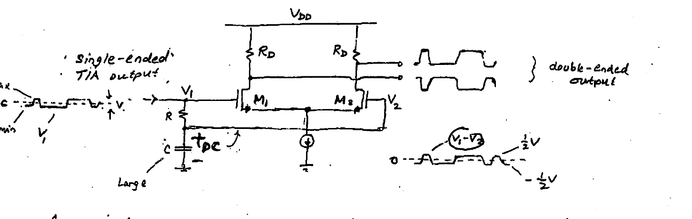

*Fig 6. Symmetrical source-coupled stage ($`M_1`$, $`M_2`$, loads $`R_D`$) converting the single-ended TIA output $`V_1`$ to a double-ended (differential) output $`V_1 - V_2`$, bipolar with $`\pm\tfrac{1}{2}V`$ swing. The $`R`$–$`C`$ branch (with off-chip $`C`$) extracts the DC level.*

A pivotal part in the above circuit is an $`R`$–$`C`$ LP filter section, which extracts the DC component of the input $`V_1`$. The resulting differential input signal $`V_1 - V_2`$ is bipolar with zero average (DC component). This results in the amplified double-ended output shown.

Importantly, a sufficiently long $`R`$–$`C`$ T.C. of the LPF is crucial for proper function of the circuit. Clearly for an inadequate $`RC \not\gg R_b^{-1}`$, the signal $`V_2`$ starts approaching $`V_1`$ — resulting in signal cancellation at the outputs. This TIA circuit, therefore, functions as a **HP filter**. For this reason, long T.C. of the order $`10`$–$`100\ \mu s`$ are employed to ensure a sufficiently low HP cutoff of the order of $`10\ \text{kHz}`$. (For $`10\ \text{Gb/s}`$ data, this cutoff corresponds to roughly a string of 1's (or 0's) of length $`10^{10}/10^4 \approx 10^6`$ — a rather rare, but possible event.) Note that due to its large required size, the filtering cap ($`C`$) is implemented by an external (off-chip) element.

### SNR

Noise analysis of the TIA leads to:

```math
\text{SNR} \triangleq \frac{\overline{V_o^2}(\text{signal})}{\overline{V_o^2}(\text{noise})} = \frac{\overline{I_i^2}(\text{rms})}{\pi kT\left[\dfrac{1}{R_F} + \dfrac{4\,g_G}{g_{m_2} R_F^2} + \dfrac{2\sqrt{2}\,\zeta A_o}{g_m R_F^2}\right]}
```

*(noise-term coefficients $`g_G`$ as written; uncertain reading marked [?]).*

This result indicates that a superior SNR is achieved with a large $`R_F`$. However, a smaller $`R_F`$ is required for wider BW — and hence a **Noise–BW tradeoff!**

> \* Both DC supply noise and substrate noise have the nature of **"Common-Mode" (CM)** interference, which is inherently rejected by the differential-circuit topology.

---

## Automatic Gain Control (AGC)

The level of the photocurrent signal delivered by a photodiode to a TIA can vary widely — typically $`1`$–$`100\ \mu A`$. Contributing factors are variations in laser diode power output at the Tx end, fiber-optic cable length and hence propagation loss in the optical fiber (attenuation), and photodiode responsivity at the Rx front end. The extent of these variations changes from link to link.

This variation in photocurrent signal level imposes a relatively wide **DYNAMIC RANGE** requirement on the TIA. Left unattended, undesirable **overload/nonlinear operation** may occur in the TIA for large input currents. The end result is a severe **degradation in speed & ISI** performance.

**The solution:** automatic reduction of the TIA gain to avoid overload. Specifically: the gain is maintained high for small inputs but is reduced for large inputs. This is accomplished thru the use of a **Variable Gain Amplifier (VGA)**, whose gain is affected by a **"Control voltage" $`V_C`$**. By producing a DC voltage proportional to the TIA output and properly utilizing it for this control input, AGC action is achieved and overload avoided.

### TIA with AGC

The circuit below shows how the DC Control Voltage $`V_C`$ is derived from the TIA output. An $`R`$–$`C`$ LPF extracts the output average ($`\overline{V_\text{out}}`$). The purpose of the additional **"replica" TIA** is to produce a DC reference ($`V_\text{bias}`$) that corresponds to the $`V_\text{out}`$ level for the "dark" $`I_\text{in} \equiv 0`$ condition. This allows the Error Amp to generate a DC voltage ($`V_C`$) directly proportional to the level of the input photocurrent swing. [Note that in the absence of photocurrent ($`I_\text{in} = 0`$) the two TIAs produce equal DC outputs equal to $`V_\text{bias}`$ — thereby nulling the Error Amp output, $`V_C \equiv 0`$.] $`V_C`$ produced for large & small $`I_\text{in}`$ is shown in Fig 1.

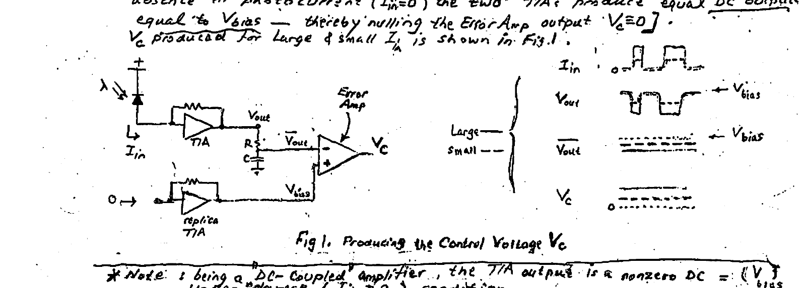

*Fig 1. Producing the control voltage $`V_C`$: the main TIA output is averaged by an $`R`$–$`C`$ LPF and compared by an Error Amp against the replica-TIA reference $`V_\text{bias}`$. Waveforms show $`I_\text{in}`$, $`V_\text{out}`$, $`\overline{V_\text{out}}`$ (large vs small), and the resulting $`V_C`$.*

> \* Note: being a DC-coupled amplifier, the TIA output is a nonzero DC $`= (V_\text{bias})`$ under "dark" ($`I_\text{in} = 0`$) condition.

### Implementing the Variable Gain (MOSFET VCR)

To affect control over the TIA gain, its gain-setting resistor $`R_F`$ is now shunted by a MOSFET operating in triode mode as a **VCR** (resistance $`R_{ds}`$). For this purpose, the gate of the device is driven by $`V_C`$ (see below).

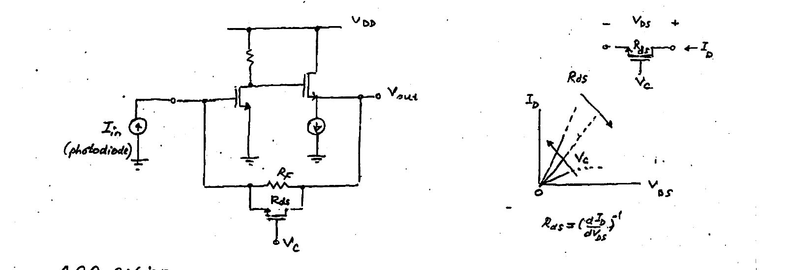

*Fig 8. The feedback resistor $`R_F`$ is shunted by a triode-mode MOSFET (resistance $`R_{ds}`$, controlled by gate voltage $`V_C`$). The $`I_D`$–$`V_{DS}`$ family shows how $`R_{ds}`$ varies with $`V_C`$, where $`R_{ds} = \left(\dfrac{dI_D}{dV_{DS}}\right)^{-1}`$.*

**AGC action:** If the level of input photocurrent pulses rises, then the size of the negative swing of output $`V_\text{out}`$ increases. This causes the average $`\overline{V_\text{out}}`$ produced by the $`R`$–$`C`$ LPF to go more negative — resulting in increased error amp input and hence an increase in its output $`V_C`$. The latter, thru its action as gate drive voltage, reduces $`R_{ds}`$, which in turn reduces the effective FB resistance ($`R_F \| R_{ds}`$). The latter decreases the TIA gain as required — thereby preventing output overload. The opposite occurs for a drop in the size of photocurrent pulses.

**NOTE:** For proper AGC action of the circuit, it is imperative for the LPF to have a sufficiently **LONG** $`RC`$ T.C. (i.e. sufficiently low cutoff frequency $`\omega_\text{lp} = 1/RC`$). It should be emphasized that for an insufficiently long T.C. the DC voltage produced ($`\overline{V_\text{out}}`$) would vary in time — tracking the individual pulses, or increase over time if a long run of "1's" occurs in the data. This presents an incorrect $`\overline{V_\text{out}}`$, and thus $`V_C`$, for subsequent data bits as shown below.

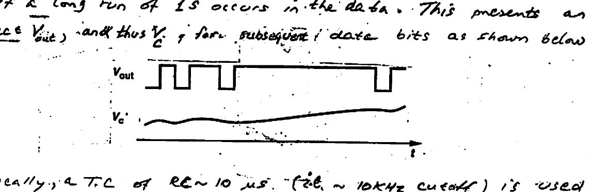

*Fig 9. With an adequately long $`RC`$ T.C., $`V_C`$ holds steady across data bits while $`V_\text{out}`$ pulses.*

Typically, a T.C. of $`RC \approx 10\ \mu s`$ (i.e. $`\sim 10\ \text{kHz}`$ cutoff) is used — requiring a large (off-chip) capacitor $`C`$.

---

## Limiters (Limiting Amplifiers — LAs)

Hi-speed data Rx employ a **Limiter** or **Limiting Amplifier (LA)** consisting of a few stages that follow the front-end TIA — supplementing its gain. Also, the LA regenerates the data by driving a **"decision element"** (Comparator) with an adequate logic level. Typically, $`\sim 10\ \text{mV}`$ at the TIA output gets amplified to a **"logic swing"** $`\sim 500\ \text{mV}`$. This is shown below.

Usually an LA employs a few **differential amp stages** in which the first stage operates **linearly** while the remaining stages operate in **digital mode** (i.e. switches).

$`V_\text{bias}`$ is used for cancelling the DC bias level of the TIA output $`V_1`$, and is produced by a passive replica TIA.

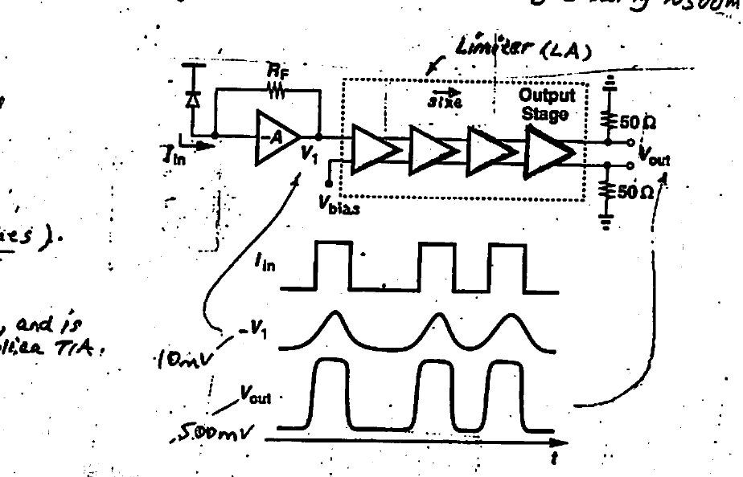

*Fig 10. Limiter (LA): a chain of differential stages following the TIA, with $`V_\text{bias}`$ cancelling the TIA DC level and an output stage driving $`50\ \Omega`$ loads. Waveforms show $`I_\text{in}`$, the $`\sim 10\ \text{mV}`$ input $`V_1`$, and the $`\sim 500\ \text{mV}`$ output $`V_\text{out}`$.*

### LA Performance

**Gain / Bandwidth / Noise / Input Cap. / and Output drive** are the important parameters of an LA.

- **Bandwidth:** typically set to equal the data rate. While the TIA output has relatively slow transitions, the LA (thru amplification & clipping) restores signal integrity with a fast $`V_\text{out}`$ (see waveform).
- **Input Cap.:** should be sufficiently low so as to avoid reduction of TIA bandwidth.
- **Noise:** LA noise is of importance because of (1) the LA's broad BW, and (2) the low gain inherent to broadband TIAs. The latter increases the relative importance of the LA noise contribution. To keep total system noise low, it is important therefore to design the LA for low noise.
- **Gain:** The first (input) stage of the LA must have sufficiently high gain to minimize the effect of noise contributed by subsequent stages (typically 3–4 stages are employed in total).
- **Output Drive:** Due to the low ($`50\ \Omega`$) impedance required by microstrip TL's on PCBs, the output stage must be able to supply sufficient current drive (e.g. $`10\ \text{mA}`$ for a $`\sim 500\ \text{mV}`$ logic swing). The large output-stage transistors used exhibit a large input capacitive load to the preceding stage which itself uses intermediate-size devices. The latter exhibit an intermediate cap. to the preceding stage and so on. To maintain speed in this cascade, **"tapered-size" MOSFETs** are employed in the successive stages.

### Effect of Limiter Action on BW

As shown by the waveforms below, except for the input stage which operates linearly as a SS amplifier, subsequent diff. stages of the LA operate **nonlinearly** as **CURRENT-STEERING** switches. Because of the tail current source being switched between two transistors, the higher stages are classified as **CURRENT-MODE LOGIC (CML)**.

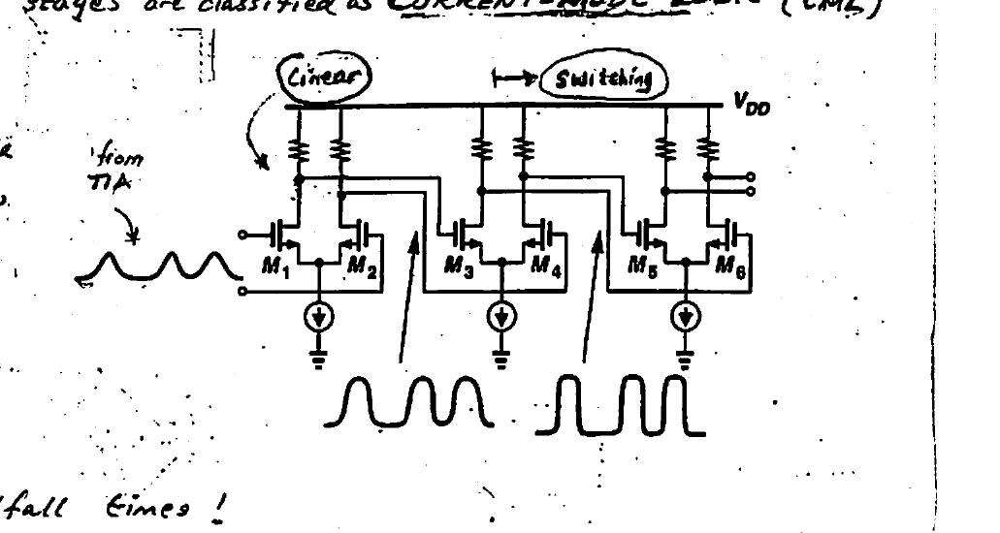

*Fig 11. After the linear input stage, the LA stages ($`M_1`$–$`M_6`$) act as current-steering (CML) switches. Waveforms show the transition from a near-sinusoidal linear output to sharp switched logic levels.*

Note that while the first stage significantly limits the BW due to its linear operation, the subsequent stages operate essentially as **digital logic gates** — contributing cumulative **"propagation delay"** with essentially unchanged rise/fall times!

Thus, only the first switching stage (2nd stage of LA) along with the input linear amplifying stage contribute to determination of the LA bandwidth. The subsequent switching stages only introduce **logic delay** (propagation delay). Therefore, amplitude limiting in these stages has a minimal effect on the bandwidth — with the resulting overall LA BW being **wider** than that of an amplifier of equal number of stages all operating linearly!

---

## Appendix 1 — Shunt–Shunt Stage

The shunt–shunt stage shown has broad-band capability thanks to the small T.C's associated w/ input & output ports @ $`x`$ and $`y`$. The small $`R`$–$`C`$ T.C's are produced at the input & output nodes by the inherent **LOW $`R_\text{in}`$ & $`R_\text{out}`$** of (S–S) FB. These low resistance levels make this configuration a **Hi-speed Transimpedance stage**.

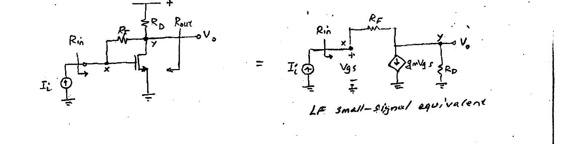

*Fig 12. Shunt–shunt transimpedance stage (with $`R_F`$, $`R_D`$, input node $`x`$, output node $`y`$) and its LF small-signal equivalent.*

### $`Z_T`$ & $`R_\text{in}`$

```math
(1)\quad \frac{V_o}{R_D} + g_m V_{gs} = I_i \qquad\qquad (2)\quad V_{gs} = I_i R_F + V_o
```

Combining:

```math
\frac{V_o}{R_D} + g_m R_F I_i + g_m V_o = I_i
```

```math
\therefore\; Z_T = \frac{V_o}{I_i} = \frac{1 - g_m R_F}{g_m + \dfrac{1}{R_D}} \;\left(\approx -R_F\right) \qquad (g_m R_F \gg 1)\,^\ast
```

```math
(3)\quad R_\text{in} = \frac{V_{gs}}{I_i} = R_F + \frac{V_o}{I_i} = R_F + Z_T = \frac{R_F + R_D}{1 + g_m R_D}
```

```math
\therefore\; R_\text{in} \approx \frac{1}{g_m} + \frac{R_F}{g_m R_D} \qquad (g_m R_D \gg 1)\,^\ast \quad \boxed{\text{LO!}}
```

### $`R_\text{out}`$

```math
R_\text{out} = \left.\frac{V_\text{test}}{I_\text{test}}\right|_{I_i = 0}
```

```math
(1)\quad I_\text{test} = \frac{V_\text{test}}{R_D} + g_m V_{gs} \qquad\qquad (2)\quad V_{gs} = V_\text{test}
```

Combining:

```math
I_\text{test} = V_\text{test}\left(\frac{1}{R_D} + g_m\right)
```

```math
\therefore\; R_\text{out} = \frac{V_\text{test}}{I_\text{test}} = \frac{R_D}{1 + g_m R_D} \approx \frac{1}{g_m} \qquad (g_m R_D \gg 1)\,^\ast
```

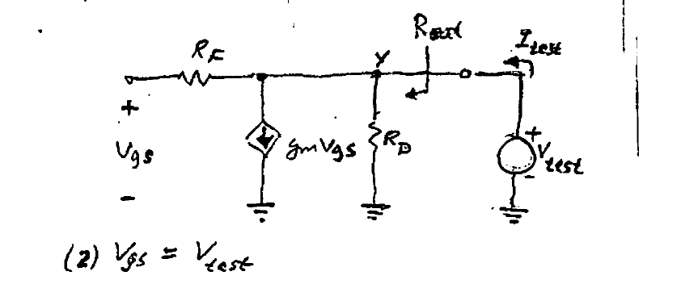

*Fig 13. Small-signal test setup ($`V_\text{test}`$, $`I_\text{test}`$) used to derive $`R_\text{out}`$.*

> \* Recall: $`g_m R_D`$ is the v.gain from Gate ($`x`$) to Drain ($`y`$) without $`R_F`$. Typically $`g_m R_D \gg 1`$.

---

## Benefits of Low $`R_\text{in}`$ & $`R_\text{out}`$

Broad-band amplifiers for Gigabit data rates can accomplish their extra-wide bandwidth by reducing the T.C associated with inevitable parasitic capacitance $`C_\text{in}`$ & $`C_\text{out}`$ appearing at the **"I"** & **"O"** ports (see Fig. below).

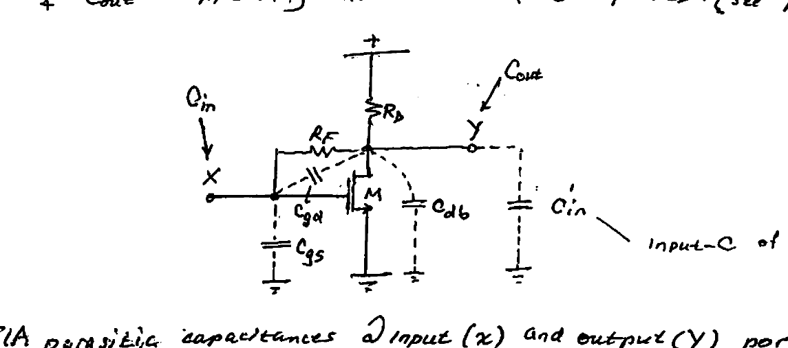

*Fig. TIA parasitic capacitances at input ($`x`$) and output ($`y`$) ports.*

The Fig above shows the parasitic device capacitances of $`M`$: $`C_{gs}`$, $`C_{gd}`$, & $`C_{db}`$. In addition, at the output port included is the input capacitance $`C_\text{in}'`$ of the following stage (LA).

It can be shown:

```math
\text{@ } x:\quad C_\text{in} = C_{gs} + C_{gd}(1 + A)
```

```math
\text{@ } y:\quad C_\text{out} = C_{db} + C_{gd}\left(1 + \frac{1}{A}\right) + C_\text{in}' \qquad\qquad A = \text{v.gain b/w } (x \leftrightarrow y)
```

The T.C's associated with these capacitances must be minimized in order to maximize the BW:

```math
\text{T.C} = R_\text{in} C_\text{in} + R_\text{out} C_\text{out}
```

The small $`R_\text{in}`$ & $`R_\text{out}`$ of the shunt–shunt TIA configuration maximize the bandwidth ($`B \propto \text{T.C}^{-1}`$), and make possible the processing of very-high data rates, $`10\text{'s}`$–$`100\text{'s}\ \text{Gb/s}`$.
