# Lecture 11 — Optical Modulation

**EECE 7398 — PICs** · Northeastern University, ECE · Spring 2023

---

## Optical Modulation

An optical **carrier** wave at a frequency $`f_c`$ can be encoded by the baseband digital data through modulation of any one (or more) of the carrier-wave attributes. The resulting modulation can be:

1. **Amplitude** — "Amplitude Shift Keying" (ASK) or PAM (Pulse-Amplitude Modulation)
2. **Frequency** — "Frequency Shift Keying" (FSK)
3. **Phase** — "Phase Shift Keying" (PSK)
4. **Quadrature Amplitude** — Amplitude + Phase (QAM)
5. **Polarization**

### Waveforms

Let $`d(t)`$ = data, and bit rate $`R_b = T_b^{-1}`$ (bps).

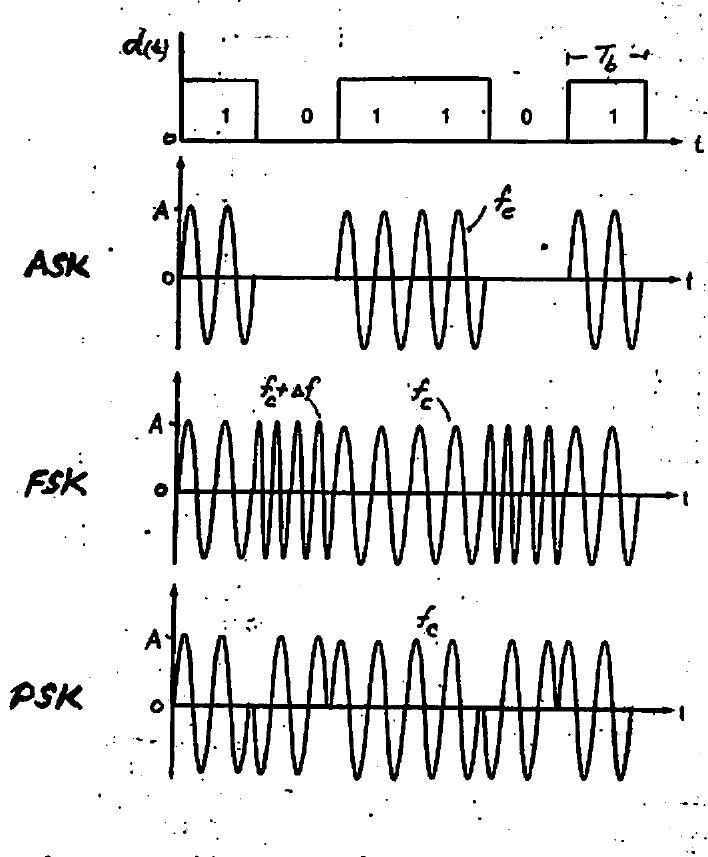

*Fig 1. Time-domain waveforms for ASK, FSK, and PSK modulation of a $`1/0`$ data stream.*

| Modulation | Carrier signal | Average bit energy |
|---|---|---|
| ASK | $`V_{ASK} = d(t)\,A\sin\omega_c t`$ | $`E_b = \dfrac{A^2}{4}T_b`$ |
| FSK | $`V_{FSK} = d(t)\,A\sin\omega_c t + \overline{d(t)}\,A\sin(\omega_2 t)`$ | $`E_b = \dfrac{A^2}{2}T_b`$ |
| PSK | $`V_{PSK} = d(t)\,A\sin\omega_c t + \overline{d(t)}\,A\sin(\omega_c t + \pi)`$ | $`E_b = \dfrac{A^2}{2}T_b`$ |

**Note:** Here $`R_b`$ = data rate (b/s), and $`E_b`$ = average bit energy.

The distribution of signal power over frequency is of importance. It determines the **bandwidths** $`B`$ (Hz) required from photonic circuits handling these signals. We therefore turn next to the **power spectrum** of the various modulations.

> Optical power $`P`$, i.e. energy flow per unit time, is given by the product
>
> ```math
> P = E_b \times R_b \quad (\text{W})
> ```

---

## Power Spectrum

The power spectrum $`S(f)`$ of the various digital modulations has common features. The mathematical description is given by the function $`\operatorname{sinc}^2(x) = \left(\dfrac{\sin x}{x}\right)^2`$:

```math
S(f) = E_b\,\operatorname{sinc}^2\!\big[\pi(f - f_c)T_b\big] \qquad \left(\int S(f)\,df = P\right)
```

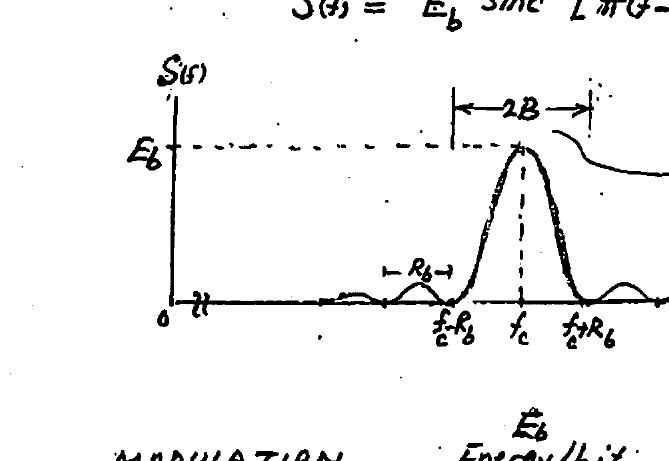

*Fig 2. Power spectrum $`S(f)`$ showing the bandwidth $`2B`$ centered at the carrier $`f_c`$. (For ASK, $`S(f)`$ also has a spectral line at $`f_c`$.)*

| Modulation | Energy/bit | "Bandwidth" $`B`$ |
|---|---|---|
| ASK | $`\dfrac{A^2}{4}T_b`$ | $`R_b`$ (with $`2B \approx 2R_b`$) |
| PSK | $`\dfrac{A^2}{2}T_b`$ | $`R_b`$ |
| FSK | $`\dfrac{A^2}{2}T_b`$ | $`\dfrac{3}{2}R_b`$ (*) |

(*) For FSK, the "frequency shift" $`\Delta f`$ is commonly selected for **orthogonal** $`1/0`$ spectra as shown. This dictates $`\Delta f = R_b`$ and $`2B = 3R_b`$.

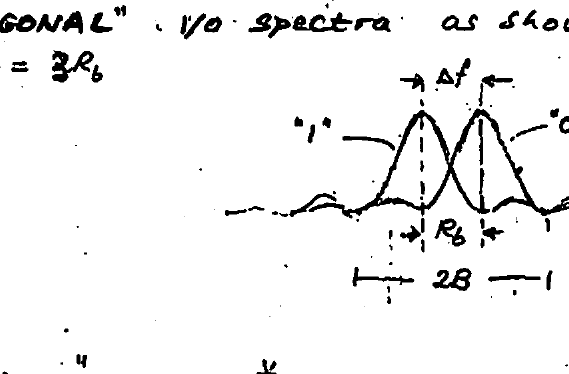

*Fig 3. Orthogonal FSK spectra: $`\Delta f = R_b`$ (orthogonality), giving $`2B = 3R_b`$.*

**Spectral Efficiency:** At best, in the above modulation schemes, the amount of data (b/s) that can be transmitted per unit bandwidth $`B`$ (Hz) of the optical spectrum, $`R_b/B`$, is as low as $`1`$ b/s/Hz. $`R_b/B`$ is coined the **spectral efficiency** and is an important performance parameter for a given modulation. It indicates how much data can be "squeezed" in a unit bandwidth (Hz) of the spectrum.

> **Note:** "Higher-order" modulations (complex modulations) can deliver higher spectral efficiencies ($`> 1`$ b/s/Hz). Note also the inferior spectral efficiency of $`2/3`$ for FSK.

---

## M-ary Modulation Schemes (Higher-Order Modulations)

These "higher-order" modulation schemes are more **spectrally efficient** in that they permit **higher** data rates ($`R_b`$) to be transmitted over a given BW than the 3 basic schemes (ASK / PSK / FSK). Since these, at best, handle 1 bit/s per unit bandwidth, they are characterized by a "BW efficiency" of $`1`$ b/s/Hz.

Because of limitations on channel width (e.g. 50 GHz in the ITU grid), advanced modulation techniques were adopted with the aim of:

1. **Squeezing** as much data into the least amount of spectrum (i.e. bandwidth) possible.
2. Doing so with the **least** amount of signal power possible while maintaining "reliable transmission" — i.e. bit error rate.

Here, (1) is measured by the so-called **spectral efficiency**, which indicates how quickly data could be transmitted in the assigned bandwidth $`B`$ (Hz) (spectral eff. $`= R_b/B`$).

And (2) is measured by the **power efficiency**, which is set by the minimum signal-to-noise ratio (SNR) that would ensure reliable communication in compliance with a max. allowed probability of bit error (Bit-Error Rate), say $`\text{BER} = 10^{-9}`$.

A number of new modulation techniques were devised to improve spectral efficiency. Each of these techniques is governed by a different relationship between "reliability of transmission" (i.e. BER) and the SNR required.

There exists a **fundamental tradeoff** between "spectral efficiency" ($`R_b/B`$) and "power efficiency" (SNR). The best choice of modulation type is determined by the relative availability of **signal power** for transmission and **bandwidth** of the channel — two primary resources (commodities) of a communication system.

Noteworthy is that the invention of the new modulation schemes was driven by an explosion of digital data (data, voice, video) to be transported.

So-called M-ary mod. schemes allow packing $`> 1`$ bit per signaling interval. Here, $`K\,(>1)`$ bits are "combined" into a single transmitted **symbol**, giving rise to a higher spectral efficiency of $`K`$ (bps/Hz). Clearly, instead of only two possible symbols (i.e. bits $`0/1`$), we now have $`M = 2^K`$ possible symbols. Example: four symbols $`(00, 01, 10, 11)`$ exist for a 2-bit symbol.

> Many of the concepts of optical communications have their origin in the field of wireless communications.

### Types of M-ary Modulations

All 3 parameters (degrees of freedom) of the carrier wave can be modulated by the data stream. This produces:

| Type | Example | $`M`$ |
|---|---|---|
| M-ary ASK | 4-PAM | $`M = 4`$ |
| M-ary FSK | 4-level FSK | $`M = 4`$ |
| M-ary PSK | QPSK, 8-PSK | $`M = 4, 8`$ |
| M-ary QAM | 16-QAM, 64-QAM, 256-QAM | $`M = 16, 64, 256`$ |

with $`M = 2^K`$ (bits/symbol $`K`$).

Because of their superior spectral efficiency, **M-ary PSK & QAM** modulations are widely used when high data-throughputs are to be transferred over limited BW (e.g. data centers, optical networks, IoT, 5G, etc.).

### M-PSK

Has $`M`$ phase states:

```math
S_i(t) = A\cos(\omega_c t - \phi_i), \qquad \phi_i = \left(\frac{i}{M}\right)2\pi, \quad i = 0, 1, \dots, M{-}1
```

```math
= a_i\cos\omega_c t + b_i\sin\omega_c t
```

where:

```math
a_i = A\cos\phi_i, \qquad b_i = A\sin\phi_i, \qquad A = (a_i^2 + b_i^2)^{1/2}, \qquad \phi_i = \tan^{-1}\!\left(\frac{b_i}{a_i}\right)
```

For binary PSK ($`=`$ BPSK): $`K = 1`$ and $`M = 2`$, while for QPSK: $`K = 2`$ and $`M = 4`$. These can be represented by **phasors** with Cartesian components $`I`$ (In-phase) and $`Q`$ (Quadrature phase) as shown in the example below. The plots are called **constellation diagrams**.

**Example:** For QPSK, $`S(t) = a_i\cos\omega_c t + b_i\sin\omega_c t`$, where the 2 bits of data ($`K = 2`$) $`d_i, d_j\ (= 1/0)`$ are mapped into (represented by) the bipolar quantities $`a_i, b_i = -1/+1`$.

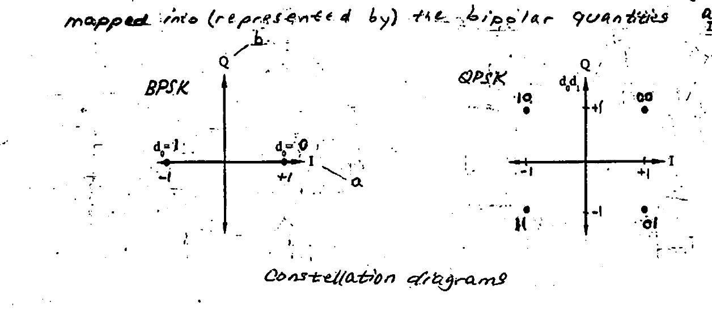

*Fig 4. Constellation diagrams for BPSK and QPSK.*

### M-ary QAM

Is obtained by allowing the amplitudes, in addition to the phase of the $`I`$ & $`Q`$ components, to be modulated.

```math
S_i(t) = A_i\cos(\omega_c t - \phi_i) = a_i\cos\omega_c t + b_i\sin\omega_c t
```

**Examples:**

**1) 16-QAM** — "mapping": $`(a_i, b_i) = (\pm 1, \pm 1),\ (\pm\tfrac{1}{3}, \pm\tfrac{1}{3}),\ (\pm 1, \pm\tfrac{1}{3}),\ (\pm\tfrac{1}{3}, \pm 1)`$

```math
(a_i, b_i) = \left((-1)^{d_0}\,\frac{1 + 2d_2}{3},\ (-1)^{d_1}\,\frac{1 + 2d_3}{3}\right)
```

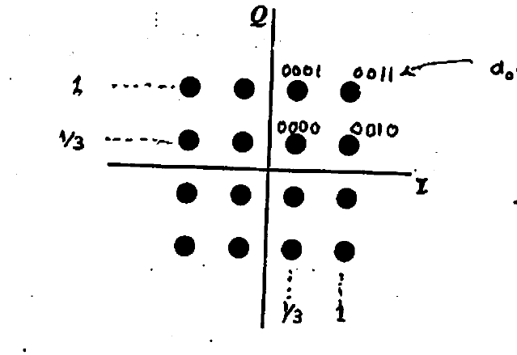

*Fig 5. 16-QAM constellation with Gray-coded bit labels $`d_0 d_1 d_2 d_3`$. (Q. Why Gray code?)*

**2) 64-QAM**

```math
(a_i, b_i) = \left((-1)^{d_0}\,\frac{1 + 2d_2 + 4d_4}{7},\ (-1)^{d_1}\,\frac{1 + 2d_3 + 4d_5}{7}\right)
```

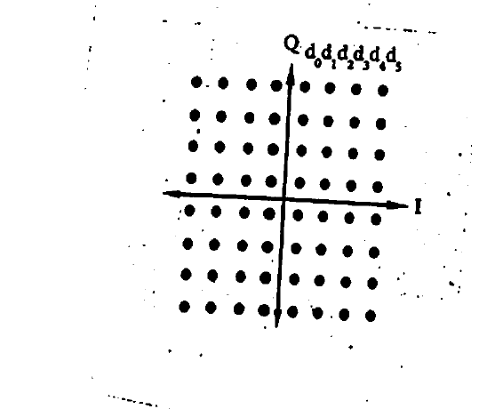

*Fig 6. 64-QAM constellation $`d_0 d_1 d_2 d_3 d_4 d_5`$. (Q. Why uniform density of points?)*

**Observation:** Note that, as a common feature, all M-ary PSK & QAM modulations require **90° phase shifting** to produce the $`I`$ & $`Q`$ components. Also, the QAM format of modulation entails amplitude scaling as well as phase shifting.

---

## Power Spectra — M-ary Modulations

**M-PSK:** Same spectrum as simple PSK except for
```math
R_b \to R_s\left(= \frac{R_b}{K}\right) \quad \text{"Symbol Rate" } (T_s = K T_b)
```
```math
E_b \to E_s\left(= K E_b\right) \quad \text{"Energy/Symbol"}
```
```math
S(f) = E_s\,\operatorname{sinc}^2\!\big[\pi(f - f_c)T_s\big], \quad T_s = R_s^{-1}, \quad B = R_s = \frac{R_b}{K}
```

**M-FSK:** $`M`$-superimposed (orthogonal) spectra of the simple FSK, with $`M = 2^K`$ and $`B \approx (M+1)R_s`$.

**M-QAM:** Combination of PSK & ASK, with $`B \approx R_s = \dfrac{R_b}{K}`$.

**PM-4 (PAM-4):** 1 symbol $`= 2`$ bits, with $`R_s = \dfrac{R_b}{2}`$.

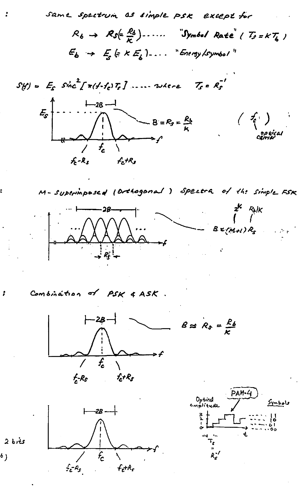

*Fig 7. Power spectra for M-PSK, M-FSK, M-QAM, and PAM-4.*

### Spectral Efficiency (bps/Hz)

We show below the spectra and spectral efficiency ($`R_b/B`$) for various modulations.

| $`R_b/B`$ | Modulation |
|---|---|
| 1 | BPSK |
| 2 | QPSK |
| 4 | 16-QAM |
| 6 | 64-QAM |
| 8 | 256-QAM |
| 10 | 1024-QAM |

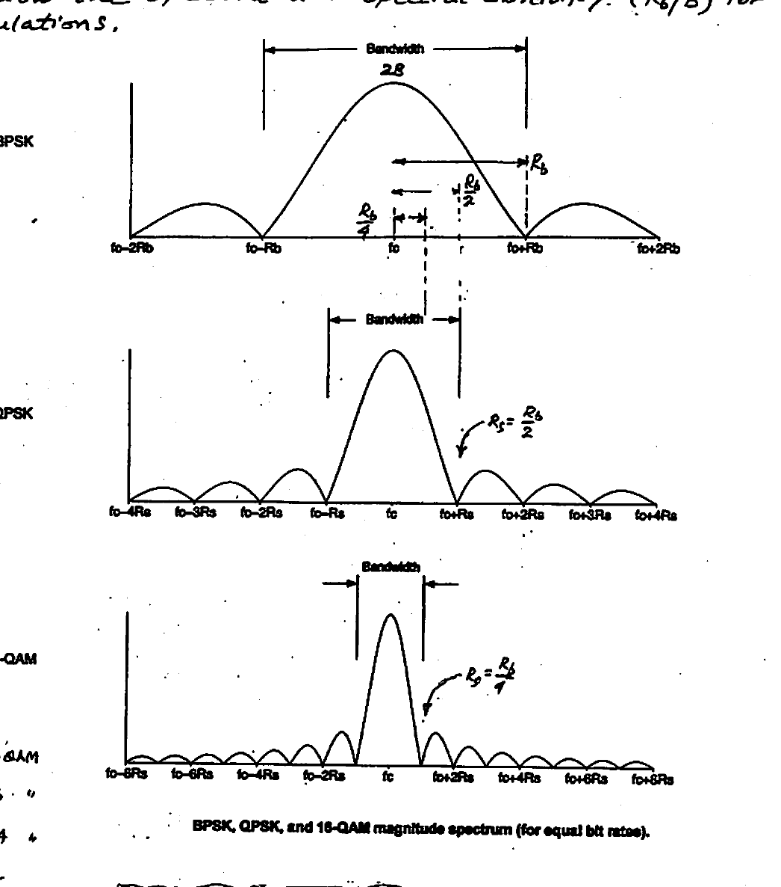

*Fig 8. BPSK, QPSK, and 16-QAM magnitude spectrum (for equal bit rates). Bandwidth $`\approx 2R_s`$.*

```math
\boxed{\text{Bandwidth} \approx 2R_s}
```

### QPSK — Example

```math
S_i(t) = A\cos(\omega_c t - \phi_i)
```

| $`d_0 d_1`$ | 00 | 10 | 11 | 01 |
|---|---|---|---|---|
| $`\phi_i`$ | 45° | 135° | 225° | 315° |

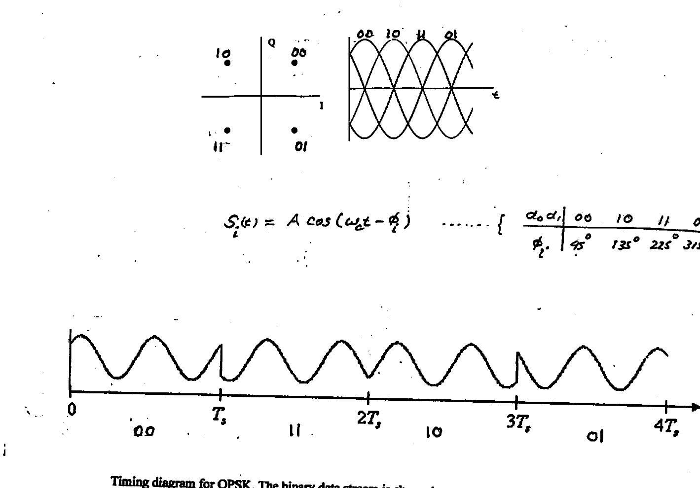

*Fig 9. Timing diagram for QPSK. The binary data stream is shown beneath the time axis; the two signal components with their bit assignments are at the top, and the combined signal at the bottom. Note the abrupt phase changes at some bit-period boundaries. The binary data conveyed is: $`00\ 11\ 10\ 01`$.*

### 16-QAM — Example

```math
S_i(t) = A_i\cos(\omega_c t - \phi_i) \qquad (3 \text{ amplitudes}, 12 \text{ phases})
```

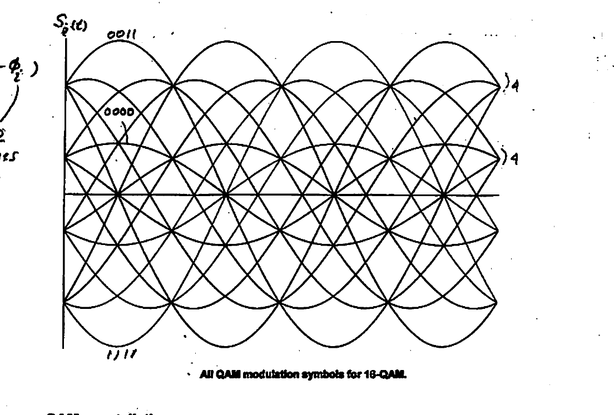

*Fig 10. All QAM modulation symbols for 16-QAM (signal waveform $`S(t)`$).*

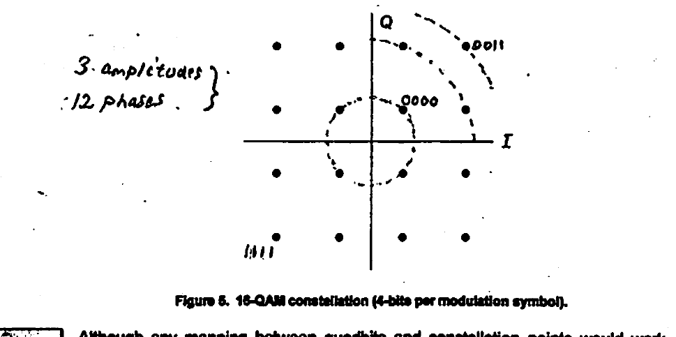

*Fig 10b. 16-QAM constellation (4 bits per modulation symbol). Each constellation point corresponds to a different quadbit $`(d_0, d_1, d_2, d_3)`$, with 3 amplitudes and 12 phases. Gray code: adjacent constellation points differ by only one bit, which facilitates error correction since a small displacement of a constellation point due to noise will likely cause only one bit of the demodulated quadbit to be erroneous.*

---

## OOK Optical Modulators — MZI-Based

Modulators of this type are based on optical **phase shifters** made of Si (or LiNbO₃) and operate on an **electro-optic** principle. Such materials change their optical refractive index ($`n`$) under an applied external electric field. This allows for changing the propagation velocity of coherent IR light passing through the materials — and hence their use for delay, phase shift, or switching.

A **Mach-Zehnder Interferometer** (MZI) employs optical interferometry to produce OOK-modulated light supplied by a laser (e.g. 1.55 μm). Its broad bandwidth supports 10's Gb/s data rates.

### LiNbO₃ MZI

Shown in Fig 1 (below) is a Mach-Zehnder electro-optical modulator based on LiNbO₃. Here, IR light from a laser is divided by a "beam splitter" into two equal-intensity waves that travel through two symmetrical arms* of equal length ($`L`$). At their exit the waves are recombined. Under suitable drive of the top (active) arm by a hi-rate data stream $`V_{in}`$, it is possible to produce a binary ($`180/0`$) binary phase delay in the light passing through it relative to the bottom (passive) arm. This phase delay is a direct result of the "electro-optic effect" governing the induced change in propagation velocity in the active arm.

Being of equal intensity, the light beams exiting the two arms, upon recombining in a "combiner", produce an on-off ("OOK") output through constructive/destructive interference. In this manner a PAM-2-modulated signal is produced with a modulating signal $`V_{in}`$ of few volts at 10's Gb/s data rates.

> *Containing a pair of electrodes to permit voltage control of light speed.

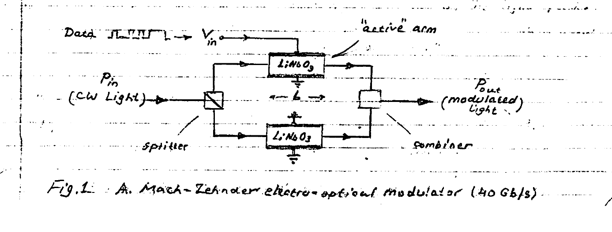

*Fig 1. A Mach-Zehnder electro-optical modulator (40 Gb/s).*

### Si-based M-Z Modulator

Most importantly, the following Si-based modulator is **CMOS-process-compatible**, allowing enhanced capability through integration of the electronic and photonic functionalities on a single chip. Similar to its LiNbO₃ counterpart, a Si-MZI modulator also employs a pair of "phase shifter arms" (Fig 2).

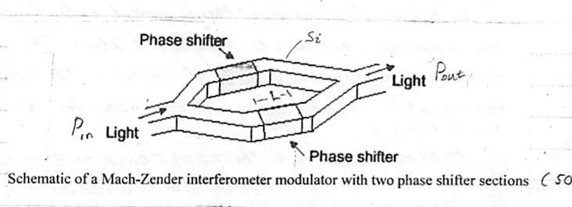

*Fig 2. Schematic of a Mach-Zehnder interferometer modulator with two phase shifter sections (50 Gb/s).*

A beam splitter at input, a beam combiner at output, and a symmetrical pair of arms — all are based on Si waveguides (wires). The phase shifters are an identical pair of Si p–n junctions biased in reverse (depletion), through which the IR light passes (into the page; Fig 3 below).

**Principle of operation:** Varying the reverse-bias voltage applied to a p–n junction changes the "depletion region" width. The dielectric constant ($`\varepsilon`$) of Si, and hence the refractive index ($`n`$), increase with the number of free charge carriers ($`e^-`$'s/$`h^+`$'s) removed in the p–n junction depletion region. Thus, a change in reverse bias affected by a $`1/0`$ digital data signal produces a corresponding change in velocity of the travelling light. This change in speed effects a delay which results in a change ($`\Delta\phi`$) in the phase of the light emerging from the phase shifter arm.

> *Dependence of $`\varepsilon`$ (and $`n`$) on free charge carriers in Si is due to the "plasma dispersion effect".

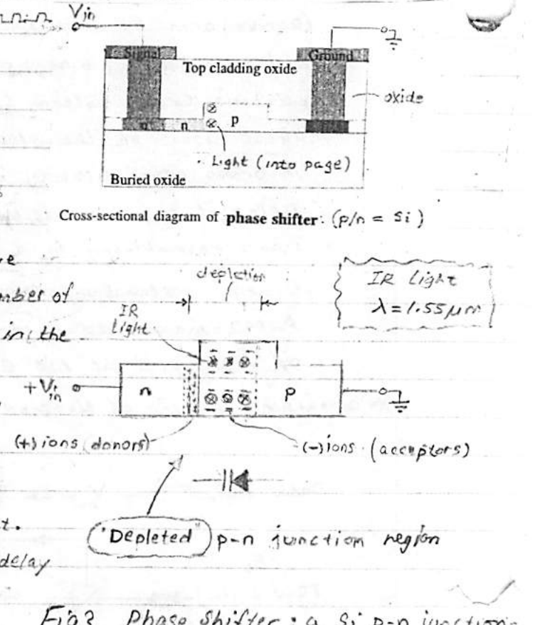

*Fig 3. Phase shifter: a Si p–n junction under reverse bias. Cross-sectional diagram of phase shifter (p/n $`=`$ Si), with IR light $`\lambda = 1.55\ \mu m`$ propagating into the page.*

---

## Phase Shift $`\Delta\phi`$

The resulting phase shift $`\Delta\phi`$ produced by the induced change $`\Delta n`$ in refractive index $`n`$ in an "active arm" of a MZI relative to a "passive arm" is readily determined:

```math
\text{Delay} \quad \Delta t = \frac{L}{V_{(active)}} - \frac{L}{V}, \qquad L = \text{length of arm} \ (\sim 1\ \text{mm})
```

```math
V = \frac{c}{n}, \qquad V_{(active)} = \frac{c}{n + \Delta n}, \qquad c = \text{velocity of light (free-space, vacuum)}
```

```math
\Delta t = \frac{L}{c}(n + \Delta n) - \frac{L}{c}n = \frac{L}{c}\Delta n
```

```math
\Delta\phi = 2\pi\left(\frac{\Delta t}{T}\right) = 2\pi f\,\Delta t = \left(2\pi\frac{c}{\lambda}\right)\Delta t = \left(\frac{2\pi}{\lambda}\right)\frac{c}{c}L\,\Delta n
```

```math
\boxed{\Delta\phi = \left(\frac{2\pi}{\lambda}\right)\Delta n \cdot L}
```

where $`f, \lambda`$ are the IR light frequency & wavelength ($`c = \lambda f`$).

**Example: 50 Gb/s silicon photonic modulator based on MZI.**

1. Phase shifter: $`L = 1\ \text{mm}`$, (p) acceptors $`= 3 \times 10^{17}\ \text{cm}^{-3}`$, (n) donors $`= 1.5 \times 10^{18}\ \text{cm}^{-3}`$, $`n(\text{Si}) \approx 3.48`$.
2. $`\Delta\phi \sim V_{in}`$ data: $`\Delta\phi \propto`$ reverse bias.
3. Find $`\Delta n / n`$ for $`\Delta\phi = \pi`$:

```math
\frac{\Delta n}{n} = \frac{\lambda}{2Ln} \times 100 = 0.022\ \%
```

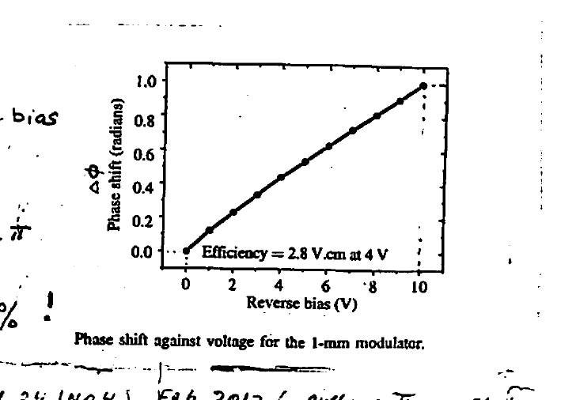

*Fig. Phase shift against voltage for the 1-mm modulator. Efficiency $`= 2.8`$ V·cm at 4 V.*

> *IEEE Photonics Technology Letters, Vol 24 (No 4), Feb. 2012 (author: Thomson et al).

### Change in Refractive Index ($`\Delta n`$)

As previously noted, the "electro-optic" effect in Si is based on the so-called "**plasma free-carrier dispersion**". The complex refractive index of silicon in the active arm is modified by changes in the concentrations (cm⁻³) of electrons ($`N_e`$) & holes ($`N_h`$) in the p–n junction depletion region brought about by the reverse-bias voltage $`V_{in}`$. The following equations are obtained by equation-fitting to experimental observations at $`\lambda = 1.55\ \mu m`$. Here, $`\Delta n`$ & $`\Delta\alpha`$ are, respectively, the changes in refractive index & absorption coefficient (real & imaginary parts of the refractive index) of Si affected by changes $`\Delta N_e`$ & $`\Delta N_h`$ in concentrations of $`e^-`$'s & $`h^+`$'s in the "depletion region" of the reverse-biased p–n junction. Increasing the reverse bias removes more charge carriers ($`\Delta N_e, \Delta N_h < 0`$) and widens the depletion region.

At $`\lambda = 1.55\ \mu m`$:

```math
\Delta n = -\big(8.8 \times 10^{-22}\,\Delta N_e + 8.5 \times 10^{-18}(\Delta N_h)^{0.8}\big) \tag{1}
```

```math
\Delta\alpha = 8.5 \times 10^{-18}\,\Delta N_e + 6.0 \times 10^{-18}\,\Delta N_h \tag{2}
```

Note that holes have a larger ratio of real to imaginary refractive index change. For this reason they are more effective for the operation of the p–n junction phase shifters in the MZI modulator. This is taken advantage of in practice by a wider p-side depletion layer in the p–n junction, which is realized through lighter acceptor doping.

At $`\lambda = 1.31\ \mu m`$, the corresponding empirical equations are:

```math
\Delta n = -\big(6.2 \times 10^{-22}\,\Delta N_e + 6.0 \times 10^{-18}(\Delta N_h)^{0.8}\big) \tag{3}
```

```math
\Delta\alpha = 6 \times 10^{-18}\,\Delta N_e + 4.0 \times 10^{-18}\,\Delta N_h \tag{4}
```

**Example:** For a Si p–n junction with doping $`N_A = N_D = 5 \times 10^{17}\ \text{cm}^{-3}`$, under a reverse bias a change in carrier concentration $`\Delta N_e \approx \Delta N_h = -5 \times 10^{17}\ \text{cm}^{-3}`$ would take place. The resulting change (at $`\lambda = 1.31\ \mu m`$) is:

```math
\Delta n = 6.2 \times 10^{-22} \cdot 5 \times 10^{17} + 6.0 \times 10^{-18}(5 \times 10^{17})^{0.8} = +1.118 \times 10^{-3}
```

That is about $`\sim 0.1\ \%`$ increase in refractive index.

> *Soref R. & Bennett B., "Electrooptical effects in silicon", IEEE Journal of Quantum Electronics (1987) 23: 123–9. doi: 10-1109/JQE.1987.1073206.

---

## Optical Transfer Function of the MZI: $`P_{out}/P_{in}`$

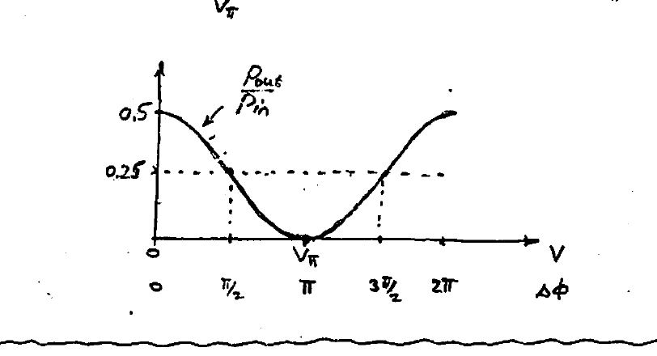

We seek the ratio of output light to input light powers. The optical power is proportional to the square of the magnitude of the electric field $`|E|^2`$ of the optical wave. Hence:

```math
\frac{P_{out}}{P_{in}} = \frac{|E_{out}|^2}{|E_{in}|^2}
```

($`E_2`$ is being modulated.)

```math
E_{out} = E_1' + E_2' = \tfrac{1}{2}E_1\,e^{j2\pi ft} + \tfrac{1}{2}E_2\,e^{j(2\pi ft \pm \Delta\phi)} \quad \text{(combiner)}
```

```math
E_{1,2} = \frac{E_{in}}{\sqrt{2}} \quad \text{(splitter)}
```

```math
|E_{out}|^2 = E_{out}\cdot E_{out}^* = \frac{1}{4}\big(E_1 + E_2\,e^{-j\Delta\phi}\big)\big(E_1^* + E_2^*\,e^{+j\Delta\phi}\big)
```

```math
= \frac{|E_1|^2}{4} + \frac{|E_2|^2}{4} + \frac{E_2 E_2^*}{4}e^{+j\Delta\phi} + \frac{E_1^* E_2}{4}e^{-j\Delta\phi}
```

```math
= \frac{|E_{in}|^2}{8} + \frac{|E_{in}|^2}{8} + \frac{|E_{in}|^2}{8}\big(e^{+j\Delta\phi} + e^{-j\Delta\phi}\big)
```

```math
= \frac{|E_{in}|^2}{4}\big(1 + \cos\Delta\phi\big)
```

```math
\therefore\quad \frac{P_{out}}{P_{in}} = 0.25\,(1 + \cos\Delta\phi)
```

**Define:** $`\Delta\phi \triangleq \dfrac{\pi}{V_\pi}\,V`$, where $`V_\pi \triangleq`$ input voltage producing a 180° phase shift.


*Fig. MZI optical transfer function $`P_{out}/P_{in}`$ vs. drive voltage $`V`$ (or phase $`\Delta\phi`$), showing the half-power point at $`0.25`$ and the $`V_\pi`$ point.*

> *Analysis based on "optical modes" propagation in the combiner shows that half the (entering) power is lost. Hence the presence of the two $`\tfrac{1}{2}`$ factors in $`E_{out}`$.
>
> Note also that $`t`$ should be $`t - \tfrac{L}{V}`$ to reflect propagation delay in the arms (length $`L`$) of the MZI. This has no effect on power, however.

---

## Photonic Modulator Performance

The performance of an optical Tx in a communication link is dominated by the optical modulator. In the following we describe the important performance parameters of an optical modulator.

### Optical Modulation Amplitude (OMA)

```math
\text{OMA} = P_{max} - P_{min}
```

```math
P_{avg} = \frac{P_{max} + P_{min}}{2}
```

where $`P_{min}`$ & $`P_{max}`$ = min & max optical power levels corresponding to "0" & "1" being transmitted, and $`P_{avg}`$ is the average output optical power.

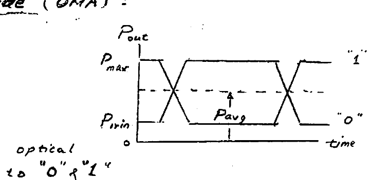

*Fig. Eye diagram showing $`P_{max}`$, $`P_{min}`$, and $`P_{avg}`$ used to define the OMA.*

To make it easier for the Rx to recover the light-data signal received in the presence of noise, it is desirable to maintain a large OMA.

### Extinction Ratio (ER)

Is a measure of the efficiency by which the modulator controls optical power in the Tx, and is defined simply as the ratio of $`P_{max}`$ (corresponding to "1") and $`P_{min}`$ (corresponding to "0"):

```math
\text{ER} = 10\log\!\left(\frac{P_{max}}{P_{min}}\right)
```

In optical links based on a direct-modulated laser or indirect optical modulator, ER is commonly in the range 10 dB – 20 dB (i.e. 10:1 – 100:1). This is to be contrasted with an "optical switch" device which has a much more stringent requirement, ER $`\geq 40`$ dB.

**ER Importance:** For the same difference $`(P_{max} - P_{min})`$, i.e. the same OMA, a higher ER is advantageous as it results in a lower $`P_{avg}`$ required from the laser.

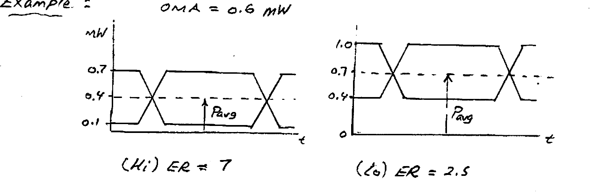

*Fig. Eye diagrams: (Hi) ER $`= 7`$, OMA $`= 0.6`$ mW; (Lo) ER $`= 2.5`$. Note the reduced $`P_{avg}`$ requirement on laser power of 0.4 mW for ER $`= 7`$ compared to 0.7 mW for ER $`= 2.5`$.*

Theoretically, max. power efficiency will be achieved ideally for $`P_{min} \to 0`$, for which ER $`\to \infty`$. This is **not** possible in practice, however — specifically, due to the "turn-on delay" that would result in the laser diode (e.g. VCSEL).

### Modulation Efficiency: $`V_\pi \cdot L`$

We have shown for a MZM:
```math
\Delta\phi = \frac{2\pi}{\lambda}\Delta n \cdot L
```

So that:
```math
\Delta n = \left(\frac{\lambda}{2\pi L}\right)\Delta\phi
```

Using $`\Delta\phi = \pi\,V/V_\pi`$:
```math
\Delta n = \left(\frac{\lambda}{2 V_\pi L}\right)V
```

The smallness of the $`V_\pi L`$ product is an important metric of the "**modulation efficiency**" of the modulator, allowing **lower operating voltages** ($`V`$) and/or **smaller size** (length $`L`$).

**Examples:**
- Lithium Niobate MZM: $`V_\pi L \approx 14`$ V·cm
- Silicon depleted-junction MZM: $`V_\pi L \approx 4`$ V·cm

---

## Lumped-MZM vs. TW-MZM

A short silicon photonic MZM with electrode length $`L < 1`$ mm can be considered a **lumped** component and be represented by a **capacitor** load for a driver.

In general, however, this approximation is not valid. At higher frequencies (data rates), the "electrical wavelength" becomes comparable to the electrode length $`L`$ of the MZM — necessitating a "distributed" element model; the long electrode is now behaving as a **transmission line** (T.L.) with "Traveling-Wave" behavior.

- **"Lumped" MZM:** $`L \ll \dfrac{\lambda}{4}`$ (electrical) — "short $`L`$"
- **"TW" MZM:** $`L \gtrsim \dfrac{\lambda}{4}`$ (electrical) — "long $`L`$"

A long electrode implies at least a 90° phase shift of the "RF signal" (data) across its length $`L`$:

```math
L \approx \frac{\lambda}{4}\text{(electrical)} = \frac{c/n}{4 f_{RF}}
```

**Define:**
```math
f_{bound} = \frac{c/n}{4L}, \qquad n = 3.48\ (\text{for Si})
```

where $`f_{bound}`$ is the "**boundary frequency**" value below which the modulator (electrode) can be approximated by a lumped capacitor (see below).

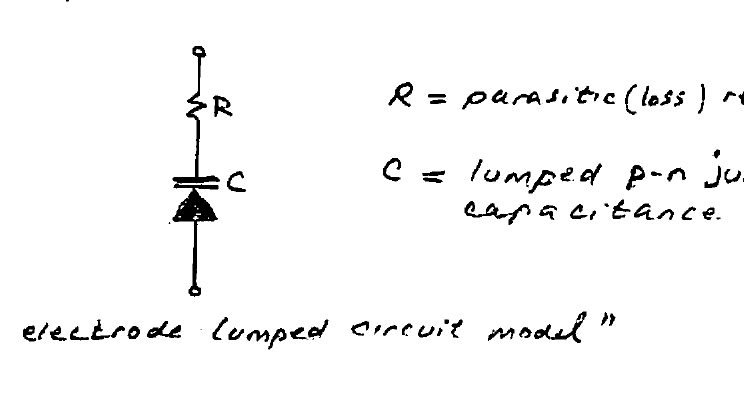

*Fig. MZM-input electrode lumped circuit model: $`R`$ = parasitic (loss) resistance ($`\sim 10\ \Omega`$), $`C`$ = lumped p–n junction capacitance ($`\sim 1`$ pF).*

**Example:** $`L \approx 1`$ mm & $`n(\text{Si}) = 3.48`$, find $`f_{bound}`$:

```math
f_{bound} = \frac{3 \times 10^{10}\ \text{cm/s} \,/\, 3.48}{4 \times 0.1\ \text{cm}} = 21\ \text{GHz}
```

Thus, for all operating frequencies $`< 20`$ GHz, or data rates $`R_b < 20`$ Gb/s, the electrode of the MZM is equivalent to a capacitor. The driver, therefore, must be appropriately designed for a **capacitive** load.

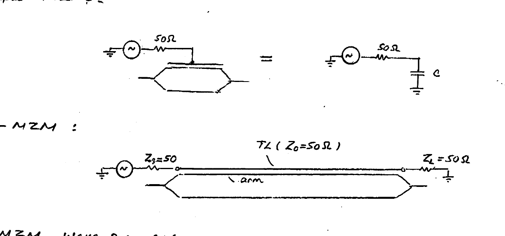

*Fig. (Top) Lumped-MZM: 50 Ω source driving a capacitor $`C`$. (Bottom) TW-MZM: 50 Ω source ($`Z_s`$) driving a transmission line ($`Z_0 = 50\ \Omega`$) with matched load $`Z_L = 50\ \Omega`$.*

### TW-MZM Wave Propagation

Clearly two types of wave propagation take place concurrently:
- **Optical** in the modulator arms.
- **Electrical** in the electrode T.L.

Consequently, two important operational requirements must be met:

**(1) Z-matching:** When the electrode T.L. is designed for $`Z_0 = 50\ \Omega`$ characteristic impedance, then both source and load terminations must match the T.L., i.e. $`Z_s = Z_L = 50\ \Omega`$. This is essential in order to prevent troublesome reflections, which would materially degrade the **signal integrity** of the modulating (data) waveform.

**(2) Velocity-matching:** Ideally, in a T-W modulator, speeds of electrical wave propagation in the electrode T.L. and of optical wave propagation in the arm of the modulator must be equal. In practice this is a challenging requirement to satisfy, and a mismatch in propagation speeds would introduce a degraded modulated optical signal as a result of the rather impaired electro-optical coupling.

### Insertion Loss (IL)

Ideally, under constructive interference, an MZI modulator output optical power equals that at its input, $`P_{out} = P_{in}`$. In practice, due to losses in the waveguide (arms), $`P_{out} < P_{in}`$. The "**insertion loss**" for the modulator is defined by the input/output ratio:

```math
\text{IL} = 10\log\!\left(\frac{P_{out}}{P_{in}}\right)
```

---

## Dual-Drive MZM (Differential / "Push-Pull" / "Balanced")

Here both phase shifter arms of the modulator are activated by $`V_1`$ & $`V_2`$.

```math
\text{(1)}\quad E_1 = E_2 = \frac{E_{in}}{\sqrt{2}} \quad \text{(splitter)}
```

```math
\text{(2)}\quad E_{out} = \frac{E_{in}}{2}e^{-j\phi_1} + \frac{E_{in}}{2}e^{-j\phi_2} \quad \text{(combiner)}
```

```math
E_{out} = \frac{E_{in}}{2\sqrt{2}}e^{-j\phi_1} + \frac{E_{in}}{2\sqrt{2}}e^{-j\phi_2}
```

```math
|E_{out}|^2 = E_{out}\cdot E_{out}^* = \frac{|E_{in}|^2}{4}\big(1 + \cos(\phi_1 - \phi_2)\big)
```

```math
\therefore\quad \frac{P_{out}}{P_{in}} = \frac{|E_{out}|^2}{|E_{in}|^2} = 0.25\big(1 + \cos(\phi_1 - \phi_2)\big) = 0.25\left(1 + \cos\!\left(\pi\frac{V_d}{V_\pi}\right)\right)
```

where $`V_d \triangleq V_1 - V_2`$ is the **differential input voltage**, and $`\phi_{1,2} = \dfrac{\pi V_{1,2}}{V_\pi}`$.

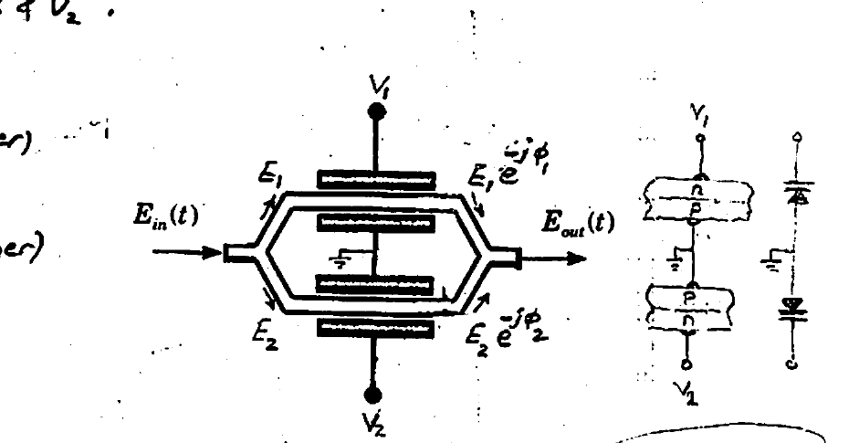

*Fig. Dual-drive (differential push-pull) MZM schematic with both arms driven by $`V_1`$ and $`V_2`$. (Note: $`V_{1,2} > 0`$.)*

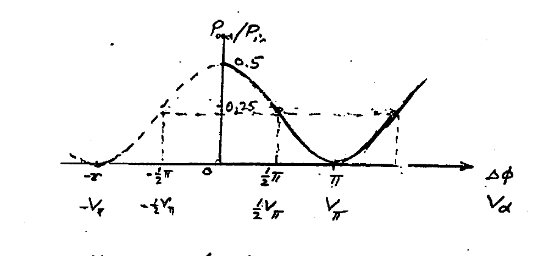

*Fig. Optical transfer characteristic $`P_{out}/P_{in}`$ vs. differential phase $`\Delta\phi`$ (drive $`V_d`$).*

**Note:**
- For $`|V_d| = V_\pi`$, the differential MZM requires for each of $`V_1`$ & $`V_2`$ only $`\dfrac{V_\pi}{2}`$: $`V_{1,2} = \pm\dfrac{V_\pi}{2}`$. This is a welcome reduction in input-level since it relaxes the voltage swing requirement from the driver circuits delivering $`V_{1,2}`$.
- The optical transfer curve has the same features as the "single-ended" version ($`V_2 \equiv 0`$) treated earlier.
