# Lecture 12 — IQ Modulation

**EECE 7398 — Analysis & Design of Photonic Integrated Circuits (PICs)** · Northeastern University · Spring 2023

## Coherent Optical Modulators

Data information may be encoded into optical carrier waves by a process of: **phase modulation (PM)**, **amplitude modulation (AM)**, and **I–Q modulation (IQM)**. Modulators can be constructed based on the **electro-optic effect** employing SOI as well as other materials ($`\text{InP}`$, $`\text{GaAs}`$, $`\text{LiNbO}_3`$). The photonic device structures employed, as well as the phasor diagrams describing their modulation action, are shown in Fig 1.

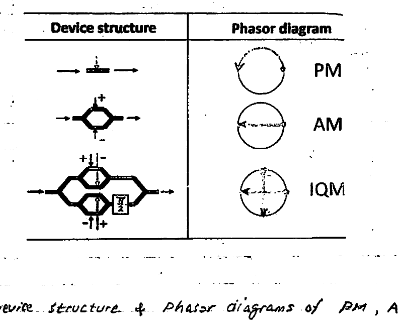

*Fig 1. Device structure & phasor diagrams of PM, AM, and IQM.*

---

## Phase Modulator (PM) — "Phase Shifter"

The **electro-optic effect** predicts and describes the small change ($`\Delta n`$) in refractive index ($`n`$) of any of the above materials when subjected to an electric field produced by an applied voltage $`V(t)`$:

```math
\Delta n = k\,V(t) \qquad (1)
```

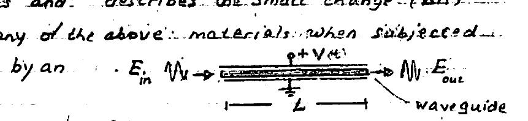

*Fig 2. A coherent wave $`E_\text{in}`$ traverses the waveguide of length $`L`$ subject to applied voltage $`V(t)`$, emerging as $`E_\text{out}`$.*

The **phase shift** $`\varphi`$ imparted to a coherent light wave ($`E_\text{in}`$) traversing the waveguide length ($`L`$) is found from the time **DELAY** produced as a result of a decrease in propagation velocity:

```math
\text{Delay} = \frac{L}{c/(n+\Delta n)} - \frac{L}{c/n} = \frac{L}{c}\,(\Delta n) \qquad (2)
```

```math
\therefore\; \varphi = 2\pi\!\left(\frac{\text{Delay}}{T}\right) = 2\pi f\!\left(\frac{L}{c}\,\Delta n\right) = \frac{2\pi L}{\lambda}\,(\Delta n) \qquad (3)
```

Eqns (1)–(3) are a mathematical description of the **electro-optic effect**.

Using (1) one can re-express $`\varphi`$:

```math
\varphi = \left(\frac{\pi}{V_\pi}\right) V(t) \qquad (4)
```

where $`V_\pi`$ = applied voltage producing a $`180°`$ phase ($`\varphi = \pi`$), and is a function of $`\lambda`$ and $`L`$. Accordingly it is called the **"half-wavelength" voltage**:

```math
V_\pi = \frac{1}{2k}\left(\frac{\lambda}{L}\right) \qquad (5)
```

To summarize the phase modulation action of the **PHASE MODULATOR**, we can readily obtain its input–output **Transfer Function (T.F.)**:

```math
E_\text{out} = E_\text{in}\,e^{-j\varphi} \quad\Rightarrow\quad \text{T.F.} = \frac{E_\text{out}}{E_\text{in}} = e^{-j\pi \frac{V(t)}{V_\pi}} \qquad (6)
```

where $`E_\text{out}`$ & $`E_\text{in}`$ are the magnitudes of the optical wave electric fields at the waveguide output and input, respectively.

### Observations

- Pure PM action is affected by $`V`$: e.g. $`180°`$ for $`V = V_\pi`$ and $`90°`$ for $`V = \tfrac{V_\pi}{2}`$.
- From eqn (5), $`V_\pi`$ is determined by the light wavelength ($`\lambda`$) and the length ($`L`$) of the waveguide arm. Importantly, a longer arm is required for higher **SENSITIVITY** (smaller $`V_\pi`$) to applied voltage. Typically, $`L \approx 1\ \text{mm}`$ (i.e. $`1000\ \mu\text{m}`$!) — a rather large size in comparison to microring resonators ($`\sim\mu\text{m}`$) and CMOS ($`\sim\text{nm}`$).
- Very low **power** consumption is involved in operating the PM. This is due to the capacitive load exhibited by the electrodes flanking the waveguide ($`\text{LiNbO}_3`$) or the reversely-biased $`p`$–$`n`$ junction (SOI).
- For PM devices based on (Si) depletion-mode $`p`$–$`n`$ junctions, the required **reverse-bias** operation places a constraint on the polarity of the applied voltage.

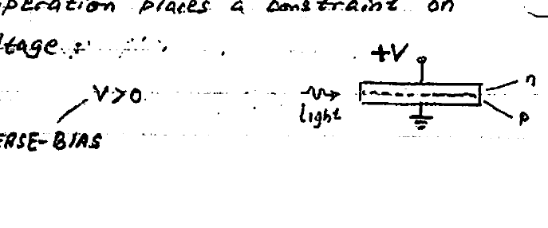

*Fig 3. Reverse-bias operation ($`V > 0`$) of the $`p`$–$`n`$ junction phase shifter.*

---

## Amplitude Modulation (AM)

An amplitude modulator can be simply realized by combining **two PMs** to interfere with one another in a **Mach–Zehnder (MZ) modulator** (below).

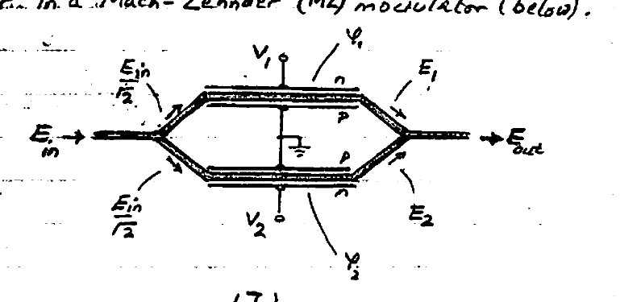

*Fig 4. Mach–Zehnder (MZ) modulator with split fields $`E_1`$, $`E_2`$ driven by arm voltages $`V_1`$, $`V_2`$.*

The Y beam-splitter at the input divides the input optical power $`E_\text{in}^2`$ into two halves $`\tfrac{1}{2}E_\text{in}^2`$ each. Or, in terms of electric field intensity, two equal $`E_\text{in}/\sqrt{2}`$ are derived from $`E_\text{in}`$.

**Phase shifts:**

```math
\varphi_{1,2} = \left(\frac{\pi}{V_\pi}\right) V_{1,2} \qquad (7)
```

**Split-output fields:**

```math
E_{1,2} = \frac{E_\text{in}}{\sqrt{2}}\,e^{-j\varphi_{1,2}} \qquad (8)
```

**Output field** after taking into account half the power loss in the output Y-combiner:

```math
E_\text{out} = \frac{E_1}{2} + \frac{E_2}{2} = \frac{E_\text{in}}{2\sqrt{2}}\left(e^{-j\varphi_1} + e^{-j\varphi_2}\right) \qquad (9)
```

**The transfer function:**

```math
\text{TF} = \frac{E_\text{out}}{E_\text{in}} = \frac{1}{2\sqrt{2}}\left(e^{-j\varphi_1} + e^{-j\varphi_2}\right) \qquad (10)
```

To accomplish AM, a **"PUSH–PULL"** excitation is employed (the **signal** $`V`$ being applied in antiphase):

```math
V_{1,2} = \pm\frac{V}{2} + V_{\text{bias}\,1,2} \qquad (11)
```

where $`V_{1,2} > 0`$ dictates that $`\frac{|V|}{2} < V_{\text{bias}\,1,2}`$ must hold to ensure an **always-reverse** bias for the depletion $`p`$–$`n`$ junctions making up the two MZ devices. Also, for convenience, the two DC bias voltages may be written as:

```math
V_{\text{bias}\,1,2} = V_\text{bias} \pm \frac{\Delta}{2} \qquad \text{where } \begin{cases} V_\text{bias} = \tfrac{1}{2}\left(V_{\text{bias}_1} + V_{\text{bias}_2}\right) \\[4pt] \Delta \triangleq \left(V_{\text{bias}_1} - V_{\text{bias}_2}\right) \end{cases} \qquad (12)
```

Evaluating the TF by combining (7) and (10):

```math
\text{TF} = \frac{E_\text{out}}{E_\text{in}} = \frac{1}{2\sqrt{2}}\left(e^{-j\frac{\pi}{V_\pi}\left(\frac{V}{2}+V_{\text{bias}_1}\right)} + e^{-j\frac{\pi}{V_\pi}\left(-\frac{V}{2}+V_{\text{bias}_2}\right)}\right)
```

```math
\text{TF} = \;\dots\; = \frac{1}{\sqrt{2}}\left(e^{-j\frac{\pi}{V_\pi}V_\text{bias}}\right)\cos\!\left(\pi\,\frac{V+\Delta}{2V_\pi}\right) \qquad (13)
```

For power:

```math
\frac{P_\text{out}}{P_\text{in}} = |\text{TF}|^2 = \frac{1}{2}\cos^2\!\left(\pi\,\frac{V+\Delta}{2V_\pi}\right) = \frac{1}{4}\left[1 + \cos\!\left(\pi\,\frac{V+\Delta}{V_\pi}\right)\right] \qquad (14)
```

### The graph

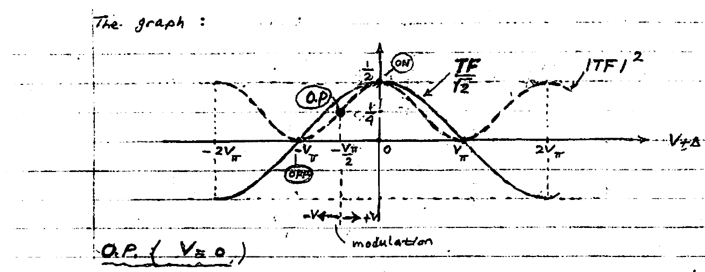

*Fig 5. $`\dfrac{\text{TF}}{\sqrt{2}}`$ and $`|\text{TF}|^2`$ vs. $`V+\Delta`$, showing the ON/OFF points and the quadrature operating point (O.P.) with the modulation swing $`-V \leftrightarrow +V`$.*

### O.P. ($`V \approx 0`$)

To obtain pure AM — i.e. **ON/OFF (OOK)** operation — one must select an **Operating Point (O.P.)** at the **"Quadrature point"** $`\left(-\tfrac{V_\pi}{2}\right)`$:

```math
\left.\left(V+\Delta\right)\right|_{V=0} = -\frac{V_\pi}{2} \quad\Rightarrow\quad \Delta = -\frac{V_\pi}{2}
```

and use a signal swing of $`V = \pm\tfrac{V_\pi}{2}`$ (peak-to-peak swing $`= V_\pi`$).

**NOTE:**

1. Typically, the electronics producing $`V_{1,2}`$ is a **Diff-Amp** with outputs $`V_{1,2} = \pm\tfrac{V}{2} + V_\text{bias}`$ (i.e. equal $`V_{\text{bias}_1} = V_{\text{bias}_2}`$). Unfortunately, this results in an O.P. located at the origin ($`\Delta = 0`$), where $`|\text{TF}|^2`$ is symmetric (instead of "sloped"). To correct this condition, by some means a relative DC shift of $`\Delta`$ must be produced between $`V_1`$ & $`V_2`$ in order to re-establish an O.P. @ the quadrature point.
2. For an O.P. located at the **"OFF" (null) point** $`\Delta = -V_\pi`$, it can be seen that by selecting a signal swing $`V = \pm V_\pi`$, **pure phase modulation (PM)** is obtained — specifically, **BPSK**, for which case:

```math
\text{TF} = \frac{e^{-j\pi \frac{V_\text{bias}}{V_\pi}}}{\sqrt{2}}\,\sin\!\left(\frac{\pi}{2}\,\frac{V}{V_\pi}\right) \qquad (15)
```

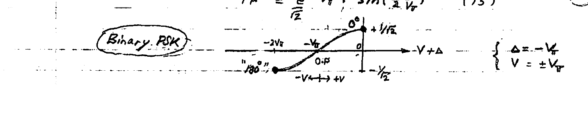

*Fig 6. Binary PSK: with $`\Delta = -V_\pi`$ and $`V = \pm V_\pi`$, the carrier toggles between $`0°`$ and $`180°`$ phase states.*

---

## I–Q Modulator (IQM)

To achieve **I–Q modulation**, a pair of "push–pull" MZM are combined **in parallel** to result in what is called a **"dual-nested"** M–Z modulator: one serves the **In-phase (I)** component, the other serves the **Quadrature (Q)** component. To accommodate the phase quadrature of the (Q) arm, a $`90°`$ **"phase shifter"** must be added (see below).

For achieving phase modulation, the MZM pair are biased at their **OFF** or **"null-point"** $`-V_\pi`$ (see BPSK).

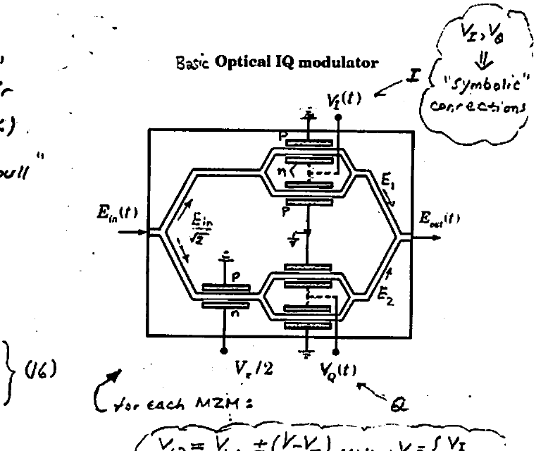

*Fig 7. Basic optical IQ modulator. The I-arm is driven by $`V_I(t)`$ and the Q-arm by $`V_Q(t)`$, with a $`\tfrac{\pi}{2}`$ phase shifter in the Q branch. ($`V_I`$, $`V_Q`$ shown as symbolic connections.)*

Applying the TF of the "push–pull" MZM (eqn (15)) to the I & Q MZM pair, one can write for its two outputs:

```math
\left.\begin{aligned} E_1 &= \frac{E_\text{in}}{\sqrt{2}}\left(e^{-j\pi\frac{V_\text{bias}}{V_\pi}}\,\sin\!\left(\frac{\pi}{2}\,\frac{V_I}{V_\pi}\right)\right) \\[6pt] E_2 &= \frac{E_\text{in}}{\sqrt{2}}\left(e^{-j\pi\frac{V_\text{bias}}{V_\pi}}\,\sin\!\left(\frac{\pi}{2}\,\frac{V_Q}{V_\pi}\right)\right)e^{-j\frac{\pi}{2}} \end{aligned}\right\} \qquad (16)
```

For each MZM:

```math
V_{1,2} = V_\text{bias} \pm \left(\frac{V - V_\pi}{2}\right), \qquad V = \begin{cases} V_I \\ V_Q \end{cases}
```

Taking into account the 50% power loss in the Y-combiner, the total output optical E-field is:

```math
E_\text{out} = \frac{E_1}{2} + \frac{E_2}{2}
```

which, following substitution of (16), yields:

```math
E_\text{out} = \frac{1}{2\sqrt{2}}\,e^{-j\pi\frac{V_\text{bias}}{V_\pi}}\left(\underbrace{\sin\!\left(\frac{\pi V_I}{2V_\pi}\right)}_{I} - j\underbrace{\sin\!\left(\frac{\pi V_Q}{2V_\pi}\right)}_{Q}\right)E_\text{in} \qquad (17)
```

Eqn (17) is represented by the I–Q diagram at right. Here $`I`$ & $`Q`$ are the **"normalized"** quantities with maximum values of $`\pm 1`$ & $`\pm j`$, respectively. These values define a square forming a **"Reachable signal space"**. All constellation points (e.g. $`A_i\,e^{j\varphi_i}`$) must therefore fall inside this space.

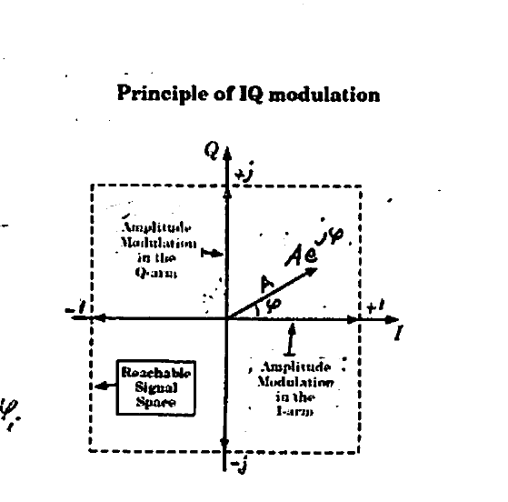

*Fig 8. Principle of IQ modulation: amplitude modulation in the I-arm and Q-arm combine to place a phasor $`A\,e^{j\varphi}`$ anywhere within the reachable signal space.*

It should be noted that in (pure) **M-PSK** only the phase $`\varphi_i`$ gets modulated (while the amplitude $`A_i`$ stays constant), whereas in **QAM** both amplitude $`A_i`$ and phase $`\varphi_i`$ get modulated.

---

## M-PSK Modulator

Here the amplitude of the optical carrier is **constant** but its phase is modulated. As a result, all constellation points reside on a **circle**, and are uniformly spaced with a phase interval $`\dfrac{2\pi}{M}`$.

### QPSK

A particular case of interest is **QPSK**: groups of 2-bits are transmitted as symbols, thereby doubling the bit rate. When QPSK is augmented to include **dual polarization (DP)**, the bit rate of the resulting **DP-QPSK** is doubled once more — leading to $`\times 4`$ higher **spectral efficiency** compared to ordinary BPSK. Accordingly, DP-QPSK finds wide application in **long-haul coherent optical communication systems** — e.g. 100 Gb/s over 100–1000 km long-haul data links.

For QPSK, (17) points out **four possible states** (symbols), where the $`V_I`$ & $`V_Q`$ and the corresponding $`I`$ & $`Q`$ have values belonging to the sets:

```math
\left.\begin{aligned} V_I \;\&\; V_Q &\in (-V_\pi,\, V_\pi) \\ I \;\&\; Q &\in (\pm 1,\, \pm j) \end{aligned}\right\} \qquad (18a)
```

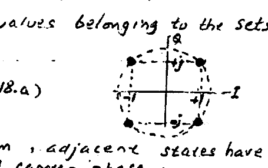

*Fig 9. QPSK constellation: four symbols on a circle, with $`\pm 1`$ on the $`I`$-axis and $`\pm j`$ on the $`Q`$-axis.*

As can be seen from the constellation diagram, adjacent states have a $`\dfrac{2\pi}{4} = \dfrac{\pi}{2}`$ angular separation, with an optical carrier phase:

```math
\varphi_i = \pm\frac{\pi}{4},\; \pm\frac{3\pi}{4} \qquad (18b)
```

The input, which consists of a CW optical carrier generated by a laser diode, can be expressed as a phasor electric field $`E_\text{in} = E_0\,e^{j\varphi_0}`$, where $`E_0`$ = peak value, $`\varphi_0`$ = initial phase. The output electric field $`E_\text{out}`$ in eqn (17) can now be expressed by the phasor:

```math
E_\text{out}(t) = \frac{E_0}{2}\,e^{-j(\varphi_0' + \varphi_i)} \qquad (19)
```

where,

```math
\varphi_0' = \varphi_0 - \pi\frac{V_\text{bias}}{V_\pi} \qquad \text{and} \qquad \varphi_i = \pm\frac{\pi}{4},\; \pm\frac{3\pi}{4}
```

---

## M-QAM Modulator

Here, **both amplitude and phase** of the optical carrier wave are modulated. For a uniformly-spaced I–Q diagram, **linearization** of eqn (17) is necessary.\* (\* leads to optimum **"noise immunity"**.)

One simple solution requires maintaining small arguments in the two "sine" terms so that $`\sin x \approx x`$. This requirement dictates that $`V_I`$ & $`V_Q`$ be kept small relative to $`V_\pi`$, i.e.,

```math
V_{I,Q} \ll \frac{2}{\pi}\,V_\pi \qquad (20)
```

Then, eqn (17) for QAM acquires a **"linearized"** form:

```math
E_\text{out} \approx \frac{\pi E_\text{in}}{4V_\pi}\,e^{-j\pi\frac{V_\text{bias}}{V_\pi}}\left[\,V_I - j\,V_Q\,\right] \qquad (21)
```

A more practical solution is obtainable through **DSP**. Here, an inverse $`\sin^{-1}(\;)`$ **PREDISTORTION** is performed on $`V_I`$ & $`V_Q`$. This leads to linearization similar to eqn (21) above.

### 16 QAM

Here each **quadruplet** of bits is converted into a symbol consisting of 4-bits, which offers a $`\times 4`$ increase in spectral efficiency relative to simple BPSK or PAM2 (OOK). When 16 QAM is augmented by dual polarization (DP) modulation, the spectral efficiency is doubled to $`\times 8`$ of BPSK. Because of this, **DP-16QAM** is employed for metro/regional networks running @ 100 Gb/s over 10's to 100's km. A block diagram of a 16QAM modulator is shown below.

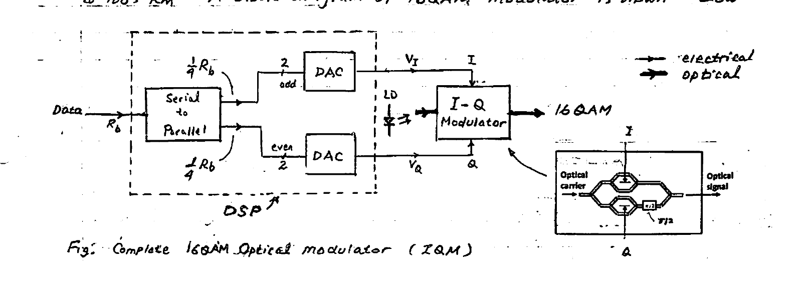

*Fig 10. Complete 16QAM optical modulator (IQM). The DSP (serial-to-parallel + two DACs) generates $`V_I`$ and $`V_Q`$ that drive the I–Q modulator fed by the laser diode (LD); → electrical, ⇒ optical.*

A DSP consisting of a **serial-to-parallel converter** and $`\times 2`$ **DACs** is used. The entering binary data stream @ rate $`R_b`$ (bits/s) is divided by the serial–parallel shift register into two 2-bit-wide parallel streams: **even** and **odd** bits. In turn, these high-speed DACs output the analog $`V_I`$ (for I) & $`V_Q`$ (for Q) signals to drive the I–Q modulator, which outputs the 16QAM modulated optical signal. Please note that the DACs convert their 2-bit inputs into **PAM4** analog signals $`V_I`$ & $`V_Q`$, with 4 uniformly spaced levels.

> \* **Note:** the DACs perform all necessary scaling and offset required for producing $`V_I`$ & $`V_Q`$ from their 2-bit data inputs.

**Example:** For illustrative purposes, let us consider how the given $`V_I`$ & $`V_Q`$ PAM4 signals produce a sequence of "states", which we denote by $`1, 2, 3, \dots`$ on the constellation diagram.

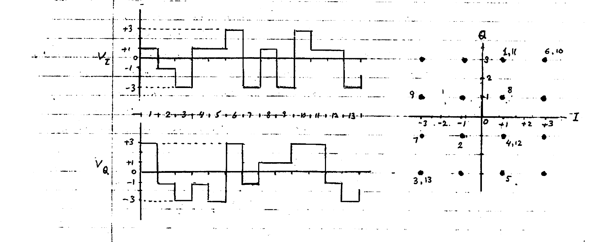

*Fig 11. The PAM4 waveforms $`V_I`$ and $`V_Q`$ (levels $`\pm 1, \pm 3`$) over time indices $`1`$–$`13`$, mapping to numbered states on the 16QAM constellation diagram.*

---

## Example: 16QAM & 64QAM

In an optical network, a coherent link operates at a frequency $`f_c = 200\ \text{THz}`$. For achieving high data throughputs, it employs QAM modulation. The QAM-modulated signal is:

```math
E_k(t) = A_k\cos(\omega_c t - \varphi_k) = a_k\cos\omega_c t + b_k\sin\omega_c t
```

Two cases are to be considered (see constellation diagrams below):

```math
\textbf{16 QAM:}\quad (a_k,\, b_k) = \left((-1)^{d_0}\,\frac{1+2d_2}{3},\; (-1)^{d_1}\,\frac{1+2d_3}{3}\right)\ \text{V/m} \quad\cdots\;(d_0\dots d_3)\ \text{symbol}
```

```math
\textbf{64 QAM:}\quad (a_k,\, b_k) = \left((-1)^{d_0}\,\frac{1+2d_2+4d_4}{7},\; (-1)^{d_1}\,\frac{1+2d_3+4d_5}{7}\right)\ \text{V/m} \quad\cdots\;(d_0\dots d_5)
```

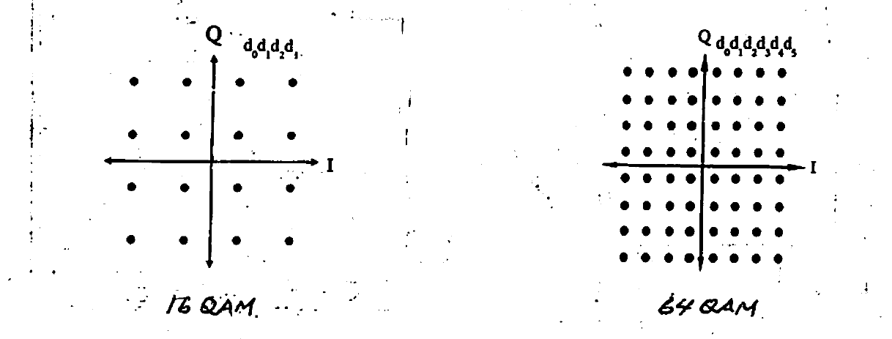

*Fig 12. Constellation diagrams for 16QAM (left, 4 bits $`d_0 d_1 d_2 d_3`$) and 64QAM (right, 6 bits $`d_0 d_1 d_2 d_3 d_4 d_5`$).*

**A)** Express $`a_k`$, $`b_k`$ in terms of the amplitude $`A_k`$ and phase $`\varphi_k`$, then show: $`A_k = \sqrt{a_k^2 + b_k^2}`$ and $`\varphi_k = \tan^{-1}\!\left(\dfrac{b_k}{a_k}\right)`$.

**B)** &nbsp;**i)** Verify that the MAX (largest) amplitude $`A_k`$ for both 16QAM & 64QAM is $`\sqrt{2}\ \text{V/m}`$ (corresponding to $`1\ \text{V/m}`$ RMS). Then, verify that 16QAM has 3 different amplitudes: $`\dfrac{\sqrt{2}}{3}`$, $`\dfrac{\sqrt{10}}{3}`$, $`\sqrt{2}`$.
&nbsp;&nbsp;&nbsp;&nbsp;**ii)** How many different amplitudes and phases are there in 64QAM?

**C)** Determine and write on the constellation diagram all 16 codes for 16QAM.

**D)** **Noise immunity:** the presence of noise/interference adding to $`E_k(t)`$ can result in displacement of a point in the constellation diagram to a (nearest-neighbor) adjacent point — producing data **ERROR**! A simple measure for "noise immunity" is the separation or distance between adjacent points (codes). Determine (in V/m) the noise immunity for 16QAM and 64QAM. By what factor is 16QAM "more immune" to noise than 64QAM?

**E)** Compare the **Dynamic Range** $`\left(\text{DR} = \left(\dfrac{\text{MAX ampl.}}{\text{Min ampl.}}\right)^2\right)`$ for 16QAM & 64QAM.

---

### Solution

#### (A) $`a_k,\, b_k = ?`$

```math
E_k = A_k\cos(\omega_c t - \varphi_k) = \underbrace{A_k\cos\varphi_k}_{a_k}\cos\omega_c t + \underbrace{A_k\sin\varphi_k}_{b_k}\sin\omega_c t
```

```math
\sqrt{a_k^2 + b_k^2} = \left(A_k^2\cos^2\varphi_k + A_k^2\sin^2\varphi_k\right)^{1/2} = A_k \quad\checkmark
```

```math
\frac{b_k}{a_k} = \frac{A_k\sin\varphi_k}{A_k\cos\varphi_k} = \tan\varphi_k \;\cdots\; \varphi_k = \tan^{-1}\!\left(\frac{b_k}{a_k}\right) \quad\checkmark
```

#### (B) i)

```math
A_k(\text{max}) = \left(a_k^2(\text{max}) + b_k^2(\text{max})\right)^{1/2} = \left(1^2 + 1^2\right)^{1/2} = \sqrt{2}\ \text{V/m}
```

| Modn | $`|a_k(\text{max})|`$ | $`|b_k(\text{max})|`$ |
| --- | --- | --- |
| 16QAM | $`1\ \text{V/m}`$ | $`1\ \text{V/m}`$ |
| 64QAM | $`1\ \text{V/m}`$ | $`1\ \text{V/m}`$ |

**3 Amplitudes of 16QAM:**

| $`d_0\,d_1\,d_2\,d_3`$ | $`a_k`$ | $`b_k`$ | $`A_k`$ |
| --- | --- | --- | --- |
| $`0\;0\;0\;0`$ | $`\tfrac{1}{3}`$ | $`\tfrac{1}{3}`$ | $`\tfrac{\sqrt{2}}{3}`$ |
| $`0\;0\;0\;1`$ | $`\tfrac{1}{3}`$ | $`1`$ | $`\tfrac{\sqrt{10}}{3}`$ |
| $`0\;0\;1\;1`$ | $`1`$ | $`1`$ | $`\sqrt{2}`$ |

(Here $`A_k = \sqrt{a_k^2+b_k^2}`$, $`\varphi_k = \tan^{-1}(b_k/a_k)`$, with $`a_k`$ along $`I`$ and $`b_k`$ along $`Q`$.)

**ii)** 64QAM has: **9 amplitudes** and **32 phases** — found by sketching one quadrant of the constellation diagram (see next page).

#### (C) Codes ($`d_0 \cdots d_3`$)

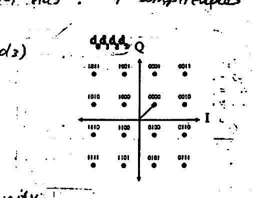

*Fig 13. The 16 codes ($`d_0 d_1 d_2 d_3`$) on the 16QAM constellation. Note the single-bit change between adjacent codes (**Gray code**).*

#### (D) Noise Immunity

| Modulation | Noise Immunity |
| --- | --- |
| 16 QAM | $`\Delta a_k = \Delta b_k = \tfrac{2}{3}\ \text{V/m}`$ |
| 64 QAM | $`\Delta a_k = \Delta b_k = \tfrac{2}{7}\ \text{V/m}`$ |

```math
\frac{N.\text{Imm}(16\text{QAM})}{N.\text{Imm}(64\text{QAM})} = \frac{2/3}{2/7} = \frac{7}{3}
```

#### (E) Dynamic Range

```math
\text{DR}(16\text{QAM}) = \left(\frac{\sqrt{2}\ \text{V/m}}{\frac{\sqrt{2}}{3}\ \text{V/m}}\right)^2 = 3^2 = 9
```

```math
\text{DR}(64\text{QAM}) = \left(\frac{\sqrt{2}}{\frac{\sqrt{2}}{7}}\right)^2 = 7^2 = 49
```

> **Note:** Any **nonlinearity** in the system can cause two adjacent points on the constellation diagram to get closer — thereby increasing the likelihood of data error when noise is present. Due to the higher $`\text{DR} = 49`$, the system has a more stringent **linearity** requirement for the 64QAM signal.

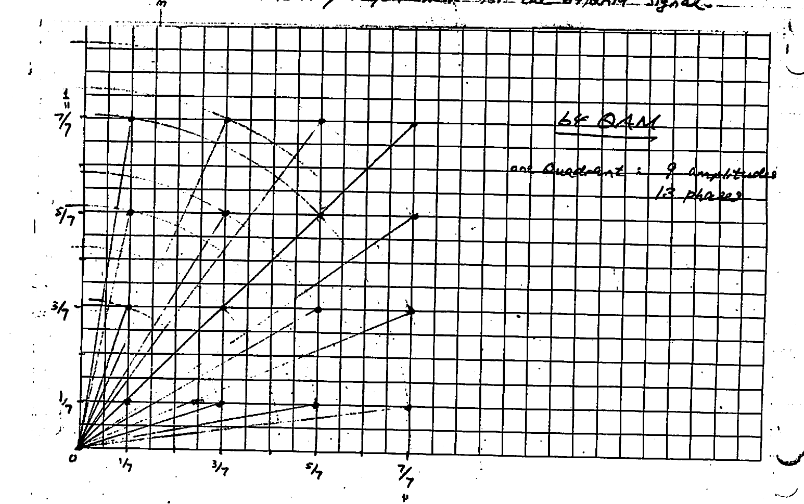

*Fig 14. 64QAM — one quadrant of the constellation, used to count the distinct amplitudes (9) and phases.*

---

## Exercise: QAM Modulation

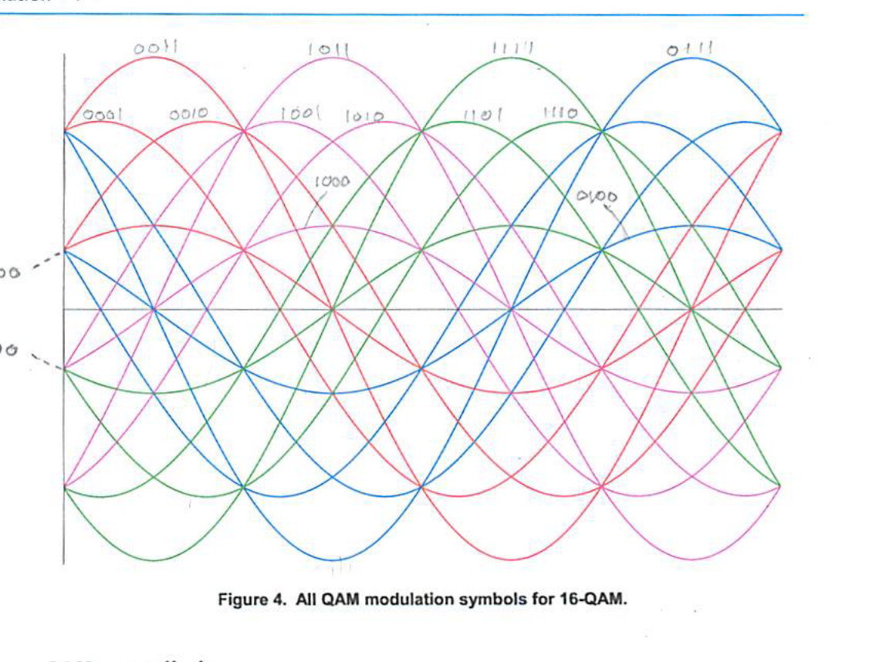

*Figure 4. All QAM modulation symbols for 16-QAM.*

### QAM constellations

Figure 5 shows the constellation diagram for 16-QAM. The constellation diagram is a pictorial representation showing all possible modulation symbols (or signal states) as a set of constellation points. The position of each point in the diagram shows the amplitude and the phase of the corresponding symbol. Each constellation point corresponds (is mapped) to a different **quadbit**.

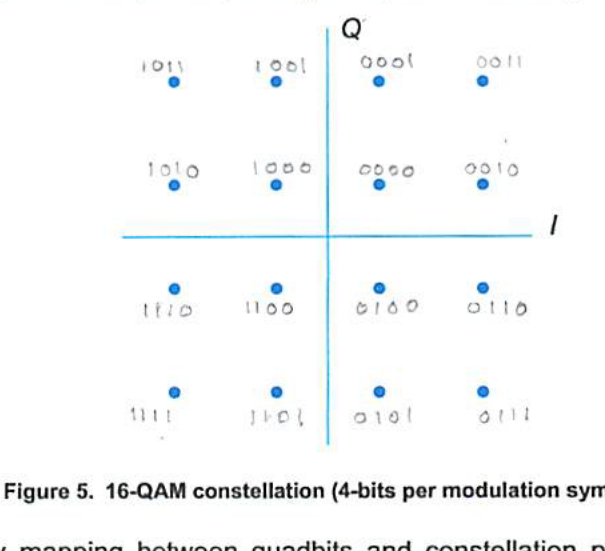

*Figure 5. 16-QAM constellation (4-bits per modulation symbol).*

Although any mapping between quadbits and constellation points would work under ideal conditions, the mapping usually uses a **Gray code** to ensure that the quadbits corresponding to adjacent constellation points differ only by one bit. This facilitates error correction, since a small displacement of a constellation point due to noise will likely cause only one bit of the demodulated quadbit to be erroneous.

> The Gray code was designed by Bell Labs researcher Frank Gray and patented in 1953. Gray codes are widely used in digital communications.
