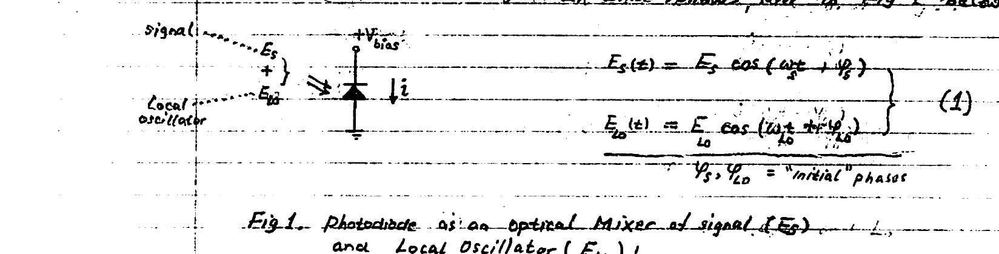
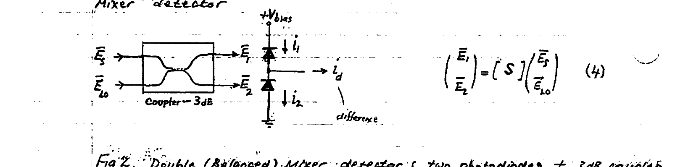
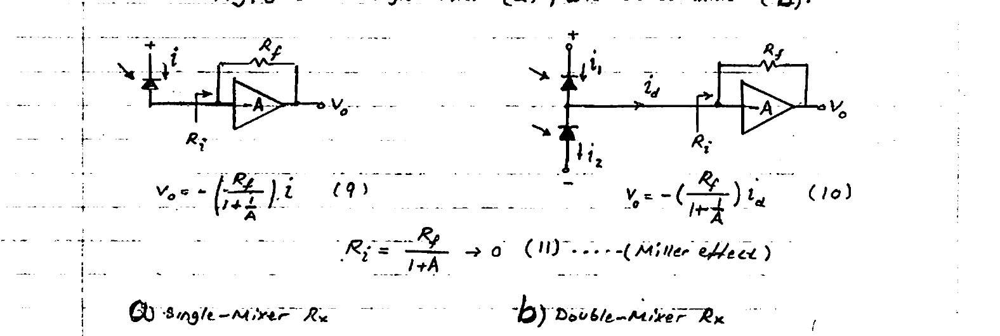
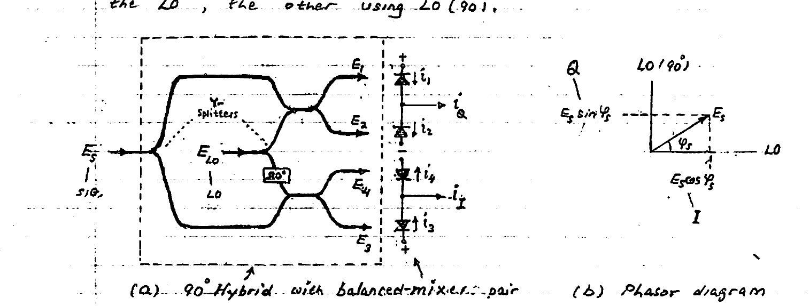
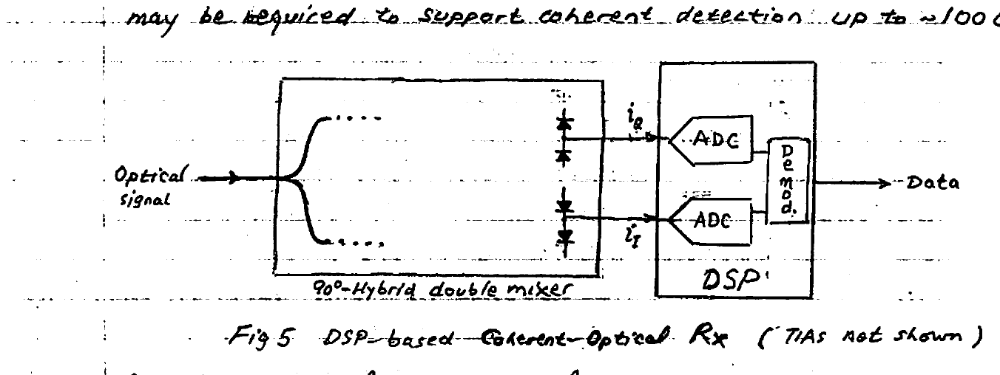
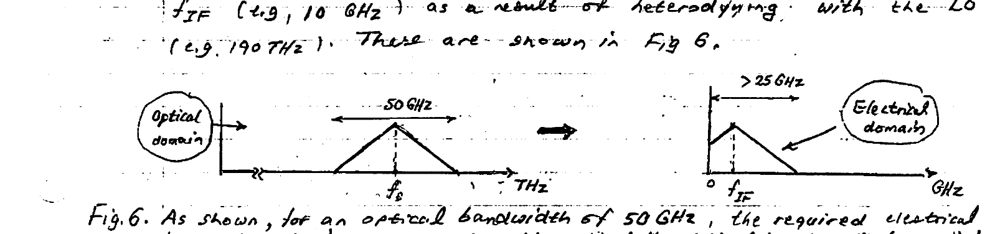
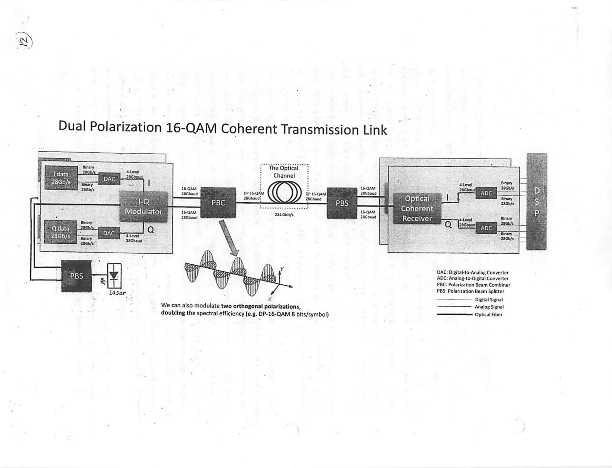

# Lecture 13 — IQ Demodulation

**EECE 7398 — Analysis & Design of Photonic Integrated Circuits (PICs)** · Northeastern University, Dept. of Electrical & Computer Engineering · Spring 2023 · Lec #13 (27 Feb)

## COHERENT OPTICAL DETECTION

**Perspective:** with its fundamental concepts rooted in Wireless Communications, **coherent optics** technology has established itself as the means for boosting the data rate over existing fiber channels. Orders of magnitude increase in their network traffic-carrying capacity was achieved by network providers, eager to offset the high cost of infrastructure fiber installations ($`\sim \`$30\text{k/Km}$). See Appendix 1 for example applications.

What gives coherent optical communication its superior data speed are the higher-order **modulation schemes** employed, which permit encoding data into: **AMPLITUDE**, **PHASE**, and **POLARIZATION** of the light. As for their predecessor wireless communication origins, here too optical waves encode data through **phase modulation (PM)** and the data-dense **quadrature-amplitude modulation (QAM)**. In addition, by employing two spatially-orthogonal polarizations (direction of $`E`$-field), a further doubling in capacity (data rate) is achieved.

In what follows we shall focus on the receiving end (**Rx**) of a coherent optical communication link. Specifically, we will proceed to develop the demodulation techniques for the detection (extraction) of the digital data from a modulated optical carrier. As we shall see, in addition to photonic signal processing, conventional electronic signal processing (**DSP**) is necessary.

### COHERENT-DETECTION: basics

Coherent detection differs markedly from the so-called "**Direct Detection**" of conventional "intensity-modulated" optical carriers such as ASK/OOK (alternatively referred to as RAM modulation). The major difference is the ability to extract the "**phase information**" in the optical carrier. (The phase is "lost" when direct intensity detection is employed.) This phase-detection capability permits processing of "spectrally-efficient" modulation formats based on phase modulation such as $`M`$-**PSK** or the combined phase & amplitude modulation i.e. $`M`$-**QAM** — both of which can offer significantly higher capacities. Specifically, a $`\log_2 M`$ times higher data rate can be achieved: for example $`\times 3`$ for 8-PSK, and $`\times 4`$ for 16-QAM modulation formats.

In what follows, two methods of coherent optical detection are developed: the "**Single-Mixer**" and the "**Double-Mixer**".

---

## Detector as Mixer

The problem (and difficulty) in detecting phase of an optical signal is its unusually high frequency. For $`\lambda = 1550\ \text{nm}`$, the commonly used IR wavelength, has a frequency near 200 THz. This is simply too fast to process electronically. Electronic processing is limited to much lower frequencies ($`\sim 100\ \text{GHz}`$ max). In an optical communication Rx, the photodetector used to convert a light signal into an electronic signal is commonly a $`p`$–$`n`$ photodiode.

The dependence of the generated photocurrent on "**light intensity**" (i.e. power) makes the device a "**square-law**" detector, with a photocurrent directly proportional to the square $`|E|^2`$ of the light $`E`$-field. This property permits using the photodiode as a **MIXER** to down-convert the optical signal to the RF range and, thereby, permit electronic processing.

When a photodetector is exposed to light made of the sum of a signal $`E_s(t)`$ (frequency $`\omega_s`$ & phase $`\varphi_s`$) and a precise Reference, i.e. **Local Oscillator** optical field $`E_{LO}(t)`$ (frequency $`\omega_{LO}`$ & phase $`\varphi_{LO}`$), then the photocurrent output will contain various by-products: optical frequencies including the "down-converted" difference frequency $`\omega_s - \omega_{LO}`$ (with phase $`\varphi_s - \varphi_{LO}`$). By bringing $`\omega_{LO}`$ close enough to $`\omega_s`$, the difference frequency can be made to fall in the RF (microwave) range. In what follows, refer to Fig 1 below.



*Fig 1. Photodiode as an optical mixer of signal ($`E_s`$) and Local Oscillator ($`E_{LO}`$).*

```math
E_s(t) = E_s \cos(\omega_s t + \varphi_s)
```

```math
E_{LO}(t) = E_{LO}\cos(\omega_{LO} t + \varphi_{LO}) \quad (1)
```

```math
\varphi_s,\ \varphi_{LO} = \text{"initial" phases}
```

As shown in the figure, the two equal-polarization beams of light — signal ($`E_s`$) and LO ($`E_{LO}`$) — result in a total field $`E_{tot}(t) = E_s(t) + E_{LO}(t)`$. The photocurrent produced $`i(t)`$ is proportional to the light intensity, i.e. the square $`E_{tot}(t)^2`$:

```math
i(t) = R \cdot E_{tot}(t)^2 \quad (2)
```

where $`R`$ = "**Responsivity**" of the photodiode $`\left(\dfrac{A}{V/m}\right)^2`$.

> \* **Regarding terminology:** "**Heterodyne**" is used to describe an Rx with different $`\omega_s \neq \omega_{LO}`$, while "**Homodyne**" is used for an Rx with equal $`\omega_s = \omega_{LO}`$. Note further: because it is difficult to make two lasers of precisely equal frequency & phase, the term "**Intradyne**" is sometimes used.

---

Following substitution of (1) and making use of the trig. identity $`\cos\alpha\cos\beta = \tfrac{1}{2}\cos(\alpha+\beta) + \tfrac{1}{2}\cos(\alpha-\beta)`$, we find:

```math
i(t) = R\left[\frac{E_s^2}{2}\big(1 + \cos(2\omega_s t + 2\varphi_s)\big) + \frac{E_{LO}^2}{2}\big(1 + \cos(2\omega_{LO} t + 2\varphi_{LO})\big) + E_s E_{LO}\Big(\cos\big((\omega_s+\omega_{LO})t + \varphi_s + \varphi_{LO}\big) + \cos\big((\omega_s-\omega_{LO})t + \varphi_s - \varphi_{LO}\big)\Big)\right] \quad (2)
```

Eqn (2) reveals that the light intensity, and hence photocurrent, contains multiple frequencies: **DC**, double ($`2\omega_s,\ 2\omega_{LO}`$), a sum ($`\omega_s + \omega_{LO}`$), and a "low-frequency" difference ($`\omega_s - \omega_{LO}`$).

The difference frequency — often referred to as "**beat**" or **intermediate frequency** (**IF**) — is typically set in the RF range, $`\omega_{IF} \triangleq \omega_s - \omega_{LO} \sim 10^9\ \text{rad}`$. The remaining frequencies are much higher and fall in the optical range ($`\sim 10^{14}\ \text{rad/s}`$). Now, semiconductor physics of the photodiode indicates that the mobile charge carriers ($`e`$'s and $`h`$'s) can move and follow the RF ("beat") electric field but are unable to respond to the much faster optical-frequency fields. Mathematically, this can be accounted for by disregarding all optical-frequency terms and retaining only two "low-frequency" terms: DC & IF. Therefore, the photocurrent reduces to:

```math
i(t) = \underbrace{R\left(\frac{E_s^2}{2} + \frac{E_{LO}^2}{2}\right)}_{\text{"DIRECT"}} + \underbrace{R\cdot E_s E_{LO}\cos(\omega_{IF}t + \varphi_{IF})}_{\text{"COHERENT"}} \quad (3)
```

where $`\omega_{IF} = \omega_s - \omega_{LO}`$ & $`\varphi_{IF} = \varphi_s - \varphi_{LO}`$.

In the above, the first term is recognized as directly due to the light intensities $`E_s^2`$ and $`E_{LO}^2`$ of the two beams, and is denoted accordingly as "**direct detection**". For example, in detection of common ASK (OOK) signals by direct detection the resulting photocurrent only responds to the square of the field (its light intensity) — w/o any phase dependence. The second term in eqn (3) is due to the **Mixing** (heterodyning), and is the "**prize**" outcome: it consists of the complete information contained in the signal: **amplitude** ($`E_s`$), frequency & phase — albeit relative to a "reference" LO ($`\omega_s - \omega_{LO}`$ and $`\varphi_s - \varphi_{LO}`$).

---

Thus, "coherent detection" can be employed to extract amplitude, frequency, and phase information contained in an appropriately-modulated optical-carrier signal! Since high-order modulation formats like $`M`$-PSK & $`M`$-QAM can offer high "spectral efficiencies", it becomes clear that this is the means of achieving very high data rates and capacities.

A bonus advantage stems from the proportionality of the "coherent" term (eqn 3) to the strength of the LO light beam. Use of relatively strong LO signal results in a high detection "**sensitivity**" (ability to pick up weak signals $`E_s`$) — as well as a boosting of the **SNR**. These translate into a superior performance of the overall system, i.e. "the coherent Rx".

Regarding the above derivation of $`i(t)`$, an alternate approach based on "**complex phasor**" notation could be used. Because this method will be employed subsequently here — as preparation — we repeat below the previous derivation using phasors.

Re-expressing $`\bar{E}_s`$ & $`\bar{E}_{LO}`$ in phasor forms:

```math
\bar{E}_s(t) = E_s\, e^{j(\omega_s t + \varphi_s)}, \qquad \bar{E}_{LO}(t) = E_{LO}\, e^{j(\omega_{LO} t + \varphi_{LO})}
```

In terms of $`\bar{E}_{tot}\,(= \bar{E}_s + \bar{E}_{LO})`$ the photocurrent $`i(t)`$ can be expressed as:

```math
\begin{aligned}
i(t) &= \frac{1}{2}R\,\big|\bar{E}_{tot}\big|^2 = \frac{1}{2}R\left[\bar{E}_{tot}\cdot \bar{E}_{tot}^{*}\right] \\
&= \frac{R}{2}\left[\Big(E_s e^{j(\omega_s t + \varphi_s)} + E_{LO} e^{j(\omega_{LO} t + \varphi_{LO})}\Big)\Big(E_s e^{-j(\omega_s t + \varphi_s)} + E_{LO} e^{-j(\omega_{LO} t + \varphi_{LO})}\Big)\right] \\
&= \frac{R}{2}\left[E_s^2 + E_{LO}^2 + E_s E_{LO}\, e^{j(\omega_{IF} t + \varphi_{IF})} + E_s E_{LO}\, e^{-j(\omega_{IF} t + \varphi_{IF})}\right] \\
&= R\left[\frac{E_s^2}{2} + \frac{E_{LO}^2}{2} + E_s E_{LO}\cos(\omega_{IF} t + \varphi_{IF})\right]
\end{aligned}
\quad (3)
```

which can be seen to be identical to the previous result.

> **Conclusion:** For a photodiode $`i(t) = \dfrac{R}{2}\,\big|\bar{E}_{tot}\big|^2`$ (where $`\bar{E}_{tot}`$ is the phasor of the total $`E`$-field).

---

## Double-Mixer detector

The Single-Mixer detector has a significant drawback stemming from noise in the LO light beam. The semiconductor laser diode commonly used to generate the coherent LO light beam suffers from random fluctuations (noise) in the intensity of its light output ($`E_{LO}`$).

As the output of the single-mixer Rx is proportional to $`E_{LO}`$, which must be kept large for a good output, the noise from the LO will inevitably be passed to the output $`i(t)`$. The LO noise present in $`i(t)`$ is referred to as "**excess noise**" so as to distinguish it from the ordinary "**shot noise**" of the photodiode.

The presence of this LO-induced excess noise detracts markedly from the **SNR** and hence "**sensitivity**" of the single-mixer detector (R). An elegant means for avoiding this degradation in performance is the dual-photodiode architecture of Fig 2 known as "**Double (Balanced) Mixer**" detector.



*Fig 2. Double (Balanced) Mixer detector: two photodiodes + 3 dB coupler.*

```math
\begin{pmatrix} \bar{E}_1 \\ \bar{E}_2 \end{pmatrix} = [\,S\,]\begin{pmatrix} \bar{E}_s \\ \bar{E}_{LO} \end{pmatrix} \quad (4)
```

The Double (Balanced) Mixer detector employs a matched pair of photodiodes and a "3-dB coupler" as shown in Fig 2. This arrangement accomplishes two very desirable outcomes: **cancellation** of the "excess noise" in the output (difference) photocurrent $`i_d\ (= i_1 - i_2)`$, and simultaneously a **doubling** of the magnitude of output signal component of photocurrent.

As shown in Fig 2, the signal light beam $`\bar{E}_s(t)`$ and the LO light beam $`\bar{E}_{LO}(t)`$ are equally combined by the 3-dB coupler to produce a pair of output fields $`\bar{E}_1(t)`$ and $`\bar{E}_2(t)`$ — each focused on a separate photodiode. Eqn (4) above gives $`\bar{E}_{1,2}`$ in terms of the inputs $`\bar{E}_s`$ & $`\bar{E}_{LO}`$ and the optical coupler's "scattering matrix" $`[S]`$:

```math
[\,S\,] = \frac{e^{-j\beta L}}{\sqrt{2}}\begin{pmatrix} 1 & -j \\ -j & 1 \end{pmatrix} \quad (5)
```

> **Note:** please refer to a previous treatment of the optical coupler, given in an earlier Lecture. Here, $`L`$ = DC coupling region length.

---

The excitation fields of the pair of photodiodes is found by combining (4) and (5):

```math
\bar{E}_1 = \frac{e^{-j\beta L}}{\sqrt{2}}\big(\bar{E}_s - j\bar{E}_{LO}\big), \qquad \bar{E}_2 = \frac{e^{-j\beta L}}{\sqrt{2}}\big(-j\bar{E}_s + \bar{E}_{LO}\big) \quad (6)
```

The generated pair of photocurrents are:

```math
\begin{aligned}
i_1 &= \tfrac{1}{2}R_1\big|\bar{E}_1\big|^2 = \frac{R_1}{4}\big|\bar{E}_s - j\bar{E}_{LO}\big|^2 = \cdots = \frac{R_1}{4}\Big(E_s^2 + E_{LO}^2 + 2\,\mathrm{Im}\big(\bar{E}_{LO}\bar{E}_s^{*}\big)\Big) \\
i_2 &= \tfrac{1}{2}R_2\big|\bar{E}_2\big|^2 = \frac{R_2}{4}\big|{-j}\bar{E}_s + \bar{E}_{LO}\big|^2 = \cdots = \frac{R_2}{4}\Big(E_s^2 + E_{LO}^2 - 2\,\mathrm{Im}\big(\bar{E}_{LO}\bar{E}_s^{*}\big)\Big)
\end{aligned}
\quad (7)
```

where $`R_{1,2}`$ = sensitivities of photodiode 1 & 2.

Noteworthy in (7) is the "**out-of-phase**" relationship between the two "signal" components of $`i_{1,2}`$ ($`\pm 2\,\mathrm{Im}(\bar{E}_{LO}\bar{E}_s^{*})`$), while their "direct detection" components are "**in-phase**". Therefore, by forming the "**difference**" ($`i_1 - i_2 \triangleq i_d`$), and using a pair of matched photodiodes $`R_{1,2} = R`$, two desirable outcomes are achieved: the "coherent-detection" term **doubles** (by addition) while the "direct-detection" terms subtract and **cancel out**!

In the terminology of "differential amplifiers", the direct-detection terms are recognized as "**COMMON-MODE**" component, while the coherent-detection terms form the "**DIFFERENTIAL-MODE**" component. Clearly, the balanced detector suppresses the undesirable CM component.

```math
i_d \triangleq i_1 - i_2 = R\,\mathrm{Im}\big(\bar{E}_{LO}\bar{E}_s^{*}\big) = -R\, E_{LO} E_s \sin(\omega_{IF} t + \varphi_{IF}) \quad (8)
```

> **Conclusion:** the (conspicuous) absence of the "direct-detection" term $`E_{LO}^2`$ in the output $`i_d`$ (eqn 8) has a welcome implication: substantial **REDUCTION** of "excess noise" produced by the LO laser. This is predicated, however, on a perfectly symmetrical, i.e. "**BALANCED**" system: a "matched" photodiode pair, and a perfectly symmetrical (i.e. 50–50) optical coupler. This dictates the need for **extreme care** to be exercised during system implementation. (Fortunately, any residual imbalance in the system can be removed with the aid of DSP.)

---

## Output Photocurrent Processing

In practice, instead of a "current" it is more convenient to use a "voltage" as an output. A simple method for $`i`$-$`v`$ conversion is to use a CMOS **Transimpedance Amplifier (TIA)** as shown in Fig 3: single-mixer (a), and double-mixer (b).



*Fig 3. Conversion of $`i`$ to $`V`$ with a CMOS broadband TIA. (a) Single-Mixer Rx, (b) Double-Mixer Rx.*

```math
V_o = -\left(\frac{R_f}{1 + \frac{1}{A}}\right) i \quad (9)
```

```math
V_o = -\left(\frac{R_f}{1 + \frac{1}{A}}\right) i_d \quad (10)
```

```math
R_i = \frac{R_f}{1 + A} \rightarrow 0 \quad \text{(Miller effect)} \quad (11)
```

Important parameters of the above TIA block is the transimpedance gain $`\left(\dfrac{-R_f}{1 + \frac{1}{A}}\right)`$ and input resistance $`\left(\dfrac{R_f}{1+A}\right)`$. For a very-high-gain "core" amplifier ($`A \gg 1`$) ideal performance is achieved: $`-R_f`$ for the TIA gain, and a desirable short-circuit ($`R_i = 0`$) for input impedance. Note the tradeoff involving $`R_f`$: increased value for higher sensitivity (gain), but a small value for reduced thermal noise $`\overline{v^2} = 4kTR_f B`$ (where $`B`$ = system bandwidth).

Finally, it is noteworthy that for light signals modulated with high-order modulation formats, which involve $`I`$ & $`Q`$ components, one Double (Balanced) Mixer Rx will not suffice! As indicated by Eqn (8), only one of these (the "sine" component) is being produced; the second "cosine" component is missing. In order to produce both, an additional Double Mixer using a $`90°`$ phase-shifted replica of the LO beam would be required. This leads to an architecture commonly termed "**I-Q demodulator**", which we proceed to treat next.

---

## I-Q demodulator

The I-Q demodulator permits the detection of both $`I`$ & $`Q`$ components of a light signal modulated in a high-order modulation format, such as $`M`$-phase and $`M`$-QAM — two popular formats used for boosting data rates and the capacity of coherent optical links.

As previously stated, two (matched) balanced-mixers are required for extraction of both $`I`$ & $`Q`$ components: one ($`Q`$) is driven with the LO, the other ($`I`$) is driven with the LO($`90°`$). The second mixer (driven with the $`90°`$ phase-delayed LO), as we shall see, permits detection of the complement component of the signal (containing the "cosine"). This is depicted in Fig 4. Here the two (matched) balanced mixers must be driven by the optical signal and the LO symmetrically. This is accomplished through use of two "**Y-SPLITTERS**" which split 50–50 each of the two light powers $`|E_s|^2`$ and $`|E_{LO}|^2`$. The entire optical circuit (couplers + splitters), which makes Quadrature I-Q detection possible, is often called a "**$`90°`$-Hybrid**" (Fig 4(a)). Also, in part (b), Fig 4, the Phasor diagram shows the detection of both $`I`$ & $`Q`$ components of the signal field $`E_s`$: one using the LO, the other using LO($`90°`$).



*Fig 4. I-Q demodulator employing a $`90°`$ Hybrid (a), and the corresponding Phasor diagram (b).*

Noting the equal power split by the two "Y-splitters", the fields coming out of SIG. splitter and LO splitter are, respectively, $`\dfrac{E_s}{\sqrt{2}}`$ and $`\dfrac{E_{LO}}{\sqrt{2}}`$.

---

Now one can determine the four field outputs $`\bar{E}_1, \cdots, \bar{E}_4`$ of the $`90°`$ Hybrid:

```math
\begin{pmatrix} \bar{E}_1 \\ \bar{E}_2 \end{pmatrix} = \frac{e^{-j\beta L}}{\sqrt{2}}\begin{pmatrix} 1 & -j \\ -j & 1 \end{pmatrix}\begin{pmatrix} \frac{\bar{E}_s}{\sqrt{2}} \\ \frac{\bar{E}_{LO}}{\sqrt{2}} \end{pmatrix}
```

```math
\begin{pmatrix} \bar{E}_3 \\ \bar{E}_4 \end{pmatrix} = \frac{e^{-j\beta L}}{\sqrt{2}}\begin{pmatrix} 1 & -j \\ -j & 1 \end{pmatrix}\begin{pmatrix} \frac{\bar{E}_s}{\sqrt{2}} \\ -j\frac{\bar{E}_{LO}}{\sqrt{2}} \end{pmatrix} \quad (12a)
```

Or, after rewriting these fields explicitly:

```math
\begin{cases}
\bar{E}_1 = \left(\dfrac{e^{-j\beta L}}{2}\right)\big(\bar{E}_s - j\bar{E}_{LO}\big) \\[4pt]
\bar{E}_2 = \left(\ ''\ \right)\big(-j\bar{E}_s + \bar{E}_{LO}\big) \\[4pt]
\bar{E}_3 = \left(\ ''\ \right)\big(\bar{E}_s - \bar{E}_{LO}\big) \\[4pt]
\bar{E}_4 = \left(\ ''\ \right)\big(-j\bar{E}_s - j\bar{E}_{LO}\big)
\end{cases}
\quad (12b)
```

Using Eqn (8) for the "difference" output currents $`i_Q`$ and $`i_I`$, we find after algebra:

```math
\begin{aligned}
i_Q &= i_1 - i_2 = \frac{R}{2}\,\mathrm{Im}\big(\bar{E}_{LO}\bar{E}_s^{*}\big) = \frac{R}{2}E_{LO}E_s\sin(\omega_{IF}t + \varphi_s) \\
i_I &= i_3 - i_4 = \frac{R}{2}\,\mathrm{Re}\big(\bar{E}_{LO}\bar{E}_s^{*}\big) = \frac{R}{2}E_{LO}E_s\cos(\omega_{IF}t + \varphi_s)
\end{aligned}
\quad (13)
```

where use was made of $`i_j = \tfrac{1}{2}R\,|\bar{E}_j|^2`$ ($`j = 1 \cdots 4`$).

Finally, with the aid of DSP the complex phasor output photocurrent can be obtained:

```math
i_{out} = i_I + j\, i_Q = \frac{R}{2}E_{LO}E_s\, e^{j(\omega_{IF}t + \varphi_{IF})} \quad (14a)
```

Except for a multiplier quantity ($`\tfrac{R}{2}E_{LO}`$), Eqn (14a) is recognized as the original modulated optical signal $`E_s(t)`$ after being downconverted to RF at $`\omega_{IF}\ (= \omega_s - \omega_{LO})`$. Note also that except for a constant ($`\varphi_{LO}`$), the signal phase is preserved as $`\varphi_{IF}\ (= \varphi_s - \varphi_{LO})`$.

Now, by appropriate DSP (before A-D conversion) the time varying term $`e^{j\omega_{IF}t}`$ can be "removed" leading to the phasor amplitude:

```math
i_{out} = \frac{R}{2}E_{LO}E_s\, e^{j(\varphi_s - \varphi_{LO})} \quad (14b)
```

---

Referring to Eqn (14b), it is evident that the information in the optical signal will be contained only in $`\varphi_s`$ in the case of $`m`$-PSK modulation, and in both $`\varphi_s`$ and $`E_s`$ in the case of $`m`$-QAM. Both $`\varphi_s`$ and $`E_s`$ are extracted by the DSP core, which then performs demodulation by decoding the symbol stream and reproduces the transmitted data stream. As we shall see subsequently, DSP is employed to execute additional important functions. To emphasize the role played by DSP, the complete DSP-based **coherent optical Receiver** is shown in Fig 5 below. Note the need for Hi-speed **ADCs** for digitizing the $`i_Q`$ & $`i_I`$ signals — since these are typically in the RF (GHz) range. Similarly, the DSP core must be sufficiently fast. Typically, the CMOS DSP may be required to support coherent detection up to $`\sim 100\ \text{GS/s}`$.



*Fig 5. DSP-based Coherent-Optical Rx (TIAs not shown).*

### Spectra: Optical vs. Electrical

While the optical spectrum ($`E_s(t)`$) is centered about $`f_s`$ (e.g. 200 THz for 1550 nm IR), the electrical spectrum of $`i_{out}`$ is centered about $`f_{IF}`$ (e.g. 10 GHz) as a result of heterodyning with the LO (e.g. 190 THz). These are shown in Fig 6.



*Fig 6. As shown, for an optical bandwidth of 50 GHz, the required electrical bandwidth is always greater than half the optical bandwidth (25 GHz) by the IF employed (i.e. 10 GHz). Note: for Homodyne it is 25 GHz since $`f_{IF} = 0`$.*

---

## POLARIZATION-DIVERSITY — Optical Links

It is possible to **DOUBLE** the data rate of an optical link by employing two similarly-modulated optical carriers having **ORTHOGONAL** polarizations (i.e. spatially $`90°`$ apart). This is referred to as "**POLARIZATION DIVERSITY MODULATION**" (**PDM**).

Fig 7 below shows a complete link employing Dual-Polarization based on 16-QAM coherent modulation. Here, the orthogonal polarizations (e.g. $`x`$ & $`y`$-axis) are affected by passing coherent light from a laser diode source through a **POLARIZATION BEAM SPLITTER (PBS)**. Thus, data transmission @ 28 Gb/s can be duplicated with the pair of identical I-Q modulators shown — with a resulting doubling of the data rate @ 56 Gb/s.

For transmission over an optical fiber channel to a receiver, a **POLARIZATION BEAM COMBINER (PBC)** is employed at the input to the fiber, and a **POLARIZATION BEAM SPLITTER (PBS)** is followed at the output far end.

At the receiving end of the channel two coherent receivers — one for each polarization — are employed. Employing DSP, the original transmitted data can be reconstructed from the two outputs of the receivers.

To demonstrate the doubling of the spectral efficiency obtainable, an example of 16-QAM (4 bits/symbol) transmission at a rate of 28 Gbaud (1 baud = 1 symbol/s) is being used. After the PBC, the light consists of two polarizations with symbols of 4 bits each, or equivalently an overall 8 bits/symbol. As a result the effective rate of data transmission through the optical channel (fiber) is $`8 \times 28`$ i.e. 224 Gb/s. Note that the effective rate of the link is being doubled @ 56 Gbaud.



*Fig 7. Dual Polarization 16-QAM Coherent Transmission Link. (DAC: Digital-to-Analog Converter; ADC: Analog-to-Digital Converter; PBC: Polarization Beam Combiner; PBS: Polarization Beam Splitter.) We can also modulate two orthogonal polarizations, doubling the spectral efficiency (e.g. DP-16-QAM 8 bits/symbol).*

---

## Appendix 1 — Examples: COHERENT OPTICAL SYSTEMS

Here are few examples of coherent modulations @ 100 Gb/s:

1. **DP-BPSK:** mainly used for undersea cable systems.
2. **DP-QPSK:** longhaul terrestrial systems.
3. **DP-16 QAM:** metro/regional terrestrial systems.

In the above, Dual-Polarization (**DP**) is used to carry twice as much information. For example, a 100 Gb/s coherent transmission system employs two orthogonal polarizations, each carrying 50 Gb/s streams of data.

**DP-QPSK** — thanks to its two-bits-per symbol, and dual polarization — carries $`2 \times 2 = 4`$ bits/symbol. This means that a 100 Gb/s DP-QPSK coherent link only requires 25 GSymbols/s, which in turn reduces the bandwidth required of all electronic circuits, PCBs, and optical components.

In contrast a 100 Gb/s PAM2 (ASK) signal would require a prohibitively broad bandwidth of 100 GHz of its electronic circuits.

Further improvement in spectral efficiency is provided by 100 Gb/s **DP-16QAM**, which transmits dual-polarization data @ 50 Gb/s or 12.5 GSymbols/s thanks to its 4-bit/symbol format.
