# Lecture 14 — PAM (Pulse Amplitude Modulation)

**EECE 7398 — PAM Data Transport** · Northeastern University, Dept. of Electrical & Computer Engineering · Spring 2023

---

## PAM Data Transport

The most basic method to transport hi-speed data is through **"intensity modulation"** of a light beam. The simplest modulation involves two binary levels and is referred to as **"ON-OFF KEYING" (OOK)** — aka **"Amplitude-Shift Keying" (ASK)** or **NRZ (Non-Return to Zero)**.

In general, when $M$-levels are involved, use of the term **PAM-$M$** (**"Pulse-Amplitude Modulation"**) is made. Here, we shall focus only on:

1. **PAM2**
2. **PAM4**

**PAM2** data employs "symbols" made of single bits encoded into binary level $+A/-A$, whereas in **PAM4** a symbol consists of a pair of consecutive bits encoded in 4 levels. In PAM4, the set of four levels are uniformly spaced b/w $+A$ & $-A$ (see below).

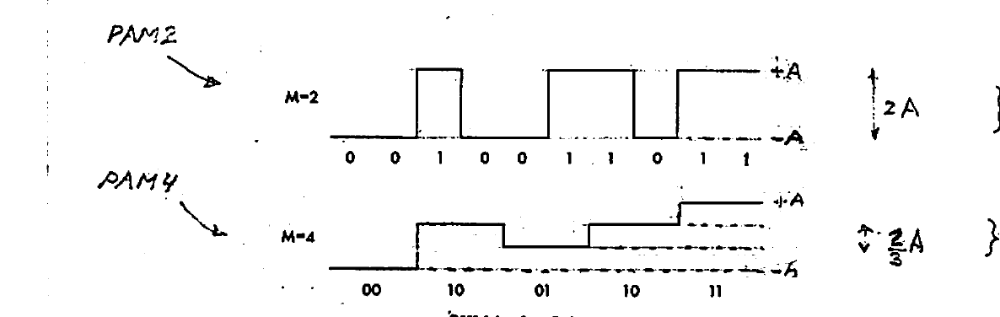

*Fig 1. PAM2 ($M=2$, 2 levels, swing $2A$) vs. PAM4 ($M=4$, 4 levels, step $\tfrac{2}{3}A$). PAM4 encodes two bits of data per symbol.*

From a perspective of **"signal strength"**, it is worth noting that while a data transition is the full-swing $2A$ in PAM2, it is only $\tfrac{2}{3}A$ in PAM4 — i.e. $1/3$ that of PAM2.

Thus, for a given total amplitude swing $\pm A$ and a given noise level in the system, **PAM4** has inherently **lower** Signal-to-Noise Ratio (**SNR**) — and hence a higher **Probability of Bit Error** during transmission / processing. This downside is more than outweighed, however, by the higher data throughput of PAM4, which stands at double that of PAM2.

For example, for the same system bandwidth suitable for handling **28 Gb/s** of PAM2 — twice this rate @ **56 Gb/s** can be comfortably accommodated by PAM4! Hence the popularity of PAM4 in very hi-speed applications including **"Internet backbone"** and **"Gigabit ethernet"**.

---

## Terminology: RZ & NRZ

The digital data described by PAM signaling is also known as **"Non-Return-to-Zero" (NRZ)**. In a PAM2 ($=$ ASK / OOK) signaling, the **NRZ** terminology refers to the fact that logic levels ($+A$ or $-A$) last for the entire **"bit duration"** ($T$). This is to be contrasted with **"Return-to-Zero" (RZ)**, where the $\pm A$ logic levels last only half the bit period ($\tfrac{T}{2}$) and return to zero during the remaining half period (below). Because of the shorter pulses, however, **RZ requires a wider bandwidth than NRZ!**

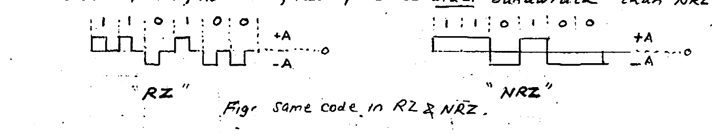

*Fig 2. Same code in RZ & NRZ.*

For example, while for NRZ data @ 10 Gb/s a bandwidth of ~10 GHz would be adequate, for RZ transmission at the same 10 Gb/s — double the bandwidth @ 20 GHz would be required! This is simply a consequence of the wider spectrum of RZ ($\approx$ twice that of NRZ).

Because of its reduced BW requirement, NRZ is said to have a better **SPECTRAL EFFICIENCY** than RZ — making it the dominant format in use.

It is noteworthy that using higher-order PAMs such as PAM4, PAM8, etc. can, respectively, double and triple the data rate in a given bandwidth — and thus the spectral efficiency.

> **\* Note:** For having perspective on data transmission speeds through optical fiber as compared to copper wire, the **IEEE 802.3 Ethernet** standard specifies:
> 1. Copper (twisted-pair): 10, 100, 1000 Mb/s ($4 \times 250\ \text{Mb/s}$)
> 2. Optical fiber: 10 Gb/s.

---

## Spectral (or Bandwidth) Efficiency

**"SPECTRAL (or Bandwidth) EFFICIENCY"** is defined as the ratio of data rate to system bandwidth, i.e. data rate per unit bandwidth ($\tfrac{\text{bps}}{\text{Hz}}$).

- For the same bit rate, **PAM4** is **TWICE** as "spectrally efficient" compared to PAM2, because it requires half the system bandwidth of PAM2.

  The reduced bandwidth has the advantage of relaxing the bandwidth (per unit data rate) requirement imposed on the system hardware — mainly, the electronics.

- For a given system (channel) bandwidth, **PAM4** can handle **TWICE** the data rate (i.e. double the **CAPACITY**) of PAM2.

---

## Power in PAM

With average power taken as the mean-square voltage across a $1\ \Omega$ resistor, PAM power can be found using simple **"expected value"** probabilistic calculation:

**PAM2 Power:**

$$P = P[-A]\,(-A)^2 + P[+A]\,(+A)^2 = \tfrac{1}{2}(-A)^2 + \tfrac{1}{2}(+A)^2 = A^2$$

> (2 equally-likely levels $+A/-A$: $P[\pm A] = \tfrac{1}{2}$)

**PAM4 Power:**

$$P = P[-A]\,(-A)^2 + P\!\left[-\tfrac{A}{3}\right]\!\left(-\tfrac{A}{3}\right)^2 + P\!\left[+\tfrac{A}{3}\right]\!\left(+\tfrac{A}{3}\right)^2 + P[+A]\,(+A)^2$$

$$= \tfrac{1}{4}A^2 + \tfrac{1}{4}\!\left(\tfrac{A^2}{9}\right) + \tfrac{1}{4}\!\left(\tfrac{A^2}{9}\right) + \tfrac{1}{4}A^2 = \boxed{\tfrac{5}{9}A^2}$$

> (4 equally likely levels $\pm A,\ \pm \tfrac{A}{3}$: $P[\ ] = \tfrac{1}{4}$)

### Energy per Bit ($E_b$)

$E_b$ is defined as the signal energy in one bit $=$ Power $\times$ bit period.

**PAM2:**

$$E_b = A^2 T$$

**PAM4:**

$$E_s = T_s \cdot \left(\tfrac{5}{9}A^2\right) = 2T\left(\tfrac{5}{9}A^2\right), \qquad E_b = \tfrac{1}{2}E_s = \tfrac{5}{9}A^2 T$$

*(The author's margin sketch shows a PAM4 transmit chain: $R_b \rightarrow$ S-P shift reg. $R_s \rightarrow$ DAC $\rightarrow$ PAM4, i.e. a serial-to-parallel shift register.)*

---

## Spectrum of PAM Signals

To determine what system bandwidth (Hz) is required for processing a PAM transmission, knowledge of its frequency spectrum $S(f)$ is needed.

It can be shown that the **Power Spectrum** $S(f)$ of PAM-2 and PAM-4 data both have the form of $\operatorname{sinc}^2$ function $\left(\operatorname{sinc} x \triangleq \left(\tfrac{\sin x}{x}\right)^2\right)$. This is shown below: the difference b/w the two spectra is the data rate applicable — **Bit Rate** $R_b$ ($\text{b/s}$) for PAM-2 and **Symbol Rate** $R_s$ ($\text{S/s}$) (or Baud/s) for PAM-4.

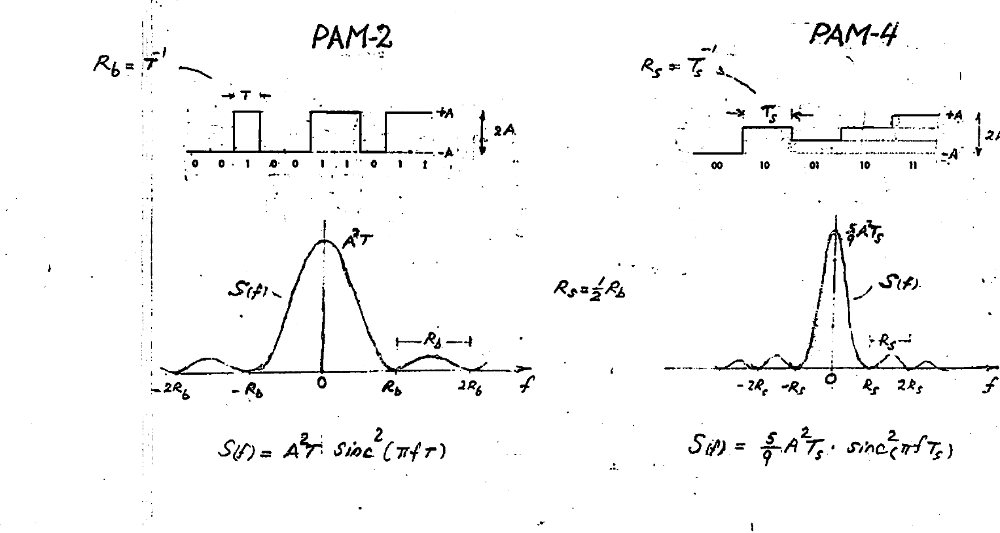

*Fig 3. PAM-2 ($R_b = T^{-1}$) and PAM-4 ($R_s = T_s^{-1}$) power spectra, both of $\operatorname{sinc}^2$ form. Note $R_s = \tfrac{1}{2}R_b$.*

$$\text{PAM-2:}\quad S(f) = A^2 T\,\operatorname{sinc}^2(\pi f T)$$

$$\text{PAM-4:}\quad S(f) = \tfrac{5}{9}A^2 T_s\,\operatorname{sinc}^2(\pi f T_s)$$

The **channel bandwidth** required to accommodate these signals is often taken to equal the width of the central lobe: i.e. $\pm R_b$ (PAM2) and $\pm R_s$ (PAM4). The justification being that ~90% of the PAM signal power is contained in it.

$$\text{BW} = 2R_b \qquad\qquad \text{BW} = 2R_s$$

Here $\text{BW} = 2B$ (where $B = $ one-sided **"BASEBAND BANDWIDTH"**):

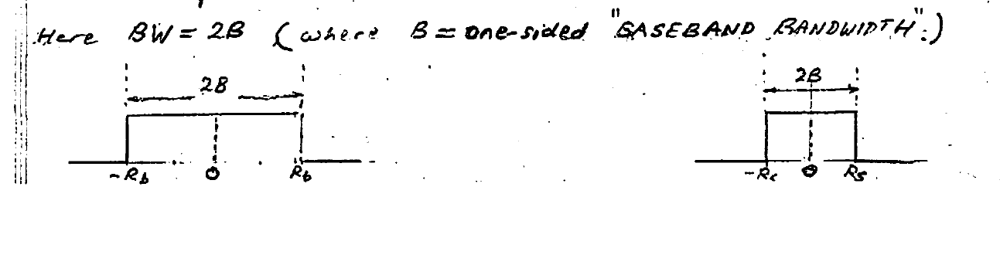

*Fig 4. The channel bandwidth equals the central-lobe width: $2B$ where $B = R_b$ (PAM2) or $B = R_s$ (PAM4).*

---

## PAM2 Bit-Error Rate (BER)

**BER** measures the full end-to-end performance of a system including Tx, Rx, and channel. As a result of presence of noise in the system, a transmitted "1-bit" (or "0") may be detected at the receiver as an incorrect "0"-bit (or "1") — resulting in a **BIT ERROR**. The **PROBABILITY of ERROR**, alternatively called the **BIT ERROR RATE (BER)**, is simply the fraction of bits in error, when a stream of data consisting of a "large" number of bits (e.g. $10^6$–$10^{12}$) is transmitted. Acceptable performance for example requires $\text{BER} \le 10^{-9}$ for telecom while $\text{BER} \le 10^{-13}$ for optical data networks.

Shown below is a PAM2 data stream f (a) "pure", (b) "corrupted" by noise. Also shown is the synchronizing **clock**. The latter permits the data to be "sampled" (by a D-FF) to **DECIDE** on the value of the received bit: a "1" ("0") above (below) the **"DECISION" (DETECTION) threshold**.

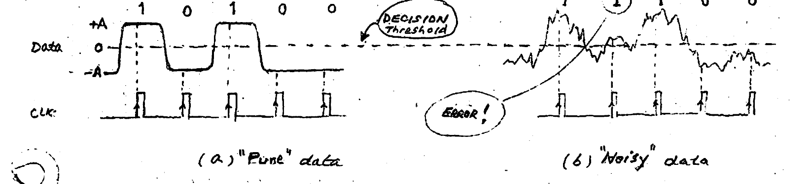

*Fig 5. (a) "Pure" data and (b) "Noisy" data, with the decision threshold and sampling clock (CLK). A sample tipped to the wrong side of the threshold yields an "Error!".*

**Assumptions:**

- Because of its random nature, the data is equally likely to be $+A$ (1) or $-A$ (0).
- The noise $n$ is assumed **ADDITIVE WHITE GAUSSIAN (AWG)** with "two-sided" Power Spectral density $\tfrac{1}{2}N_0$ ($\text{V}^2/\text{Hz}$), and a **PDF**:

$$P_n = \frac{1}{\sqrt{2\pi}\,\sigma}\, e^{-\frac{n^2}{2\sigma^2}}, \qquad \sigma = n_{\text{rms}}$$

**BER derivation:**

$$\text{Probab. of ERROR} = P_{0\rightarrow 1} + P_{1\rightarrow 0}$$

$$P_{0\rightarrow 1} = P[\,\text{Data} = -A \ \&\ n(t) > A\,] = \underbrace{P[\text{Data}=-A]}_{1/2}\cdot P[n > A]$$

$$P_{1\rightarrow 0} = P[\,\text{Data} = +A \ \&\ n(t) \le -A\,] = \underbrace{P[\text{Data}=+A]}_{1/2}\cdot P[n < -A]$$

$$\therefore\ \text{Probab. of ERROR} = \tfrac{1}{2}P[n > A] + \tfrac{1}{2}P[n < -A] = \underline{P[n > A]}$$

Since $P[n > v] = P[n < -v]$ due to symmetry of the Gaussian PDF $P_n$:

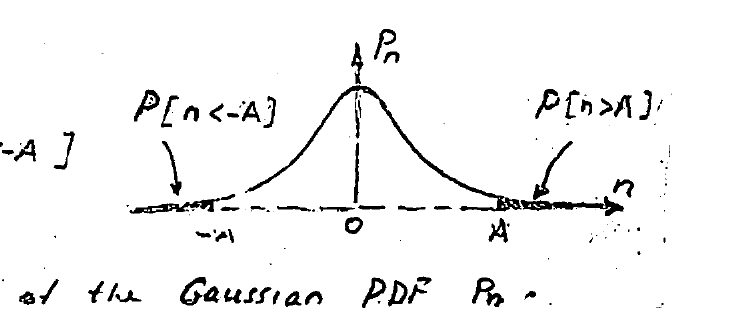

*Fig 6. Gaussian noise PDF $P_n$; the error tails $P[n<-A]$ and $P[n>A]$ are symmetric about zero.*

$$\text{PROBAB. of ERROR} = P[n > A] = \int_A^{\infty} P_n\,dn = \int_A^{\infty} \frac{1}{\sqrt{2\pi}\,\sigma}\, e^{-\frac{n^2}{2\sigma^2}}\,dn \qquad\left(z = \tfrac{n}{\sigma}\right)$$

$$\therefore\ \text{BER} = \frac{1}{\sqrt{2\pi}}\int_{A/\sigma}^{\infty} e^{-\frac{z^2}{2}}\,dz \triangleq Q\!\left(\tfrac{A}{\sigma}\right) = Q\!\left(\sqrt{\text{SNR}}\right)$$

**Notes:**

- Here, $\text{SNR} \triangleq \dfrac{\overline{V^2}(\text{signal})}{\overline{V^2}(\text{noise})} = \dfrac{A^2}{\sigma^2}$, with $\sigma^2 = \overline{V^2}(\text{noise}) = \overline{n^2} = \tfrac{1}{2}N_0 \cdot 2B$, where $B = R_b$ is the one-sided BW to be employed.\*
- The **Q-function** above:

$$Q(x) \triangleq \frac{1}{\sqrt{2\pi}}\int_x^{\infty} e^{-\frac{z^2}{2}}\,dz = \tfrac{1}{2}\operatorname{erfc}\!\left(\tfrac{x}{\sqrt{2}}\right), \qquad x = \sqrt{\text{SNR}}$$

- where $\ \operatorname{erf}(u) \triangleq \dfrac{1}{\sqrt{2\pi}}\displaystyle\int_{-u}^{u} e^{-y^2}\,dy, \qquad \operatorname{erfc}(u) \triangleq 1 - \operatorname{erf}(u)$
- For $x \gtrsim 3$: $\quad Q(x) \approx \dfrac{1}{\sqrt{2\pi}\,x}\, e^{-x^2/2}$

> **NOTE:**
> $$x^2 = \text{SNR} = \frac{A^2}{\sigma^2} = \frac{A^2}{\tfrac{1}{2}N_0 \cdot 2B} = \frac{A^2 T}{N_0} = \frac{E_b}{N_0} \qquad (B = R_b = \tfrac{1}{T})$$
> $$\Rightarrow\ \text{BER} = Q\!\left(\sqrt{\tfrac{E_b}{N_0}}\right)$$

**Example:** In a fiber-optic receiver the Transimpedance amplifier (TIA) produces output noise with rms $\sigma = 1\ \text{mV}$. The peak output signal ($\pm A$) is $\pm 5.5\ \text{mV}$. Find BER. *(Note: photodiode noise is being neglected.)*

$$\sqrt{\text{SNR}} = x = \frac{5.5\ \text{mV}}{1\ \text{mV}} = 5.5\ (> 3) \qquad (\text{SNR} = 5.5^2 = 30.25 \rightarrow 14.8\ \text{dB})$$

$$\text{BER} = Q(5.5) \approx \frac{1}{\sqrt{2\pi}\cdot 5.5}\, e^{-\frac{5.5^2}{2}} \approx 2.36 \times 10^{-8}$$

i.e. the Probability of Error $= \text{BER} \approx$ 24 bits in every billion bits (which is somewhat high due to a rather noisy TIA selected).

- The dependence of **BER**, i.e. $Q(\sqrt{\text{SNR}})$, on **SNR** is a strong one, and is shown in the graph below:

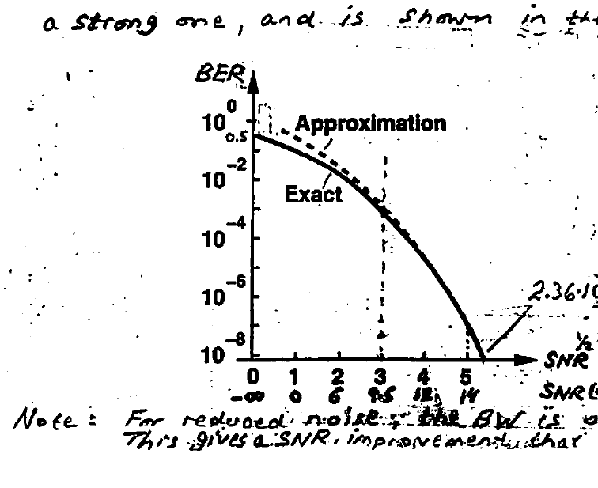

*Fig 7. BER vs. SNR, showing the exact $Q$-function and its approximation. At $\sqrt{\text{SNR}} = 5.5$, $\text{BER} \approx 2.36\times10^{-8}$.*

| $\text{SNR (dB)}$ | $-\infty$ | 9.54 | 13.98 | 15.56 | 16.9 | 18.06 |
| --- | --- | --- | --- | --- | --- | --- |
| $\tfrac{A}{\sigma} = \sqrt{\text{SNR}}$ | 0 | 3 | 5 | 6 | 7 | 8 |
| $\text{BER}$ | 0.5 | $1.5\times10^{-3}$ | $3\times10^{-7}$ | $10^{-9}$ | $10^{-12}$ | $10^{-15}$ |

> **\* Note:** For reduced noise, the BW is often limited to $0.75\,R_b$ instead of $R_b$. This gives a SNR improvement that leads to a LOWER BER.

---

## Photodetector BER (OOK)

Since the optical signal is of binary nature, the BER analysis done for PAM2 modulation (OOK) may be employed here by observing that the binary amplitude $\pm A$ corresponds here to two photocurrent levels. The two photocurrent levels are $R\,P(1)$ and $R\,P(0)$, where $R$ ($\text{A/W}$) is the photodiode Responsivity. Thus, we make the substitution $A = \dfrac{R\,P(1) - R\,P(0)}{2}$.

Shown below: a Drop-MR receiver filter channel + the optical power levels.

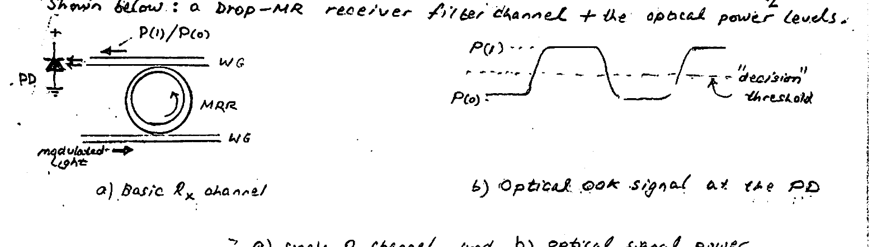

*Fig 8. (a) Basic $R_x$ channel (PD, microring resonator MRR, waveguides) and (b) optical OOK signal at the PD, showing power levels $P(1)$, $P(0)$ and the "decision" threshold.*

Furthermore, the mean-square noise ($\sigma^2$) may be taken as the average of two **"shot-noise"** components $\sigma^2(1)$ and $\sigma^2(0)$. (Recall $\sigma^2(1) = 2q\,I(1)\,B$, $\sigma^2(0) = 2q\,I(0)\,B$, and $B$ is the bandwidth of the PD circuit.)

Thus, the $\sqrt{\text{SNR}}$, which is given by $A/\sigma$, becomes $\dfrac{R\,(P(1) - P(0))}{\sigma(1) + \sigma(0)}$, and the BER:

$$\text{BER} = \tfrac{1}{2}\operatorname{erfc}\!\left(\tfrac{x}{\sqrt{2}}\right) = Q(x), \qquad x = R\,\frac{P(1) - P(0)}{\sigma(1) + \sigma(0)}$$

Using the previously developed eqns for $P(1)$ & $P(0)$ for the MR modulator:

$$x = \left(\frac{R\,P\,a}{\sigma(1) + \sigma(0)}\right)\cdot\left(1 - \frac{1}{1 + (2Q\,\Delta\lambda_m / \lambda_r)^2}\right)$$

where $P$ = modulator input-optical power, and $a \triangleq$ **"full-ring"** attenuation.

Note that "$a$" determines the modulation **"Extinction Ratio"** $\text{ER} = 1/(1-a)$. Also, the losslessness of the microring resonator is represented by the quality factor $Q$, and $\Delta\lambda_m$ is the modulation wavelength shift (detuning).

> **\*** Rui Wu et al., "Compact Modelling and System Implications of Microring Modulator in Nanophotonic Interconnects," *SLIP '15*, June 6, 2015, ACM.

---

## PAM4 Bit Error Rate (BER)

The Bit Error Rate (BER), which is the same as the **"Probability of Bit Error"**, specifies the expected fraction of erroneous bits received in a large stream of bits (e.g., $10^6$, $10^9$, $10^{12}$ etc.) independent of the pairing of bits in PAM4 to form a symbol (Baud), an individual bit represents the **"elementary unit"** of information being transmitted. Thus, as a fundamental measure of **RELIABILITY**, the Probability of Bit Error ($P_b$) takes precedence over the symbol probability of error ($P_s$). However, to determine $P_b$ we first must determine $P_s$.

Extending the single-**"DECISION THRESHOLD"** analysis of PAM2 to PAM4, one finds the possible data errors based on three ($3$) threshold decision levels (dashed in diagram). Here, however, a smaller minimum noise amplitude of only $\pm A/3$ can result in data errors as opposed to $\pm A$ for PAM2.

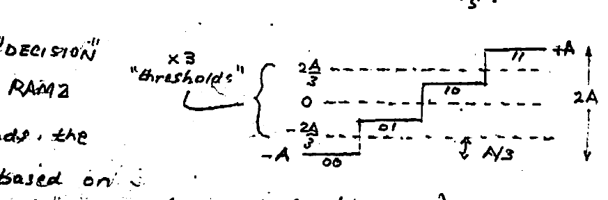

*Fig 9. The four PAM4 levels ($-A,\ -\tfrac{2A}{3},\ \dots,\ +A$, encoding 00, 01, 10, 11) and the three "$\times 3$ thresholds" at $-\tfrac{2A}{3}, 0, +\tfrac{2A}{3}$; minimum error-causing noise is $A/3$.*

The Probability of a Symbol error $P_s$ would involve accidental transitions from any of 4 levels (00, 01, 10, 11), i.e.:

$$P_s = P[00]\cdot P\!\left[n > \tfrac{A}{3}\right] + P[01]\!\left(P\!\left[n < -\tfrac{A}{3}\right] + P\!\left[n > \tfrac{A}{3}\right]\right) + P[10]\cdot\left(P\!\left[n < -\tfrac{A}{3}\right] + P\!\left[n > \tfrac{A}{3}\right]\right) + P[11]\cdot P\!\left[n < -\tfrac{A}{3}\right]$$

where,

$$P[00] = \dots = P[11] = \tfrac{1}{4} \quad\Leftarrow\ \text{Probability of each symbol}$$

$$P\!\left[n > \tfrac{A}{3}\right] = P\!\left[n < -\tfrac{A}{3}\right] = \text{Probability of noise} > \tfrac{A}{3}\ \left(< -\tfrac{A}{3}\right)$$

For Additive White Gaussian Noise (AWGN) with "two-sided" power spectral density $\tfrac{N_0}{2}$ ($\text{V}^2/\text{Hz}$) and PDF $P(n) = \dfrac{1}{\sqrt{2\pi}\,\sigma}\, e^{-n^2/2\sigma^2}$:

$$P\!\left[n > \tfrac{A}{3}\right] = P\!\left[n < -\tfrac{A}{3}\right] = Q\!\left(\tfrac{A/3}{\sigma}\right)$$

$$\left(Q(x) = \int_x^{\infty}\frac{1}{\sqrt{2\pi}}\,e^{-\frac{z^2}{2}}\,dz = \tfrac{1}{2}\operatorname{erfc}\!\left[\tfrac{x}{\sqrt{2}}\right]\right)$$

$P_s$ then reduces to:

$$\boxed{\ \text{SER} = P_s = \tfrac{3}{2}\,Q\!\left[\tfrac{A/3}{\sigma}\right] \left(= \tfrac{3}{4}\operatorname{erfc}\!\left[\tfrac{A/3}{\sqrt{2}\,\sigma}\right]\right)\ } \qquad \text{(Symbol Error Rate)}$$

### BER (from SER)

We make the following practical (and convenient) assumptions that simplify extracting the BER.

**Assumptions:**

1. Noise-induced errors involve ONLY **"adjacent"** symbols (levels), with errors to more distant symbols being rather rare, and hence negligible.
2. **GRAY coding** of the bits is employed for symbols; i.e. "adjacent symbols" differ by **ONE** bit only.

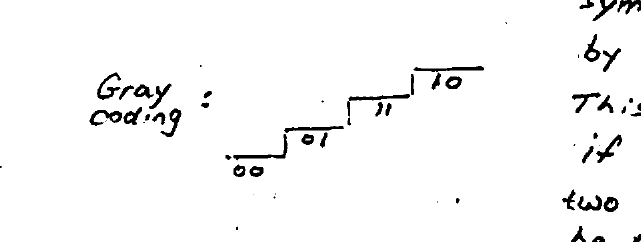

*Fig 10. Gray coding of the PAM4 levels: 00, 01, 11, 10 — adjacent symbols differ by a single bit.*

This coding of "1-bit change" means that if a noise-induced error occurs between two adjacent levels, only one bit would be in error. This is to be compared to ordinary binary coding — where two bits could be involved b/w adjacent levels (e.g. 01 → 10). Note that a single-bit in error leads to a **simpler** "Error Correction" procedure.

For a long data stream of $N \gg 1$ symbols:

$$\#\,\text{Erroneous Symbols} = N \times P_s$$

Based on the above assumptions, this also equals the # Erroneous bits. Using this to find $P_b$ (i.e. BER):

$$P_b = \frac{\#\,\text{Erroneous bits}}{\#\,\text{Total bits}} = \frac{N P_s}{2N} = \frac{P_s}{2}$$

since in PAM4 there are 2 bits per symbol.

Summarizing in the form of "Bit Error Rate" ($\text{BER} = P_b$):

$$\boxed{\ \text{BER} \approx \tfrac{3}{4}\,Q\!\left(\tfrac{A}{3\sigma}\right) \left(= \tfrac{3}{8}\operatorname{erfc}\!\left(\tfrac{A}{3\sigma\sqrt{2}}\right)\right)\ }$$

> (Note: $\text{BER} = \tfrac{1}{2}\,\text{SER}$)

---

## Energy per Symbol / Bit

We define two useful quantities involving the signal energy contained in a "symbol" and a single "bit" — with the important objective of using them to express the SNR and the BER of PAM data.

- $E_s \triangleq$ Energy per symbol
- $E_b \triangleq$ Energy per bit

Using the average power $\tfrac{5}{9}A^2$ of a symbol in PAM4:

$$E_s = \left(\tfrac{5}{9}A^2\right)T_s$$

$$E_b = \frac{E_s}{2} = \left(\tfrac{5}{9}A^2\right)\frac{T_s}{2} = \left(\tfrac{5}{9}A^2\right)T \qquad (T_s = 2T)$$

since for PAM4 a symbol consists of a pair of consecutive bits.

### SNR

The Signal-to-Noise Ratio is defined as:

$$\text{SNR} \triangleq \frac{\text{Signal Power}}{\text{Noise Power}} = \frac{\tfrac{5}{9}A^2}{\sigma^2}$$

For the noise power, $\sigma^2 = \tfrac{1}{2}N_0 \cdot 2B$. Here, since the bandwidth is usually set to accommodate the central lobe of the PAM4 spectrum, we use $B = R_s$:

$$\therefore\ \sigma^2 = \tfrac{1}{2}N_0 \cdot 2R_s = \frac{N_0}{T_s}$$

$$\text{SNR} = \frac{\tfrac{5}{9}A^2 T_s}{N_0} = \frac{E_s}{N_0} \qquad (\text{PAM4})$$

This is to be compared with the SNR for PAM2:

$$\text{SNR} = \frac{A^2}{\sigma^2} = \frac{A^2}{\tfrac{1}{2}N_0 \cdot 2B} = \frac{A^2}{N_0 R_b} = \frac{A^2 T}{N_0} = \frac{E_b}{N_0} \qquad (\text{PAM2})$$

where $B = R_b$ is used to accommodate the central lobe of the PAM2 spectrum.

---

## BER Expressions in terms of $E_b/N_0$

The arguments of the $Q(x)$ function can now be rewritten for convenience in terms of the SNR or the energies $E_s$ & $E_b$:

$$\text{PAM2:}\quad x = \frac{A}{\sigma} = \text{SNR}^{1/2} = \sqrt{\frac{E_b}{N_0}}$$

$$\text{PAM4:}\quad x = \frac{A}{3\sigma} = \left(\frac{\text{SNR}}{5}\right)^{1/2} = \sqrt{\frac{E_s}{5N_0}} \qquad\Bigg\}\ E_s = 2E_b$$

This leads to useful expressions for the BER's:

$$\text{PAM2:}\quad P_b = \text{BER} = Q\!\left(\sqrt{\tfrac{E_b}{N_0}}\right) = \tfrac{1}{2}\operatorname{erfc}\!\left(\sqrt{\tfrac{E_b}{2N_0}}\right) \qquad \tfrac{E_b}{N_0} = \text{SNR}$$

$$\text{PAM4:}\quad P_b = \text{BER} \approx \tfrac{3}{4}\,Q\!\left(\sqrt{\tfrac{2E_b}{5N_0}}\right) \approx \tfrac{3}{8}\operatorname{erfc}\!\left(\sqrt{\tfrac{E_b}{5N_0}}\right) \qquad \tfrac{2E_s}{N_0} = \text{SNR}$$

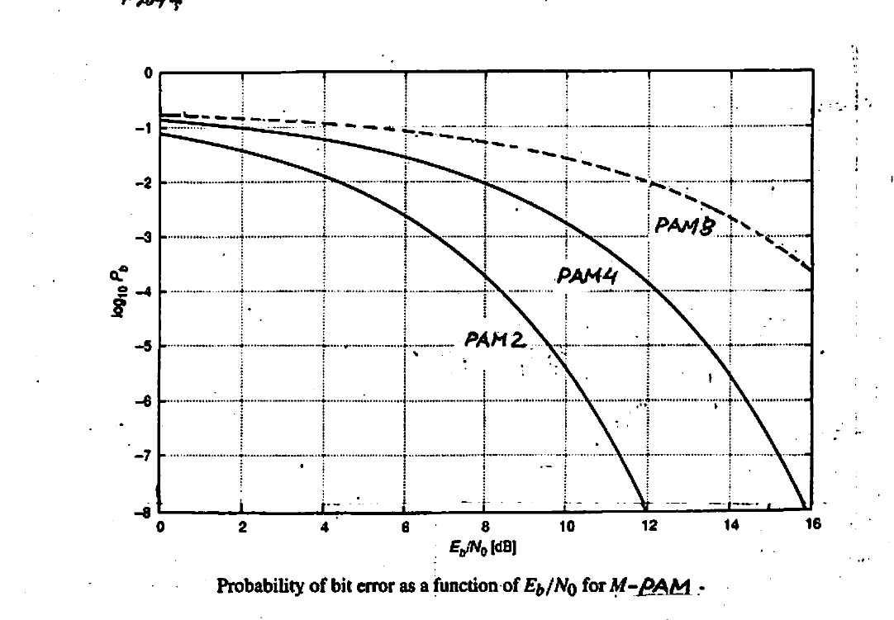

*Fig 11. Probability of bit error $\log_{10}P_b$ as a function of $E_b/N_0$ (dB) for $M$-PAM (PAM2, PAM4, PAM8).*

- For the same Probability of bit error (BER), PAM4 requires greater $E_b/N_0$ (~SNR), which is a result of the smaller "amplitude interval" b/w adjacent symbols in PAM4.
- The smallness of the required $E_b/N_0$ for a given BER is a measure of **"POWER EFFICIENCY"** of a particular modulation scheme. Thus, PAM4 offers a higher "Spectral Efficiency", but a lower "Power Efficiency" than PAM2.

---

## Intersymbol Interference (ISI)

Because of its LP nature (i.e. its limited bandwidth), a baseband data-transfer channel will **DISTORT** the digital data stream passing through it. Abrupt rise/fall edges of data pulses now acquire certain rise/fall times, whose duration is set by the channel bandwidth. This is demonstrated below for the RC circuit used to model a first-order LP channel, whose bandwidth is $f_{-3\text{dB}} = \tfrac{1}{2\pi RC}$.

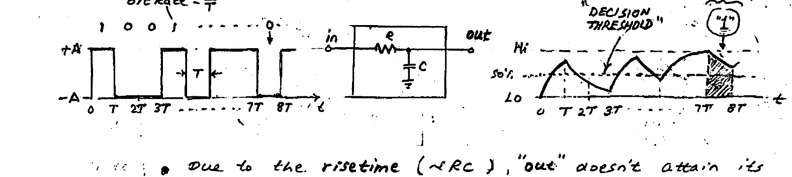

*Fig 12. First-order RC (LP) channel with bit rate $= \tfrac{1}{T}$: due to finite rise/fall times the "out" waveform fails to reach full Hi/Lo, compressing levels toward the decision threshold and producing a bit error (shaded).*

- Due to the risetime ($\sim RC$), "out" doesn't attain its full "Hi" amplitude during a data pulse (a "1").
- Due to the falltime ($\sim RC$), "out" doesn't decay to the full "Lo" level between data pulses (during "0"s).

As a result, the Hi/Lo levels are **"compressed"** towards the centerline DECISION THRESHOLD and can result — in the case of "out" waveform shown — in ERRONEOUS output bit (shaded area). Furthermore, even if this does not occur, it is still possible for noise to add / subtract from the signal and "tip the scale" — resulting in erroneous data bit due to the compressed Hi/Lo levels and their proximity to the decision threshold level.

The above data errors resulting from the cumulative interaction of a string of symbols is called **"INTERSYMBOL INTERFERENCE" (ISI)**.

### Eye Diagram

This is a graphical display that summarizes for all the possible pulse sequence patterns the potential for ISI. It does so by superimposition (on top of one another) of numerous traces of "FIXED length" of the output waveform.

- An **"OPEN" EYE** represents superior performance (small ISI).
- A **"CLOSED" EYE** represents inferior performance (large ISI).

This is shown below for two cases: (1) Insufficient & (2) Sufficient BW. The greatly enhanced SIGNAL INTEGRITY in (2) leads to an open EYE diagram.

**Example:** $T = 0.1\ \text{ns}$ (10 Gb/s); random data sequence.

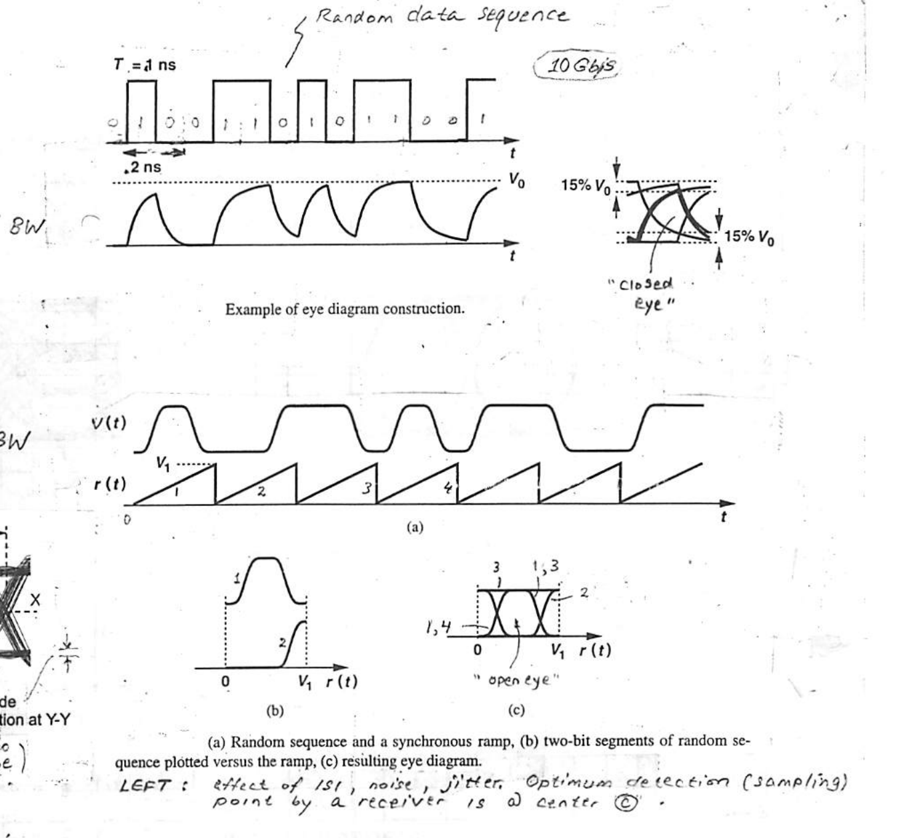

*Fig 13. Example of eye diagram construction. (1) Insufficient BW → "closed eye" (15% $V_0$ opening). (2) Sufficient BW: (a) random sequence and a synchronous ramp, (b) two-bit segments of random sequence plotted versus the ramp, (c) resulting "open eye". The symbol cell shows jitter at X–X (timing errors) and the amplitude distribution at Y–Y (noise). The optimum detection (sampling) point by a receiver is at center (c).*

**Conclusions:**

- The EYE diagram is an effective tool for assessing the degrading effects of system / circuit impairments on **SIGNAL INTEGRITY** of transmitted hi-speed data: JITTER & AMPLITUDE DEGRADATION.
- The above examples demonstrate that the EYE diagram tends to acquire a SMALLER opening ("CLOSED" or "compressed") when the potential for ISI is high, and becomes "OPEN" for low ISI.
- Opening the EYE is achievable through enhancement of the high frequencies in the signal thru **"EQUALIZATION"**, which compensates for the LP nature of the channel — at either (or both) the Receiver or the Transmitter.
- For measurement / simulation, an X-Y plot (e.g. on an oscilloscope) gives an EYE diagram for $Y = $ data, and $X = $ a synchronous ramp $r(t)$ with a period equal to a clock period (2 bit periods). The data is often simulated by a **"Pseudo Random Bit Sequence" (PRBS)** generator.

> **\* SIGNAL INTEGRITY** is a measure of closeness of a digital signal to the ideal: zero rise/fall times, no jitter, distinct Hi/Lo logic levels.

---

## PAM4 Eye Diagram

Unlike PAM2, where the Eye diagram shows transitions only b/w 2 levels, for PAM4 it shows all possible transitions among all 4 levels (see figures below).

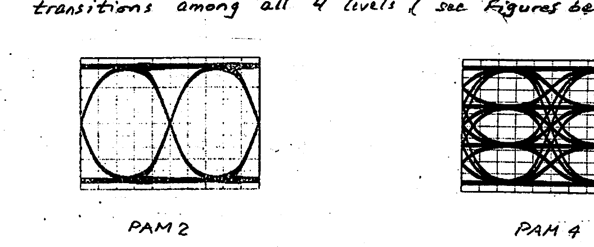

*Fig 14. PAM2 (single eye) vs. PAM4 (three stacked eyes) eye diagrams.*

Furthermore, the **"eye height"** for PAM4 is $1/3$ that of PAM2, leading to a reduction (or loss) in SNR:

$$\text{SNR loss} = 20\log\!\left(\tfrac{1}{3}\right) = -9.5\ \text{dB}$$

This is shown below:

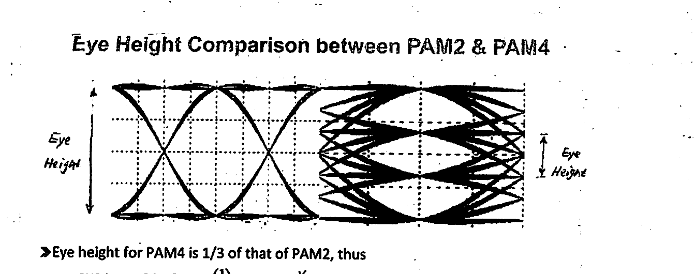

*Fig 15. Eye Height Comparison between PAM2 & PAM4. The PAM4 eye height is $1/3$ that of PAM2.*

> - Eye height for PAM4 is $1/3$ of that of PAM2, thus **SNR loss** $= 20\cdot\log_{10}\!\left(\tfrac{1}{3}\right) \approx 9.5\ \text{dB}$.\*
> - **\*** In practice, there is further degradation due to nonlinearity. Together one should consider $> 11\ \text{dB}$ SNR penalty.

It is noteworthy that a reduced SNR as shown above is responsible for the higher BER of PAM4.

---

## Factors affecting the BER

Bit errors in a stream of (baseband) data or optically-modulated data can occur due to additional system impairments besides (random) noise:

- **Interference** by other signals such as in adjacent channel cross-talk (as in WDM) is an important source of BER.
- As we have seen, **ISI-induced** bit errors can also occur for "closed" eye diagram.
- **Dispersion**, which can cause adjacent "1" bits to overlap through its pulse broadening effect, can easily result in bit error. In the case of a (1, 0, 1) sequence, for example, dispersion — thru pulse broadening of the two "1" bits — can overlap and cover up the in-between "0" — thus resulting in a bit error.

Since data is transmitted mostly in "packets", we turn to examining the PER, next.

### Packet Error-Rate (PER)

The PER is the fraction of received data packets which are in error. A packet of $N$-bits is in error (incorrect) if at least one of the $N$-bits are in error.

$$P_P \triangleq \text{Probab.}[\text{Packet is in Error}] = 1 - \text{Probab.}[\text{Packet is NOT in error}]$$

$$= 1 - \underbrace{(1-P_e)\times(1-P_e)\cdots(1-P_e)}_{N} = 1 - (1-P_e)^N$$

$$\therefore\ P_P \approx 1 - (1 - N P_e) = N P_e \qquad \text{(since } P_e \ll 1\text{)}$$

**Example:** $N = 250$ bits/packet, with (1) $P_e = 10^{-9}$ (telecom) and (2) $P_e = 10^{-13}$ (data network). Find $P_P = ?$

$$\text{1)}\quad P_P = 250 \times 10^{-9} \qquad\qquad \text{2)}\quad P_P = 250 \times 10^{-13}$$
