# Lecture 15 — CMOS Drivers

**EECE 7398 — Analysis & Design of Photonic Integrated Circuits (PICs)** · Northeastern University, Dept. of Electrical & Computer Engineering · Spring 2023

## CMOS Drivers for Modulators

To deliver to modulators the drive required to properly modulate an optical carrier wave, a driver circuit — typically CMOS-based — is used.

Both microring-based and MZI-based modulators exhibit a capacitive load representing the reversely biased $`p`$–$`n`$ junction, so that the driver must be designed to drive a **capacitive load**.

A simple CMOS amplifier driver is shown below.

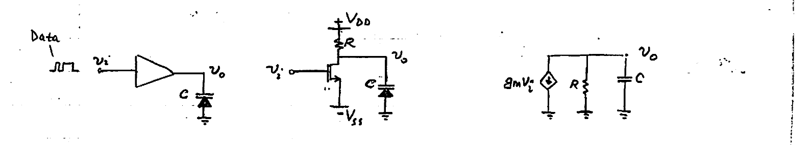

*Fig. A simple CMOS amplifier driver — block diagram driving a capacitive load $`C`$ (left), the common-source (C-S) realization (center), and its small-signal equivalent circuit (right).*

### Voltage gain ($`A`$) analysis

```math
v_o = -g_m v_i \, (R \,\|\, C) = -g_m v_i\!\left(\frac{R}{1 + sCR}\right)
```

```math
A = \frac{v_o}{v_i} = \frac{-g_m R}{1 + j\dfrac{\omega}{\omega_{3dB}}} \quad\rightarrow\quad \frac{A}{A_0} = \frac{1}{1 + j\dfrac{\omega}{\omega_{3dB}}} \quad\cdots\quad \begin{cases} A_0 = -g_m R \\[4pt] \omega_{3dB} = 1/RC \end{cases}
```

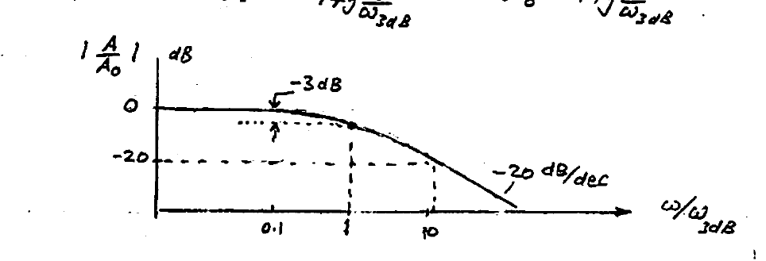

*Fig. Magnitude response $`\left|\dfrac{A}{A_0}\right|`$ (dB) vs. $`\omega/\omega_{3dB}`$, showing the $`-3`$ dB corner and the $`-20`$ dB/dec roll-off.*

High data rates can only be accommodated with a correspondingly wide bandwidth $`\omega_{3dB}`$. Due to the **gain–bandwidth tradeoff** ($`|A_0| = g_m R`$, $`\omega_{3dB} = 1/RC`$), reducing $`R`$ for wider bandwidth would result in a sacrifice in the gain $`A_0`$ — an undesirable outcome. To offset the drop in gain, the transistor transconductance "$`g_m`$" could be increased by biasing it at a higher DC current. This, however, would increase the DC power consumption from the DC supplies ($`V_{DD}`$ & $`V_{SS}`$).

**Solution:** add an on-chip inductor $`L`$ in series with $`R`$ to boost the gain at high frequencies (see next).

---

## Inductive Peaking

Increasing the load impedance at high frequencies by adding an on-chip inductor ($`L`$) partially counteracts the gain rolloff produced by the capacitive load ($`C`$) shunting the output node.\*

The resulting BW enhancement (extension) could be significant, and can be viewed also from the perspective of introduction (by $`L`$) of a "zero" in the gain transfer function, or alternatively as a "resonance" $`L`$–$`C`$ effect.

Consider a C-S stage without (A) and with (B) $`L`$-peaking.

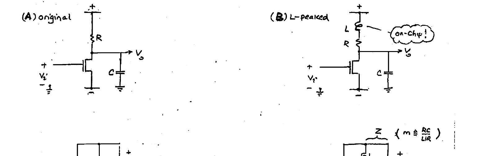

*Fig. (A) Original C-S stage and (B) $`L`$-peaked C-S stage (on-chip inductor $`L`$ in series with $`R`$), with their respective small-signal models. In (B), $`Z`$ is the load impedance and $`m \triangleq \dfrac{RC}{L/R}`$.*

**(A) Original:**

```math
A = \frac{v_o}{v_i} = -\frac{A_0}{1 + sRC}
```

```math
\left|\frac{A}{A_0}\right| = \frac{1}{\sqrt{1 + \dfrac{\omega^2}{\omega_{3dB}^2}}} \qquad \& \qquad \omega_{-3dB} = \frac{1}{RC}
```

**(B) $`L`$-peaked:**

```math
A = \frac{v_o}{v_i} = -g_m\frac{(sL + R)\,\frac{1}{sC}}{(sL + R) + \frac{1}{sC}} = -A_0\,\frac{(1 + s\tau)}{1 + ms\tau + m s^2 \tau^2}
```

```math
\left|\frac{A}{A_0}\right| = \sqrt{\frac{1 + \omega^2\tau^2}{(1 - m\omega^2\tau^2)^2 + m^2\omega^2\tau^2}}
```

with the definitions

```math
L/R = \tau, \qquad RC = m\tau, \qquad m = \frac{RC}{L/R} \quad (\text{the } \tau\text{-c ratio, } C \text{ to } L).
```

The series $`L`$ introduces a **"zero"**, hence the $`(1 + s\tau)`$ factor in the numerator.

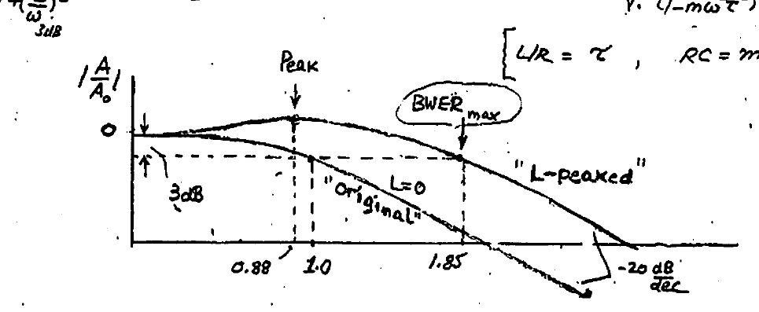

*Fig. Magnitude $`\left|\dfrac{A}{A_0}\right|`$ vs. $`\omega/\omega_{-3dB(orig.)}`$ for the "original" ($`L=0`$) and "$`L`$-peaked" stages, showing the peak and the maximum bandwidth-extension ratio (BWER$`_{max}`$).*

### Bandwidth: "Bandwidth Extension Ratio" (BWER)

Setting $`\left|\dfrac{A}{A_0}\right| = \dfrac{1}{\sqrt{2}}`$:

```math
\frac{1}{2} = \frac{1 + x}{(1 - mx)^2 + m^2 x}, \qquad \cdots \qquad x \triangleq (\omega\tau)^2
```

```math
\therefore\; m^2 x^2 + (m^2 - 2m - 2)x - 1 = 0 \quad\rightarrow\quad x = \frac{-(m^2 - 2m - 2) + \sqrt{(m^2 - 2m - 2)^2 + 4m^2}}{2m^2}
```

\* See Appendix-O: "Spiral Inductors".

---

## Maximizing the Bandwidth Extension Ratio

```math
x = (\omega\tau)^2 \quad\rightarrow\quad (\omega\tau m)^2 = \left(\frac{\omega_{-3dB}}{\omega_{-3dB(orig)}}\right)^2 \triangleq \text{BWER}^2 \qquad (\text{BW Extension Ratio})
```

```math
\therefore\; \text{BWER}^2 = \left(-\frac{m^2}{2} + m + 1\right) + \sqrt{\left(-\frac{m^2}{2} + m + 1\right)^2 + m^2}
```

**Max BWER:**

```math
\frac{d}{dm}\left(\text{BWER}^2\right) = 0
```

```math
-m + 1 + \frac{2\left(-\frac{m^2}{2} + m + 1\right)(-m + 1) + 2m}{2\sqrt{\;\cdots\;}} = 0
```

```math
\vdots
```

```math
m^3 - 2m = 0 \quad\rightarrow\quad \boxed{m = \sqrt{2}}
```

```math
\text{BWER}^2_{max} = (-1 + \sqrt{2} + 1) + \sqrt{(-1 + \sqrt{2} + 1)^2 + 2} = \sqrt{2} + 2 \;\;(= 3.414)
```

```math
\therefore\; \text{BWER}_{max} = \sqrt{\sqrt{2} + 2} = \underline{1.848}
```

### Frequency Peaking $`\left|A/A_0\right|_{peak}`$

```math
\left|\frac{A}{A_0}\right|_{max} = ? \qquad \frac{d}{d\omega}\left|\frac{A}{A_0}\right|^2 = 0 \qquad \left|\frac{A}{A_0}\right|^2 = \frac{1 + \omega^2\tau^2}{1 + 2\omega^4\tau^4 + 2(1 - \sqrt{2})\omega^2\tau^2}
```

Using $`y \equiv \omega\tau`$:

```math
\left|\frac{A}{A_0}\right|^2 = \frac{1 + y^2}{1 + 2y^4 + 2(1 - \sqrt{2})y^2}
```

```math
0 = \frac{d}{dy}\left|\frac{A}{A_0}\right|^2 = 2y(\text{Denom.}) - (1 + y^2)\big(8y^3 + 4(1 - \sqrt{2})y\big)
```

```math
6y^4 + 2(5 - \sqrt{2})y^2 - (4\sqrt{2} - 2) = 0
```

```math
y^2_{1,2} = \frac{-2(5 - \sqrt{2}) \pm \sqrt{4(5 - \sqrt{2})^2 + 24(4\sqrt{2} - 2)}}{12} = 0.385
```

```math
y = \sqrt{0.385} = 0.621 = \omega\tau \;\cdots\; \tau = mRC = \frac{m}{\omega_{3dB(original)}}
```

```math
\therefore\; \omega_{peak} = 0.878\,\omega_{-3dB(original)}
```

```math
\left|\frac{A}{A_0}\right|_{peak} = \left[\frac{1 + 0.621^2}{1 + 2(0.621)^4 + 2(1 - \sqrt{2})0.621^2}\right]^{1/2} = 1.19 \;\cdots\; \text{i.e. about } \underline{20\%}\text{ peaking}
```

**Conclusion:** price paid = a moderate ~20% deviation from gain flatness for ~85% increase in BW ($`\text{BWER} \approx 1.85`$).

---

## Signal Integrity Issues

Hi-speed systems, such as those processing gigabit data rates, demand that data pulses retain their "rectangular" waveshape as they get amplified (**waveform fidelity**).

This places two general requirements on the amplifier "gain function":

1. **Flat gain MAGNITUDE** over frequency ($`\Rightarrow`$ no "AMPLITUDE DISTORTION")
2. **Flat delay** — "— "— "— ($`\Rightarrow`$ no "PHASE DISTORTION")

*(See Appendix-1.)*

The first requirement ensures the spectral components of the data stream (sinc spectrum) retain their **relative strengths**, while the second requirement guarantees that the time relationships (**relative phase**) among these frequency components is preserved. Both conditions must prevail for **perfect reproduction** of the signal waveform [except of course for a scaling of magnitude due to amplification].

If, for example, the delay is not equal for all frequency components, severe waveform distortion could result. Such "phase distortion" is highly undesirable because of the potential "increase in bit error rate". To minimize this degradation in performance, it is important to enhance the **"phase linearity"** vs. frequency to ensure reasonable **"delay uniformity"** over the spectrum of the signal. This can be accomplished by demanding a **"MAXIMALLY FLAT DELAY"** (MFD).

### Maximally-Flat Delay

The so-called **group delay** "$`t_d`$" is defined as:

```math
t_d \triangleq -\frac{d}{d\omega}\big(\text{Arg }A(j\omega)\big) = -\frac{d}{d\omega}\phi(\omega)
```

where $`\big(\text{arg }A(j\omega) = \phi(\omega) \equiv`$ phase of $`A(j\omega)\big)`$.

For **maximum flatness**, we must maximize the number "$`n`$" of zero derivatives $`\left(\dfrac{d}{d\omega}\right)^n`$ of the delay function $`t_d`$ at $`\omega = 0`$.

In our case of an inductively-peaked stage:

```math
\text{arg }A(j\omega) = \arctan(\omega\tau) - \arctan\!\left(\frac{\omega m\tau}{1 - m\omega^2\tau^2}\right)
```

```math
-t_d = \frac{\tau}{1 + (\omega\tau)^2} - \frac{1}{1 + \frac{(\omega m\tau)^2}{(1 - m\omega^2\tau^2)^2}}\left(\frac{m\tau(1 - m\omega^2\tau^2) - 2m\omega^2\tau \cdot \omega m\tau}{(1 - m\omega^2\tau^2)^2}\right)
```

```math
\frac{d}{d\omega}t_d\Big|_{\omega=0} = 0 = \frac{-2\omega\tau^3}{(1 + (\omega\tau)^2)^2} - \frac{6m^2\omega\tau^3(1 + m^2\omega^4\tau^4 + (m^2 - 2m)\omega^2\tau^2) - (m\tau - 3m^2\omega^2\tau^3)}{\big[1 + m^2\omega^4\tau^4 + (m^2 - 2m)\omega^2\tau^2\big]^2}\Big(4m^2\omega^3\tau^4 + 2(m^2 - 2m)\omega\tau^2\Big)
```

---

## Maximally-Flat Delay (continued)

```math
0 = \frac{d^2}{d\omega^2}t_d\Big|_{\omega=0} = \frac{d}{d\omega}\left[\frac{-2\omega\tau^3}{(1 + (\omega\tau)^2)^2} - \frac{-6m^2\omega\tau^3(1 + m^2\omega^4\tau^4 + (m^2 - 2m)\omega^2\tau^2) - (m\tau - 3m^2\omega^2\tau^3)}{\big[1 + m^2\omega^4\tau^4 + (m^2 - 2m)\omega^2\tau^2\big]^2}\Big(4m^2\omega^3\tau^4 + 2(m^2 - 2m)\omega^2\tau^2\Big)\right]_{\omega=0}
```

```math
\vdots
```

```math
m^3 - 3m^2 - 1 = 0
```

```math
\therefore\; m = 1 + \left(\frac{3 + \sqrt{5}}{2}\right)^{1/3} + \left(\frac{3 - \sqrt{5}}{2}\right)^{1/3} \approx 3.10 \qquad (\text{can be shown})
```

**(1) BWER:**

```math
\left|\frac{A}{A_0}\right|^2 = \frac{1}{2} = \frac{1 + x}{(1 - 3.1x)^2 + 3.1^2 x} \quad\cdots\quad x = (\omega\tau)^2_{-3dB}, \quad m = 3.10
```

```math
\vdots
```

```math
9.61 x^2 + 1.41 x - 1 = 0
```

```math
\therefore\; x = 0.258 \;\Rightarrow\; \omega\tau_{-3dB} = \sqrt{x} = 0.507
```

```math
\omega_{-3dB} = \frac{0.507}{\tau} = \frac{0.507}{RC}\,m = 1.573\,\omega_{-3dB(original)}
```

```math
\boxed{\text{BWER} \approx 1.57}
```

**(2) Frequency Peaking:** one can show **no peaking** occurs!

```math
\therefore\; \left|\frac{A}{A_0}\right|_{peak} = 1.0
```

### Maximally-Flat Gain

Here, we need to maximize the number "$`n`$" of zero derivatives $`\left(\dfrac{d}{d\omega}\right)^n`$ of the gain magnitude function at $`\omega = 0`$. This ensures the "flattest" magnitude gain versus frequency behavior!

```math
\left|\frac{A}{A_0}\right|^2 = \frac{1 + \omega^2\tau^2}{(1 - m\omega^2\tau^2)^2 + m^2\omega^2\tau^2} = \frac{1 + \omega^2\tau^2}{1 + m^2\omega^4\tau^4 + \omega^2\tau^2(m^2 - 2m)}
```

```math
\frac{d}{d\omega}\left|\frac{A}{A_0}\right|^2\Big|_{\omega=0} = \frac{2\omega\tau^2[\;\cdots\;] - (1 + \omega^2\tau^2)\big[4m^2\omega^3\tau^4 + 2\omega\tau^2(m^2 - 2m)\big]}{[\;\cdots\;]^2}\Big|_{\omega=0} = 0
```

```math
0 = \frac{d^2}{d\omega^2}\left|\frac{A}{A_0}\right|^2\Big|_{\omega=0} = \frac{d}{d\omega}\left\{\frac{2\omega\tau^2[\;\cdots\;] - (1 + \omega^2\tau^2)\big[4m^2\omega^3\tau^4 + 2\omega\tau^2(m^2 - 2m)\big]}{[\;\cdots\;]^2}\right\}
```

---

## Maximally-Flat Gain (continued)

```math
0 = \Big[\big(2\tau^2[\;\cdots\;] + 2\omega\tau^2[4m^2\omega^3\tau^4 + 2\omega\tau^2(m^2 - 2m)] - 2\omega\tau^2[\;\cdots\;]\big) - (1 + \omega^2\tau^2)[12m^2\omega^2\tau^4 + 2\tau^2(m^2 - 2m)] - 2[\;\cdots\;](4m^2\omega^3\tau^4 - 2\omega\tau^2(m^2 - 2m))\{\;\cdots\;\}\Big]_{\omega=0}
```

```math
\vdots
```

```math
m^2 - 2m - 1 = 0
```

```math
\therefore\; m = \frac{2 \pm \sqrt{4 + 4}}{2} = 1 + \sqrt{2} = 2.414
```

**BWER:**

```math
\frac{1}{2} = \left|\frac{A}{A_0}\right|^2 = \frac{1 + x}{(1 - 2.414x)^2 + 2.414^2 x} \qquad x = (\omega\tau)^2_{-3dB}
```

```math
\vdots
```

```math
5.8274 x^2 - 1.001 x - 1 = 0
```

```math
x = \frac{1 \pm \sqrt{1 + 4 \times 5.8274}}{2 \times 5.8274} = 0.509
```

```math
\omega_{3dB}\tau = \sqrt{x} = 0.7135
```

```math
\omega_{3dB} = \frac{0.7135}{\tau} = \frac{m \times 0.7135}{RC} = \frac{1.7194}{RC} \qquad (m = 2.414)
```

```math
\therefore\; \boxed{\text{BWER} = 1.7194}
```

### Summary

| Optimization | $`m`$ | BWER | Normalized Peak Gain |
| --- | --- | --- | --- |
| Max BW | 1.41 | $`\approx 1.85`$ | 1.19 |
| Maximally Flat Delay | 3.1 | $`\approx 1.57`$ | 1.0 |
| Maximally Flat Gain | 2.41 | $`\approx 1.72`$ | 1.0 |

*Table. Summary of inductive-peaking optimization criteria.*

---

## Driver Performance

Desirable driver performance attributes:

1. Hi-speed (broadband)
2. Low DC-power consumption
3. Low BER & "open" eye-diagram
4. CMOS/BiCMOS technology (electronic/photonic integration)

The CMOS design\* below combines the speed performances of the **"cascode"** configuration and the **CML** differential topology. It employs Silicon Photonics for integration of the MZ optical modulator and the electronics of the driver on a single CMOS chip — a $`0.13\ \mu m`$ CMOS-SOI technology is used, with a resulting **20 Gb/s** data-rate performance.

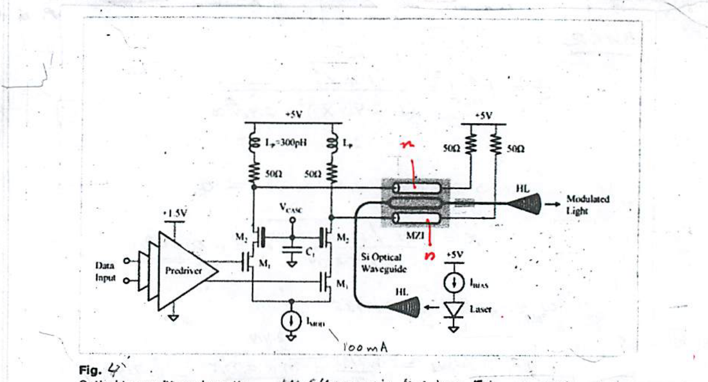

*Fig 4. Optical transmitter schematic. HL (Holographic Lens) = fiber-to-chip coupler.*

In general, due to gigabit data rates, the long, reverse-biased $`p`$ and $`n`$ depletion regions must be modelled by two transmission-line sections as shown — requiring $`50\ \Omega`$ termination to ensure a $`Z`$-match. For its operation, the MZ modulator requires a drive of 5-V swing (see Appendix 2). Therefore,

```math
5\text{ V} = I_{MOD} \times 50\ \Omega
```

```math
\therefore\; I_{mod.} = 100\text{ mA}
```

The large $`M_{1,2}`$ MOSFETs supporting this high current drive themselves require a "tapered" cascade of 3 pre-drivers for optimum driving of its own input ($`C_{gs}`$) capacitance.

Note also the use of **Inductive Peaking** (two on-chip spiral inductors of 300 pH) for bandwidth extension.

---

## Power Consumption

```math
I_{MOD} \times V_{cc} = \underline{0.5\text{ W}}\;!
```

### MZI details

Employs symmetrical topology and is of the **"Travelling-Wave"** type. To ensure a low $`V_\pi`$, each arm ($`p`$–$`n`$ junction) is made 4 mm long! For max. linearity, the **"Quadrature-bias"** point ($`\Delta\phi = \pi/2`$) was selected for operation (see O.P. in Fig 5).

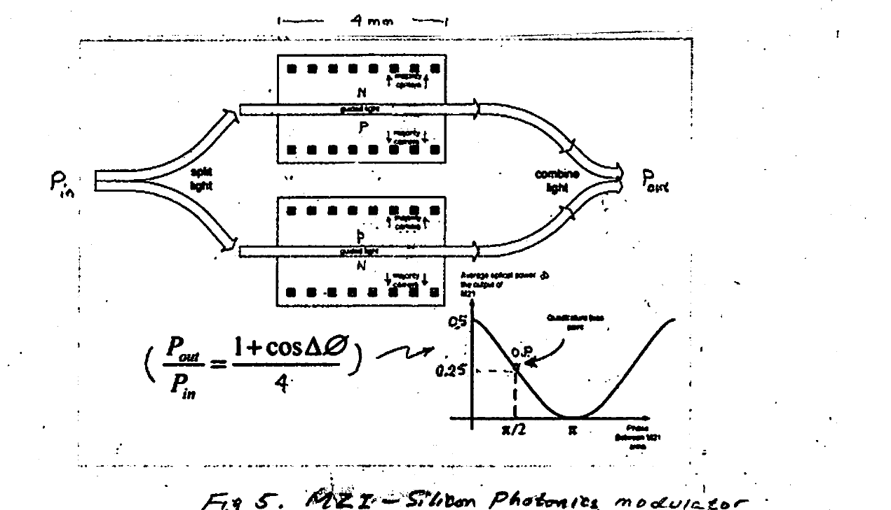

*Fig 5. MZI — Silicon Photonics modulator. Each arm is ~4 mm long; the transfer characteristic shows the quadrature-bias operating point (O.P.) at $`\Delta\phi = \pi/2`$.*

```math
\frac{P_{out}}{P_{in}} = \frac{1 + \cos\Delta\phi}{4}
```

For additional information — specifically regarding the cascade of pre-drivers — see Appendix 3.

> \* "A Fully Integrated 20 Gb/s Optoelectronics Transceiver Implemented in Standard 0.13 μm CMOS SOI Technology", B. Analui et al., *IEEE Journal of Solid State Circuits*, Vol 41, Issue 12, 12 Dec. 2006.

---

## Appendix-O — Spiral Inductors

Although IC planar inductors have limited inductance, for HF/HS applications even a small $`L`$ has sufficient reactance to make it a useful component. Indeed, having air as a core, IC spiral inductors are typically limited to small values ($`L \lesssim 10\text{ nH}`$) with an inherently inefficient utilization of chip area. Furthermore, they tend to be lossy with limited quality factors ($`Q \lesssim 10`$).

Few planar geometries are common. These usually employ the topmost (thickest) metal layer for its low resistance, and small parasitic capacitance to substrate resulting from the large separating distance.

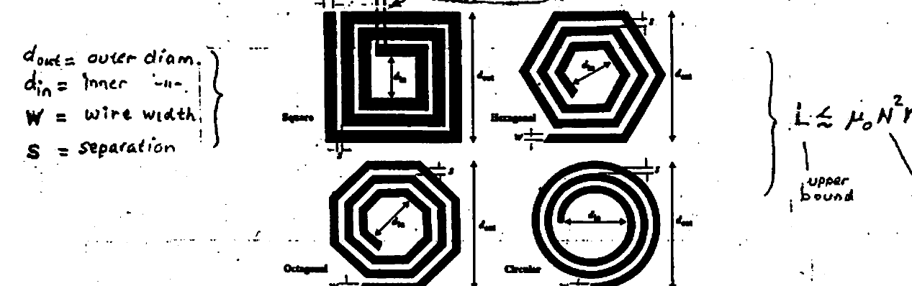

*Fig. Common IC spiral-inductor geometries: square, hexagon, octagon, and circular, plus a cross-under. Parameters: $`d_{out}`$ = outer diameter, $`d_{in}`$ = inner diameter, $`W`$ = wire width, $`S`$ = separation. Upper bound $`L \lesssim \mu_0 N^2 r`$ ($`N`$ = # turns).*

Many formulas exist in the literature for the inductance calculation. The following expression & table provide an accurate ($`\lesssim 5\%`$) estimate for the "$`L`$" of the above geometries:

```math
L \approx \frac{\mu_0 N^2 d_{avg}}{2}\, c_1\!\left[\ln\!\left(\frac{c_2}{\rho}\right) + c_3\rho + c_4\rho^2\right] \qquad (< \pm 5\%)
```

```math
d_{avg} = \frac{d_{in} + d_{out}}{2} \quad\cdots\quad \text{average "diameter"}
```

```math
\rho = \frac{d_{out} - d_{in}}{d_{out} + d_{in}} \quad\cdots\quad \text{"fill factor"} \; (< 1)
```

```math
N = \#\text{ turns}, \qquad \mu_0 = 4\pi \cdot 10^{-9}\ \left(\frac{H}{cm}\right)
```

**Coefficients for inductance formula:**

| Shape | $`c_1`$ | $`c_2`$ | $`c_3`$ | $`c_4`$ |
| --- | --- | --- | --- | --- |
| Square | 1.27 | 2.07 | 0.18 | 0.13 |
| Hexagon | 1.09 | 2.23 | 0.00 | 0.17 |
| Octagon | 1.07 | 2.29 | 0.00 | 0.19 |
| Circle | 1.00 | 2.46 | 0.00 | 0.20 |

*Table. Coefficients for the inductance formula by geometry.*

---

## Appendix-1 — Signal Distortion

### (I) Amplitude Distortion

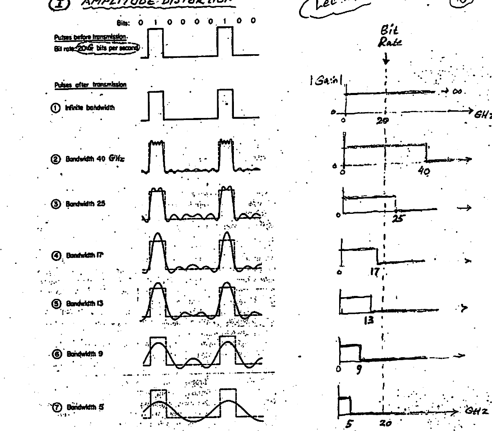

*Fig. Amplitude distortion. A bit pattern (0 1 0 0 0 0 1 0 0) at a bit rate of 20 Gb/s transmitted through systems of decreasing bandwidth: ∞ (infinite), 40, 25, 17, 13, 9, and 5 GHz. As the gain "brick-wall" bandwidth shrinks below the bit rate, the high-frequency spectral content is removed and the rectangular pulses become increasingly rounded and distorted.*

**Culprit:** **unequal** amplification of the various frequencies in a signal.

### (II) Phase Distortion

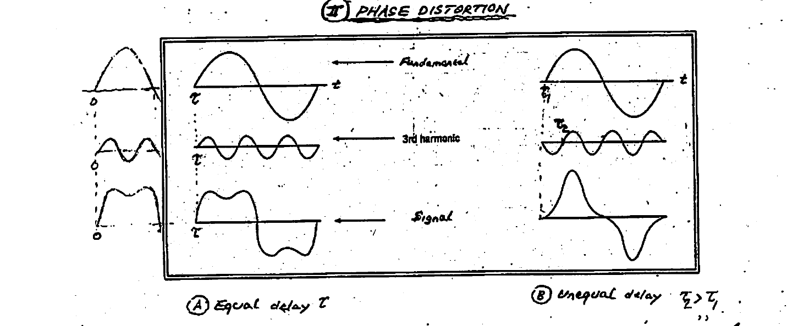

*Fig. Phase distortion. (A) Equal delay $`\tau`$ for the fundamental, 3rd harmonic, and resulting signal — the waveform is faithfully reproduced. (B) Unequal delay ($`\tau_2 > \tau_1`$) — the harmonic is shifted relative to the fundamental, severely distorting the resulting signal.*

**Culprit:** **unequal** delay of various frequencies in a signal.

> **Note:** since $`\text{DELAY} \triangleq \dfrac{d}{d\omega}(\text{PHASE})`$, a constant delay implies a **LINEAR** phase variation vs. frequency.

---

## Appendix-2 — $`I_{mod}`$ for the MZI Driver

```math
I_M = ? \qquad (\text{for 5-V differential, p-to-p, output A–B swing})
```

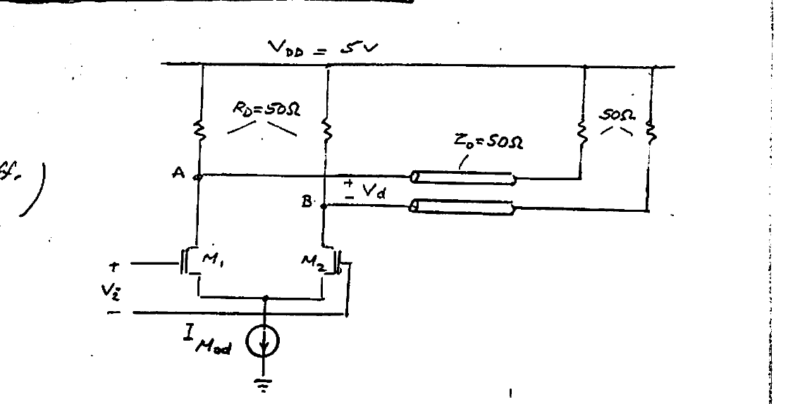

*Fig. Differential ($`M_1`$, $`M_2`$) CML driver with $`V_{DD} = 5`$ V, drain resistors $`R_D = 50\ \Omega`$, transmission lines $`Z_0 = 50\ \Omega`$ (terminated in $`50\ \Omega`$), and tail current $`I_{Mod}`$.*

For $`M_1`$:

```math
M_1: \begin{cases} \text{OFF} \cdots V_A(\text{Hi}) = V_{DD} \\[4pt] \text{ON} \cdots V_A(\text{Lo}) = V_{DD} - 25\ \Omega \times I_{Mod} \end{cases} \qquad (25\ \Omega = R_D \,\|\, Z_0)
```

```math
M_2: \;\; \text{same for } V_B.
```

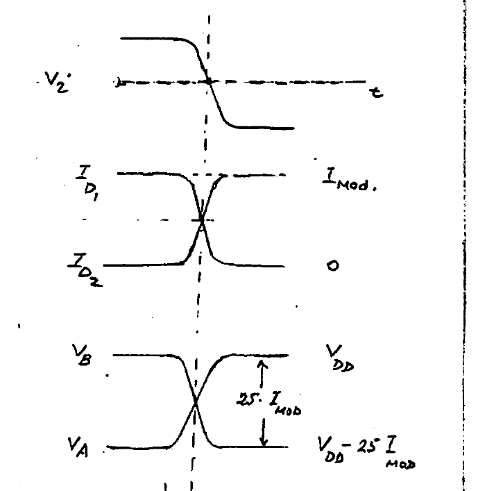

*Fig. Switching waveforms: input $`V_i`$, drain currents $`I_{D_1}`$, $`I_{D_2}`$ (swinging between $`I_{Mod}`$ and 0), and node voltages $`V_A`$, $`V_B`$ (swinging by $`25\,I_{Mod}`$ between $`V_{DD}`$ and $`V_{DD} - 25\,I_{Mod}`$).*

```math
\therefore\; (V_A - V_B) = \pm\,25\,I_{Mod} \quad\equiv\quad V_d
```

```math
\therefore\; V_d\,(\text{p-to-peak}) = 50\,I_{Mod}
```

**MZM driver specs:** 5 V input differential peak-to-peak swing.

```math
\therefore\; 50\,I_{Mod} = 5\text{ V} \qquad \text{or,} \qquad \boxed{I_{Mod} = 100\text{ mA}}
```

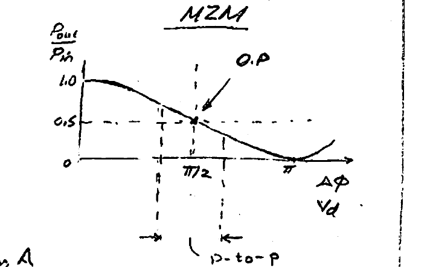

*Fig. MZM transfer characteristic $`\dfrac{P_{out}}{P_{in}}`$ vs. $`\Delta\phi`$ (and $`V_d`$), showing the quadrature operating point (O.P.) at $`\Delta\phi = \pi/2`$ and the p-to-p drive swing.*

---

## Appendix-3 — Advantages of Differential Signaling

Although at very high data rates, interference due to the smallest capacitive coupling could be troublesome, the presence of two currents ($`I_{D_1}`$, $`I_{D_2}`$) switching simultaneously but in "opposite phase" practically cancels out any potential interference their switching may cause (see "aggressor" lines in Fig below) to other nearby circuits.

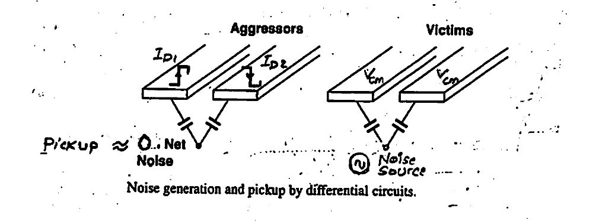

*Fig. Noise generation and pickup by differential circuits. Aggressor lines carrying $`I_{D_1}`$, $`I_{D_2}`$ produce a net "pickup" $`\approx 0`$ (net noise), while victim lines pick up the interference equally as common-mode.*

Similarly, differential lines being "victimized" by a nearby noisy interference source tend to pick up the interference equally as a pure common-mode signal $`V_{cm}`$. Such EM interference gets suppressed by the differential nature of the circuit topology (see "victim" lines).

### Multi-stage Predrivers (buffer)

Buffers are often constructed in a multi-stage **tapered** cascade to maintain speed and ISI (signal integrity). This avoids the inferior performance obtained by using a single stage with one large transistor as predriver.

Shown below is a 3-stage **TAPERED buffer** with successively increasing tail currents 2.5, 5, 10 mA to provide progressively greater drive capability for charging the progressively larger input capacitance of larger succeeding transistor stages.

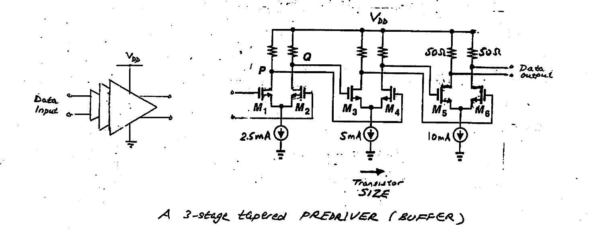

*Fig. A 3-stage tapered predriver (buffer). Successive differential stages ($`M_1`$–$`M_2`$, $`M_3`$–$`M_4`$, $`M_5`$–$`M_6`$) use increasing tail currents (2.5 → 5 → 10 mA), i.e. increasing transistor size, to drive the progressively larger input capacitance of the following stage.*
