# Lecture 16 — Lasers Intro

**EECE 7398 — Analysis & Design of Photonic Integrated Circuits (PICs)** · Northeastern University, Dept. of Electrical & Computer Engineering · Spring 2023

---

## Lasers — Basic Theory

Much like the DC power supply serving electronic circuits as the energizing source, the **laser is the optical power supply for photonic circuits**.

Of course, a vast difference exists between their frequency of operation: 0 Hz (DC) and 100's THz, respectively. The laser — being an optical source — is actually an **optical oscillator** based on a similar positive feedback (FB) principle as its more-familiar counterpart, the electronic oscillator (Fig 1).

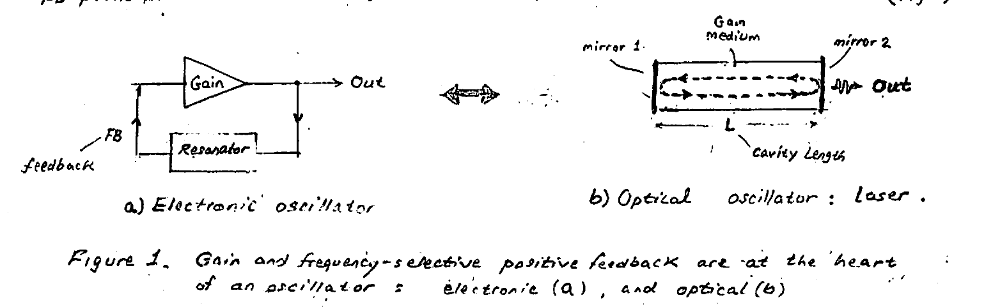

*Figure 1. Gain and frequency-selective positive feedback are at the heart of an oscillator: electronic (a), and optical (b).*

Note that the frequency at which the oscillations / lasing takes place is set by a **resonator**: a highly frequency-selective element. This element is usually a simple L–C resonator circuit for electronic oscillators. In a laser this function is performed by a **pair of parallel mirrors** forming a **"cavity resonator"** — aka a **Fabry–Perot cavity**.

To ensure startup and subsequently sustenance of the oscillations / lasing, **amplification** (i.e. power gain) must be provided in the feedback loop. This is typically achieved in electronic oscillators by an amplifier (active device), while in a laser by a substance capable of **"optical amplification"** — often appropriately called a **"gain medium"** or **"active medium"**.

As a preamble to discussing the basic operation of a laser, the operation of its electronic counterpart — the ordinary oscillator — will be described first. Occurrence of oscillations by a positive feedback process — which is common to both electronic & optical oscillators — is more conveniently perceived when viewed from the more familiar perspective of electronic oscillators.

Shown in Fig 2 is a basic electronic oscillator employing an amplifier (A) and a feedback network ($\beta$) connected in a closed (positive) feedback loop. The governing circuit equations:

$$v_{out} = A \cdot v_{fb} \quad (1) \qquad v_{fb} = \beta \cdot v_{out} \quad (2)$$

leading to:

$$v_{out} = A\beta\, v_{out} \quad (3)$$

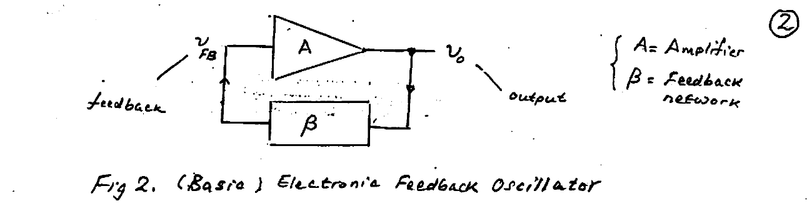

*Fig 2. (Basic) Electronic Feedback Oscillator.* Here $A$ = amplifier, $\beta$ = feedback network.

Since we are seeking the conditions that result in oscillations, $v_0 \neq 0$ in eqn (3), which leads to the **oscillations condition**:

$$A\beta = 1 + j0 \quad (4)$$

Eqn (4) is known as the **Barkhausen criterion** for oscillations. It can be demonstrated (see Appendix-1) that the occurrence of oscillations is subject to closed-loop transmission $A\beta$:

$$A\beta \begin{cases} < 1 & \cdots\text{none} \quad (a) \\ = 1 & \cdots\text{sustained} \quad (b) \\ > 1 & \cdots\text{growing} \quad (c) \end{cases} \quad (5)$$

For oscillations to **start-up**, a trigger is required: the minute electrical noise (nV–μV) — ever-present in all electric circuits. For oscillations to grow from the noise level (nanovolts or microvolts), oscillators are always designed for condition 5(c): $A\beta > 1$.

The basic nonlinearity of amplifiers results in a decrease of their gain ($A$) with increasing signal level (Fig 3 (a)). This important feature is responsible for the eventual limiting of the oscillations amplitude and a steady-state condition of sustained oscillations $A\beta = 1 + j0$ (5(b)) to prevail. The solution of the two conditions $\mathrm{Re}(A\beta) = 1$ and $\mathrm{Im}(A\beta) = 0$ (or $|A\beta| = 1$ & $\angle A\beta = 0°$) leads to: i) oscillations frequency ($\omega_{osc}$), and ii) the minimum gain ($A_{min}$) required.

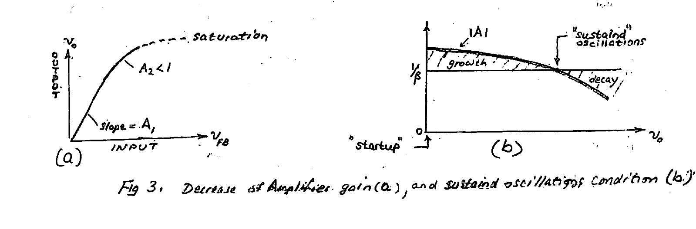

*Fig 3. Decrease of amplifier gain (a), and sustained oscillation condition (b).*

---

## Example: Sinusoidal Oscillator

Determine for oscillations:

1. frequency $\omega_{osc}$
2. min. amplifier gain $A_{min}$

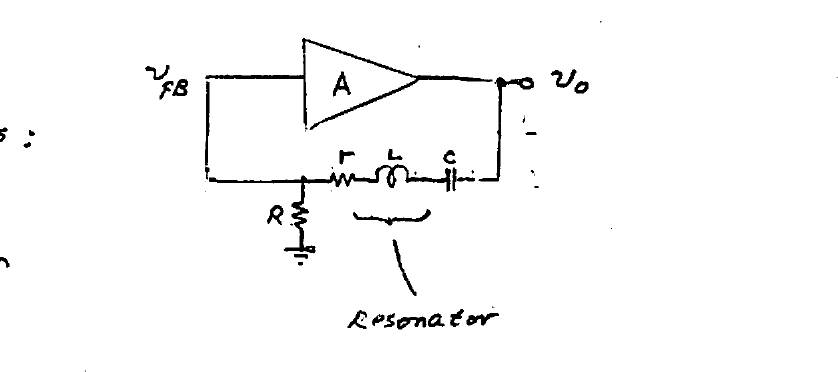

$$\begin{cases} v_0 = A\, v_{fb} & (1) \\[4pt] v_{fb} = \dfrac{R}{R + r + sL + \frac{1}{sC}}\, v_0 & (2) \end{cases}$$

(2) → (1), with $s = j\omega$ (sinusoidal oscillations):

$$v_0 = \left(\frac{AR}{R + r + sL + \frac{1}{sC}}\right) v_0$$

$$\therefore\quad \frac{AR}{R + r + j\!\left(\omega L - \frac{1}{\omega C}\right)} = 1 \;\Rightarrow\; \begin{cases} AR = R + r & (1) \\[4pt] j\!\left(\omega L - \dfrac{1}{\omega C}\right) = 0 & (2) \end{cases}$$

(1) gives:

$$A_{min} = 1 + \frac{r}{R}$$

(2) gives:

$$\omega_{osc} = \frac{1}{\sqrt{LC}}$$

**Conclusions:**

- The oscillator oscillates at the **RESONANT frequency** ($\omega_0 = 1/\sqrt{LC}$) of the resonator.
- During oscillations $v_{fb} = \dfrac{R}{r + R}\, v_0$ (as the L–C branch is an effective short circuit @ resonance). Thus:

$$A_{min} = \frac{v_0}{v_{fb}} = \frac{r + R}{R} = 1 + \frac{r}{R} \quad\checkmark$$

- If $A < A_{min} \rightarrow$ no oscillations.
- $A = A_{min} \rightarrow$ SUSTAINED (steady-state) oscillations.
- $A > A_{min} \rightarrow$ START UP of oscillations.

---

## Appendix-1 — Worksheet for FB Oscillators

Consider the (positive) feedback topology below:

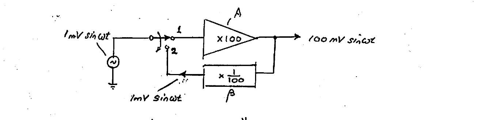

a) What happens when the switch "instantaneously" switches to position 2?
b) " " " $\beta = \frac{1}{200}$?
c) " " " $\beta = \frac{2}{100}$?
d) What starts the oscillations?
e) What is required of the $\beta$ (feedback) network to build an oscillator at frequency 10 MHz? Assume $A$ is at least 100.

---

## Lasers: Basic Physics

The basic physics behind optical amplification is described herein. For a substance (solid or gas) to be made a light source emitting photons, energy must be supplied to it: e.g. electric heating of a filament in a light bulb, or electric discharge (arc) in a neon lamp. This input energy "pump" is responsible for the **"excitation"** of the constituent atoms of the gain medium and raising their energies to higher levels. As the excited atoms spontaneously collapse back to their normal / ground state, **"spontaneous emission"** of light waves (photons) takes place. The frequency ($f$) (wavelength $\lambda$) of the emitted photons is quantified by **Einstein's relation**:

$$\Delta E = hf \quad \left(= \frac{hc}{\lambda}\right) \quad (6)$$

$\Delta E$ = energy difference, "Excited" − "Ground"; $hf$ = emitted photon energy.

- $h = 6.6262 \times 10^{-34}$ Joule·sec (Planck's constant)
- $c = 2.9979 \times 10^{8}$ m/s (light speed in vacuum)

> **Note:** Since in solids the discrete energies (lines or states) of atoms "merge" to form energy **BANDS**, spontaneous emission will involve a range of frequencies rather than a single or a discrete set of frequencies. This is due to numerous (a band) of excited atomic states.

---

## Spontaneous Emission

The following features characterize spontaneous emission:

- Many photon frequencies ($f$) result due to a range of higher levels of "excitation" energies of the atoms in said substance.
- Emitted waves (photons) occur at random times in various directions in a range of wavelengths.

Thus in conclusion, spontaneous emission is not of a single frequency / wavelength / phase. This radiation type is known as **"non-coherent"** emission, and is produced, for e.g., by an **LED**.

---

## Stimulated Emission: "Optical Amplification"

- By the use of a **resonator cavity**, only the resonant wavelengths can be sustained in the F–P cavity, which acts an optical-wavelength-selective filter: since the conducting mirrors force a zero E-field at their surface (by a phase-reversal upon reflection), many optical standing-wave patterns, i.e. **"longitudinal modes"**, can be sustained by the cavity. Each of these modes is characterized by a specific wavelength $\lambda_m$ satisfying $m\left(\frac{\lambda_m}{2 n_{e\!f\!f}}\right) = L$. This leads to:

$$\lambda_m = \frac{2 n_{e\!f\!f} L}{m}, \qquad f_m = \frac{c}{\lambda_m} = m\!\left(\frac{c}{2 n_{e\!f\!f} L}\right) \quad (7)$$

- $L$ = length of cavity (distance b/w mirrors)
- $n_{e\!f\!f}$ = effective refractive index of the "gain medium"
- $m$ = mode order (integer = 1, 2, 3, …)
- $\lambda_m$, $f_m$ = wavelength (free space) and frequency of the $m$th longitudinal mode.

The figure below illustrates two different orders of longitudinal modes that can be sustained inside the Fabry–Perot resonator cavity. These are standing-wave patterns with maxima and minima (zero intensity) positions. In practice $m \sim 100\text{–}1000$!

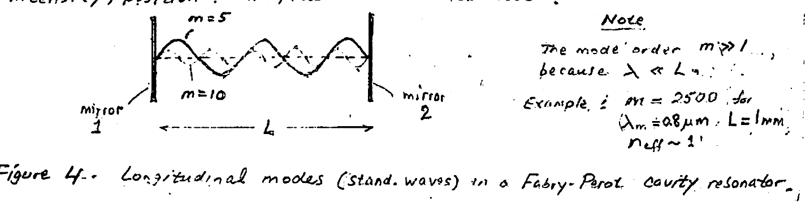

*Figure 4. Longitudinal modes (stand. waves) in a Fabry–Perot cavity resonator.*

> **Note:** The mode order $m \gg 1$, because $\lambda \ll L$. Example: $m = 2500$ for $\lambda_m = 0.8\ \mu m$, $L = 1\ \text{mm}$, $n_{e\!f\!f} \sim 1$.

Among the many waves that are spontaneously emitted by the medium, only those of wavelengths $\lambda_m$, eqn (7), and travelling along the optical axis of the resonator cavity will be favored and sustained as lasing waves. All other waves fail to contribute to the cavity field. In the cavity, light with a resonant wavelength ($\lambda_m$) will bounce back and forth between the two mirrors growing in intensity each pass as a result of a positive **"optical feedback"** mechanism.

The optical positive feedback occurs as follows: spontaneously generated light resonating in the cavity with a wavelength $\lambda_m$ stimulates already-excited atoms in the gain medium to emit photons (radiation) of equal energy, i.e. same $\lambda_m$. In turn, this stimulated emission after travelling and bouncing back from a mirror, produces another stimulated wave in phase with the first. In such a manner, quickly a high-intensity monochromatic light beam ($\lambda_m$) is produced in the cavity. Use of a partially reflecting mirror 2 allows a portion of the generated light to be extracted as output. By employing very-high gain, the gain medium can easily absorb the loss incurred in cavity optical power. The above feedback process is responsible for the laser acronym: **"Light Amplification (by) Stimulated Emission of Radiation"**.

The coherent light beam generated by the laser is a spatially and spectrally concentrated beam with features:

1. highly-directional monochromatic beam with a specific wavelength $\lambda_m$.\*
2. the waves (photons) that make up the laser beam are all in phase — i.e. **"coherent"**. The result is an E-field (and H-field) propagating with a uniform wavefront — i.e. a **plane wave** (Fig 5).
3. the direction of the E-field in the plane perpendicular to the direction of propagation is fixed — meaning a fixed unchanging direction of **"polarization"** during propagation.
4. the laser beam has very high **brightness** (or radiance) mainly because all the emitted photons travel in the same direction as a highly-collimated beam of strong intensity.
5. while eqn (7) predicts an infinite number of lasing wavelengths, it turns out that only a limited number is actually possible. This is because the **"gain medium"** itself has a limited gain bandwidth (Fig 6).

> \* In reality a Fabry–Perot cavity-based laser produces a multiplicity of lasing photons with different wavelengths $\lambda_m$. This of course leads to an application as a **"Multi-Wavelength"** laser for use in WDM systems. To limit emission to a single $\lambda$, however, a suitable light filter is used.

---

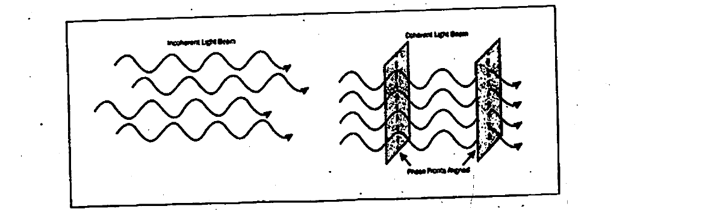

*Figure 5. Coherence of laser light means that all light waves are in phase with one another.*

## Laser Threshold

For actual laser action to start, a minimum excitation **THRESHOLD** must be exceeded. This is necessary in order to increase the amplification by the gain medium so as to exceed laser losses. (Recall a similar requirement exists for the active device (amplifier) in a conventional electronic oscillator.)

Laser losses originate from few sources. A major loss is the optical output power being extracted at one of the mirrors, which is made partially reflecting. Another source of loss stems from the fact that only a fraction of the spontaneous emission — namely that directed along the resonator axis — will produce stimulated emission.

If insufficient gain is present, then lasing action may not start. The weak output that would be observed would be due to spontaneous emission only. In practice ample excitation or **"pump"** power is supplied in excess of the threshold, so as to produce a high enough optical gain so that such losses can be tolerated.

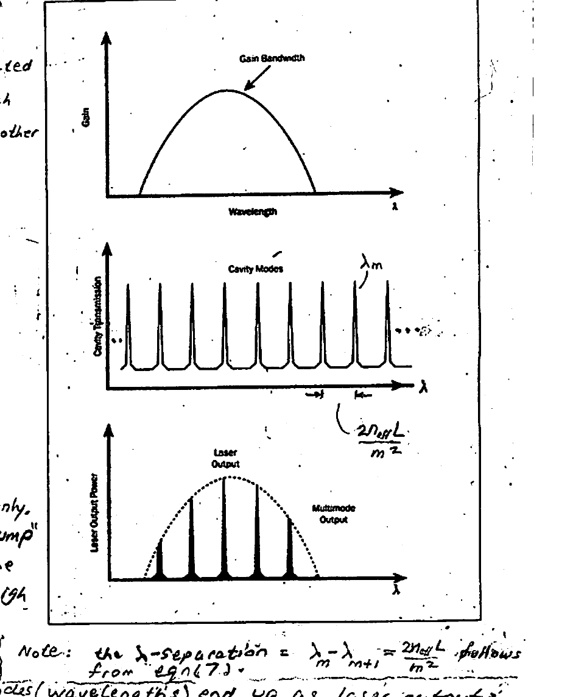

*Figure 6. Not all cavity modes (wavelengths) end up as laser outputs. Due to a limited gain bandwidth of the active medium, only a fraction ends up as useful output.*

> **Note:** the $\lambda$-separation $= \lambda_m - \lambda_{m+1} = \dfrac{2 n_{e\!f\!f} L}{m^2}$ follows from eqn (7).

---

## Summary

- The three mechanisms responsible for lasing action are **"energy absorption"** (pumping), **"spontaneous emission"**, and **"stimulated emission"**. Also see back page for **"competition among the three mechanisms"**.

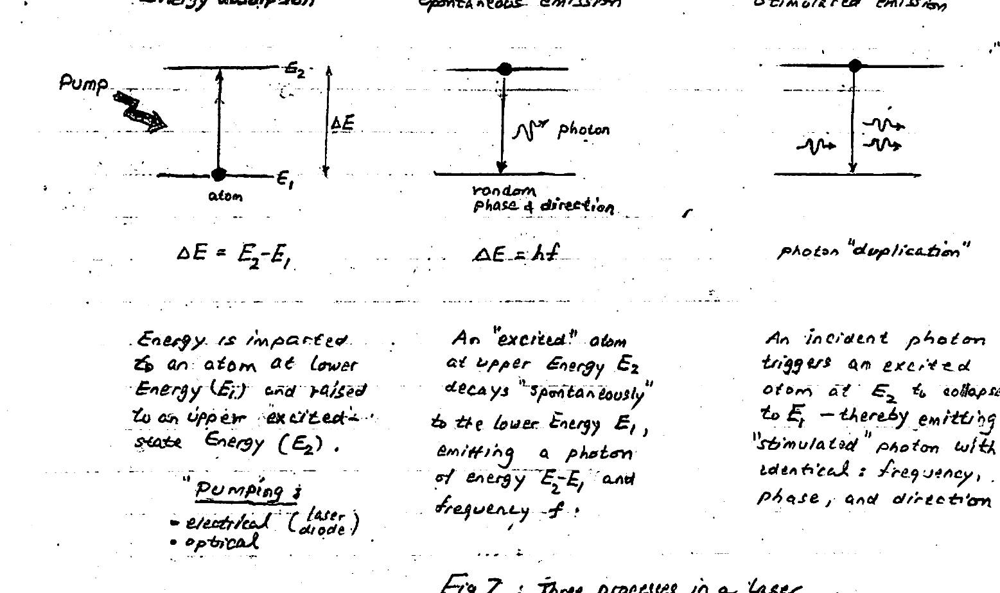

*Fig 7. Three processes in a laser.*

**"Energy absorption":** Energy is imparted to an atom at lower energy ($E_1$) and raised to an upper excited-state energy ($E_2$). $\Delta E = E_2 - E_1$.

- **Pumping:**
  - electrical (laser diode)
  - optical

**"Spontaneous emission":** An "excited" atom at upper energy $E_2$ decays "spontaneously" to the lower energy $E_1$, emitting a photon of energy $E_2 - E_1$ and frequency $f$. $\Delta E = hf$ (random phase & direction).

**"Stimulated emission":** An incident photon triggers an excited atom at $E_2$ to collapse to $E_1$ — thereby emitting a "stimulated" photon with identical frequency, phase, and direction (photon "duplication").

- The optical cavity has the ability of filtering the "spontaneous emission", and produces discrete frequencies (longitudinal modes) with frequency separation\* $\dfrac{c}{2 n_{e\!f\!f} L}$.

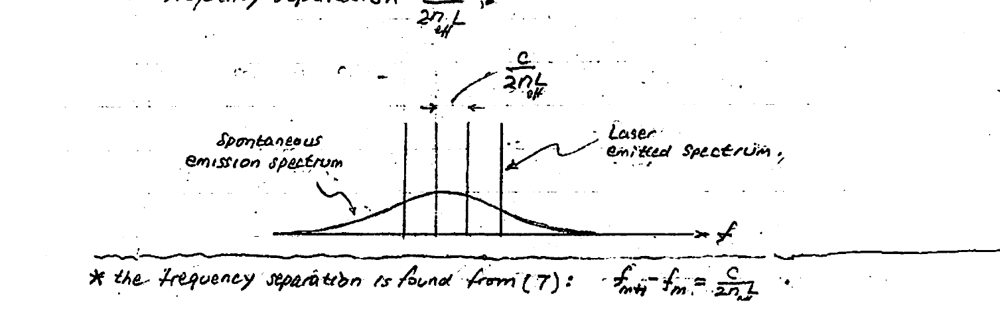

> \* the frequency separation is found from (7): $f_{m+1} - f_m = \dfrac{c}{2 n_{e\!f\!f} L}$.

---

## Competition Among the Three Mechanisms

The mechanisms of absorption, spontaneous emission, and stimulated emission are always co-present during laser operation. For lasing action to occur, however, conditions need to be created that favor **stimulated emission** over absorption and spontaneous emission.

- An incident photon of energy ($hf$) has equal probability for being **absorbed** by a ground-state atom — thereby raising it to an excited-state, or **"duplicated"** (i.e. amplified) through interaction with an atom already at an excited-state of energy (stimulated emission).

To favor stimulated emission over absorption, the excited-state atoms must be more numerous than the ground-state atoms — a condition known as **"population inversion"**.

Note that this is a marked deviation from thermodynamic equilibrium conditions, where the opposite is true: the lower energy-state atoms are more numerous than the upper-energy-state atoms (a condition governed by the **Boltzmann distribution**).

Also, upper energy levels get "emptied" by spontaneous emissions as well as stimulated emissions. For lasing action to take place, these excited-state energy levels have to be emptied faster by stimulated emission. It has been demonstrated that stimulated emission can be made dominant if the active (gain) medium is "flooded" with light, i.e. a large number of photons. An expedient means for accomplishing this is spatially confining the photons in an **optical cavity**.

When a laser is "turned on", it initially acts as a lamp (e.g. LED) with spontaneous emission occurring in all directions. However, the small part of it which is aligned with the axis of the cavity results in photons travelling back and forth in the cavity. Thanks to the light amplifying medium, the number of these photons grows very fast through stimulated emission. The confinement of the light in the cavity increases the probability of stimulated emission over spontaneous emission. Thus, lasing action can take place.

---

## Gain–Loss Balance (in the cavity)

When the laser is operating continuously its output optical power is constant despite the increase in the number of photons that occurs after each passage of the laser beam through the amplifying medium. The balancing act comes from a decrease in the number of photons after each mirror reflection.

The derivation of the implied gain–loss balance of optical power in the laser cavity is the subject of this section.

The optical power in the laser cavity as it exits the amplifying medium ($P_{out}$) is related to that entering it ($P_{in}$) by the gain ($G$) of the amplifying medium:

$$P_{out} = G \cdot P_{in} \quad (8)$$

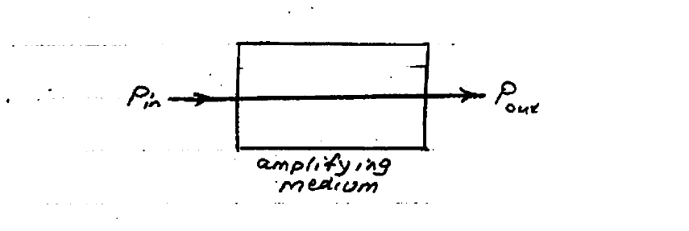

During a round trip in the cavity, the laser beam experiences loss at the reflecting mirrors, where not all incident power is reflected back into the cavity. Part of the incident power is lost to absorption (or, the extraction as output) at the mirrors. The situation in the cavity is as shown:

Let us examine the return-trip power balance, starting with an incident power ($P$) on mirror $M_2$ and ending with a return-trip power $P_{rt}$ at the same position. Clearly, steady-state operation of the laser requires equality $P_{rt} = P$:

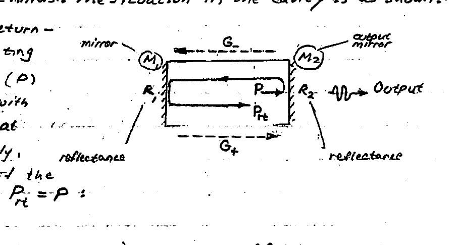

$$P_{rt} = (R_2 P) \times G_- \times R_1 \times G_+ = P \quad (9)$$

From which one obtains the important cavity **"gain-loss"** balance eqn:

$$G_+ G_- R_1 R_2 = 1 \quad (10)$$

where $R_1$, $R_2$ are the reflectances of the two "mirrors" $M_1$ & $M_2$ in the cavity.

**Notes:**

1. $R_2 < R_1$, by design, to permit extraction of output power at $M_2$.
2. $G_+ \neq G_-$ because $G_\pm$ depend on the incident power, which is not the same (in part due to $R_2 \neq R_1$).

Returning to the considerations pertaining to return power ($P_{rt}$) vs initial incident power ($P$), the following becomes clear:

3. No laser oscillations can occur if $G_+ G_- R_1 R_2 < 1$.
4. To ensure laser oscillations, must have $G_+ G_- R_1 R_2 > 1$.

In (4) the power in the beam increases each roundtrip. The increase is limited, however, not unbounded, as the number of excited-state atoms is finite, and dictated by pumping. This limits the number of stimulated photons.

Thus, if $N$ represents the maximum number of photons that can be "pumped" per second, then the gain ($G$) can be defined in terms of $N$ and the power $P_{in}$ of the beam at its entrance into the amplifying medium:

$$G = \frac{P_{in} + N(hf)}{P_{in}} \quad (11)$$

where $hf$ is the energy of a photon at frequency ($f$) of laser oscillations.

Eqn (11) indicates that if $P_{in}$ increases, the gain of the amplifying medium decreases tending towards $\rightarrow 1$, since $G = 1 + \dfrac{N hf}{P_{in}}$. (The decrease in $G$ with $P_{in}$ is often referred to as **GAIN SATURATION**.)

Thus when the optical power in the cavity increases, $G_+ G_-$ decreases and stabilizes @ $G_+ G_- = 1/R_1 R_2$, i.e. stable steady-state lasing.

### Mirror Reflectance ($R$)

Recall that for reflection normal to the interface b/w two materials with **"intrinsic impedances"** $Z_{o_1}$, $Z_{o_2}$ (i.e. reflection coefficient) is:

$$R = \left|\frac{Z_{o_2} - Z_{o_1}}{Z_{o_2} + Z_{o_1}}\right|^2 \quad (12) \qquad Z_{o_{1,2}} = \sqrt{\frac{\mu}{\varepsilon_{1,2}}}$$

$$R = \left(\frac{n_1/n_2 - 1}{n_1/n_2 + 1}\right)^2 \quad (13) \qquad \left(\text{used: } Z_{o_2}/Z_{o_1} = \sqrt{\varepsilon_1/\varepsilon_2} = n_1/n_2\right)$$

where $n_{1,2}$ = refractive indices.

---

## Conditions for Optical Frequency

The longitudinal-modes frequencies that can exist in the laser cavity are given by (7), i.e. $f_m = m\left(\dfrac{c}{2 n_{e\!f\!f} L}\right)$. However, only those frequencies that fall inside the bandwidth of the gain material have a chance to oscillate. Furthermore, only a subset of these, for which $G_+ G_- > 1/R_1 R_2$, will actually oscillate.

This is illustrated by two figures below. In the first, two frequencies will oscillate, while none in the second.

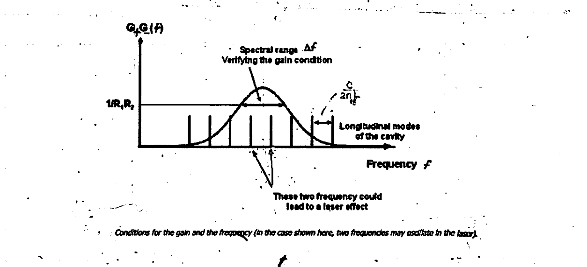

*Conditions for the gain and the frequency (in the case shown here, two frequencies may oscillate in the laser).*

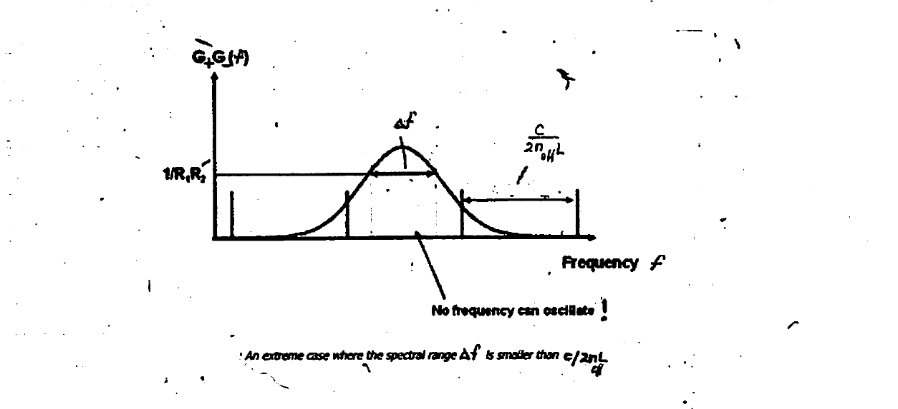

*An extreme case where the spectral range $\Delta f$ is smaller than $c/2 n_{e\!f\!f} L$.*

> **Note:** In the above figures the spectral range that satisfies the gain condition $G_+ G_- > 1/R_1 R_2$ is denoted by $\Delta f$.

---

## Single-Mode Operation

Initially, upon power-up, laser oscillations start as multi-modal with frequencies $f_1, f_2, \ldots, f_m$ for which the gain exceeds the loss $G_+ G_- > 1/R_1 R_2$ (see (a) of the figure below). These frequencies begin to grow, with the central ones (near the peak frequency, $f_0$) growing the fastest. Subsequently, the gain saturates (eqn (11)), and the peripheral modes get attenuated since their losses now exceed the gain, and eventually vanish. Concurrently, however, the central modes continue their growth (see (b)), until only a single mode survives at $f_0$ (see (c) in the figure).

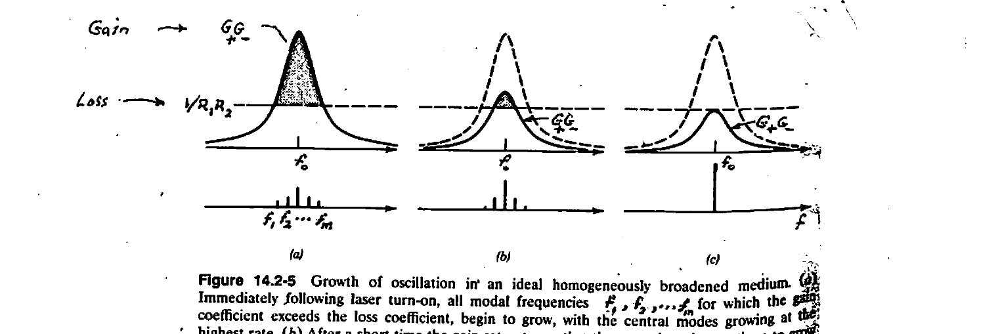

*Figure 14.2-5. Growth of oscillation in an ideal homogeneously broadened medium. (a) Immediately following laser turn-on, all modal frequencies $f_1, f_2, \ldots, f_m$ for which the gain coefficient exceeds the loss coefficient, begin to grow, with the central modes growing at the highest rate. (b) After a short time the gain saturates so that the central modes continue to grow while the peripheral modes, for which the loss has become greater than the gain, are attenuated and eventually vanish. (c) In the absence of spatial hole burning, only a single mode survives.*

Being central to laser operation, we show below the transient behavior of gain saturation of the active medium as the photon flux increases from zero in the cavity. The final photon flux is reached at **"steady state"** where gain = loss.

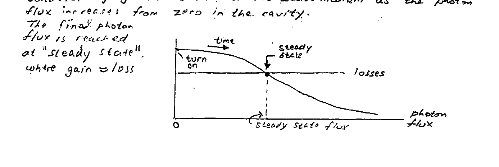

---

## Spatial Beam Features

A laser operating in steady state sustains a light beam whose spatial structure does not change despite numerous roundtrips inside the cavity. Such a beam has a **Gaussian distribution** of optical irradiance in a plane perpendicular to the beam's direction of propagation.

The figure below shows the distribution of light on a screen intercepting a laser beam, while the graphical plot under it shows the Gaussian distribution of irradiance in a plane perpendicular to the direction of propagation.

**Beam Radius:** This is typically defined as the off-axis distance where the intensity (irradiance) drops to $1/e^2$ of its on-axis maximum value.

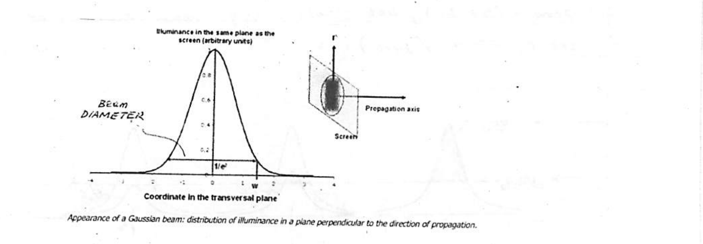

*Appearance of a Gaussian beam: distribution of illuminance in a plane perpendicular to the direction of propagation.*

It is noteworthy that often the laser beam is noncircular having two diameters: large (**"fast axis"**) and small (**"slow axis"**). A typical beam cross-section is shown below.

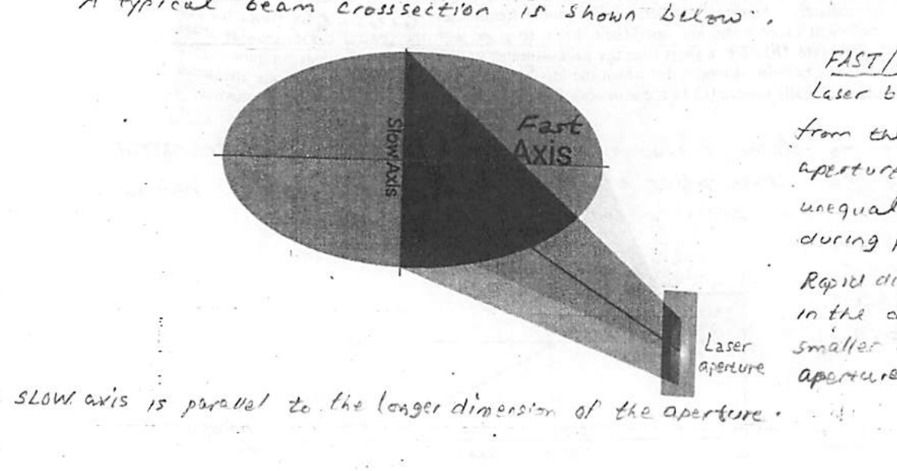

The SLOW axis is parallel to the longer dimension of the aperture.

> **FAST/SLOW Axes:** Laser beam diffraction from the rectangular aperture results in unequal divergence rates during propagation. Rapid divergence occurs in the direction of the smaller dimension of the aperture (**FAST axis**).
