# Lecture 17 — Semiconductor Lasers

**EECE 7398 — PICs** · Northeastern University, ECE · Spring 2023

---

## Light Emission from a Semiconductor

Light can be emitted from a semiconductor material by a process of **electron–hole recombination**: the "collapse" of an excited electron from the **conduction band** ($E_c$) to recombine with a hole in the **valence band** ($E_v$). This is depicted by the energy band diagram in Fig 1.

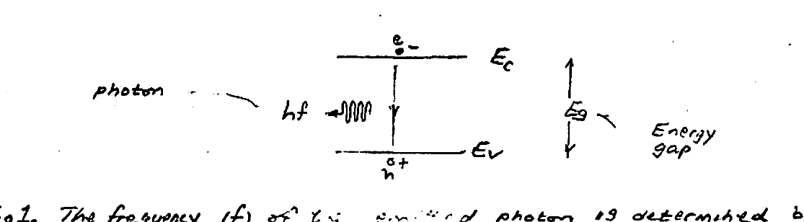

*Fig 1. Electron–hole recombination across the energy gap emits a photon of energy $hf$.*

The frequency ($f$) of the emitted photon is determined by $E_g = hf$:

$$f = E_g / h \tag{1}$$

and using $\lambda = c/f$, the corresponding emitted wavelength $\lambda$ is:

$$\lambda\,(\mu m) = \frac{1.24}{E_g\,(\text{eV})} \tag{2}$$

For example, for GaAs with $E_g = 1.42\ \text{eV}$ one finds $\lambda = 0.87\ \mu m$.

Two important requirements must be satisfied for light emission to occur:
1. The semiconductor has a **direct bandgap**, and
2. A condition of **population inversion** must prevail.

Condition (i) automatically rules out **silicon**, which is not a direct-bandgap but rather an **indirect-bandgap** material. In contrast, **Gallium Arsenide**, being a direct-bandgap semiconductor, makes a good laser.

Condition (ii) requires electrical **"pumping"** for the production of strong population inversion for the $e^-$'s and $h^+$'s. An expedient way of achieving this is through the use of a **forward-biased p–n junction**, giving rise to the so-called **"injection diode laser"** or simply **laser diode (LD)**.

---

## Junctions

Junctions between differently doped regions of a semiconductor material are called **homojunctions**. An important example is the **p–n junction**, discussed in this subsection. Junctions between different semiconductor materials are called **heterojunctions** (discussed subsequently).

### The p–n Junction

The p–n junction is a homojunction between a p-type and an n-type semiconductor. It acts as a diode which can serve in electronics as a rectifier, logic gate, voltage regulator (Zener diode), and tuner (varactor diode); and in optoelectronics as a light-emitting diode (LED), laser diode, photodetector, and solar cell.

A p–n junction consists of a p-type and an n-type section of the same semiconducting material in metallurgical contact with each other. The p-type region has an abundance of holes (majority carriers) and few mobile electrons (minority carriers); the n-type region has an abundance of mobile electrons and few holes. Both charge carriers are in continuous random thermal motion in all directions.

When the two regions are brought into contact (Fig. 15.1-16), the following sequence of events takes place:

- Electrons and holes **diffuse** from areas of high concentration toward areas of low concentration. Electrons diffuse from the n-region into the p-region, leaving behind positively charged ionized donor atoms; holes diffuse from the p-region into the n-region, leaving behind negatively charged ionized acceptor atoms. This diffusion cannot continue indefinitely because it disrupts the charge balance in the two regions.
- A narrow region on both sides of the junction becomes almost totally depleted of mobile charge carriers — the **depletion layer**. It contains only the *fixed* charges (positive ions on the n-side and negative ions on the p-side). The thickness of the depletion layer in each region is inversely proportional to the concentration of dopants in the region.
- The fixed charges create an electric field in the depletion layer pointing from the n-side toward the p-side. This **built-in field** obstructs the diffusion of further mobile carriers through the junction region.
- An equilibrium condition is established resulting in a net **built-in potential difference** $V_0$ between the two sides of the depletion layer, with the n-side exhibiting a higher potential than the p-side.
- The built-in potential provides a lower potential energy for an electron on the n-side relative to the p-side. As a result, the energy bands bend as shown in Fig. 15.1-16. In thermal equilibrium there is only a single Fermi function for the entire structure, so that the Fermi levels in the p- and n-regions must **align**.
- **No net current** flows across the junction; the diffusion and drift currents cancel for the electrons and holes independently.

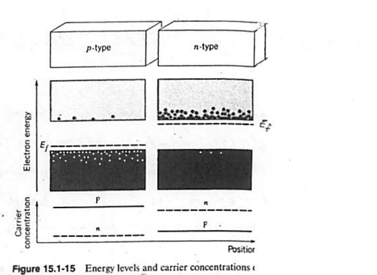

*Fig 15.1-15. Energy levels and carrier concentrations of a p-type and an n-type semiconductor before contact.*

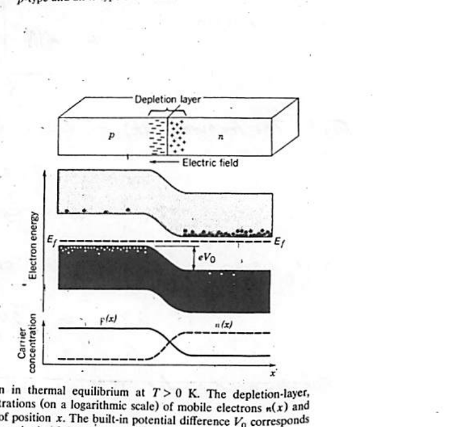

*Fig 15.1-16. A p–n junction in thermal equilibrium at $T>0$ K. The depletion-layer energy-band diagram and the mobile-carrier concentrations $n(x)$, $p(x)$ are shown vs. position $x$. The built-in potential difference $V_0$ corresponds to an energy $eV_0$.*

### The Biased Junction

An externally applied potential alters the potential difference between the p- and n-regions, modifying the flow of majority carriers, so the junction can be used as a "gate". If the junction is **forward biased** by applying a positive voltage $V$ to the p-region (Fig. 15.1-17), its potential is increased with respect to the n-region, so that an electric field is produced in a direction opposite to that of the built-in field. The forward bias causes a departure from equilibrium and a misalignment of the Fermi levels in the p- and n-regions, represented by two quasi-Fermi levels $E_{fc}$ and $E_{fv}$ in the depletion layer (a state of quasi-equilibrium).

The net effect of the forward bias is a reduction in the height of the potential-energy hill by an amount $eV$. The majority carrier current increases by an exponential factor $\exp(eV/k_B T)$, so the net current becomes $i = i_s \exp(eV/k_B T) - i_s$, where $i_s$ is a constant. The excess majority carrier holes and electrons that enter the n- and p-regions become minority carriers and recombine with the local majority carriers; their concentration decreases with distance from the junction. This process is known as **minority carrier injection**.

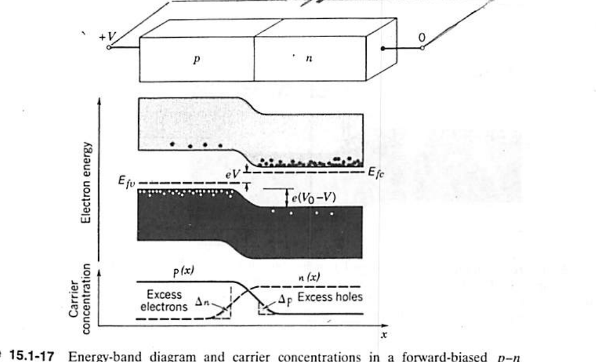

*Fig 15.1-17. Energy-band diagram and carrier concentrations in a forward-biased p–n junction.*

If the junction is **reverse biased** by applying a negative voltage $V$ to the p-region, the height of the potential-energy hill is augmented by $eV$, impeding the flow of majority carriers. The current is multiplied by $\exp(eV/k_B T)$ with $V$ negative; i.e. it is reduced. The net result is a small current of magnitude $\approx i_s$ flowing in the reverse direction when $|V| \gg k_B T/e$.

A p–n junction therefore acts as a diode with a current–voltage ($i$–$V$) characteristic:

$$\boxed{\,i = i_s\left[\exp\!\left(\frac{eV}{k_B T}\right) - 1\right]\,} \tag{15.1-24}$$

*(Ideal Diode Characteristic.)*

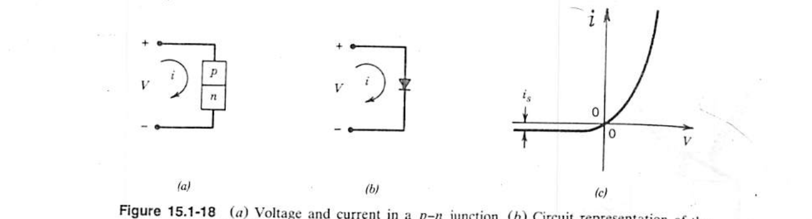

*Fig 15.1-18. (a) Voltage and current in a p–n junction. (b) Circuit representation of the p–n junction diode. (c) Current–voltage characteristic of the ideal p–n junction diode.*

---

## Light-Emitting Diode (LED)

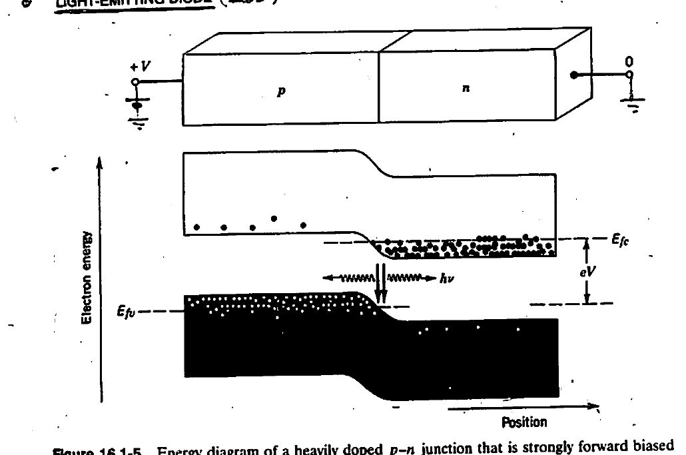

*Fig 16.1-5. Energy diagram of a heavily doped p–n junction that is strongly forward biased by an applied voltage $V$. The dashed lines represent the quasi-Fermi levels, which are separated as a result of the bias. The simultaneous abundance of electrons and holes within the junction region results in strong electron–hole radiative recombination (injection electroluminescence) — **spontaneous** emission.*

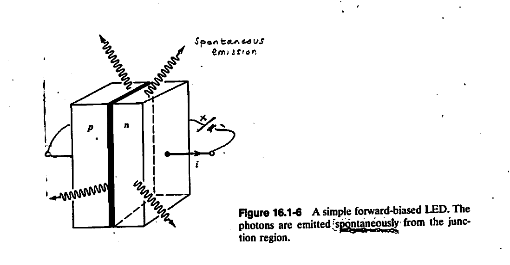

*Fig 16.1-6. A simple forward-biased LED. The photons are emitted **spontaneously** from the junction region.*

---

## Semiconductor Injection Laser

A forward-biased heavily doped p–n junction fabricated from a **direct-gap** semiconductor material. The injected current is sufficiently large to provide optical gain. The optical feedback is provided by mirrors, usually obtained by **cleaving** the semiconductor material along its crystal planes. The sharp refractive index difference between the crystal and the surrounding air causes the cleaved surfaces to act as reflectors. Here the semiconductor crystal acts both as a **gain medium** and as an **optical resonator**, as illustrated in Fig. 16.3-1.

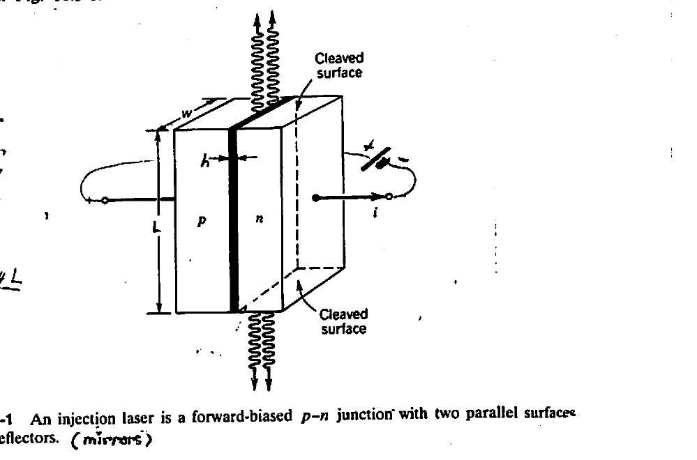

*Fig 16.3-1. An injection laser is a forward-biased p–n junction with two parallel surfaces that act as reflectors (mirrors).*

Where $L$ = length of cavity, $W$ = width of cavity, $h$ = height of cavity. The **resonant wavelength**:

$$\lambda_m = \frac{2 n_{\text{eff}} L}{m}$$

### Lasing condition

$$G^{+} G^{-} > \frac{1}{R_1 R_2}$$

with mirror reflectances:

$$R_1 = \left(\frac{n_1 - 1}{n_1 + 1}\right)^2, \qquad R_2 = \left(\frac{n_2 - 1}{n_2 + 1}\right)^2$$

> **Note:** reflectances $R_{1,2}$ are between air and the semiconductor. For example, for GaAs, $n_{\text{GaAs}} \approx 3.5$, so that $R_{1,2} \approx 30\%$.

### Optical Confinement

**Total internal reflection** (in the depletion region) is ensured through the **"plasma dispersion effect"**, which makes:

$$n_{\text{depl.}} > n_p,\, n_n$$

---

## The Light–Current Curve

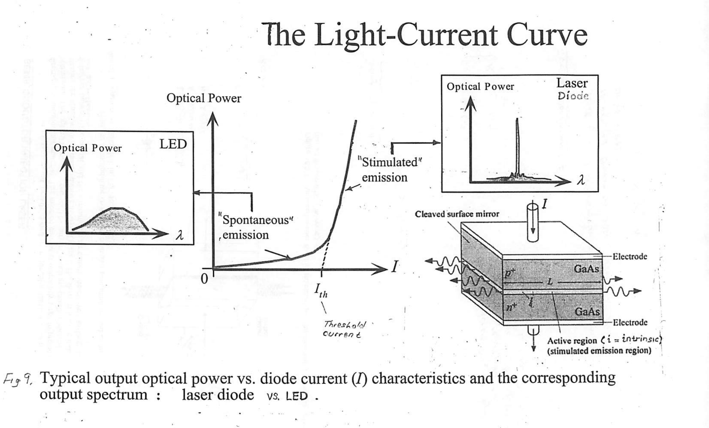

*Fig 9. Typical output optical power vs. diode current ($I$) characteristics and the corresponding output spectrum: laser diode vs. LED.* Below the **threshold current** $I_{th}$ the device emits broad **spontaneous** emission (LED-like); above $I_{th}$ it emits narrow-band **stimulated** emission (laser). The active region ($i$ = intrinsic) is the stimulated-emission region.

---

## Performance Enhancement

The optical confinement is an important performance feature of laser diodes, as it increases the laser's output and efficiency. The optical confinement can be enhanced through the use of two different semiconductors (i.e. a **heterojunction**), where a larger contrast in refractive index can be attained in comparison to single-semiconductor structures (i.e. a **homojunction**). This is demonstrated in Fig. 16.3-2.

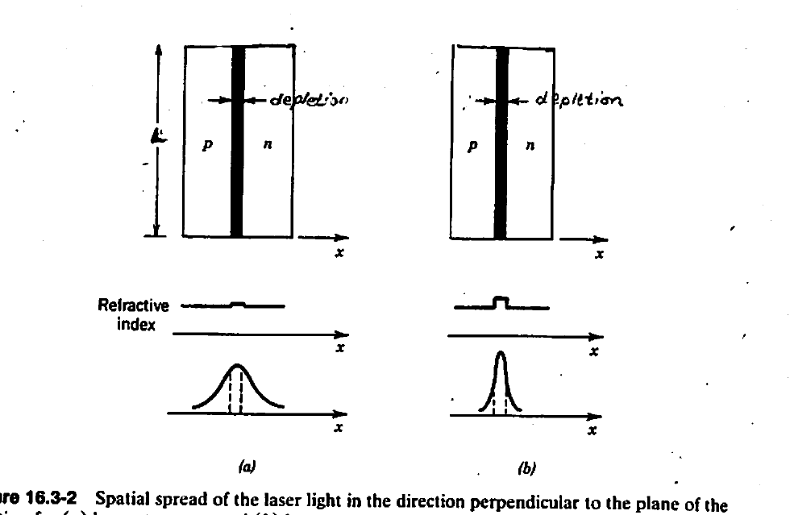

*Fig 16.3-2. Spatial spread of the laser light in the direction perpendicular to the plane of the junction for (a) homostructure, and (b) heterostructure lasers.*

Two semiconductors with different **energy gaps** possess different refractive indices, with the smaller-bandgap material having a higher refractive index. An example is the GaAs heterojunction diode laser based on a **p–i–n double-heterostructure**: AlGaAs for the p & n outer regions, and intrinsic "i" GaAs for the central region (Fig 7). Because it possesses a greater energy gap than GaAs, the AlGaAs double outer (p & n) regions possess a lower refractive index. This property makes the two outer regions function as **"cladding"** — confining the optical beam to the central (GaAs) region, which has a higher refractive index.

> \* For example, in the Si-photonics SOI technology ($n_{\text{SiO}_2}\approx 1.5$ and $n_{\text{Si}}\approx 3.5$), the respective energy gaps are: ~9 eV (SiO₂) and ~1.1 eV (Si).

### Example: Heterostructure of a Laser Diode (GaAs / GaAlAs)

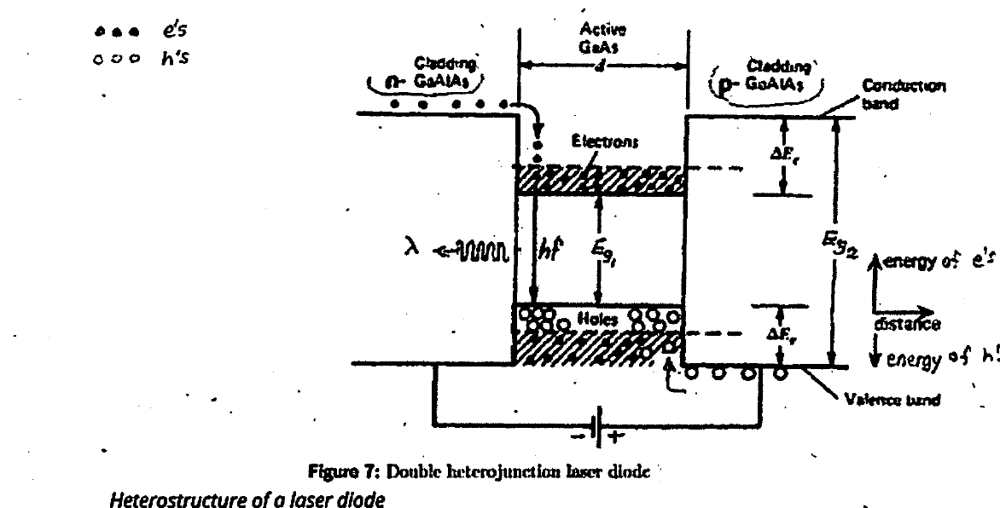

*Fig 7. Double heterojunction laser diode.*

As illustrated in Figure 7, the **AlGaAs laser diode** consists of a double heterojunction formed by an undoped (or lightly p-doped) active region surrounded by higher-bandgap p and n cladding layers ($\text{Al}_x\text{Ga}_{1-x}\text{As}$). The surrounding cladding layers provide an energy barrier to confine carriers to the active region. The actual operation wavelengths may range from 750–880 nm due to the effects of dopants, the size of the active region, and the compositions of the active and cladding layers.

For example, when the active layer has an energy gap $E_g = 1.424\ \text{eV}$, the nominal emission wavelength is $\lambda = hc/E_g\ (= 1.24/E_g) = 871\ \text{nm}$. When a bias voltage is applied in the forward direction, electrons and holes are injected into the active region. Since the band gap energy is larger in the cladding layers than in the active layer, the injected electrons and holes are prevented from diffusing across the junction by the potential barriers formed between the active layer and cladding layers (Figure 7). The electrons and holes confined to the active layer create a state of **population inversion**, allowing the amplification of light by stimulated emission.

The cladding layers serve two functions: first, inject charge carriers; second, light confinement. Since the active region has a smaller bandgap than the cladding layers, its refractive index will be slightly larger than that of the surrounding layers. The GaAs refractive index at these wavelengths is $n \approx 3.5$ while the refractive index of the $\text{Al}_x\text{Ga}_{1-x}\text{As}$ cladding layers is slightly smaller. Figure 8 indicates the electromagnetic field distribution due to the heterostructure.

**Advantages:**
1. Optical confinement
2. Injected $e^-$'s & $h^+$'s confinement

> \* Promotes confinement of lasing action!

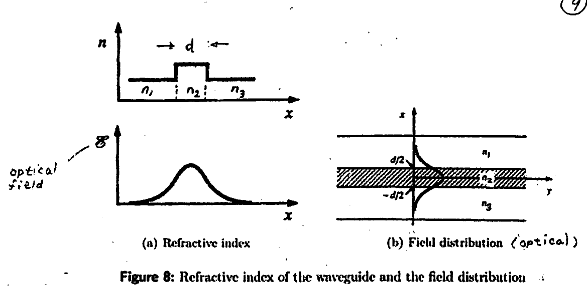

*Fig 8. (a) Refractive index of the waveguide and (b) the (optical) field distribution.*

### Numerical Data

- **GaAs / AlGaAs Double-Heterostructure Laser Diode:** The active layer (layer 2) is fabricated from GaAs ($E_{g2} = 1.42\ \text{eV}$, $n_2 = 3.6$). The surrounding layers (1 and 3) are fabricated from $\text{Al}_x\text{Ga}_{1-x}\text{As}$ with $E_g > 1.43\ \text{eV}$ and $n < 3.6$ (by 5 to 10%). This LD typically operates within the 0.82- to 0.88-μm wavelength band using AlGaAs with $x = 0.35$ to $0.5$.

---

## Direct Modulators

To encode the laser beam with data, **"direct modulators"** are required. Various CMOS driver circuits are employed.

### (I) Differential Current Steering (CML*)

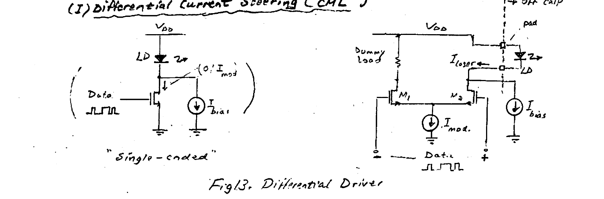

*Fig 13. Differential Driver (single-ended version shown at left; differential current-steering version at right).*

**Operation:** $I_{bias} \approx I_{th}$ (to avoid "turn-on" delay in the LD).

$$\text{Data} = \begin{cases} \text{"0"} & I_{laser} = I_{bias} \\ \text{"1"} & I_{laser} = I_{bias} + I_{mod} \end{cases}$$

**Advantages:**
- Hi-speed "current steering" operation of CML.
- No undesirable interference due to "inductive spikes" ($L\,\frac{di}{dt}$) resulting from parasitic "$L$" in the DC supply.

**Disadvantages:**
- Doubles the power consumption of a "single-ended" driver.
- Must duplicate the LD branch with a dummy load — to ensure operational symmetry.

> \* **CML** stands for **"Current-Mode Logic"** circuits. These are fast-switching CMOS or bipolar circuits based on MOSFETs/BJTs. To maintain high-speed switching, the transistors operate between "active" and "cutoff" modes, avoiding the "slow" modes of triode (MOSFETs) and saturation (BJTs).

### (II) Single-ended (BiCMOS) Cascode

Takes advantage of the hi-speed (broad BW) of the cascode topology.

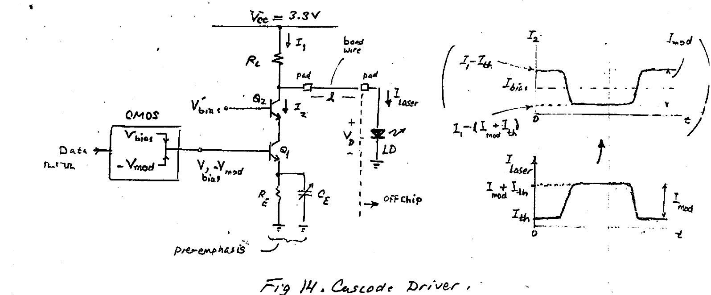

*Fig 14. Cascode Driver.*

When LD = ON, $V_D(\text{on}) \approx$ constant $\Rightarrow I_1 \approx$ const:

$$I_1 \approx \frac{V_{CC} - V_D(\text{on})}{R_L}$$

With $I_{laser}$ as shown above, we can find the required $I_2$:

$$I_2 = I_1 - I_{laser}$$

This requires an inverted input Data (see $-V_{mod}$).

**Advantages:**
- 50% reduction in power consumption (compared to differential).
- Hi-speed (SiGe) HBTs!
- Adjustable "pre-emphasis" $R_E$–$C_E$ for BW-extension.
