# Lecture 18 — InGaAsP Lasers

## InGaAsP Laser Diodes

The importance of lasers based on **InGaAsP** stems from their emission range of wavelengths **(1100–1650) nm**, which covers the widely-used **1310 nm** & **1550 nm** bands of Datacom and Telecom.

The four-element **III–V** semiconductor alloy **InGaAsP** is a versatile laser material, typically grown on an **InP substrate**.\* The chemical formula for this quaternary alloy can be expressed as

```math
\text{In}_{x}\text{Ga}_{1-x}\text{As}_{y}\text{P}_{1-y}
```

where $`x`$ & $`y`$ are composition parameters in the range $`(0,1)`$ — i.e. $`0 \le x \le 1`$ and $`0 \le y \le 1`$. In particular, the composition $`(x = 0.53,\ y = 1)`$, leading to $`\text{In}_{0.53}\text{Ga}_{0.47}\text{As}`$, is of importance as it leads to high-quality lasers, thanks to the **"lattice constant"** match between thin films of InGaAs and the InP substrate.

For this reason, $`\text{In}_{0.53}\text{Ga}_{0.47}\text{As}`$ is often referred to as **"standard"** InGaAs. (It is an alloy of two compounds: $`\text{In}_{x}\text{Ga}_{x}\text{As} = (\text{InAs})_{x}\,(\text{GaAs})_{1-x}`$.)

> \* Here, InP — with its larger bandgap (1.35 eV) — provides confinement of generated light as well as charge carriers to the cavity (undoped InGaAs).

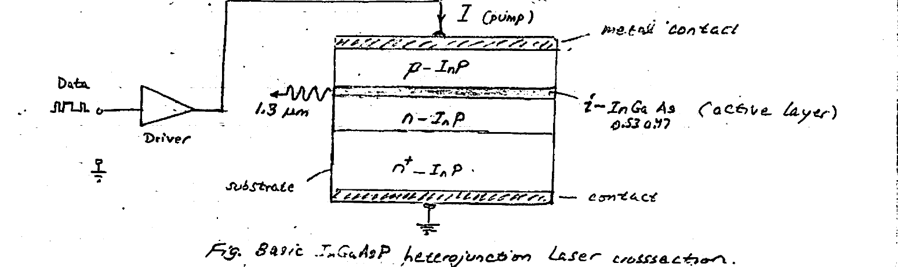

*Fig 1. Basic InGaAsP heterojunction laser crossection.*

In the Figure above a typical InGaAsP laser diode is shown being **OOK driven** by data. The spectral distribution of a 1.3 μm laser is shown below.

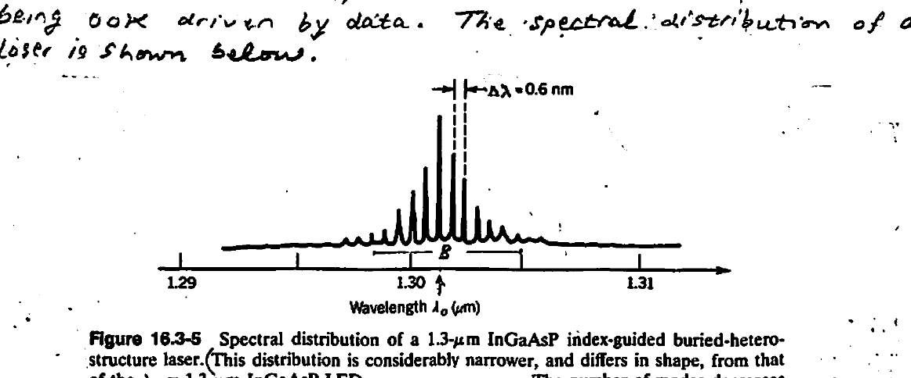

*Figure 16.3-5. Spectral distribution of a 1.3-μm InGaAsP index-guided buried-heterostructure laser. (This distribution is considerably narrower, and differs in shape, from that of the $`\lambda_o = 1.3\,\mu m`$ InGaAsP LED. The number of modes decreases as the injection current increases; the mode closest to the gain maximum increases in power while the side peaks saturate.) (Adapted from R. J. Nelson, R. B. Wilson, P. D. Wright, P. A. Barnes, and N. K. Dutta, CW Electrooptical Properties of InGaAsP Buried-Heterostructure Lasers, IEEE Journal of Quantum Electronics, vol. QE-17, pp. 202–207, © 1981 IEEE.)*

---

## Example — Number of Longitudinal Modes in an InGaAsP Laser

*(For the laser of Fig 1 / Fig 2 on the previous page.)*

**Cavity:**

```math
\begin{cases} L = 400\ \mu m \\ n_{\text{eff}} = 3.5 \quad (\text{InGaAsP}) \\ \lambda_o = 1.301\ \mu m \end{cases}
```

**Calculate:**

1. Mode-spacing ($`\Delta f`$ & $`\Delta \lambda`$)
2. Number of modes ($`N`$) possible inside $`B = 1.2\ \text{THz}`$
3. $`L = ?`$ for $`N = 1`$

**Solution:**

```math
m\,\frac{\lambda_m / 2}{n_{\text{eff}}} = L \quad\rightarrow\quad \lambda_m = \frac{2\,n_{\text{eff}}\,L}{m}
```

```math
f_m = \frac{c}{\lambda_m} = \frac{m\,c}{2\,n_{\text{eff}}\,L} \qquad \left( f_{m+1} = (m+1)\frac{c}{2\,n_{\text{eff}}\,L} \right)
```

```math
\Delta f = f_{m+1} - f_m = \frac{c}{2\,n_{\text{eff}}\,L} = 107.1\ \text{GHz}
```

```math
\frac{\Delta \lambda}{\lambda} = -\frac{\Delta f}{f} \qquad \left( f = \frac{c}{\lambda_o} = 230.6\ \text{THz} \right)
```

```math
\Delta \lambda = \lambda\,\frac{\Delta f}{f} = 1301 \cdot \frac{107.1\ \text{GHz}}{230.6\ \text{THz}} = 0.604\ \text{nm}
```

```math
N - 1 = \frac{B}{\Delta f} = \frac{1.2\ \text{THz}}{107.1\ \text{GHz}} = 11 \quad\rightarrow\quad N \approx 12
```

**For $`N = 1`$:** make $`\Delta f = B`$

```math
\Delta f = \frac{c}{2\,n_{\text{eff}}\,L} = 1.2\ \text{THz}
```

```math
\therefore\ L = \frac{c / (2\,n_{\text{eff}})}{1.2\ \text{THz}} = 36\ \mu m
```

---

## Laser Performance Parameters

- $`\lambda_o\ (\mu m)`$ = lasing wavelength $`\left( \lambda_o = \dfrac{1.24}{E_g\,(\text{eV})} \right)`$
- $`I_{th}\ (\text{mA})`$ = threshold pump current for stimulated emission (@ $`\lambda_o`$)
- $`P_{out}\ (\text{mW})`$ = CW output power
- $`\text{OSNR}`$ = Optical Signal-to-Noise Ratio. Here the noise is due to spontaneous emission.
- $`dI_{th}/dT`$ = Temperature coefficient of $`I_{th}`$. (Usually $`> 0`$.)

---

## DC-Interfaced MZI Modulator

Consider the utilization of a pair of 50–50 directional couplers $`\text{DC}_1`$ & $`\text{DC}_2`$ to interface the MZI phase shifter as shown. The directional couplers replace the **Y-branch** input splitter and output combiner normally used.

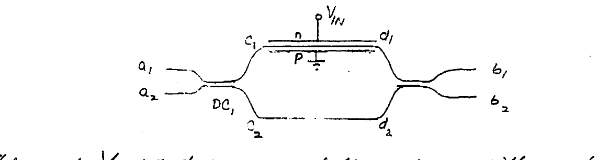

*Fig 3. DC-interfaced MZI modulator: directional couplers $`\text{DC}_1`$, $`\text{DC}_2`$ with phase shifter ($`V_{IN}`$) between equal-length arms.*

The input $`V_{IN}`$ introduces a relative phase difference ($`\Delta\phi`$) between the two equal-length ($`L`$) arms of the MZI (center).

We seek to determine the outputs $`b_1, b_2`$ in terms of inputs $`a_1, a_2`$.

**$`\text{DC}_2`$ & $`\text{DC}_1`$:**

```math
(1)\quad \begin{pmatrix} b_1 \\ b_2 \end{pmatrix} = \frac{e^{-j\beta\ell}}{\sqrt{2}} \begin{pmatrix} 1 & -j \\ -j & 1 \end{pmatrix} \begin{pmatrix} d_1 \\ d_2 \end{pmatrix} \qquad (2)\quad \begin{pmatrix} c_1 \\ c_2 \end{pmatrix} = \frac{e^{-j\beta\ell}}{\sqrt{2}} \begin{pmatrix} 1 & -j \\ -j & 1 \end{pmatrix} \begin{pmatrix} a_1 \\ a_2 \end{pmatrix}
```

**Phase shifter:**

```math
(3)\quad \begin{pmatrix} d_1 \\ d_2 \end{pmatrix} = \begin{pmatrix} e^{-j\phi_1} & 0 \\ 0 & e^{-j\phi_2} \end{pmatrix} \begin{pmatrix} c_1 \\ c_2 \end{pmatrix}
```

**Using (1) & (2):**

```math
\begin{pmatrix} b_1 \\ b_2 \end{pmatrix} = \left(\frac{e^{-j\beta\ell}}{\sqrt{2}}\right)^{2} \begin{pmatrix} 1 & -j \\ -j & 1 \end{pmatrix} \begin{pmatrix} e^{-j\phi_1} & 0 \\ 0 & e^{-j\phi_2} \end{pmatrix} \begin{pmatrix} 1 & -j \\ -j & 1 \end{pmatrix} \begin{pmatrix} a_1 \\ a_2 \end{pmatrix}
```

Define $`[H]`$ as the system **Transfer Function** matrix, $`\begin{pmatrix} b_1 \\ b_2 \end{pmatrix} = [H] \begin{pmatrix} a_1 \\ a_2 \end{pmatrix}`$, where $`[H] = \begin{pmatrix} H_{11} & H_{12} \\ H_{21} & H_{22} \end{pmatrix}`$.

```math
H_{11} = \frac{e^{-j2\beta\ell}}{2}\left(e^{-j\phi_1} - e^{-j\phi_2}\right) \qquad H_{12} = -\frac{j}{2}\,e^{-j2\beta\ell}\left(e^{-j\phi_1} + e^{-j\phi_2}\right)
```

```math
H_{21} = -\frac{j}{2}\,e^{-j2\beta\ell}\left(e^{-j\phi_1} + e^{-j\phi_2}\right) \qquad H_{22} = -\frac{e^{-j2\beta\ell}}{2}\left(e^{-j\phi_1} - e^{-j\phi_2}\right)
```

---

## Single-IN Operation

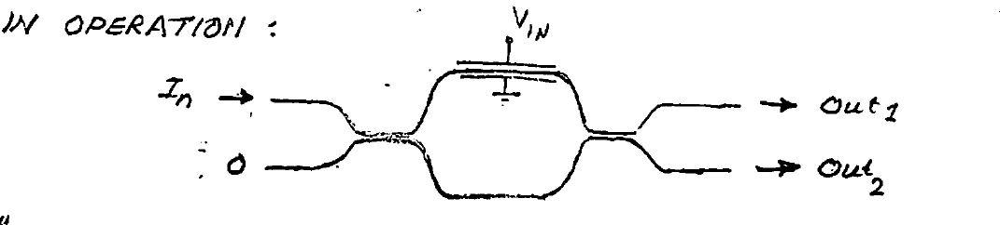

*Fig 4. Single-in operation: input $`I_n`$ on the top arm, the other input grounded ($`0`$); outputs $`\text{Out}_1`$, $`\text{Out}_2`$; modulation via $`V_{IN}`$.*

### "Cross"

```math
\frac{\text{Out}_2}{I_n} = \frac{b_2}{a_1} = H_{21} = -\frac{j}{2}\,e^{-j2\beta\ell}\left(e^{-j\phi_1} + e^{-j\phi_2}\right)
```

```math
\frac{P_{out_2}}{P_{in}} = |H_{21}|^2 = \frac{1}{2}\left(e^{-j\phi_1} + e^{-j\phi_2}\right)\left(\ \cdots\ \right)^{*} = \cdots
```

```math
\therefore\ \frac{P_{out_2}}{P_{in}} = \frac{1}{2}\left(1 + \cos\Delta\phi\right) \qquad \Delta\phi = \phi_1 - \phi_2 = \pi\,\frac{V_{IN}}{V_{\pi}}
```

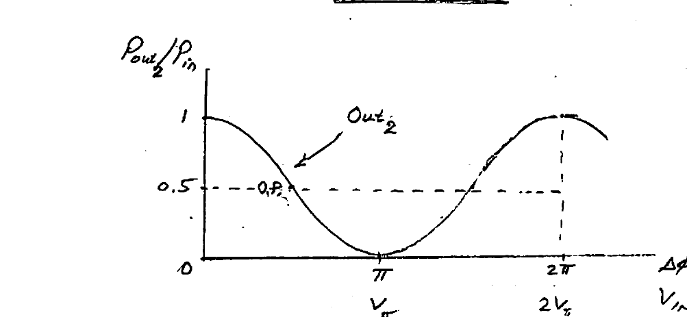

*Fig 5. $`P_{out_2}/P_{in}`$ vs. $`\Delta\phi`$ (i.e. $`V_{IN}`$). $`\text{Out}_2`$ is maximum (= 1) at $`\Delta\phi = 0,\ 2\pi`$ and zero at $`\Delta\phi = \pi`$ ($`V_{IN} = V_{\pi}`$). Operating point (O.P.) at 0.5.*

**Applications:** 1) Tuneable BSF · 2) OOK modulator (inverting)

### "Direct"

```math
\frac{\text{Out}_1}{I_n} = \frac{b_1}{a_1} = H_{11} = \frac{e^{-j2\beta\ell}}{2}\left(e^{-j\phi_1} - e^{-j\phi_2}\right)
```

```math
\frac{P_{out_1}}{P_{in}} = |H_{11}|^2 = \frac{1}{2}\left(e^{-j\phi_1} - e^{-j\phi_2}\right)\left(\ \cdots\ \right)^{*} = \cdots
```

```math
\therefore\ \frac{P_{out_1}}{P_{in}} = \frac{1}{2}\left(1 - \cos\Delta\phi\right) \qquad \Delta\phi = \pi\,\frac{V_{IN}}{V_{\pi}}
```

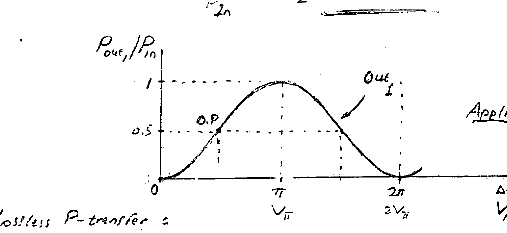

*Fig 6. $`P_{out_1}/P_{in}`$ vs. $`\Delta\phi`$ (i.e. $`V_{IN}`$). $`\text{Out}_1`$ is zero at $`\Delta\phi = 0,\ 2\pi`$ and maximum (= 1) at $`\Delta\phi = \pi`$ ($`V_{IN} = V_{\pi}`$). Operating point (O.P.) at 0.5.*

**Application:** 1) OOK modulator (see O.P.) · 2. Tuneable BPF

**Lossless P-transfer:** Note conservation of power:

```math
\frac{P_{out_1}}{P_{in}} + \frac{P_{out_2}}{P_{in}} = 1 \quad\rightarrow\quad P_{out_1} + P_{out_2} = P_{in}
```

---

## Optical Amplifiers

Optical amplifiers amplify information-carrying light signals **directly** — w/o the need for a complex O–E conversion followed by E–O conversion.\*

As we shall see, optical amplifiers, like lasers, are also based on **"stimulated emission"**. Depending on the pumping means for achieving **"population inversion"**, they are categorized as:

- **I) electrically pumped**
- **II) optically pumped**

- **Electrically-pumped** optical amplifiers are known as **"Semiconductor Optical Amplifier" (SOA)**. There exist two major types:
  1. **Fabry–Perot Laser Amplifier (FPLA)**
  2. **Travelling-Wave Semiconductor Laser Amplifier (TWSLA)**
- **Optically-pumped** optical amplifiers are best exemplified by the popular **EDFA (Erbium-Doped Fiber Amplifier)**, which has wide use in optical-fiber-based systems.

> \* A weak optical signal requiring boosting is (O–E) converted to electrical form with the aid of a photodiode. The electrical data signal thus recovered is then amplified by a laser driver for an (E–O) conversion back into modulated light with the same wavelength as the original signal.

---

## Semiconductor Optical Amplifier (SOA)

Similar to a laser diode, an SOA employs a semiconductor **gain (amplifying) medium**. However, an SOA operates **just below threshold** ($`I \lesssim I_{th}`$) to avoid laser oscillations, but takes advantage of amplification (by stimulated emission) of a weak optical information signal requiring additional amplification. The close-to-threshold operation is depicted in the Figure below.

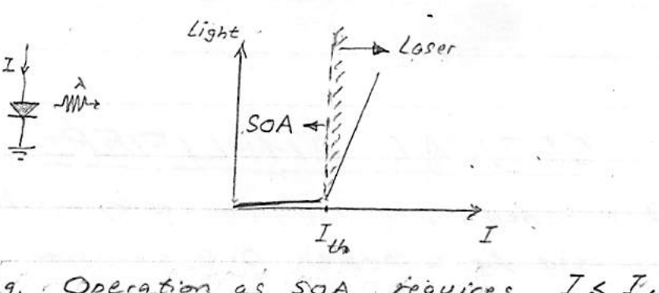

*Fig 7. Operation as an SOA requires $`I \lesssim I_{th}`$ (below the lasing threshold).*

The principle of operation of an SOA is depicted in the Figure below. Here, with the aid of optical lenses, the optical information signal arriving through an input fiber enters the **"gain medium"** of the SOA at left. The same optical signal, following amplification by the gain medium, exits at right and is properly coupled into the output fiber.

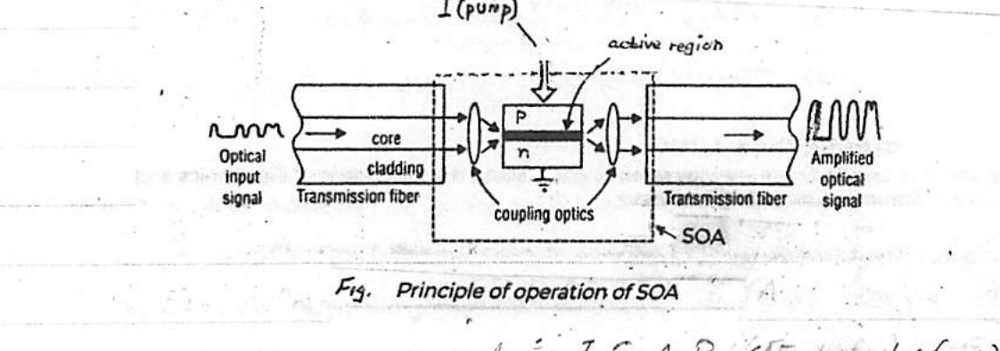

*Fig 8. Principle of operation of SOA.*

The SOA gain material is **InGaAsP** (Figure below). Recall this III–V semiconductor alloy is also used for making lasers that emit the **1310 & 1550 nm** wavelengths employed in fiber communications systems for Datacom & Telecom.

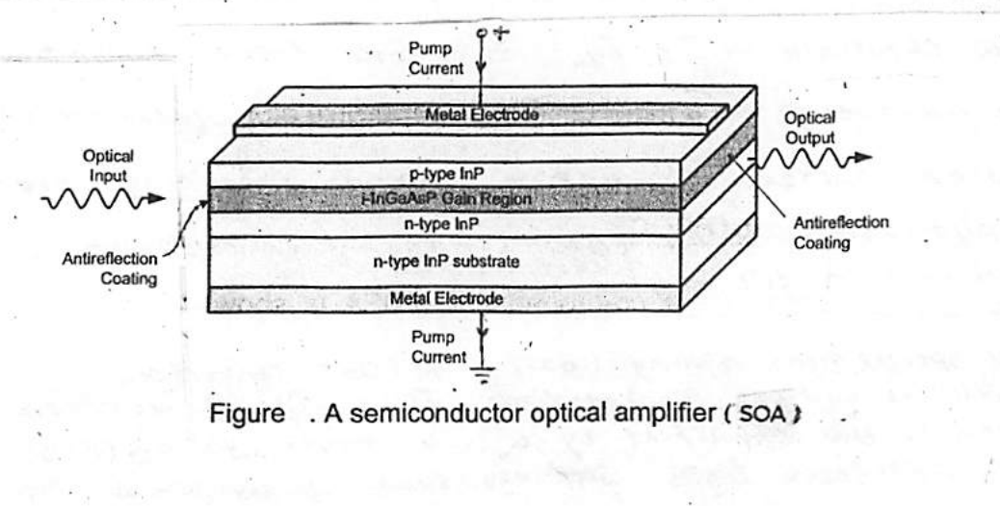

*Fig 9. A semiconductor optical amplifier (SOA): p-InP / i-InGaAsP gain region / n-InP on an n-type InP substrate, with metal electrodes and antireflection coatings.*

The optical gain depends on the following factors:

- Wavelength of the optical input signal
- Characteristics of the gain (amplifying) medium
- The intensity of light beam within the active region

### Types of SOA

#### Fabry–Perot Laser Amplifier (FPLA)

This type of SOA has the exact same configuration as the **Fabry–Perot laser**, as shown below.

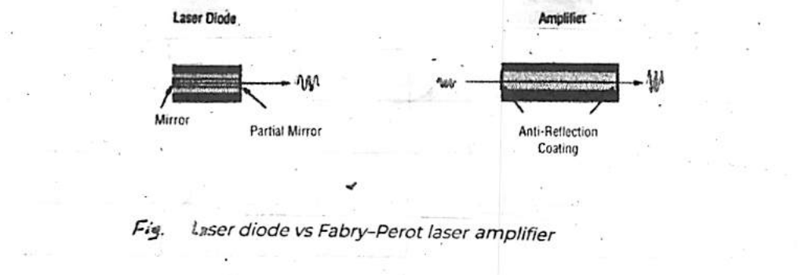

*Fig 10. Laser diode vs. Fabry–Perot laser amplifier. The amplifier replaces the partial mirror facets with anti-reflection coatings.*

To ensure absence of oscillations, the SOA is made to have very low reflectance ($`\sim 10^{-4}`$) at its two **"facets"** — for e.g. through use of anti-reflection coating. The low reflectance ensures losses exceeding gain in the active medium, i.e.:

```math
G_{+}\,G_{-} < \frac{1}{\sqrt{R_1 R_2}}
```

The principle of operation of an FPLA is depicted in the Figure below. It is similar to a **+FB electronic amplifier** (see Appendix-0).

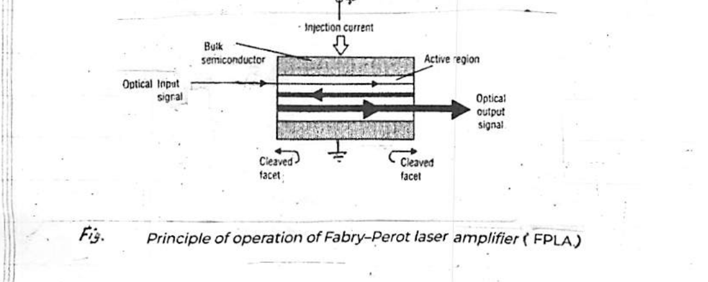

*Fig 11. Principle of operation of Fabry–Perot laser amplifier (FPLA).*

#### Travelling-Wave Semiconductor Laser Amplifier (TWSLA)

Here the input optical information signal is amplified by a **single pass** through the active region. No optical feedback is being employed, as evidenced by the absence of end mirrors. The principle of operation of a TWSLA is depicted in the Figure below.

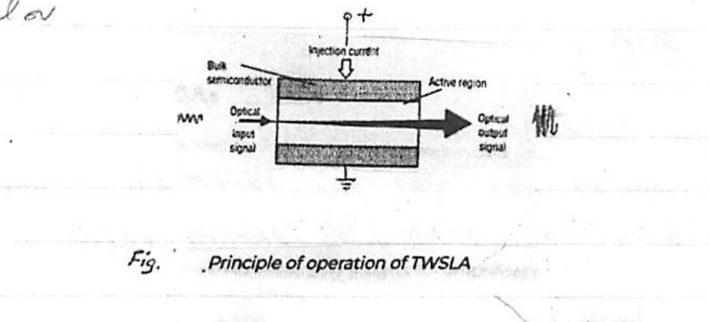

*Fig 12. Principle of operation of TWSLA.*

To keep the signal **"clean"**, cavity resonance must be suppressed by ensuring very low reflectance ($`\sim 10^{-4}`$) at the ends of the device. A common technique for achieving this is through use of **antireflection (AR) coating**. This is shown in the Figure below.

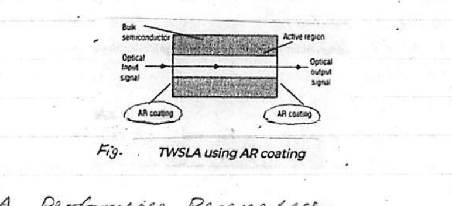

*Fig 13. TWSLA using AR coating.*

### SOA Performance Parameters

- **$`P_{out}`$:** output power ($`\sim 5\text{–}10\ \text{mW}`$)
- **gain:** power gain of SOA (as function of input power)
- **Bandwidth:** optical bandwidth is determined by the gain bandwidth
- **Polarization:** input light polarization affects SOA performance
- **Noise:** noise generated in SOAs has its origin in the (random) spontaneous emission

---

## Erbium-Doped Fiber Amplifier (EDFA)

The **Erbium-Doped Fiber Amplifier (EDFA)** is an optical amplifier used in the **C-band** and **L-band**, where the loss of telecom optical fibers becomes lowest in the entire optical telecommunication wavelength bands. Invented in 1987 [1], an EDFA is now most commonly used to compensate the loss of an optical fiber in long-distance optical communication. Another important characteristic is that an EDFA can amplify **multiple** optical signals simultaneously, and thus can be easily combined with **WDM** technology.

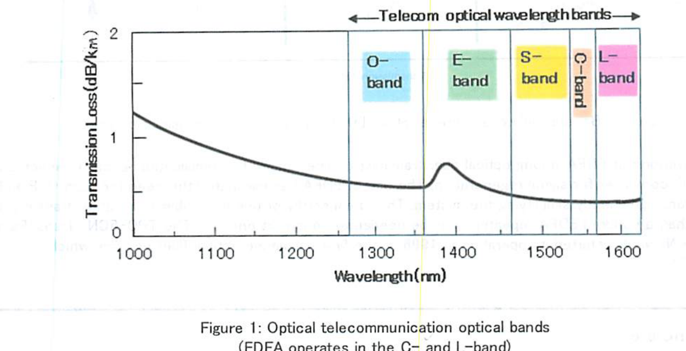

*Figure 1. Optical telecommunication optical bands (EDFA operates in the C- and L-band).*

EDFAs are used as a **booster**, **inline**, and **pre-amplifier** in an optical transmission line, as schematically shown in Figure 2. The booster amplifier is placed just after the transmitter to increase the optical power launched to the transmission line. The inline amplifiers are placed in the transmission line, compensating the attenuation induced by the optical fiber. The pre-amplifier is placed just before the receiver, such that sufficient optical power is launched to the receiver. A typical distance between each of the EDFAs is several tens of kilometers.

> Note: see Appendix-1.

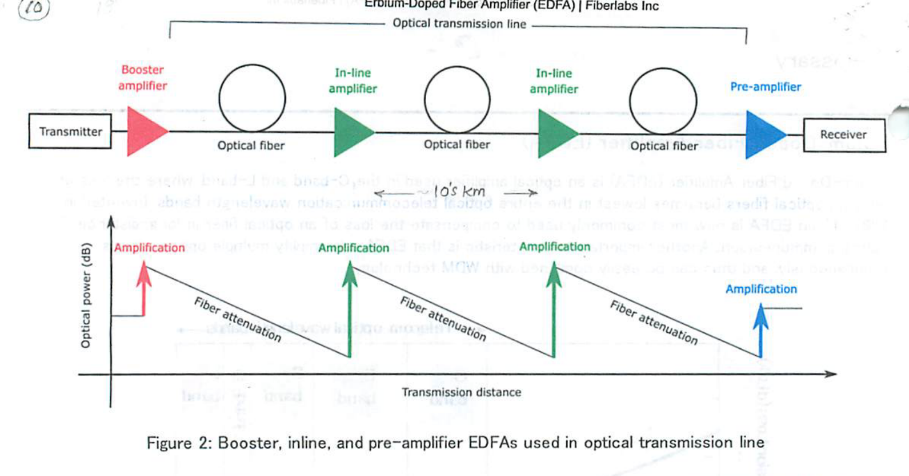

*Figure 2. Booster, inline, and pre-amplifier EDFAs used in an optical transmission line.*

Before the invention of EDFA, a long optical fiber transmission line required a complicated optical-to-electrical (O–E) and E–O converter for signal regeneration. The use of EDFA has eliminated the need for such O–E and E–O conversion, significantly simplifying the system. This is especially of use in a submarine optical transmission, where more than a hundred EDFA repeaters may be needed to construct one link.\* The **TPC-5CN** (Trans-Pacific Cable 5 Cable Network), started its operation in 1996, is the first submarine optical fiber network which employed EDFA.

> \* $`\sim 1000\text{'s km}`$.

### Working principle

Figure 3 illustrates a simplified energy diagram of Er, showing how amplification takes place at 1550 nm. Two typical wavelengths to pump an EDFA are 980 or 1480 nm (from a Laser Diode, LD).

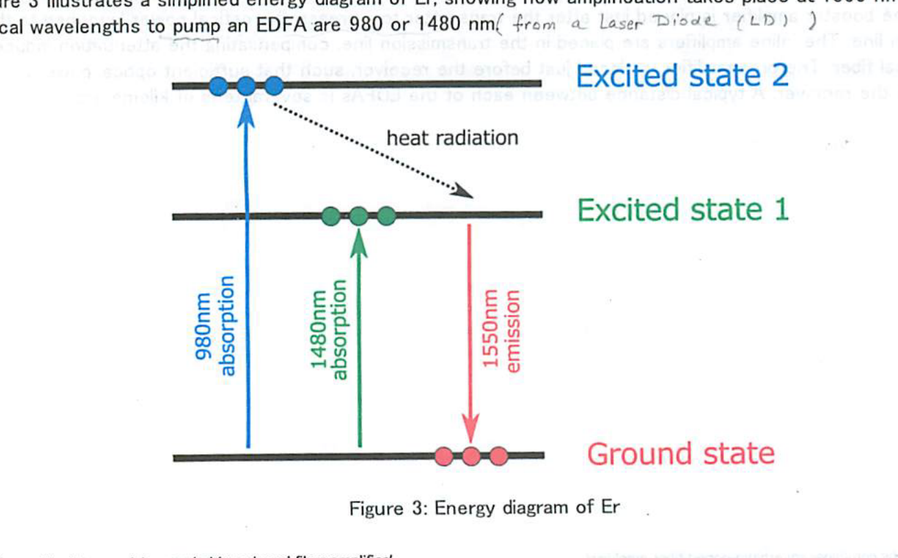

*Figure 3. Energy diagram of Er.*

When an EDFA is pumped at **1480 nm**, the Er ion doped in the fiber absorbs the pump light and is excited to an excited state (Excited state 1 in Figure 3). When sufficient pump power is launched to the fiber, population inversion is created between the ground state and Excited state 1, and amplification by **stimulated emission** takes place at around 1550 nm. When an EDFA is pumped at **980 nm**, the Er ion absorbs the pump light and is excited to another excited state (Excited state 2 in Figure 3). The lifetime of the Excited state 2 is relatively short, and as a result, the Er ion is immediately relaxed to the Excited state 1 by radiating heat (i.e. no photon emission). This relaxation process creates a **population inversion** between the ground level and Excited state 1, and amplification takes place at around 1550 nm.

Since the first demonstration of a diode-pumped EDFA in 1989 [2], intensive effort has been made to make the pump LD highly reliable. Now high-power pump laser diodes at 980 nm or 1480 nm are both commercially available, and most EDFAs are pumped by laser diodes due to the compactness and robustness.

### Internal configuration

Figure 4 shows one common configuration of EDFA. The input signal is combined with the pump light by a **WDM coupler** and launched to the EDF. The pump light launched to the EDF creates population inversion and the input signal is amplified by stimulated emission. **Isolators** are placed both at the input and output, in order to stabilize signal amplification by eliminating unwanted back reflection from the output port, as well as to prevent the amplifier from operating as a laser. In this common configuration, the wavelength of the pump LD is locked close to the peak absorption wavelength of erbium (by an external fiber Bragg grating); the wavelength range is normally between 974 nm to 980 nm.

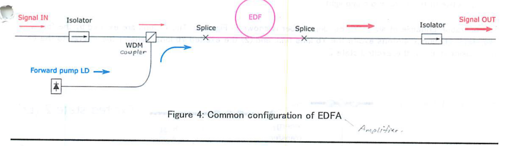

*Figure 4. Common configuration of EDFA.*

### Key optical characteristics

1. **Saturated output power (or simply maximum output power):** the maximum output power from an amplifier when sufficient signal input power (typically around 0 dBm or higher) is launched to the amplifier. A booster amplifier typically operates under this condition, and thus saturated output power is an important characteristic for a booster amplifier.
2. **Small-signal gain:** the gain in an amplifier when the signal power launched to the amplifier is very small (typically around −30 dBm). A pre-amplifier typically operates under this condition, and thus small-signal gain is an important characteristic for a pre-amplifier.
3. **Noise figure:** amplification by an EDFA adds some noise to the original signal — mainly due to amplified spontaneous emission (ASE) from the EDF — and thus decreases the signal-to-noise ratio (S/N ratio). Noise figure (NF) of an optical amplifier is a measure of degradation in the S/N ratio, expressed in dB, and lower NF indicates lower noise characteristic (theoretical minimum 3 dB). In general, ASE grows fast when the signal input power is low, thus NF is an important characteristic for a pre-amplifier (i.e. small input power). On the other hand, ASE is well suppressed when the signal input power is high, and the NF value measured at a higher input power has little importance. A typical NF value of commercial EDFA at a small signal input power is within the range of 5 to 7 dB.
4. **Gain flatness:** when an EDFA is used for wavelength-division multiplexing (WDM) transmission, it would be ideal that all the WDM channels have equal gain. In reality, however, each of the channels has a different gain value and the variation is referred to as the gain flatness. Gain flatness is particularly important when many EDFAs are concatenated in an optical transmission line (e.g. submarine optical transmission), as the gain variation is accumulated in the EDFA chains and results in large signal power differences between the WDM channels. Gain flatness can be improved by, for example, modification of glass composition of the EDF (higher aluminium concentration) or the incorporation of an external gain-flattening optical filter.

### References

1. R. J. Mears et al., "Low-noise erbium-doped fibre amplifier operating at 1.54 μm," *Electronics Letters* **23**(19), 1026–1028 (1987).
2. M. Nakazawa, Y. Kimura, and K. Suzuki, "Efficient Er³⁺-doped optical fiber amplifier pumped by a 1.48 μm InGaAsP laser diode," *Appl. Phys. Lett.* **54**(4), 295–297 (1989).
3. J. D. Minelly et al., "Diode-array pumping of Er³⁺/Yb³⁺ Co-doped fiber lasers and amplifiers," *IEEE Photonics Technology Letters* **5**(3), 301–303 (1993).

---

## Appendix 0 — Regenerative (+FB) Amplification

The amplification capability of an (electronic) amplifier can be increased markedly through the use of **positive feedback** (see Figure below).

As we shall see, the boost in gain is achieved at the cost of amplifier **bandwidth**.

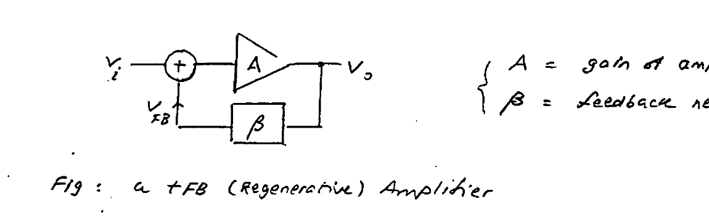

*Fig 18. A +FB (Regenerative) amplifier. $`A`$ = gain of amplifier, $`\beta`$ = feedback network.*

**Analysis:** $`H(j\omega) = V_o / V_i`$ — Closed-loop (C.L.) gain.

```math
(1)\quad V_o = A\,(V_i + V_{FB}) \qquad (2)\quad V_{FB} = \beta\,V_o
```

$`(2) \rightarrow (1):\quad V_o = A\,(V_i + \beta\,V_o)`$

**Solving for $`H`$:**

```math
H = \frac{V_o}{V_i} = \frac{A}{1 - A\beta} \qquad \begin{cases} A\beta < 1 \ \cdots\ H > A \quad (\text{amplifier}) \\ A\beta = 1 \ \cdots\ H \rightarrow \infty \quad (\text{oscillator}) \end{cases}
```

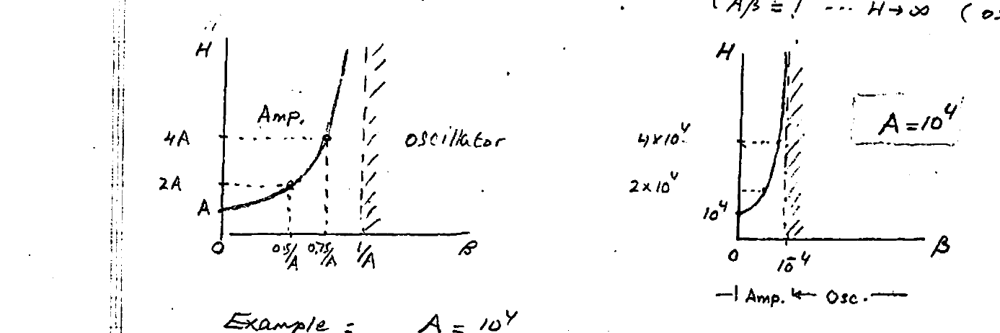

*Fig 19. Closed-loop gain $`H`$ vs. feedback factor $`\beta`$, showing the amplifier and oscillator regions. (Left) general behaviour; (right) example with $`A = 10^4`$, where the amplifier/oscillator boundary occurs at $`\beta = 10^{-4}`$.*

**Example:** $`A = 10^4`$

```math
\begin{cases} \text{Oscillator:} & A\beta \ge 1 \ \cdots\ \beta \ge 10^{-4} \\ \text{Amplifier:} & A\beta < 1 \ \cdots\ \beta < 10^{-4} \end{cases}
```

C.L. amplification **exceeding** the amplifier gain is possible by regenerative FB.

### Bandwidth Narrowing

```math
A(j\omega) = \frac{A_o}{1 + j\frac{\omega}{\omega_o}} \qquad \begin{cases} \omega_o = \text{3-dB BW} \\ A_o = \text{DC gain} \end{cases}
```

```math
\therefore\ H = \frac{A}{1 - A\beta} = \frac{A_o}{1 + j\frac{\omega}{\omega_o} - A_o\beta} = \frac{H_o}{1 + j\frac{\omega}{\Omega_o}} \cdots
```

- **C.L. 3-dB BW:** $`\quad \Omega_o = \omega_o\,(1 - A_o\beta) < \omega_o`$
- **C.L. DC Gain:** $`\quad H_o = \dfrac{A_o}{1 - A_o\beta}`$

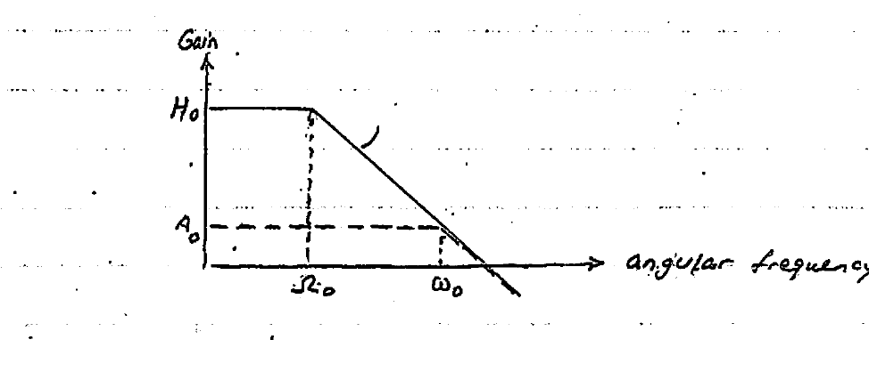

*Fig 20. Closed-loop gain vs. angular frequency. The DC gain rises from $`A_o`$ to $`H_o`$ while the bandwidth narrows from $`\omega_o`$ to $`\Omega_o`$.*

**Properties:**

1. **Gain × BW conservation:** $`\quad H_o\,\Omega_o = A_o\,\omega_o`$
2. **Gain–BW Tradeoff:** $`\quad H_o\,\Omega_o = \text{constant}`$

---

## Appendix 1 — Introduction: Optical Amplifier

With the rapid development of the optic communication networks, longer transmission lengths are required. Optical amplifier can satisfy the requirements of optical communication networks. An optical amplifier is a device that amplifies an optical signal directly, without the need to first convert it to an electrical signal. An optical amplifier may be considered as a laser without an optical cavity, or one in which feedback from the cavity is suppressed. This post is going to help you get a better understanding of optical amplifier.

### Working Principles of Optical Amplifier

A basic optical communication link contains a transmitter and receiver, with an optical fiber cable connecting them. Although signals transmitting in optical fiber suffer far less attenuation than in other mediums, such as copper, there is still a limitation about 100 km on the distance the signals can travel before becoming too noisy to be detected.

Optical amplifiers are widely used in fiber optic data links. Figure 1 shows three ways in which optical amplifiers can be used to strengthen the performance of optical data links. A booster amplifier is used to increase the optical output of an optical transmitter just before the signal enters an optical fiber. The optical signal is attenuated as it travels in the optical fiber. An inline amplifier is utilized to restore (regenerate) the optical signal to its original power level. An optical pre-amplifier is operated at the end of the optical fiber link in order to increase the sensitivity of an optical receiver.

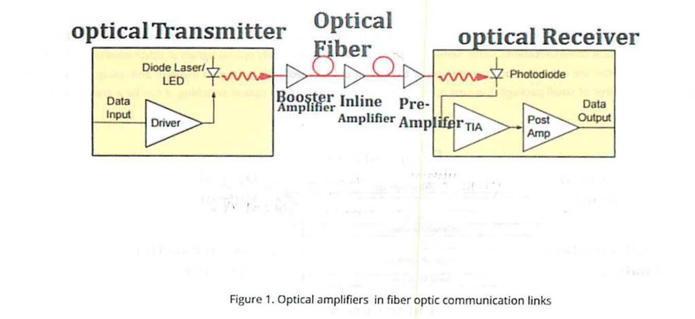

*Figure 1. Optical amplifiers in fiber optic communication links.*

### Features of Optical Amplifier

- Ratio of output power to input power
- Gain as a function of input power
- Range of wavelengths over which the amplifier is effective
- Maximum output power, beyond which no amplification is reached
- Undesired signal due to physical processing in amplifier
