# Lecture 19 — WDM Lasers

**EECE 7398 — Analysis & Design of Photonic Integrated Circuits (PICs)** · Northeastern University, Dept. of Electrical & Computer Engineering · Spring 2023

**Laser Sources for WDM**

---

## WDM Transmitters

The multiple wavelengths in a WDM system may be implemented by an array of lasers of the appropriate wavelengths followed by an array of an equal number of modulators. To obtain the desired WDM signal, a **λ-Multiplexer** is employed as shown in Fig 1.

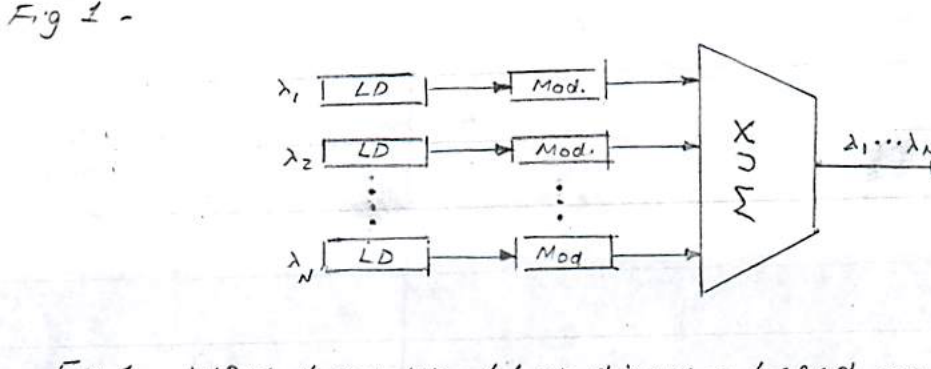

*Fig 1. WDM transmitter block diagram based on arrays of laser diodes & modulators multiplexed into a WDM channel.*

The solution depicted in Fig 1 is readily implemented for a small number of wavelengths. However, its scaling to a higher number of channels is rather daunting and impractical.

A more practical solution is based on a single **"multi-λ" laser** (aka **comb laser**), which generates an array of equally-spaced wavelengths capable of matching the **ITU grid** of WDM.

By using microrings tuned to different λ's, a **Microring Modulator Bank** individually modulates each of the λ's generated by the comb laser with its separate data stream (Fig 2). At the receiver end a **Ring Filter Bank** implements a receiver array in which photodetectors driven by the individual rings convert the modulated light beams into data.

Noteworthy is the integration with the PIC function of **EIC functions** in the form of **CMOS drivers** and **TIAs** in the array of Tx and Rx, respectively.

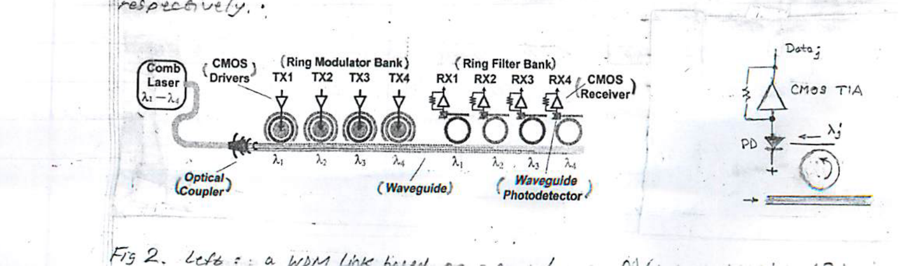

*Fig 2. Left: a WDM link based on a comb laser, a ring modulator bank (TX1–TX4, with CMOS drivers) and a ring filter bank (RX1–RX4, with CMOS receiver), coupled through an optical coupler into a waveguide. Right: detail of a waveguide photodetector (PD) with its CMOS TIA recovering data $j$ for wavelength $\lambda_j$.*

---

## Example — Intel's 4-Microring WDM Tx/Rx (Fig 3)

- Employs a **4-λ Laser**
- **PAM4** modulation @ 112 Gb/s
- CMOS support circuitry on a **separate chip***

> \* Separating the electronic & photonic functions on separate chips provided the ability to optimize the CMOS technology independently of the PIC technology. The two chips form a stack with the PIC at the bottom and the CMOS chip on top. The two ICs are assembled in **3D fashion** with interconnection between the two made with **micro copper pillars**.

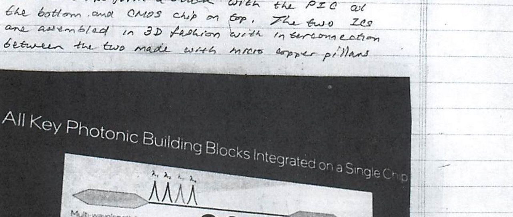

*Fig 3. ×4 Channel (112 Gb/s) WDM Tx/Rx (Intel). "All Key Photonic Building Blocks Integrated on a Single Chip": multi-wavelength laser, silicon microring modulators, optical amplifier, and silicon microring photodetectors.*

### Example — Comb laser vs. multi-laser design of a 400 Gb/s capacity WDM

- **multi-laser:** 10 units modulated each @ 40 Gb/s
- **comb laser:** 40 channels modulated each @ 10 Gb/s

**Advantages of comb laser implementation:** 9 lasers saved; lower-speed CMOS electronics required for drivers/modulators (10 Gb/s vs. 40 Gb/s); lower cost.

---

## Multi-Wavelength Laser

The multi-λ or comb laser, with its large wavelength count, simplicity, spectral match to the ITU WDM grid, low cost, and low power consumption, has clear advantages over the multi-laser approach. Here, we shall examine two comb laser types:

1. **Fabry–Perot LD**
2. **Mode-locked laser**

### Fabry–Perot Comb Laser

The comb laser employs a **"Fabry–Perot" (FP) cavity resonator** containing the semiconductor active-gain material — a **III–V** compound semiconductor such as GaAs, InAs, AlAs, and their alloys. Typically, the laser structure is grown on an $n^+$-GaAs substrate and includes ten layered planes of **InAs/InGaAs Quantum Dots (QD)** in an active gain layer of GaAs/AlGaAs.

The FP resonator cavity is of simple parallel-mirror type with length $L$ of the order of **1 mm (1000 μm)**. Such a cavity can support a large number ($\sim 100$) of closely-spaced wavelengths during lasing action, and is repeated here for convenience (Fig 4).

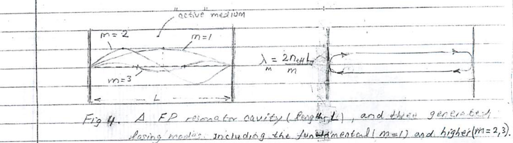

*Fig 4. A FP resonator cavity (length $L$) and the lasing modes it generates, including the fundamental ($m=1$) and higher ($m=2,3$) modes.*

$$\lambda_m = \frac{2\,n_{\text{eff}}\,L}{m}$$

Because of the zero electric-field boundary condition at the two conducting mirror surfaces, a **standing-wave pattern** forms as shown in Fig 4. Here, only the first three modes (wavelengths) $m = 1, 2, 3$ are shown. By fitting an integer ($m$) of half-wavelengths in the cavity ($L$), the corresponding modes' wavelengths are obtained.

The DC current pump driving the LD establishes **population inversion**. During operation, the two mirrors provide **POSITIVE FEEDBACK** consisting of the return of stimulated photons to the active (gain) medium to stimulate more photons. Only wavelengths $\lambda_m$ producing a stable standing-wave pattern are supported by the resonator. Furthermore, due to its distributed nature, the resonator has an infinite number of **resonant longitudinal modes** with frequency spacing:

$$\Delta f = \frac{c}{2\,n_{\text{eff}}\,L} \qquad \left(\text{where } \Delta f = f_{m+1} - f_m\right)$$

It is worth noting that common cavity lengths naturally exhibit λ-spacings similar to the **ITU standard grid**. For example, for semiconducting cavities employing an active (gain) layer of GaAs/AlGaAs with $n_{\text{eff}} \approx 3$, a uniform spacing of $\Delta f \approx 27\ \text{GHz}$ and $\Delta f = 40\ \text{GHz}$ are obtained for cavity lengths of **1.85 mm** and **1.25 mm**, respectively (Fig 5). The figure illustrates that within **3 dB** of the peak, as many as **50 comb channels** are available. Furthermore, the optical power used is $\sim 1\ \text{mW/channel}$. The number of channels obtained is primarily limited by the **gain bandwidth** of the active region of the laser. The **relative-intensity noise (RIN)**, which measures the extent to which optical noise (due to spontaneous emission) contaminates the laser oscillations, is quite low.

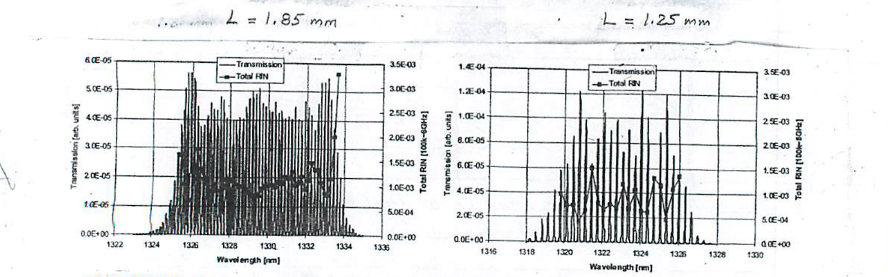

*Fig 5. Spectra and total RIN measurements of nominal 1320 nm comb lasers with channel spacing of 27 GHz (left, $L = 1.85$ mm) and 40 GHz (right, $L = 1.25$ mm). In both cases $\Delta f = \dfrac{c}{2 n_{\text{eff}} L}$.*

---

## Example — A High Channel Count Single-Laser WDM Link

The feasibility of an extreme **200-channel** WDM system based on a single comb laser is shown in Fig 6. The potential for very-high capacity can be readily realized: at 10 Gb/s **OOK** modulation such a link can reach a capacity of **2 Tb/s** ($= 200 \times 10\ \text{Gb/s}$).

This system requires ×200 modulators/drivers, which entails integration of more of the same components — a capability at which semiconductor fabrication processes excel.

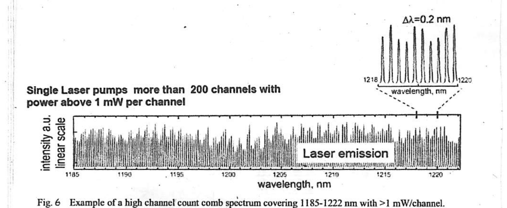

*Fig 6. Example of a high channel count comb spectrum covering 1185–1222 nm with >1 mW/channel. A single laser pumps more than 200 channels with power above 1 mW per channel ($\Delta\lambda = 0.2$ nm).*

---

## Quantum Dots & QD Lasers

In solid-state materials, a **quantum dot (QD)** is a nano-scale (crystal) inclusion of a narrow-bandgap semiconductor within a wider-bandgap material matrix. A simple example is **InAs/GaAs**, which is based on QD's of InAs (0.36 eV bandgap) grown on a background GaAs (1.42 eV bandgap). A useful structure (for lasers) is multiple layers of InAs embedded in a surrounding GaAs matrix. When InAs is used as the gain "layer" in a laser, the surrounding lower-index-of-refraction GaAs acts as a **cladding** to promote optical confinement to the gain layer. (Recall total internal reflection.) Note that here, thanks to the higher bandgap of the GaAs, **e/h charge-carrier confinement** is achieved as well.

An example of a QD III–V laser based on the above materials is given in Fig 7. Here, the QD layers of InAs serve as the active (amplifying) medium.

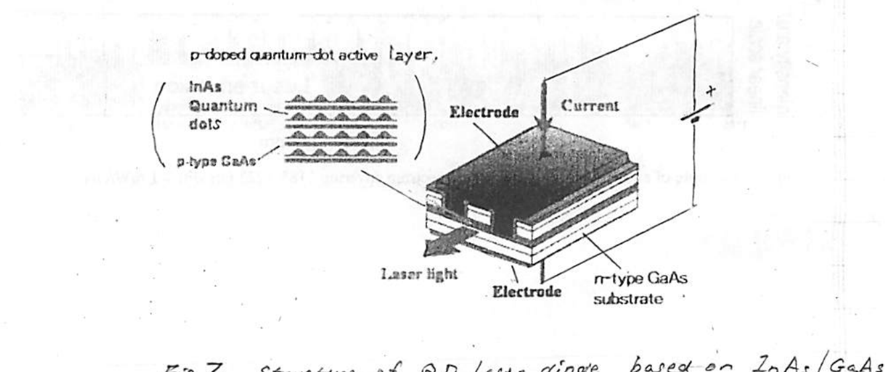

*Fig 7. Structure of a QD laser diode based on InAs/GaAs. The p-doped quantum-dot active layer contains InAs quantum dots on p-type GaAs; current is injected through electrodes, and laser light is emitted from the edge. The substrate is n-type GaAs.*

Thanks to unique physical properties, QD's give lasers high-performance properties surpassing other types of lasers. These include: low **threshold** ($I_{th}$) & power consumption, **temperature stability** of performance, and **low cost**.

The unique properties of QD's stem mainly from their nano-scale dimensions. **Size** plays a crucial role in determining the energy levels (states) that exist in a crystal. Thus, by varying the nano-meter size of a semiconductor QD crystal it can be made to emit light at various wavelengths covering the **visible** and **IR**.

### Density of States (DOS)

The dependence of the energy-distribution of states or levels in a solid is governed by the **density of states (DOS)**. The DOS measures the number of states available (for e's to occupy) vs. energy, which ultimately sets the electronic & optical properties of the material.

A drastic reduction in one or more dimension of a semiconductor crystal has a remarkable effect on the DOS as a function of energy $E$ (Fig 8).

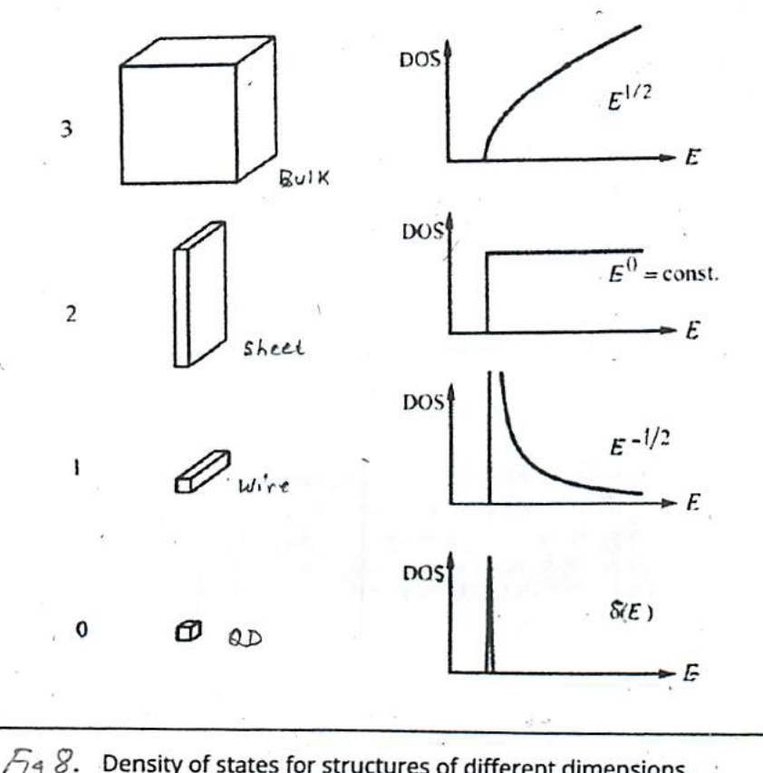

*Fig 8. Density of states for structures of different dimensions.*

| Dimensions | Structure | DOS vs. energy $E$ |
| --- | --- | --- |
| 3 | Bulk | $\text{DOS} \propto E^{1/2}$ |
| 2 | Sheet | $\text{DOS} = E^{0} = \text{const.}$ |
| 1 | Wire | $\text{DOS} \propto E^{-1/2}$ |
| 0 | QD | $\delta(E)$ (discrete levels) |

A quantum dot (QD) can be viewed as a **0-D crystal**. The DOS for a QD changes drastically from the $\sqrt{E}$ dependence for a macroscopic crystal (bulk) to a set of **discrete levels** or delta functions (one of which is shown). This feature of the DOS of QD's is akin to the discrete energy levels in an atom — a property that gives QDs the name **pseudo atom**.

Through size and composition control of QD's during fabrication, it is possible to synthesize QD laser sources that emit in various desirable wavelengths including visible (e.g., blue, green, red) and IR (e.g. 1310 & 1550 nm).

### Fabrication of QDs

Typically QD's are fabricated by **high-temperature deposition** on a substrate of another crystal material. The required size, uniformity, and composition are arrived at through control of the growth temperature and choice of materials.

An important factor in the formation of QD's is the **lattice mismatch** with the substrate material. The mismatch-induced strain causes grouping of the deposited molecules into **"nano-islands"**, similar to the formation of water droplets on a car's windshield. The QD growth technique employed is known as the **Stranski–Krastanov (S–K) process**.

In the S–K growth process, the QD material initially grows as a continuous planar form, but with increasing thickness a build-up of strain energy (due to the mismatch in lattice constants) eventually drives the re-organization of the QD material into nano-sized islands — a process of **"self-assembly"** takes place allowing for strain relaxation.

Fig 9 shows a transmission electron microscope (TEM) image of a stack of 4 InAs QD-layers buried in GaAs used to make a laser.

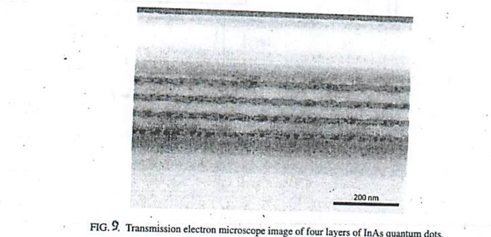

*Fig 9. Transmission electron microscope image of four layers of InAs quantum dots.*

Because of the **self-assembled** nature of QD growth, the ultimate properties of the resulting material are strongly dependent on the fabrication process. For example, QD surface density, size uniformity, ground-state transition energy, & [?] between energy levels can all be tuned to some extent and optimized by changing growth temperature, rate of growth, and interruptions in growth. Shown in Fig 10 are emission spectra of (a) InAs QD on GaAs, (b) same as (a) except with a 2 nm layer of $\text{In}_{0.15}\text{Ga}_{0.85}\text{As}$ sandwiched between the InAs and GaAs, and (c) InAlGaAs on InP. Corresponding (atomic-force) microscope images of exposed quantum dots are given in parts (d)–(f) of Fig 10.

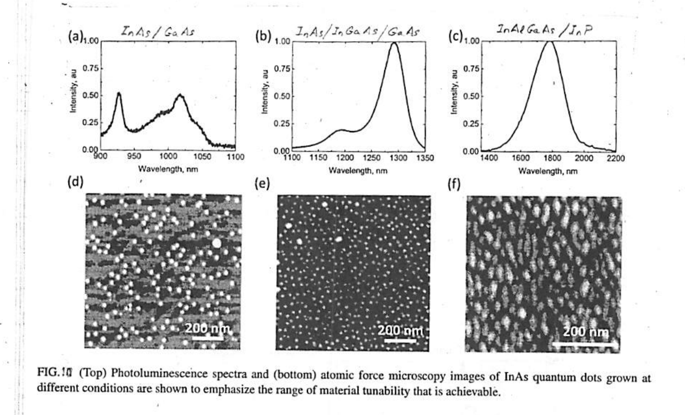

*Fig 10. (Top) Photoluminescence spectra and (bottom) atomic force microscopy images of InAs quantum dots grown at different conditions are shown to emphasize the range of material tunability that is achievable. (a) InAs/GaAs, (b) InAs/InGaAs/GaAs, (c) InAlGaAs/InP.*

---

## Properties of QD Lasers

The discrete DOS characterizing QD's gives QD lasers their outstanding properties & performance, which include:

a) **Remarkable temperature stability** (up to 100 °C): ultra-stable emission wavelength ($\lambda$), light level ($P_{out}$), threshold ($I_{th}$), and constant slope efficiency ($dP_{out}/dI$).
b) **Low-power consumption** with a low threshold $I_{th}$ ($\sim$ mA's).
c) **Multi-λ light source** for WDM applications.
d) A promising **comb laser for Si-photonics**.
e) **Low cost.**

Degradation of performance with rising temperature has been a major drawback of conventional laser diodes. Shown below (Fig 11) is a comparison of a QD laser and a conventional LD vs. temperature. To be noted is the high temperature stability of both the threshold $I_{th}$ and the slope efficiency of the QD-based laser.

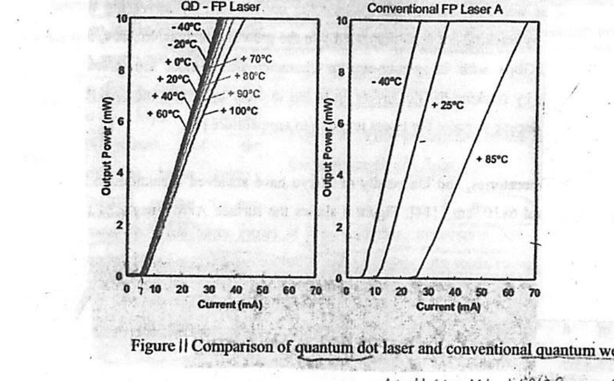

*Figure 11. Comparison of quantum dot laser and conventional quantum well lasers. The QD–FP laser maintains nearly identical $L$–$I$ characteristics from −40 °C to +100 °C, whereas the conventional FP laser A shifts strongly between −40 °C, +25 °C, and +85 °C.*

The stability of emission wavelength with rising temperature is another performance aspect in which QD lasers excel. This is evident from Fig 10 (below), which displays the variation of emission wavelength with temperature for a QD laser vs. a quantum-well laser.

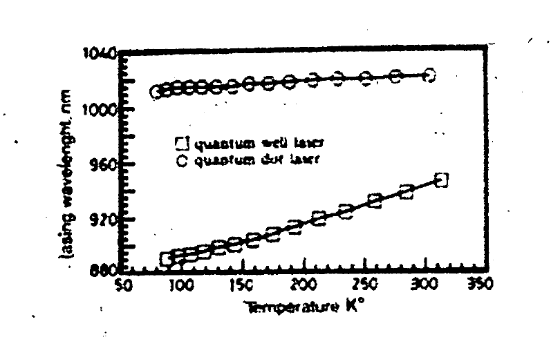

*Fig 10. Temperature stability of lasing wavelength of a QD laser vs. another laser (QW). The quantum-dot laser (circles) remains essentially flat at $\sim 1015$ nm, while the quantum-well laser (squares) drifts from $\sim 890$ nm to $\sim 950$ nm over 50–320 K.*

---

## Mode-Locked Comb Laser

This type of multi-wavelength laser is suitable for WDM systems, which employ multiple wavelengths at precise locations on the **ITU grid**. Typically, **MODE-LOCKED** lasers produce up to **1000 channels** with various uniform $f$-spacings ranging from **100 GHz** down to **3.125 GHz** (known as **"hyperfine" WDM**).

The output of a mode-locked laser consists of a continuous **train of very narrow pulses**, which in the frequency domain corresponds to a periodic line spectrum with uniform spacing set by the **Repetition Rate (GHz)** of the pulse train. For example, a pulse train with 40-ps period and narrow pulse width $\tau = 1\ \text{ps}$ generates a flat-magnitude optical line-spectrum with separation of **25 GHz** corresponding to the Repetition Rate $= 1/(40\ \text{ps})$ of the pulse train $\big((40\ \text{ps})^{-1} = 25\ \text{GHz}\big)$. See figure below.

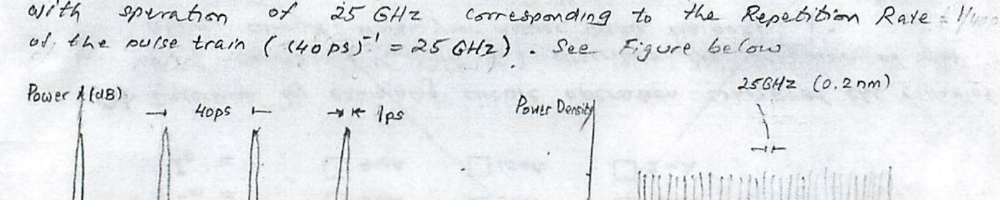

*Fig. Example of time-domain (a) and frequency-domain (b) outputs of a C-band (centered @ 1537 nm) mode-locked laser. (a) A 40-ps period pulse train (pulse width $\sim 1$ ps). (b) Spectrum in the C-band, with 25 GHz (0.2 nm) line spacing.*

The comb spectrum of the pulse train shown in the figure stems from the mathematical evaluation of the **Fourier transform*** of a uniform impulse train, which is a line-spectrum train with uniform spacing equal to the pulse repetition rate. In the example above, the 1-ps short pulses may be considered narrow enough to approximate impulses (delta functions). The error incurred in this approximation is a non-uniform but very wide distribution of spectral amplitudes following a $\dfrac{\sin \pi f \tau}{\pi f \tau}$, i.e. first null at $f = 1/\tau = 1000\ \text{GHz}$ — accommodates 40 spectral lines.

> \* **The Fourier transform of a uniform impulse train** (amplitude "$a$"):
> $$g(t) = a \sum_{n=-\infty}^{\infty} \delta(t - nT) \;\longleftrightarrow\; G(f) = 2\pi a \sum_{k=-\infty}^{\infty} \delta(f - k f_0)$$
> is a line-spectrum train. Here $\displaystyle G(f) = \int_{-\infty}^{\infty} g(t)\, e^{-j 2\pi f t}\, dt$, and $f_0 = 1/T$ is the repetition rate (Hz).

The varying envelope of the spectrum as a result of the finite pulse width can be overcome by **"Dynamic Gain Equalization"**, which flattens and filters the laser's spectrum.

The laser itself can be conveniently based on **Erbium glass technology**, covering any section of the ITU grid from **1530 to 1565 nm**. The output power may be boosted to as much as **10 dBm (10 mW)** using an EDFA.

The figure below shows a complete multi-wavelength laser system which can lock the entire wavelength spectrum to the ITU grid. Also shown is the 32-channel WDM channel grid produced.

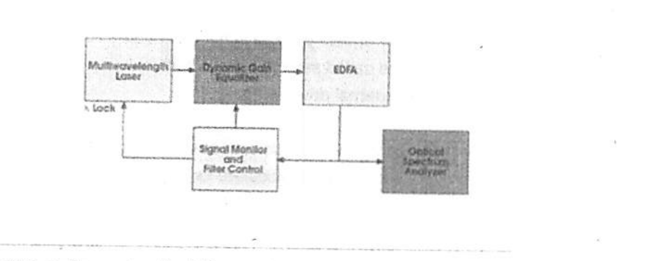

*Figure 3a. In this multiwavelength platform setup, a dynamic gain equalizer flattens and filters the laser's spectrum. An erbium-doped fiber amplifier increases channel power. Using one channel, one wavelength locker and a cavity adjustment of less than 1 μm, the entire wavelength spectrum can be locked to the ITU grid.*

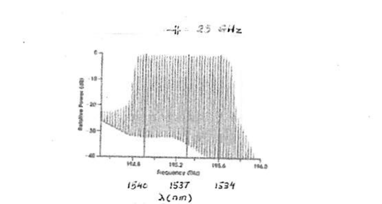

*Figure 3b. The multiwavelength laser platform produced this 32-channel WDM channel grid. Signal to noise is greater than 30 dB, and the channels are separated by exactly 25 GHz on the ITU grid. Channel flatness is less than 0.4 dB.*

---

### Reference

† M. Brownell, "Multiwavelength Lasers simplify WDM Networks and Applications," *Photonics Spectra*, March 2003.
