# Lecture 2 — Link Budget, Losses

**EECE 7398 — Analysis & Design of Photonic Integrated Circuits (PICs)** · Northeastern University, Dept. of Electrical & Computer Engineering · Spring 2023

---

## Optical Link Budget & Design

The design of a fiber optical link (Fig 1) must meet a number of design criteria, which ensure satisfactory link performance. These consist of **"user-specified"** and **"designer-specified"** criteria. The user (client) generally specifies the **distance** over which the link must operate, as well as the **data rate** of transmission. The designer, on the other hand, has to determine the specifications required of the system components to be employed.

- **Primary specs:**
  - Data Rate ($R_b$).
  - Link distance ($D$).
- **Secondary specs:**
  - Modulation format (e.g. OOK, PAM4, etc.)
  - System fidelity (i.e. Bit-error rate $\text{BER} \le 10^{-9}$)
  - Cost: components, installation, maintenance.

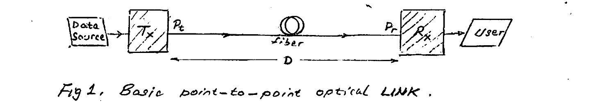

*Fig 1. Basic point-to-point optical link.*

For the choice of a Laser Diode (as transmitting source) and photodiode as detector (at the receiving end), the type of fiber selected is either **Multi-Mode (MM)** for short-reach applications ($< 10$ km) or **Single-Mode (SM)** for long-reach applications (100's–1000's km).

In the figure above:

$$P_t = \text{transmit power} \quad (\text{dBm})$$
$$P_r = \text{received power} \quad \text{required to ensure compliance with a BER specification (typically} < 10^{-9}\text{)}$$

A **"LINK BUDGET"** can now be formulated which balances the **"net power"** ($P_t - P_r$) with the total of power **loss** in the various parts of the link.

---

## Power-Loss Model

The power-loss model involves the optical power loss in: 1) fiber, 2) connectors, 3) splices.

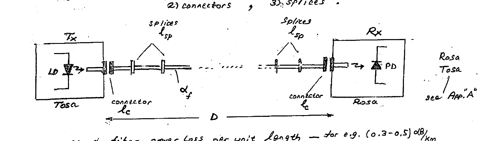

*Fig 2. Details of an optical link.*

- $\alpha_f$ : fiber power loss per unit length — for e.g. $(0.3\text{–}0.5)\ \text{dB/km}$
- $\ell_c$ : connector loss $\sim (0.2\text{–}0.3)\ \text{dB}$
- $\ell_{sp}$ : splice loss $\sim (0.05\text{–}0.1)\ \text{dB}$
- $\alpha_f$ : fiber loss per unit length $(0.3\text{–}0.5)\ \dfrac{\text{dB}}{\text{km}}$

### Power Budget calculations

Maximum loss permitted:

$$L_{max} = P_t - P_r$$

$$L_{max} = \ell_c + \ell_{sp} + \ell_f + \ell_{margin} \qquad \begin{cases} \ell_f = \alpha_f \cdot D \\[4pt] \ell_{margin} = \text{safety margin}^{*} \end{cases}$$

$$\therefore\quad \ell_f = L_{max} - (\ell_c + \ell_{sp} + \ell_{margin})$$

$$D_{max} = \frac{\ell_f}{\alpha_f}$$

**Example:** $P_t = 1\ \text{mW}$, $P_r = 0.1\ \mu\text{W}$, $\ell_{margin} \approx 6\ \text{dB}$, $\alpha_f = 0.3\ \dfrac{\text{dB}}{\text{km}}$ (for BER $= 10^{-9}$):

$$L_{max} = P_t - P_r = 0 - (-40) = 40\ \text{dB}$$

$$D_{max} = \frac{\ell_f}{0.3\ \tfrac{\text{dB}}{\text{km}}} \approx 110\ \text{km} \qquad \left(\ell_f = L - \ell_{margin} = 34\ \text{dB}\right)$$

To maintain performance for distance $> 110$ km, e.g. an **EDFA** must be inserted @ 110 km to boost optical power.

> $^{*}\ \ell_{margin}$ = a system margin of safety (cushion), which accounts for deterioration/aging etc. Generally a margin of $\sim 6\ \text{dB}$ is found adequate.

---

## Appendix A — ROSA & TOSA

In high-data-rate fiber optical links, two types of basic optical subassemblies are commonly employed:

1. Receiver Optical Sub-Assembly — **ROSA** (Fig 3)
2. Transmitter Optical Sub-Assembly — **TOSA** (Fig 4)

The function of **ROSA** is to provide the Rx end with highly-aligned **"optical coupling"** b/w the optical fiber and the photodiode. In a ROSA it is customary to include the **TIA** amplifier, which converts the generated photocurrent pulses (by the photodiode) into corresponding amplified signal voltage.

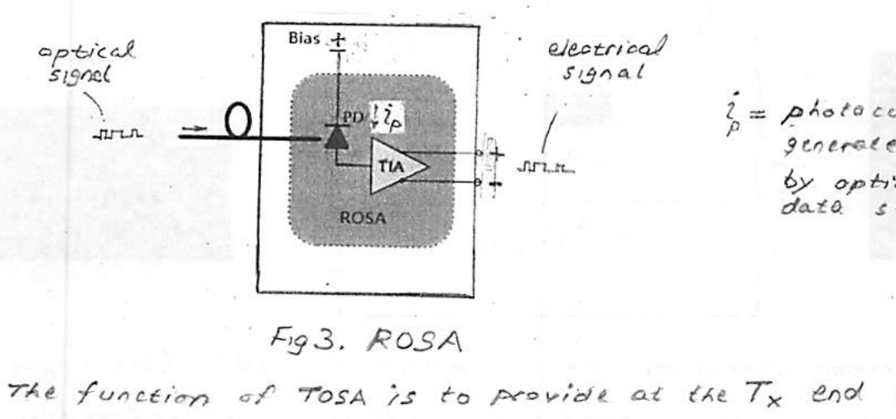

*Fig 3. ROSA.* $\ i_p$ = photocurrent generated in PD by optical data stream.

The function of **TOSA** is to provide at the Tx end a precisely aligned optical coupling between the optical fiber and the Laser Diode (LD). In this subassembly it is common to include a **Laser-Diode Driver (LDD)**, which permits to convert the electrical data stream into a corresponding stream of light pulses.

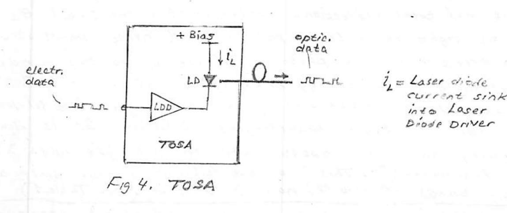

*Fig 4. TOSA.* $\ i_L$ = laser diode current sink into Laser Diode Driver (LDD).

---

## II. Silicon Waveguides

Si waveguide structures are the basic optical interconnect in SiPh. As we shall see, they also serve as a building block in making passive devices. Both silicon (Si) and its oxide ($\text{SiO}_2$), which are the basis for the SOI CMOS technology, by a great fortune, turn out to form an excellent material pair for Si photonic waveguides. This **"dual utility"** paves the way for a powerful system design approach based on the **convergence of photonic & electronic ICs**.

In a Si-WG, undoped (pure) Si forms the nano-size core, while insulating oxide ($\text{SiO}_2$) i.e. silica forms the surrounding **"cladding"**. The technology employed is based on the same SOI platform — as the SOI CMOS platform.

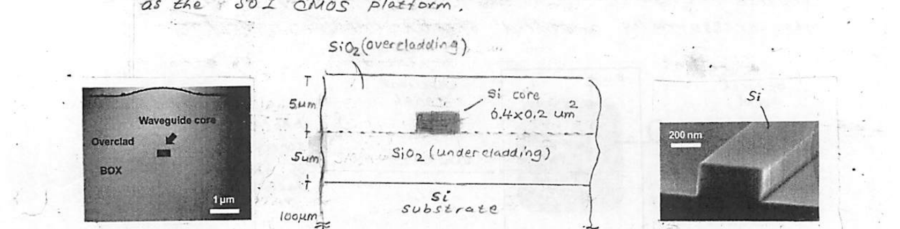

*Fig 5. A common structure of Si-waveguide in SOI (see Appendix B). Si core $0.4 \times 0.2\ \mu\text{m}$; $\text{SiO}_2$ overcladding and undercladding; Si substrate. BOX = Buried Oxide.*

Importantly, the large contrast between the **"refractive index"** of Si ($3.48$) and the cladding of $\text{SiO}_2$ ($1.45$) results in a small critical angle ($\theta_c \approx 25°$). Such a small critical angle makes for superior confinement of the light and thereby facilitates propagation down the waveguide by internal total reflection. Furthermore, the small $\theta_c$ permits tight bends to be possible and hence small structural geometries in making photonic devices of various kinds.

Interestingly, the **"energy bandgap"** of Si being $1.12\ \text{eV}$, corresponds to light energy of wavelength $\lambda \approx 1.1\ \mu\text{m}$. This means for all light wavelengths $< 1.1\ \mu\text{m}$, Si is light-absorbing and hence opaque, while for all light with $\lambda > 1.1\ \mu\text{m}$, Si is transparent.* This is a most fortunate feature, since all telecom bands (O thru U) have $\lambda > 1.1\ \mu\text{m}$ (see Table 1).

> \* Incident light gets absorbed by a semiconductor by creation of e–h pairs of mobile charge carriers only if the photon energy ($hf$) exceeds the **"energy gap"** of the semiconductor. With $f = c/\lambda$, one obtains $\lambda = 1.24/E_g(\text{eV})$ ($= 1.11\ \mu\text{m}$ for Si).

The Si nanowire shown in Fig 5 is based on pure undoped (intrinsic) Si, and therefore light propagates in it loss-free. In practice, however, the waveguide exhibits low loss $\sim 0.1\ \text{dB/cm}$, introduced mainly by scattering due to line-edge roughness (sidewalls) of the Si core.

Furthermore, the **"wire"** waveguide structure of Fig 5 can support very tight bends with extremely small bending radius $\sim 1\ \mu\text{m}$. This tight bending capability makes possible the making of such useful elements as **"Optical Delay Lines"** in the form of a dense compact serpentine structure. For e.g. a $\sim 1\ \text{ns}$ delay can be squeezed in a chip area no greater than $0.3 \times 0.3\ \text{mm}^2$.

### Critical Angle ($\theta_c$)

For a SOI system, the $\text{Si–SiO}_2$ interface in a Si-waveguide is characterized by a relatively small critical angle ($\theta_c$) thanks to the high index contrast:

$$\theta_c = \arcsin\!\left(\frac{n_{\text{SiO}_2}}{n_{\text{Si}}}\right) = 24.6°$$

A small angle indeed relative to a $77°$ for the silica fiber.

In conclusion, the Hi-contrast SOI system leads to a high optical confinement — thereby making possible the fabrication of compact devices, and hence their integration on a PIC.

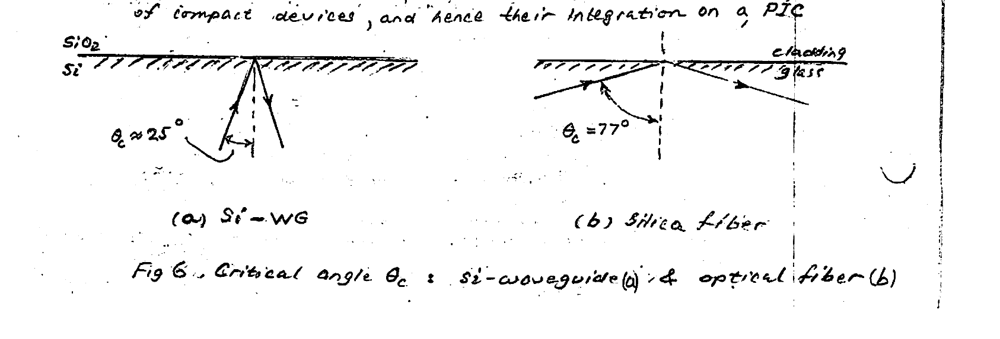

*Fig 6. Critical angle $\theta_c$: Si-waveguide (a) & optical fiber (b). (a) Si-WG, $\theta_c \approx 25°$; (b) Silica fiber, $\theta_c = 77°$.*

---

## Appendix B — SOI Fabrication

Figure 7 shows a typical fabrication process for a Si-wire waveguide. First, a hard mask layer and resist mask layer are formed on a SOI substrate. The hard mask is used to improve the selectivity of Si etching and is often made of $\text{SiO}_2$. Next, waveguide patterns are defined by using electron beam (EB) lithography or excimer laser deep ultraviolet (DUV) lithography, which are capable of forming 100-nm patterns. Ordinarily, EB and DUV lithography technologies are used in the fabrication of electronic circuits where they are optimized for patterning of straight and intersecting line patterns. Therefore, no consideration has been given to curves and roughness in the pattern edges, which are important factors in fabricating low-loss optical waveguides. To reduce propagation losses of the waveguides, it is necessary to reduce the edge roughness to around 1 nm or less. This means that particular care must be taken in the data preparation for EB shots or DUV masks.

After resist development and $\text{SiO}_2$ etching for a hard mask, the silicon core is formed by low-pressure plasma etching with an electron-cyclotron resonance (ECR) plasma or inductive coupled plasma. To ensure the edge roughness of the side walls

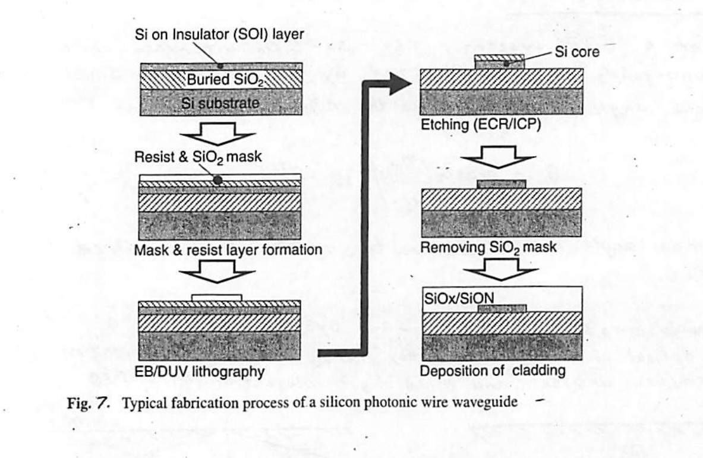

*Fig 7. Typical fabrication process of a silicon photonic wire waveguide.*

is at sub-nanometer levels, the plasma conditions and the selection of etching gases must be tuned for individual plasma equipment.

Finally, an overcladding layer is formed with a $\text{SiO}_2$-based material or polymer resin material. To avoid damaging the silicon layer, the cladding layers must be deposited by a low-temperature process, such as the plasma-enhanced chemical vapor deposition (PE–CVD) method. In particular, for waveguides associated with electronic structure, it is essential to use a low-temperature process so as not to damage the electronic devices.

---

## Maximum Bending Angle

Consider a waveguide with a bend at an angle $\beta$ and a light ray at the critical angle $\theta_c$.

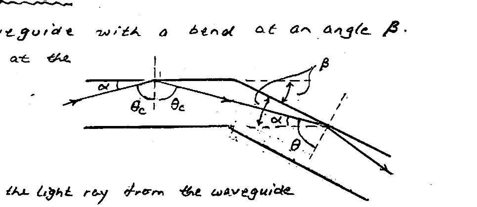

To avoid exit of the light ray from the waveguide at the bending arm, internal total reflection is required: i.e. $\theta > \theta_c$.

$$\theta = 90° - (\beta - \alpha) = 180° - \theta_c - \beta \qquad (\alpha = 90° - \theta_c)$$

$$\therefore\quad \beta_{max} = 180° - 2\theta_c$$

Thus, large bend angles can be accommodated for small $\theta_c$ — such as for Si-waveguides ($\theta_c \approx 25°$). For a fiber ($\theta_c \approx 77°$) it is required that $\beta < 26°$, while for a Si-waveguide $\beta < 130°$!

### Right-angle bend

Here,

$$\theta = \alpha = 90° - \theta_c$$

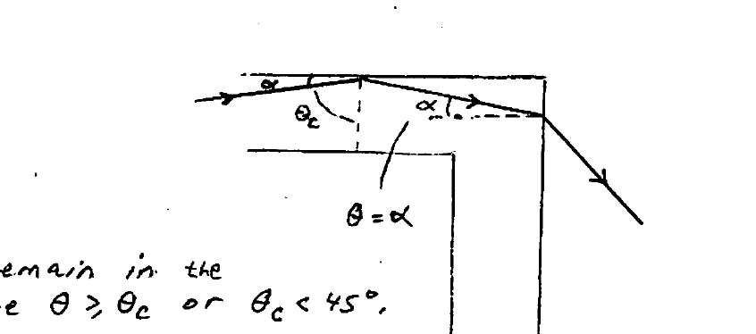

For the light ray to remain in the waveguide, need to require $\theta > \theta_c$ or $\theta_c < 45°$.

For a material such as silica (optical fiber) with $\theta_c \approx 77°$, light will exit and leave the fiber as shown! In contrast, the light will remain in the waveguide for a Si-waveguide. (See Figure below.)

The ability of Si-waveguides to accommodate tight bends avoids necessity of large size and makes possible the squeezing of various geometrical structures in small areas. Examples are spiral and serpentine **"delay lines"** below.

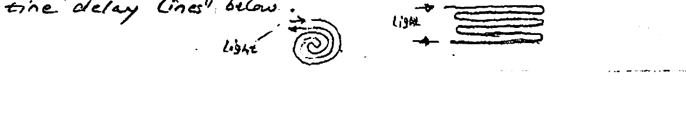

### Small $\theta_c$

Clearly, for this case the reflected beam strikes the perpendicular bend wall at $\theta > \theta_c$. This produces internal total reflection, and hence confinement of the light after the $90°$ bend.

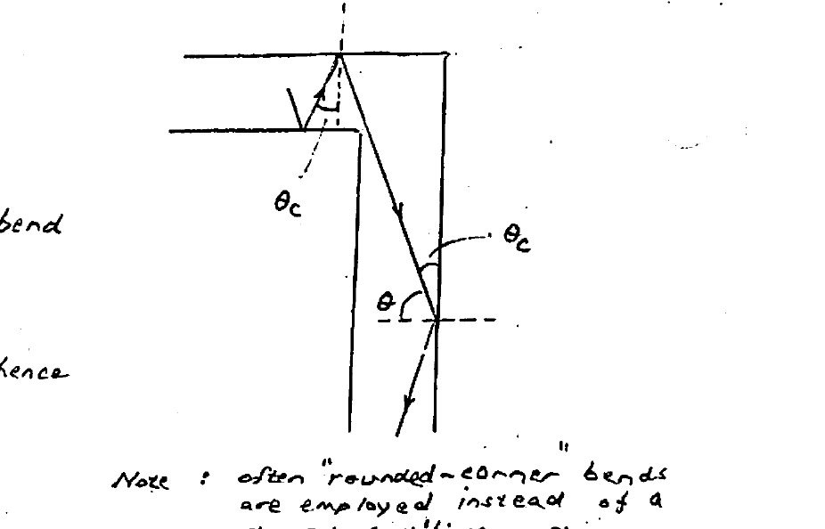

> **Note:** often "rounded-corner" bends are employed instead of a sharp rectilinear shape.

---

## Fiber-to-Chip Coupling

When data is transferred between a fiber-optic based system and a photonic IC (PIC), there is an obvious need for a suitable **"coupling interface"** to down-scale to the on-chip Si-waveguide system.

Noting the large mismatch in cross-sectional area b/w a SM fiber $\sim 75\ \mu\text{m}^2$ ($10\ \mu\text{m}$ diameter) and a Si-waveguide $\sim 0.25\ \mu\text{m}^2$, it is clear that only a very small percentage of the light signal can be directly coupled between the two.

A coupling structural interface of an appropriate geometry — such as a **"funnel"** — is required. Furthermore, for greatest flexibility, the coupling structure should permit coupling to take place anywhere on the chip where input-output light transfer is needed — and not necessarily only at the outer edges of the chip. Fig 8 below shows an optical fiber / Si-WG coupler. The Si waveguide extends farther to the right into the remainder of the photonic IC. As required, the taper provides for size-matching between the fiber and the nano-size Si waveguide: i.e., $10\ \mu\text{m}$ diameter fiber to $\sim 0.5\ \mu\text{m}$ square Si wire. More specifically, the shallow flat grooved structure acts as a **"diffraction grating"** permitting convenient vertical–horizontal two-way coupling of light.* It is noteworthy that the fiber must approach the coupler at an offset angle $\theta$ from the normal to ensure good **"efficiency"** of light coupling. Typically the angle $\theta \sim 10°$.

> \* See "Physical & Geometrical Optics" — Appendix C.

To understand the coupler's action, we consider the case in which an optical signal is being transferred into the fiber from the chip by the Si-WG (Fig 9). The principle of **"reciprocity"** in optics obviates the need for additional treatment of the reverse transfer from fiber to the chip.

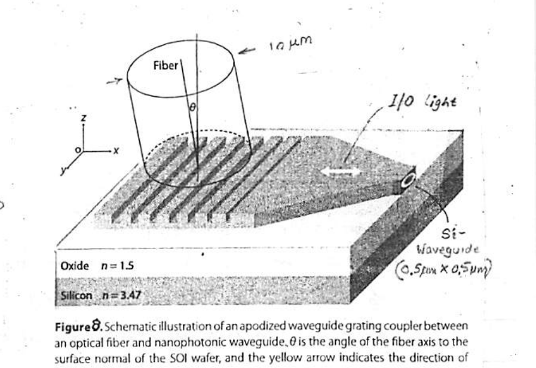

*Fig 8. Schematic illustration of an apodized waveguide grating coupler between an optical fiber and nanophotonic waveguide. $\theta$ is the angle of the fiber axis to the surface normal of the SOI wafer, and the yellow arrow indicates the direction of light propagation. (Oxide $n = 1.5$; Silicon $n = 3.47$; Si waveguide $0.5\ \mu\text{m} \times 0.5\ \mu\text{m}$.)*

The light–grating interaction is governed by **Huygen's principle**: each point of contact of incident light with the grating "teeth" acts as a secondary point-source or scatterer of light in all directions. We seek here to determine the direction(s), i.e. angle $\theta$ relative to the normal, for which light is diffracted by the grating.

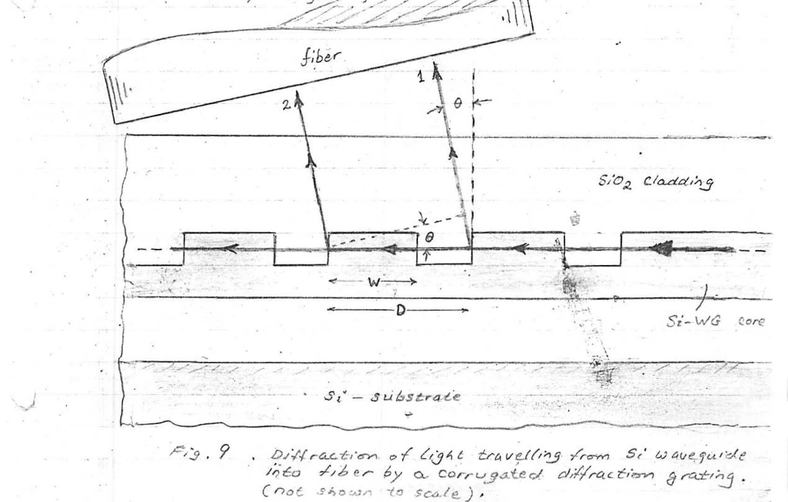

*Fig 9. Diffraction of light travelling from Si waveguide into fiber by a corrugated diffraction grating. (Not shown to scale.)*

Examining two similar light beams (1 & 2) diffracted in a direction $\theta$, it becomes evident that they will interfere constructively if:

$$\frac{D}{v_g} - \frac{D\sin\theta}{v_c} = mT \qquad (1)$$

where $m = 1, 2, 3, \dots$ (beam "order"), $T = \tfrac{1}{f}$ ($f$ = light frequency). $v_g = c/n_g$ & $v_c = c/n_c$ are light propagation velocities in the grating ("effective" refractive index $n_g$) and cladding (refractive index $n_c$), with $c$ & $\lambda_0$ being the free-space light speed & wavelength. We use $f = c/\lambda_0$ in (1) to yield:

$$\sin\theta = \left(n_g - \frac{m\lambda_0}{D}\right) \Big/ n_c \qquad (2)$$

The following approximations can be used for $n_c$ & $n_g$:

$$\left.\begin{aligned} n_c &\approx n_{\text{SiO}_2} \\ n_g &\approx F\, n_{\text{Si}} + (1-F)\, n_{\text{SiO}_2} \end{aligned}\right\} \qquad (3)$$

Equation (2) above yields the various angles of diffracted beams of different **"orders"** ($m$). Appropriate design through selection of the grating **"pitch"** ($D$) and **"Fill factor"** ($F \triangleq W/D$) reduce the number of orders to first order ($m = 1$) only — rendering all higher orders non-existent.

**Example:** Find $\theta$ for **"first order"** ($m = 1$) diffraction.

Given: $\lambda_0 = 1.55\ \mu\text{m}$, $D = 0.75\ \mu\text{m}$, $F = 0.6$, $n_{\text{Si}} = 3.45$, $n_{\text{SiO}_2} = 1.45$.

$$n_g = 0.6\, n_{\text{Si}} + 0.4\, n_{\text{SiO}_2} = 2.65$$

$$\sin\theta = \left(n_g - \frac{\lambda_0}{D}\right) \Big/ n_c = 0.30 \quad \rightarrow \quad \theta \approx 17.5°$$

$m = 2$?:

$$\sin\theta = \left(n_{\text{eff}} - \frac{2\lambda_0}{D}\right) \Big/ n_c = -1.02$$

Clearly all higher order diffractions ($m \ge 2$) are non-existent!

---

## Effective Index ($n_{\text{eff}}$)

An examination of the propagation phenomenon of light in a Si waveguide shows that some of the light (evanescent field) also travels in the surrounding $\text{SiO}_2$ cladding (Fig 10, below). Because Si and $\text{SiO}_2$ have two different optical densities (different index of refraction), this causes the light to have two different speeds. It is more convenient to treat such an inhomogeneous system as an equivalent homogeneous material with some effective index of refraction $n_{\text{eff}}$. Typically $n_{\text{eff}}$ would lie between $n_{\text{SiO}_2} = 1.44$ and $n_{\text{Si}} = 3.48$. Its value would also depend on the width & height cross-sectional dimensions of the waveguide, as well as the light wavelength $\lambda$.

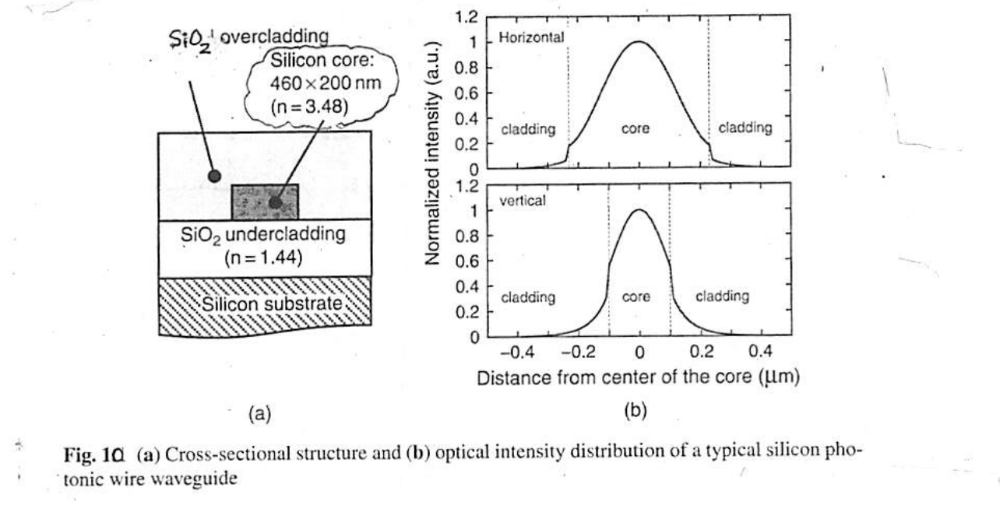

*Fig 10. (a) Cross-sectional structure and (b) optical intensity distribution of a typical silicon photonic wire waveguide. Silicon core: $460 \times 200\ \text{nm}$ ($n = 3.48$); $\text{SiO}_2$ overcladding; $\text{SiO}_2$ undercladding ($n = 1.44$); Silicon substrate.*

---

## Waveguide Termination

Back-reflection from the end of a Si waveguide leads to undesirable interference with the forward-propagating light. This can result in signal integrity degradation, and even impede proper photonic device action. A case in point is integrated photonic routers, where open-ended Si-waveguide wires are a common feature. Here, to act as an absorbant of energy of the light arriving at a WG's end, an effective optical termination is essential. A typical light terminator may have a spiral shape* as shown in Fig 11. A typical length of the spiral is $\sim 30\ \mu\text{m}$.

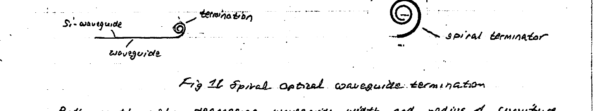

*Fig 11. Spiral optical waveguide termination.*

Both continuously decreasing waveguide width and radius of curvature result in enhanced dissipation of incident light through increased internal scattering and radiation. Typical width and radius variations might span $0.5\ \mu\text{m} \rightarrow 0.2\ \mu\text{m}$ and $5\ \mu\text{m} \rightarrow 1\ \mu\text{m}$, respectively. Along with heavier $p^{++}$ doping, the loss coefficient of the spiral termination is enhanced significantly.

The following data of **RETURN LOSS** gives an idea of the terminator effectiveness relative to an unterminated WG. (Recall that Return loss (dB) is given by $\text{RL} = 10\log\left[\text{reflected power}/\text{incident power}\right]$.)

| WG | RL (Return Loss) | |
| --- | --- | --- |
| unterminated | $-10\ \text{dB}$ | ($\tfrac{1}{10}$) |
| spiral terminated | $-30\ \text{dB}$ | ($\tfrac{1}{10^3}$) |
| $p^{++}$ doped spiral | $-40\ \text{dB}$ | ($\tfrac{1}{10^4}$) |

To illustrate the onset of losses at small radius of curvature, see Fig 12.

> \* "Spiral Optical Waveguide Termination", P. Dumais. Patent Application Publication No. US2017/0315296A1, Pub. Date: Nov 2, 2017.

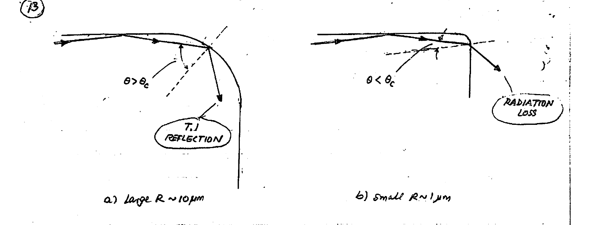

*Fig 12. Effect of decreasing radius of curvature $R$ of a bend on optical losses in a Si WG. (a) Large $R \sim 10\ \mu\text{m}$, $\theta > \theta_c$ → T.I. reflection. (b) Small $R \sim 1\ \mu\text{m}$, $\theta < \theta_c$ → radiation loss.*

Here an optical ray propagating at small glancing angle $\alpha$ is considered for demonstration of total internal reflection (large $R \sim 10\ \mu\text{m}$) and escape and loss of optical power (small $R \sim 1\ \mu\text{m}$).

---

## Appendix C — Physical vs. Geometrical Optics

In many applications, light phenomena involve structures with dimensions $\gg \lambda$. In such cases the behavior of light can be predicted by the principles of **GEOMETRIC (RAY) OPTICS** — where light is adequately treated as **"rays"**. Familiar examples: Snell's law of refraction, the law of reflection (e.g. reflected light from a smooth surface/mirror), focusing a light beam by a lens into a spot, or the inverse — converting a point light-source into a collimated beam, etc.

In some other applications, however, marked deviations occur from the behavior predicted by geometric (ray) optics. These deviations are found to occur for structures having small size comparable to the wavelength $\lambda$ of the light. An accurate description of the correct behavior of light in all these situations entails considering the **WAVE NATURE** of light. The appropriate theoretical framework based on light's wave behavior is known as **PHYSICAL OPTICS** (or **DIFFRACTION THEORY**).

By describing light as propagating electromagnetic waves, account can be given for phenomena involving interaction between two light waves of different phases — leading to constructive or destructive interference. It should be noted that the latter can not be accounted for by ray theory, i.e. geometrical optics.

Such interference phenomena are described instead by **DIFFRACTION THEORY**. Examples of diffraction include: passage of light through a narrow slit or pinhole, light interaction in various corrugated structures (**Diffraction Gratings**), and holography.

Diffraction gratings consist of periodic structures with which light interacts in various interesting ways that make them very useful in **SILICON PHOTONIC ICs**. Examples of such applications include optical fiber to silicon waveguide couplers, and **Arrayed Waveguide Grating (AWG)** used in **Wavelength Division Multiplexing (WDM)** systems, to be treated later.
