# Lecture 20 — Diffraction Grating

**EECE 7398 — Analysis & Design of Photonic Integrated Circuits (PICs)** · Northeastern University, Dept. of Electrical & Computer Engineering · Spring 2023

---

## Diffraction Grating Basics

Consider a planar transmission grating containing a number ($`N`$) of narrow slits at a pitch ($`d`$). For a cross-section of such a grating with normally incident coherent light @ $`\lambda`$ ($`\lambda \ll d`$), see Fig 1. We wish to determine the resulting distribution of the optical field at a point "$`P`$" on a parallel image plane at a large distance $`D`$ ($`\gg Nd`$).

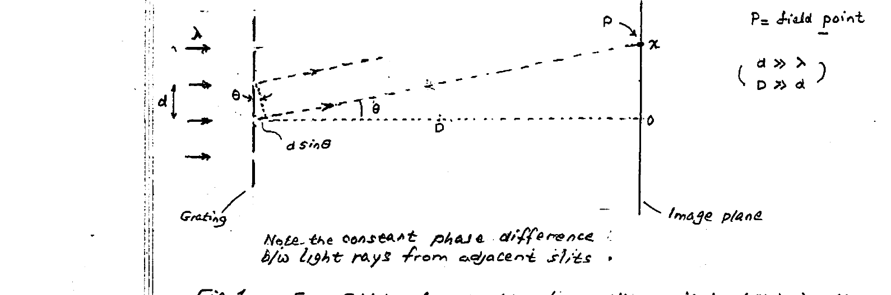

*Fig 1. Far-field of a grating ($`N`$ slits, pitch $`d \gg \lambda`$). Here, the field point "$`P`$" is at a large distance $`D`$ ($`\gg d`$).*

Note the constant phase difference b/w light rays from adjacent slits.

The total optical field at "$`P`$" is a result of **"interference"** among the fields from all slits. Maxima or minima of light intensity result depending on whether the interference is constructive or destructive.

### Principal Maxima*

Light rays from all slits will interfere constructively if this occurs for two adjacent slits. This entails a relative phase difference $`\delta`$ of $`2\pi \times m`$, where $`m = \pm\,\text{integer}`$ ($`|m| = 0, 1, 2, \ldots`$). From Fig 1, one finds:

```math
\delta = \frac{2\pi}{\lambda}\,(d\sin\theta) \qquad (1)
```

For a maximum: $`\;\delta_{\max} = 2\pi m`$

```math
\sin\theta = m\frac{\lambda}{d} \qquad (2)
```

Because $`\lambda \ll d \;\rightarrow\; \theta = \text{small}`$,** so

```math
x = D\tan\theta = m\!\left(\frac{\lambda}{d}\right)D \qquad (3)
```

> \* Not including weaker "secondary" maxima.
> \** $`\theta = \text{small}`$ ($`\sin\theta \approx \tan\theta`$).

---

## Observations

- Note that the position (angle) of the maxima is **not** dependent on the # of slits ($`N`$).
- However, if the intensity of the maxima were examined, one finds a strong increase ($`\propto N^2`$) with the # slits.

### Principal Maxima — in detail (see Fig 2)

- **$`m = 0`$ (zero-order):**

```math
d\sin\theta = 0 \;\rightarrow\; \theta_0 = 0° \;,\quad x_0 = 0 \quad (\text{indep. of } \lambda\,!)
```

- **$`m = 1`$ (1st-order):**

```math
d\sin\theta = \lambda \;\rightarrow\; \sin\theta_1 = \frac{\lambda}{d} \;,\quad x_1 = \frac{\lambda}{d}D
```

- **$`m = 2`$ (2nd-order):**

```math
d\sin\theta = 2\lambda \;\rightarrow\; \sin\theta_2 = 2\frac{\lambda}{d} \;,\quad x_2 = 2\frac{\lambda}{d}D
```

- **$`m = 3`$ (3rd-order):**

```math
d\sin\theta = 3\lambda \;\rightarrow\; \sin\theta_3 = 3\frac{\lambda}{d} \;,\quad x_3 = 3\frac{\lambda}{d}D
```

- **$`m`$th order:**

```math
d\sin\theta = m\lambda \;\rightarrow\; \sin\theta_m = m\frac{\lambda}{d} \;,\quad x_m = m\frac{\lambda}{d}D
```

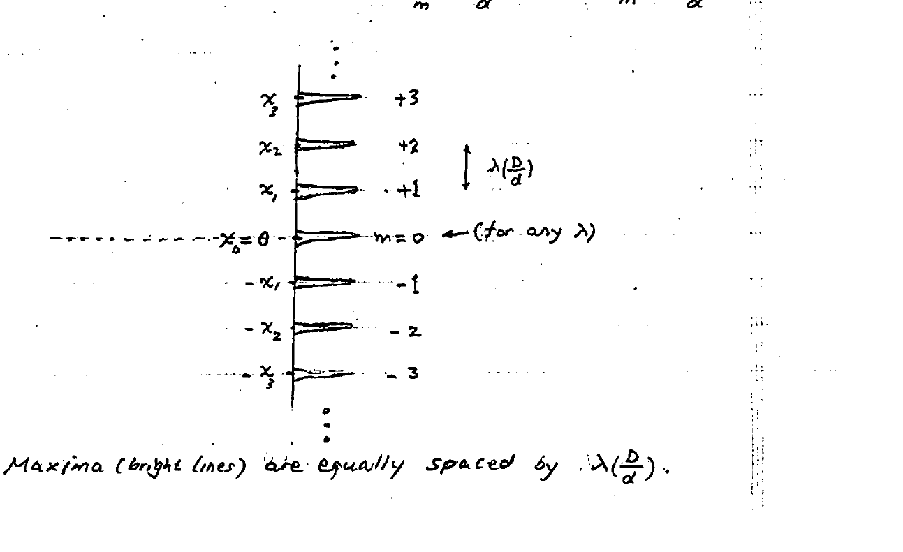

*Fig 2. Maxima (bright lines) are equally spaced by $`\lambda\!\left(\dfrac{D}{d}\right)`$.*

---

## Minima (nulls)

For a minimum ($`=`$ null) at the field point ($`P`$), one must require total destructive interference of the sum-total of light fields from ALL $`N`$ slits combined. To determine this condition, we resort to a simple geometrical representation of the vectorial sum of the individual fields from all $`N`$ slits.

As preparation, let us first examine two cases: (a) at maximum, (b) off-maximum. This is depicted in Fig 3 for $`N = 5`$ slits.

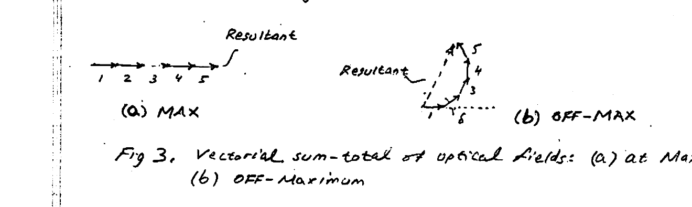

*Fig 3. Vectorial sum-total of optical fields: (a) at maximum, (b) off-maximum.*

As seen, the in-phase vectors producing a maximum simply add in (a). In contrast, the phase-shifted vectors produce a reduced resultant field in (b).

A null field (minimum) is produced (adjacent to a maximum) when the polygon closes on itself (Fig 4), i.e., $`\delta_{\min} = \delta_{\max} + \dfrac{2\pi}{N}`$, where $`\delta_{\max} = 2\pi m`$.

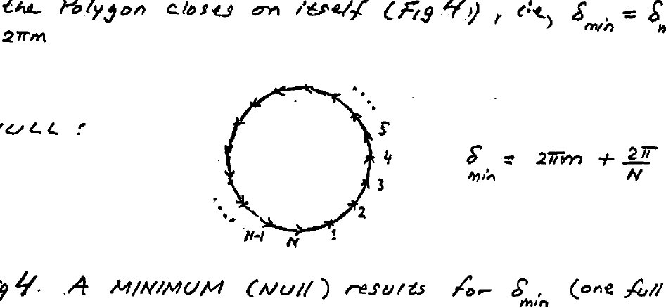

*Fig 4. A minimum (null) results for $`\delta_{\min}`$ (one full circle).*

```math
\delta_{\min} = 2\pi m + \frac{2\pi}{N}
```

Since the closed polygon may repeat itself with an integer ($`q`$) of encirclements, $`\delta_{\min}`$ needs to be revised:

```math
\delta_{\min} = 2\pi m + q\!\left(\frac{2\pi}{N}\right) \qquad (4)
```

Note that, unlike maxima, the position of the minima **is** a function of the # of slits ($`N`$).

---

## Intensity Distributions

To illustrate the principal maxima and the minima occurring in between them, the light intensity at ($`P`$) for various gratings ($`N = 2, 3, 5, 6, 20`$) were calculated and plotted vs. $`\frac{1}{2}\delta`$ in Fig 5. Here $`\frac{1}{2}\delta`$ equals $`(m\pi)`$ for maxima and $`\left(m\pi + \frac{q}{N}\pi\right)`$ for minima. Observe that, unlike the fixed positions of the maxima, the position and number of the minima both change in accordance with eqn (4).

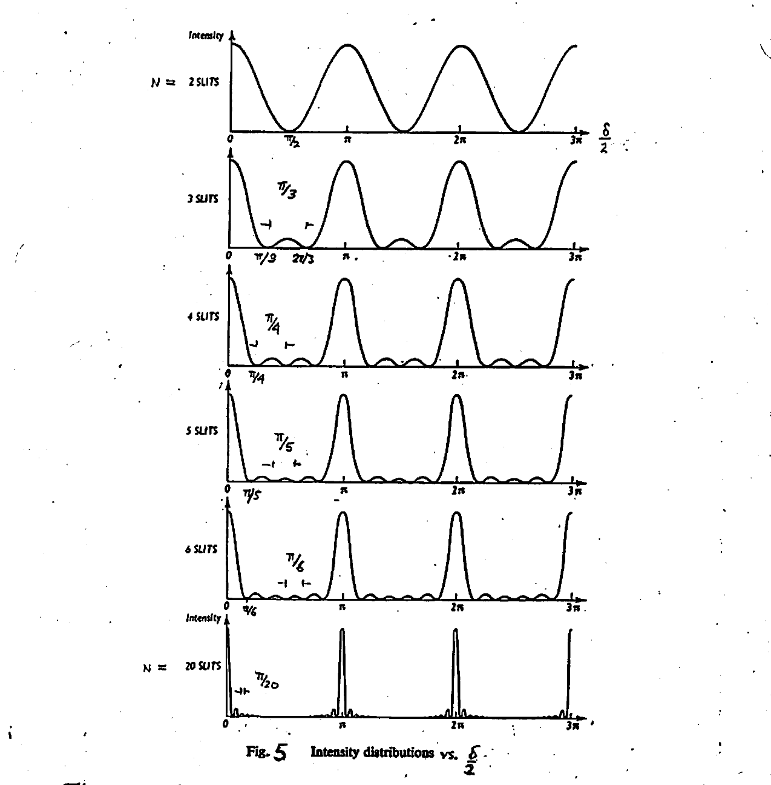

*Fig 5. Intensity distributions vs. $`\dfrac{\delta}{2}`$.*

The intensity plot above clearly reveals occurrence of $`N-1`$ minima b/w adjacent maxima: one for 2 slits, two for 3 slits, etc. Importantly, implied by these minima is the existence of **"secondary" (minor) maxima** — much weaker than the principal maxima, especially for large $`N`$'s. Thus, we shall ignore the secondary maxima.

---

The maxima produced by gratings with large slit count ($`N`$) appear as bright lines in the image plane. This is clearly evident for $`N = 20`$ in Fig 6. Also, for comparison, reduced counts ($`N = 3, 1`$) were included. For the case of a single-slit ($`N = 1`$) diffraction, see Appendix A.

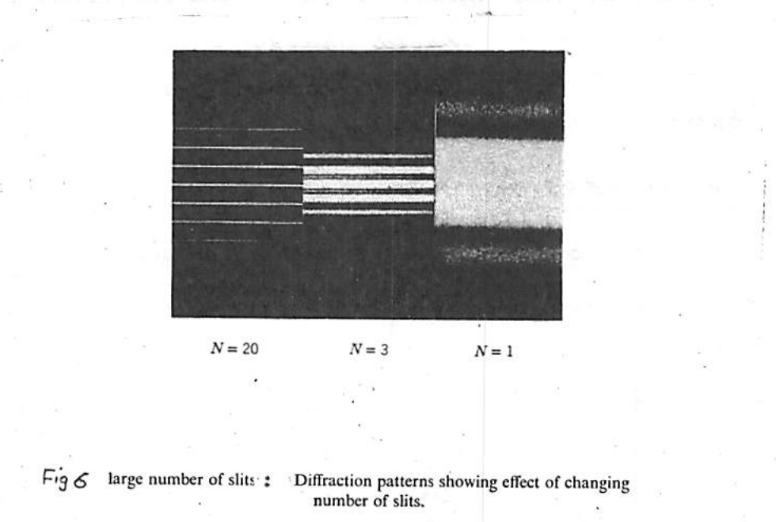

*Fig 6. Large number of slits: diffraction patterns showing effect of changing number of slits ($`N = 20, 3, 1`$).*

---

## Grating Spectra (Polychromatic Light)

In many applications, the incident light is polychromatic, i.e., consists of a discrete number of wavelengths $`\lambda_1, \lambda_2, \lambda_3, \ldots`$ (where $`\lambda_1 < \lambda_2 < \lambda_3 < \cdots`$).

Eqn (3) indicates that the zero-order maximum ($`m = 0`$) is made of **all** wavelengths $`\lambda_1, \lambda_2, \lambda_3, \ldots`$, all centered at $`x = 0`$ in the image plane. On the other hand, higher-order ($`|m| > 0`$) maxima contain each a cluster of separate maxima due to $`\lambda_1, \lambda_2, \lambda_3, \ldots`$ appearing in order of increasing $`\lambda`$ (away from center, $`x = 0`$), i.e., $`\lambda_1, \lambda_2, \lambda_3, \ldots`$ (Fig 7).

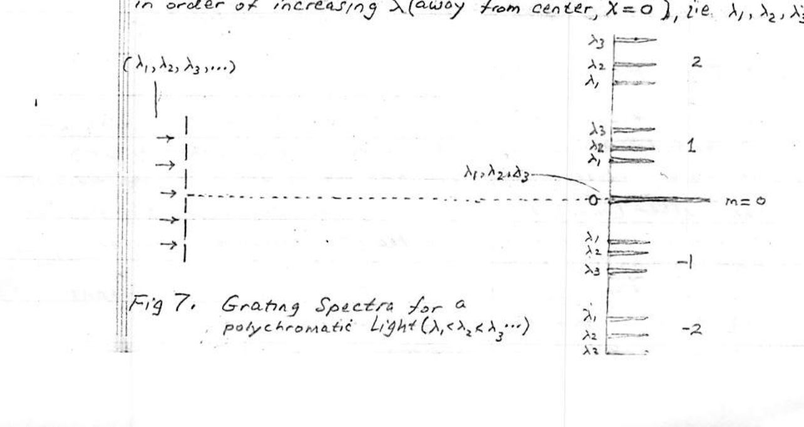

*Fig 7. Grating spectra for polychromatic light ($`\lambda_1 < \lambda_2 < \lambda_3 \cdots`$).*

---

Noteworthy is the important discrimination by the diffraction grating: for non-zero diffraction orders ($`m \neq 0`$), the different wavelengths are **dispersed** away from center ($`x \neq 0`$) in proportion to the size of their wavelength $`\lambda_1 \to \lambda_2 \to \lambda_3 \cdots`$.

The ability to resolve different $`\lambda`$'s contained in a light signal makes the diffraction grating useful as a $`\lambda`$-demultiplexer in **WDM** systems (see later: arrayed waveguide grating (AWG)). Another obvious application of the diffraction grating forms the basis for an optical spectrum analyzer.

### Angular Dispersion ($`D`$)

The dispersion of different $`\lambda`$'s within a spectrum order ($`m`$), as well as among different spectral orders (different $`m`$'s), is **not** uniform. Instead, the dispersion gradually increases with increasing $`\lambda`$ and order $`m`$ (see Fig 7). The angular dispersion ($`D`$) is defined as the rate of change of the angle ($`\theta`$) with wavelength ($`\lambda`$). From (2) one finds:

```math
D = \frac{d\theta}{d\lambda} = \frac{m}{d\cos\theta} \qquad (5)
```

Eqn (5) indicates that (for small $`\theta`$, $`\cos\theta \approx 1`$) $`D`$ increases with the diffraction order ($`m`$); thus, the higher the diffraction order, the greater is the dispersion. Also, $`D`$ depends inversely on the grating's pitch ($`d`$). A greater dispersion is obtained for a smaller pitch. Regarding $`\theta`$, however, note that if $`\theta`$ remains small (i.e. $`\cos\theta \approx 1`$) then the increase in the dispersion with $`\theta`$ will be insignificant and may be neglected.

---

## Free-Spectral Range (FSR)

It can be seen from Fig 7 that it is possible for two adjacent-order clusters of spectra to overlap. This first occurs when the highest $`\lambda`$ in a lower-order cluster ($`m`$) overlaps the lowest $`\lambda`$ in the adjacent higher-order cluster ($`m+1`$). This is generally considered undesirable. For example, in a WDM system this would lead to crosstalk interference b/w streams modulating the two $`\lambda`$'s in question!

The concept of Free Spectral Range (FSR) provides a means for controlling the occurrence of crosstalk.

By limiting "upper" wavelengths in a given diffraction order from entering the spectral domain of an adjacent "higher" diffraction order, no crosstalk may occur. This is simply achieved by requiring the "spectral interval" $`\Delta\lambda`$ b/w two adjacent-order clusters to contain all the wavelengths ($`\lambda_1, \lambda_2, \ldots, \lambda_N`$) employed for WDM. For e.g., for the lowest wavelength $`\lambda_1`$:

```math
m\,(\lambda_1 + \Delta\lambda) \leq (m+1)\,\lambda_1
```

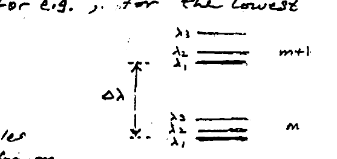

*Spectral interval $`\Delta\lambda`$ separating the order-$`m`$ and order-$`(m+1)`$ clusters.*

This relation results from equating the angles $`\theta`$ in Eqn (2) for the two $`\lambda`$'s: $`(\lambda_1 + \Delta\lambda)`$ for $`m`$, and $`\lambda_1`$ for $`(m+1)`$.

Recognizing that $`\text{FSR} = \Delta\lambda`$, we obtain:

```math
\Delta\lambda = \text{FSR} = \frac{\lambda_1}{m} \qquad (6)
```

Thus, higher-diffraction orders ($`m`$) have a smaller FSR.

---

## Appendix — Diffraction from a Narrow Slit

In the diffraction grating treatment that we have undertaken, the details of the diffraction pattern of a slit were not considered in finding maxima or minima of the diffraction pattern. There, slits were assumed to have negligible width.

Here, we provide a close examination of the diffraction pattern of a single slit with aperture (width) $`W`$.

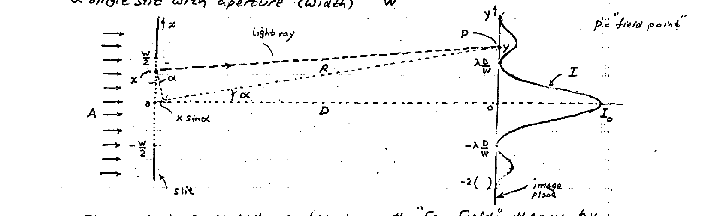

*Single-slit diffraction: incident plane wave on aperture $`A`$ of width $`W`$, producing intensity $`I`$ on the image plane at distance $`D`$ with the first nulls at $`\pm\lambda\dfrac{D}{W}`$.*

The analysis presented is based on the **"Far-Field"** theory by Fraunhofer, which is valid for a remote image plane, $`D = \text{large}`$ $`\left(D \gg \dfrac{(W/2)^2}{\lambda}\right)`$.

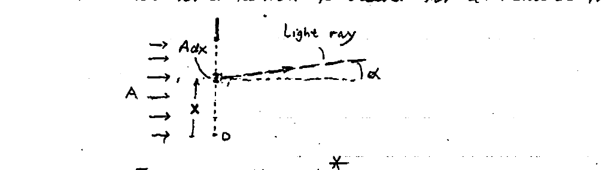

*Differential field $`dE`$ from the slit element $`A\,dx`$ at angle $`\alpha`$.*

Employing Huygens' principle,* the optical field differential $`dE`$ @ $`P`$ is:

```math
dE = \frac{A\,dx}{R}\,e^{-jK(R - x\sin\alpha)} \qquad (1)
```

where $`\;K = \dfrac{2\pi}{\lambda}\;`$ and $`\;A = \text{incident field}`$.

The total field:

```math
E = \int_{-W/2}^{+W/2} dE = \frac{A}{R}\,e^{-jKR}\!\left(\int_{-W/2}^{W/2} e^{jKx\sin\alpha}\,dx\right) = \frac{AW}{R}\,e^{-jKR}\!\left(\frac{\sin u}{u}\right) \qquad (2)
```

where $`\;u = \left(\dfrac{\pi W}{\lambda}\right)\sin\alpha`$.

Finally the light intensity ($`I`$):

```math
I \approx E^2 = \left(\frac{AW}{R}\right)^2 \mathrm{sinc}^2\!\left(\frac{\pi W}{\lambda}\sin\alpha\right) \qquad (3)
```

> \* Huygens' principle: each point on a wave front may be regarded as a secondary (new) source of spherical wavelets.
> \** For $`I(y)`$ one may substitute $`\sin\alpha \approx \dfrac{y}{D}`$ (since $`\alpha = \text{small}`$).

---

The intensity distribution in (3) may be rewritten as:

```math
I = I_0\,\frac{\sin^2\beta}{\beta^2} \qquad (4)
```

where,

```math
I_0 = \left(\frac{AW}{R}\right)^2 = \text{max intensity on image plane } (y = 0)
```

```math
\beta = \frac{\pi W}{\lambda}\sin\alpha \approx \frac{\pi W}{\lambda D}\,y
```

### Half-Power Beamwidth

```math
I(y) = \tfrac{1}{2}I_0 \;\rightarrow\; \frac{\sin^2\beta}{\beta^2} = \frac{1}{2} \;\rightarrow\; \alpha_{1/2} = 0.4425\,\frac{\lambda}{W}
```

```math
\therefore\;\text{Half-Power Beamwidth},\quad 2\alpha_{1/2} = 0.885\!\left(\frac{\lambda}{W}\right) \qquad (5)
```

### Width of Principal Maximum

```math
I(y_0) = 0 \;\rightarrow\; 2y_0 = \frac{2\lambda}{W}D \qquad (6)
```

### Example

```math
\lambda = 1.55\ \mu m \;,\quad W = 20\lambda = 31\ \mu m \;,\quad D = 1.5\ mm
```

Find:
- a) FWHM bandwidth ($`2\alpha_{1/2}`$)
- b) Width of principal max. $`2\alpha_0`$ and $`2y_0`$
- c) Verify validity of Fraunhofer's "far field".

**a)**

```math
2\alpha_{1/2} = 0.885 \cdot \frac{1}{20} = 0.04425\ \text{rad} = 2.54°
```

**b) Principal max.:**

```math
I = 0 \;\rightarrow\; \beta = \pm\pi
```

```math
\therefore\; \pi = \pi \cdot 20\sin\alpha \;\rightarrow\; 2\alpha_0 = 5.73°
```

width:

```math
2y_0 = \frac{2\lambda}{W}D = 150\ \mu m
```

**c)**

```math
D = 1.5\ mm \gg 155\ \mu m \quad \checkmark\ \text{OK} \quad \left(\left(\tfrac{1}{2}W\right)^2 / \lambda = (10\lambda)^2/\lambda = 100\lambda = 155\ \mu m\right)
```

---

The figure below gives a magnified photograph of the diffraction pattern. Here, $`75\ \mu m =`$ "half width" of central lobe, i.e. principal maximum.

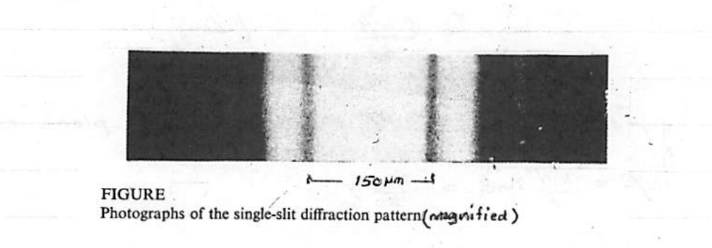

*Figure. Photographs of the single-slit diffraction pattern (magnified). The marked interval is $`150\ \mu m`$.*

---

## Far-Field & Fourier Transform

It can be shown rigorously that the optical "far field" evolves from the original amplitude distribution (at aperture) as a spatial Fourier transform. The single-slit just treated forms an example (see Fig below).

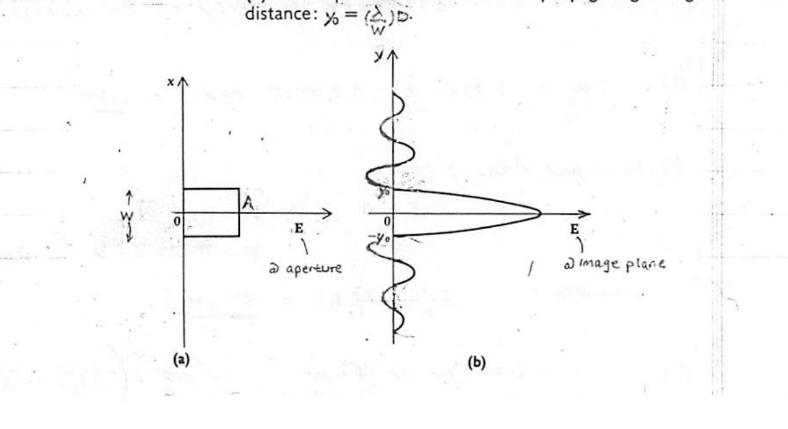

*Figure. (a) Original distribution of the amplitude of a wave. (b) The amplitude of the wave after propagating a long distance: $`y_0 = \left(\dfrac{\lambda}{W}\right)D`$.*

A second example is the multi-slit diffraction grating. Consider a large ($`N \gg 1`$) number of narrow slits of width "$`W`$" and pitch $`d`$ ($`\gg W`$).

Applying the Fourier transform to an optical field made of a train of a very large number ($`N \gg 1`$) of very narrow rectangular apertures (slits), the far-field distribution shown in the Fig below is obtained. Note that $`\lambda\dfrac{D}{W} \gg \lambda\dfrac{D}{d}`$.

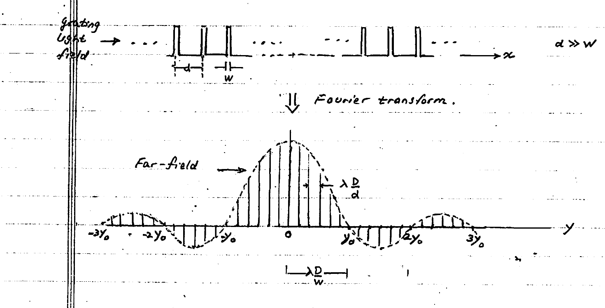

*Far-field (Fourier transform) of a periodic grating field: a series of maxima spaced by $`\lambda\dfrac{D}{d}`$ enveloped by the single-slit $`\mathrm{sinc}`$ of width $`\lambda\dfrac{D}{W}`$ ($`d \gg W`$).*

Referring to the far-field distribution of a grating in Fig 2, one concludes that instead of equal-sized maxima the actual distribution displays a progressive decay in amplitude as shown above. This feature is clearly evident from the photo in Fig 6 showing the far field of a large number $`N = 20`$ of slits.

We conclude that the ordinary grating has a limited number of useful orders of diffraction ($`m`$), and hence a limited capability of serving as a $`\lambda`$-demultiplexer. This gives way to a remarkable device: the **"Arrayed Waveguide Grating"** (AWG).
