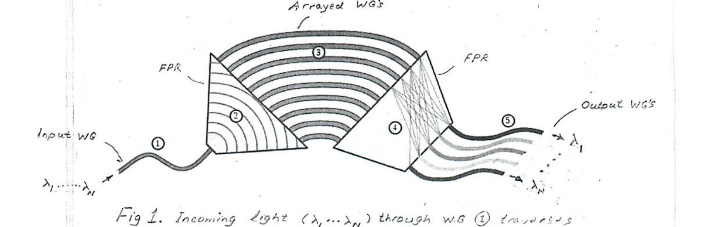
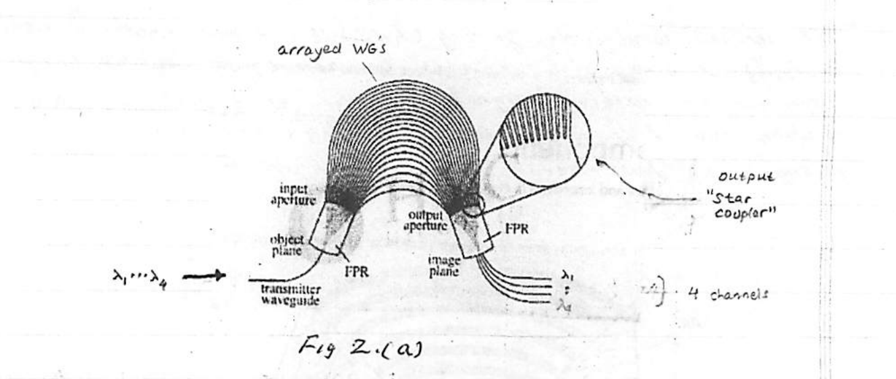
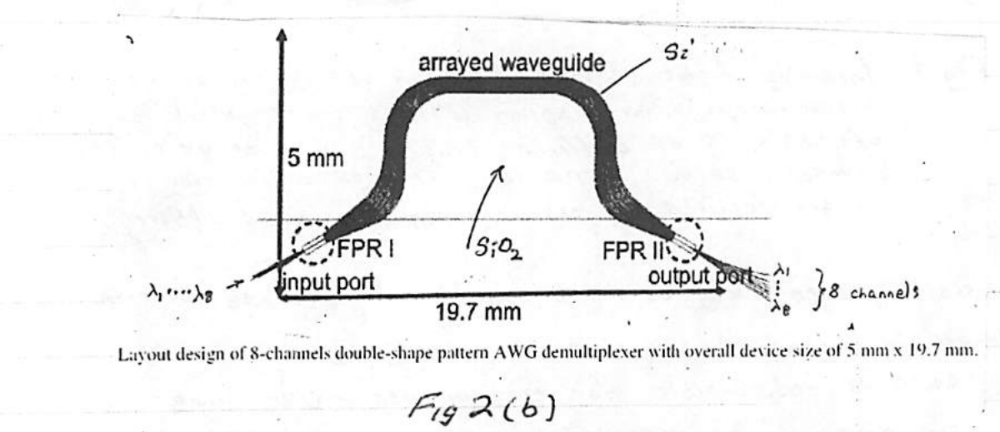
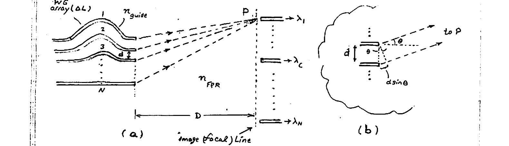
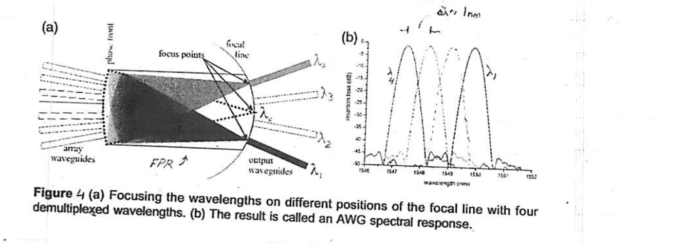
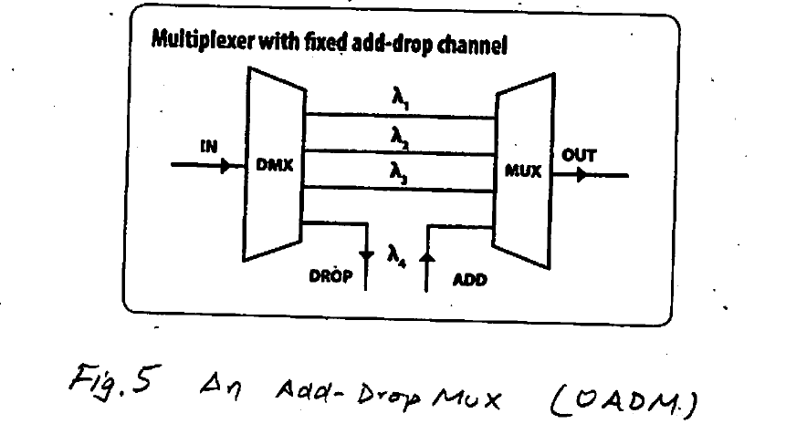

# Lecture 21 — Arrayed Waveguide Grating (AWG)

**EECE 7398 — Analysis & Design of Photonic Integrated Circuits (PICs)** · Northeastern University, Dept. of Electrical & Computer Engineering · Spring 2023

---

## Introduction

The **arrayed waveguide grating (AWG)** is a passive photonic device employing an array of waveguides to effect a spatial (angular) dispersion of multi-$`\lambda`$ signals. At its heart, an AWG functions much like a **diffraction grating**, and hence its name. A simplified AWG structure is shown in Fig 1.



*Fig 1. Incoming light ($`\lambda_1, \dots, \lambda_N`$) through WG ① traverses a free-propagation region (FPR) ②, and enters an array of WG's ③ of different lengths. At its exit, the light traverses a second FPR ④. Through diffraction, the various $`\lambda`$'s are focused on the $`N`$ output WG's ⑤. (Here, $`\lambda_1 < \cdots < \lambda_N`$.)*

As we shall discover, key to AWG operation is a **fixed increment $`\Delta L`$** in the length of adjacent WG's in the array ③. This very feature of the AWG is responsible for two of its major uses in WDM systems: **$`\lambda`$-deMultiplexer**, and **$`\lambda`$-Multiplexer**. What is shown in Fig 1 is a $`\lambda`$-deMUX function. However, by the principle of **OPTICAL RECIPROCITY**, the same device is useful as a **$`\lambda`$-MUX** when operated in reverse: with ⑤ acting as input WG's for $`N`$ monochromatic light beams $`\lambda_1, \dots, \lambda_N`$.

AWG's are made employing few technologies, mainly:

| Technology | Description |
| --- | --- |
| SOI | Silicon on Insulator |
| SOS | Silica on Silicon |
| InP | Indium Phosphide |
| Si₃N₄ | Silicon Nitride |

---

## Typical Structure of Practical AWGs

Fig 2 below shows the typical structure of practical AWGs.\*



*Fig 2.(a) Practical AWG: transmitter waveguide / object plane → input aperture → FPR → arrayed WG's → output aperture / image plane → FPR (output "star coupler") → 4 channels ($`\lambda_1, \dots, \lambda_4`$).*

> **Note:** because of its shape the free propagation region (FPR) is often called a **"star coupler"**.



*Fig 2(b). Layout design of 8-channels double-shape pattern AWG demultiplexer with overall device size of 5 mm × 19.7 mm. Input port ($`\lambda_1 \dots \lambda_8`$) → FPR I → arrayed waveguide (Si core, SiO₂ cladding) → FPR II → output port (8 channels $`\lambda_1 \dots \lambda_8`$).*

Representative parameters (from the margin notes):

- $`\sim 30`$ WG's ($`1\ \mu m \times 12\ \mu m`$)
- $`n_{Si} = 3.40[?]`$
- $`n_{SiO_2} = 1.45`$
- $`\Delta L' = 3.16[?]`$

The above AWG deMUX's are intended for **CWDM** (×4 and ×8 channels). Higher channel counts are also employed (e.g. ×15, ×32, etc.).

> **\* ALTERNATE names:** AWGs are also referred to as **"PHASED ARRAYS"** (PHASARS), and **"WAVEGUIDE GRATING ROUTERS"**.

---

## Operating Principle

Consider the basic AWG structure of Fig 3. Here, the array of WG's at left has $`N`$ waveguides with uniform spacing ($`d`$), and a length which progressively increases at an increment $`\Delta L`$ b/w adjacent waveguides. At a relatively large distance $`D`$ ($`D \gg Nd`$) is the **image (focal) line**, where beams of different $`\lambda`$'s focus after diffraction on the $`N`$ output waveguides. For simplicity, only the diffraction for one wavelength $`\lambda_1`$ (the shortest) is shown, with constructive interference taking place at the field point "$`P`$".



*Fig 3. (a) Analysis of a maximum @ $`P`$ (Note: $`D \gg Nd`$). (b) Detail showing the geometrical part of the pathlength phase delay (the other part is due to $`\Delta L`$).*

For a maximum @ $`P`$ (field point), constructive interference must take place there from each pair of adjacent waveguides of the array. That is

```math
\frac{\Delta L}{v_{\text{guide}}} - \frac{d\sin\theta}{v_{\text{FPR}}} = mT \qquad (1)
```

where $`v_{\text{guide}} = c/n_{\text{guide}}`$, $`v_{\text{FPR}} = c/n_{\text{FPR}}`$, $`T = 1/f`$. Also $`f = c/\lambda`$, where $`\lambda`$ = free-space wavelength, and the integer $`m = 0, 1, 2, 3, \dots`$ is often called the **"diffraction order"**.

Solving for $`\theta`$:

```math
\sin\theta = \frac{\Delta L' - m\lambda}{d\, n_{\text{FPR}}} \qquad (2)
```

where $`\Delta L' = \Delta L \cdot n_{\text{guide}}`$ is the **"optical pathlength increment"**.

Eqn (2) indicates a **spatial** (angular) dispersion of the various wavelengths $`\lambda_1, \dots, \lambda_N`$: upward (larger $`\theta`$) for the shorter $`\lambda`$'s, and downward (smaller or negative $`\theta`$) for the longer $`\lambda`$'s. Conveniently, the **center** wavelength in the group $`\lambda_1, \dots, \lambda_N`$ is chosen to result in $`\theta = 0°`$ — so that an equal number of $`\lambda`$'s are above ($`\theta > 0`$) and below ($`\theta < 0`$) the reference angle $`\theta = 0`$ corresponding to $`\lambda_c`$ (Fig 4):

```math
\theta = 0 \quad \rightarrow \quad \lambda_c = \frac{\Delta L'}{m} \qquad (3)
```

We observe that in order to fabricate\* an AWG with good accuracy, the limited tolerance of the fabrication process would dictate a $`\Delta L'`$ of adequate size. Eqn (3) therefore implies a large integer for $`m`$ (since $`\Delta L' = m\lambda_c`$), for e.g. $`m \approx 10\text{–}100`$ — much larger than for ordinary diffraction gratings. A large $`m`$ is also beneficial for increasing the **"spectral resolution"**, defined as the change in $`\theta`$ per given incremental change in $`\lambda`$ evaluated for $`\lambda_c`$:

### Spectral Resolution

```math
\left| \frac{d\theta}{d\lambda} \right|_{\lambda_c} = \left. \frac{m}{d\, n_{\text{FPR}} \cos\theta} \right|_{\theta = 0} = \frac{m}{d\, n_{\text{FPR}}} \qquad (4)
```

Note also the inverse effect on spectral resolution that the spacing ($`d`$) of the WG array has.

Typical values of $`\Delta L'`$ and $`d`$ are in the ($`\mu m`$) range, with $`\Delta L'`$ being larger than $`d`$.

> **\*** In fabrication, the length of the array waveguides is selected such that $`\Delta L'`$ is an integer multiple of the central wavelength $`\lambda_c`$.

---

## Spectral Response

The dispersion of the different $`\lambda`$'s by the AWG is often plotted as a **"spectral response"**. An example is given in Fig 4. Here, for simplicity, a deMUX operation for $`N = 4`$ is shown ($`\lambda_4 < \lambda_3 \cdots < \lambda_1`$).



*Figure 4. (a) Focusing the wavelengths on different positions of the focal line with four demultiplexed wavelengths. (b) The result is called an AWG spectral response.*

Note the high spectral resolution of $`\Delta\lambda = 1\ \text{nm}`$ obtainable.

---

## Example

Consider an AWG for deMUX application for NTU's 8-channel CWDM grid (1471–1611) nm with 20 nm spacing and center wavelength $`\lambda_c = 1551\ \text{nm}`$.

**SOI technology:**

- $`\Delta L = 15\ \mu m`$
- $`n_{\text{FPR}} = n_{SiO_2} = 1.45`$, $`\quad n_{\text{guide}} \approx n_{Si} = 3.45`$
- $`d = 6\ \mu m`$

NTU grid (nm): 1471, 1491, 1511, 1531, **1551** ($`\lambda_c`$), 1571, 1591, 1611.

**Determine:**

a) Spectral resolution @ $`\lambda_c`$
b) Span $`\theta_{\min}`$, $`\theta_{\max}`$ for the NTU CWDM given.
c) $`\Delta\theta`$ b/w adjacent channels
d) $`\Delta x`$ —"— for $`D = 200\ \mu m`$ (FPR)

### Solution

**a)** Spectral resolution:

```math
\left| \frac{d\theta}{d\lambda} \right|_{\lambda_c} = \frac{m}{d\, n_{\text{FPR}}}
```

First find $`m`$ from $`\lambda_c = \dfrac{\Delta L'}{m}`$:

```math
\Delta L' = \Delta L \times n_{\text{guide}} = 15 \times 3.45 = 51.8\ \mu m
```

```math
m = \frac{\Delta L'}{\lambda_c} = \frac{\Delta L\, n_{\text{guide}}}{\lambda_c} = 33
```

```math
\left| \frac{d\theta}{d\lambda} \right|_{\lambda_c} = \frac{33}{6 \times 1.45} = 2.62 \times 10^{-3}\ \text{rad/nm} \quad (\approx 0.15\ °/\text{nm})
```

**b)** Span of angles:

```math
\sin\theta_{\max} = \frac{\Delta L' - m\lambda_{\min}}{d\, n_{\text{FPR}}} = \frac{51.8 - 33 \times 1.471}{6 \times 1.45} = 0.307 \quad (\theta_{\max} \approx 17.9°)
```

```math
\sin\theta_{\min} = \frac{\Delta L' - m\lambda_{\max}}{d\, n_{\text{FPR}}} = \frac{51.8 - 33 \times 1.611}{6 \times 1.45} = -0.23 \quad (\theta_{\min} \approx -13.3°)
```

**c)** Angle between adjacent channels:

```math
\Delta\theta = \left| \frac{d\theta}{d\lambda} \right|_{\lambda_c} \times \Delta\lambda = 2.62 \times 10^{-3} \times 20 = 0.0524\ \text{rad} = \underline{3.0°}
```

**d)** Spatial separation on the focal line:

```math
\Delta x \approx \Delta\theta \times D = 0.0524 \times 200\ \mu m = \underline{\underline{10.5\ \mu m}}
```

---

## Applications

- Mux / deMux for WDM.
- Spectroscopy
- Optical Add/Drop MUX (OADM)

AWGs applications range from simple add/drop multiplexers to complex cross-connects in optical telecom systems.

An important application area is the **WDM-based Passive Optical Networks (PONs)**. In this technology multiple WDM channels are transmitted on optical fibers carrying content (info) to different subscribers. Using deMUX and imaging properties of an AWG, specific channels ($`\lambda`$'s) can be directed (dropped) to different subscribers. Similarly, input channels can be added for further transmission on the fiber (Fig 5).



*Fig 5. An Add-Drop Mux (OADM). A multiplexer with fixed add-drop channel: IN → DMX passes $`\lambda_1, \lambda_2, \lambda_3`$ to MUX → OUT, while $`\lambda_4`$ is dropped and added at the DROP/ADD ports.*
