# Lecture 22 — Photonic Routers

**EECE 7398 — PICs** · Northeastern University, ECE · Spring 2023

---

## Photonic On-Chip Networks — Background

### Multi-core Chips: A Necessity

- Need for explosive computational power
  - Consumer / entertainment applications
  - Scientific applications
- Increasing clock frequency is not possible, as it increases power dissipation

$`\Rightarrow`$ **Solution: Core-level parallelism** — distribute tasks to multiple cores.*

> \* Aka **CMP** ("Chip Multi-Processor").

---

## Challenges: Interconnection of Cores

- **Traditional interconnect\* architectures are not scalable**
  - Delay limits the number of cores

> \* Bus-based interconnect.

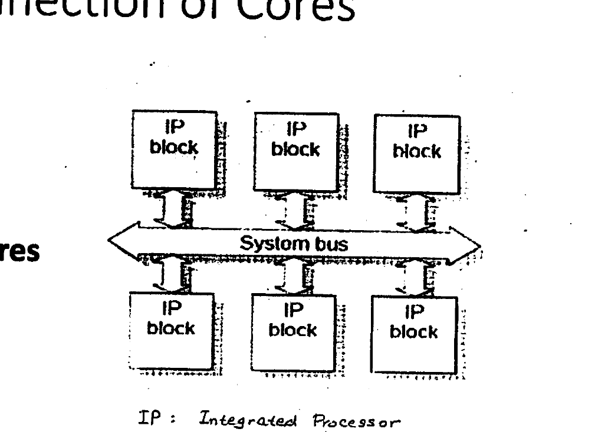

*Fig 1. Traditional bus-based interconnect: IP blocks tied to a shared system bus. (IP: Integrated Processor.)*

$`\Rightarrow`$ **Solution:** a scalable interconnect infrastructure for communication.

---

## Network-on-Chip (NoC)

- Packet-based on-chip network
- Dedicated infrastructure for data transport
  - Decoupling of functionality from communication
  - A plug-and-play network independent of the cores

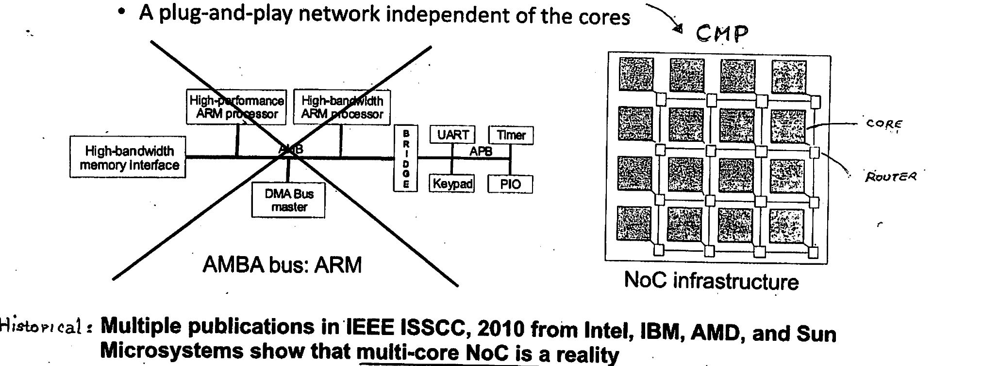

*Fig 2. Left: an AMBA bus (ARM) architecture. Right: an NoC infrastructure for a CMP — a 2-D array of cores, each attached to a router.*

> **Historical:** Multiple publications in *IEEE ISSCC, 2010* from Intel, IBM, AMD, and Sun Microsystems show that **multi-core NoC is a reality**.

---

## Topology

- **Regular topology:** each node has the same number of neighbors.
- **Example:** 2D mesh, 2D torus.

---

## 2D Mesh

- Simplest and most popular topology for NoCs.
- Every switch, except those at the edges, is connected to four neighboring switches and one node (core).

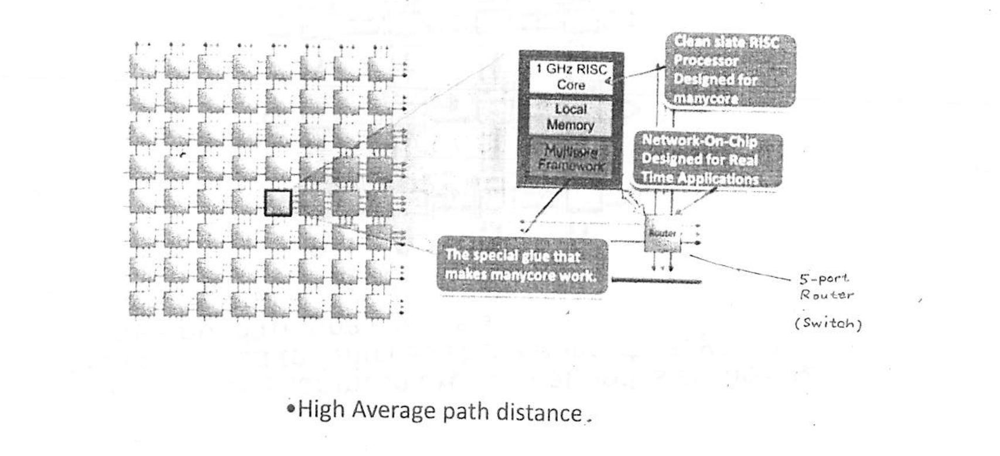

*Fig 3. 2D mesh: each node couples a 1 GHz RISC core + local memory + multicore framework to a 5-port router (switch). The router is "the special glue that makes manycore work."*

- High average path distance.

---

## 2D Torus

- Layout of a regular mesh except that nodes at the edges are connected to switches at the opposite edge via "wrap-around" routing channels.
- Every switch has five ports.

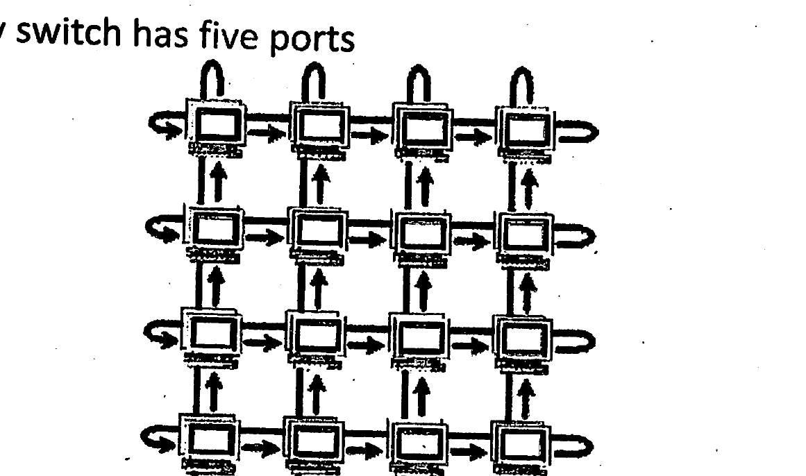

*Fig 4. 2D torus: a mesh with wrap-around links at the edges.*

- Long links $`\rightarrow`$ high delay and high power dissipation.

---

## Typical NoC Packet Format

A packet is divided into a **Header**, a **Payload**, and a **Tail**.

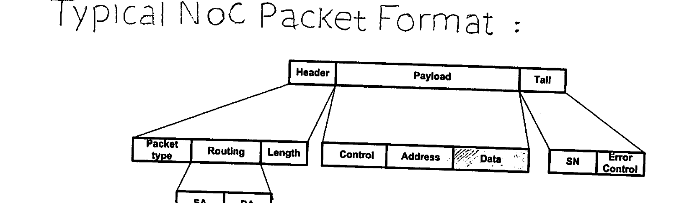

*Fig 5. Typical NoC packet: Header (Packet type, Routing, Length) → SA, DA; Payload (Control, Address, Data); Tail (SN, Error Control).*

- **Header**
  - Routing and network control information.
  - In the case of distributed routing, the information required is the destination and source addresses (DA & SA).
  - In the case of source routing, the complete routing information is written.
  - In the case of variable packet size, a length field is required (# bytes in "Data" section = 46–1500).
- **Payload**
- **Tail**
  - Sequence number (SN).
  - Error control fields such as hamming code or CRC fields.*

> \* **CRC:** Cyclic Redundancy Check — carries integrity of received data by providing error detection.

---

## Optical Network on a Chip (NOCs)

A number of network topologies have been proposed for building efficient photonic networks on a chip (NOCs): mesh, torus, crossbar, fat-tree, Clos, etc. Based on configurability of the routing patterns, these networks may be grouped into two categories: **FIXED** and **SWITCHED**.

### Fixed Networks

A **fixed network** is a wavelength-selective passive optical network possessing a fixed routing pattern, defined at the initial design of the network. The route between a source and a destination is established through selection of a specific wavelength of the source or the destination. Such a network is often referred to as a **passive optical network**, or **PON**. It is worth noting that a PON requires multiple laser wavelengths — one per source/destination.

### Switching Networks

Here, the routing pattern is dynamic and is set through a separate electronically-controlled network. In comparison, the "fixed network" appears to have lower latency due to its passive nature. This suggests that the time it takes to select a specific wavelength is shorter than the time required for configuring the "switching network". However, because the switching network has the ability to accommodate multiple-wavelength WDM signals, it has a superior aggregate bandwidth. Furthermore, the switching network generally has a compact footprint and better scalability. Finally, while a PON network requires a multiplicity of laser sources/wavelengths (one per channel), a switched network can operate on a single $`\lambda`$, calling for a single laser source.

Since a Chip Multiprocessor (CMP) typically consists of a 2-D array (grid) of identical general-purpose processors, it follows that photonic networks for CMPs would also employ a 2-D regular topology. Two such topologies are shown in **Fig 1**: a) Mesh and b) Torus.

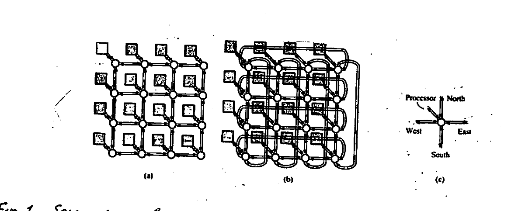

*Fig 1. Schematics of 2-D ×16 multi-core CMPs with topologies: (a) mesh, (b) torus. A photonic router is shown in (c) (with Processor / North–East–South–West ports).*

Note that each link b/w routers — as well as b/w a processor and a router — is composed of two "directional" waveguides for two-way communications. Also note the five directional ports of the optical router (to 4 adjacent routers) plus one O-E/E-O connection to a processor. An opto-electronic / electro-optical interface circuit is shown in detail in **Fig 2**. Note that a serializer and deserializer are needed on the $`T_x`$ side & $`R_x`$ side, respectively.

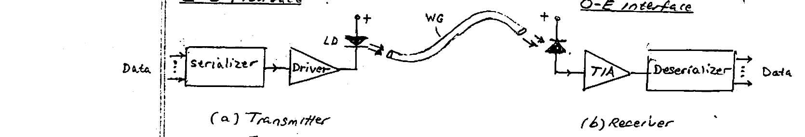

*Fig 2. E-O (Tx) interface (a), and O-E (Rx) interface (b). (a) Transmitter: Data → Serializer → Driver → LD → WG. (b) Receiver: WG → photodiode → TIA → Deserializer → Data.*

In contrast to the fixed routing path in PON networks, here in a switching network the routing path from a source to a destination is dynamically reconfigurable through electronic-control circuitry.

---

## Photonic Integrated Routers

On-chip optical networks may be viewed as a micro-scale extension of the large-scale optical network employed for data communications over distance.

Just as optical fiber outperforms previously-employed copper wires, here too optical on-chip networks based on Si-WGs outperform their electronic (wire-based) counterparts. Optical on-chip networks excel in three areas: **bandwidth**, **power efficiency**, and **latency**. Thanks to optical networks on a chip (NOC), highly efficient communication can be realized in a CMP among its different cores and between the cores and memory.

Typically, a NOC is a **"switch-fabric"** composed of a number of planar interconnected routers, each containing four bidirectional waveguide connections to four adjacent routers (directions: East–West–North–South), and a near core processor. The latter connection, by necessity, is a mixed E-O/O-E interconnect. Unlike electrical-wires, here optical waveguide crossings (intersections) are permissible since in principle two light beams crossing paths do not interact or result in interference!

Light signals travelling over WGs may be switched b/w two WGs using an **MRR-based switch element (SE)** in which the WGs are parallel or cross (intersect), as illustrated in **Fig 3**.

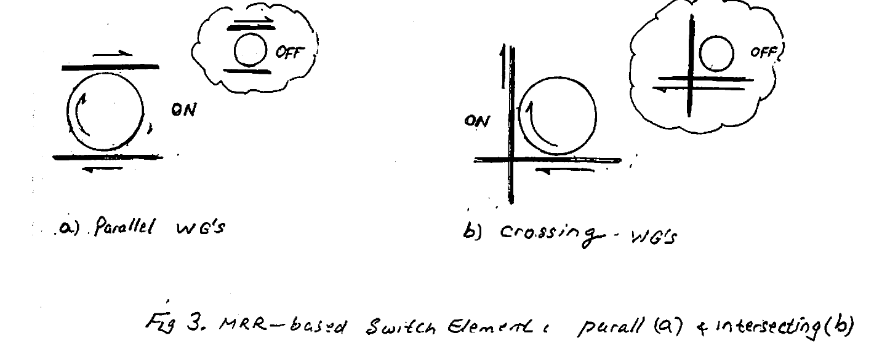

*Fig 3. MRR-based switch element: parallel (a) & intersecting (b) waveguides, each shown in ON and OFF states.*

We turn next to the design of the photonic routers to be employed in the NOC. As these are many (e.g. 16 in Fig 1), an area-efficient switching element must be employed for integration on a Si-chip: a microring-resonator (MRR) based switch. Its small size* (radius, $`R \sim`$ few $`\mu`$m's) makes it suitable for integration in large numbers to build routers.

> \* Size considerations rule out a Mach–Zehnder-based switch. Recall a typical MZI requires $`\sim`$1 mm (1000 $`\mu`$m's)!

### Example

Shown in **Fig 4** is the schematic layout of a five-port on-chip optical router. It contains 16 (identical) MRR, and 14 crossings.* All microrings are activated (switched) employing microheaters. For the sake of simplicity, the network of microheaters has been omitted.

In addition to single-$`\lambda`$ operation (@ 1.5 $`\mu`$m), the router can operate w/ a WDM signal w/ channel-spacing equal to the FSR of the MRR.

**Important:** Router operation must avoid malfunction occurring due to "contentions" or "blockings".

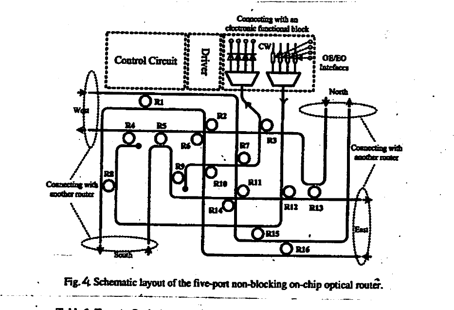

*Fig 4. Schematic layout of the five-port non-blocking on-chip optical router (rings R1–R16, with Control Circuit, Driver, CW source, and OE/EO interfaces).*

> \* In practice, crossings do not behave ideally, and cause some of the following impairments: transmission/reflection loss + crosstalk. Sometimes special structures are employed to minimize these impairments.

**Table 1. Twenty Optical Links of the Five-Port Non-Blocking Optical Router**

| Output \ Input | East | South | West | North | Center |
| --- | --- | --- | --- | --- | --- |
| **East**   | — | None | R11 | R13 | R12 |
| **South**  | None | — | R1 | R2 | R8 |
| **West**   | R6 | R5 | — | None | R4 |
| **North**  | R16 | R14 | None | — | R15 |
| **Center** | R10 | R9 | R7 | R3 | — |

Examining Fig 4 reveals that there are 20 possible optical links or light-paths: 5 input ports × 4 output ports ("self-links" excluded). In Table 1, the MRR switch element controlling each link has been labeled $`R_j`$ ($`j = 1, \ldots, 16`$). Here, "none" implies no switch necessary.

It is noteworthy that:

1. "Port-to-itself" links are absent.
2. To economize with # MRR switches (chip area) and power consumption, one of each of the remaining four destinations is made permanent — thereby not requiring an MRR switch. This is labeled in Table 1 as "none".
3. All MRRs used are identical (radius = 10 $`\mu`$m, and 0.22 $`\mu`$m gaps to WGs).

It is instructive for the reader, as an exercise, to verify to their satisfaction the detailed switching function of the router (Table 1).

Other 5-port router designs are also possible, but striving to keep the number of MRR switches and crossings low has the advantage of reduced chip area, reduced power consumption (e.g. by the heaters), and reduced crosstalk and insertion loss.

Another aspect worth noting of the router layout is a careful arrangement of its five ports' locations & orientation so as to mesh smoothly with the four neighboring routers. Finally, the optical router is not restricted to a single-wavelength signal; it is also useful for WDM signals with a channel spacing made to match the FSR of the MRR.

### "Blocking" & "Non-Blocking"

A router is categorized as **"non-blocking"** when each in–out combo has a separate dedicated physical link to realize it.

Non-blocking implies absence of contention or concurrent overlap of optical paths. Thus, signal packets originating at two input ports may not be destined to the same output port: in a non-blocking router every input–output connection pattern can be properly realized.

If some in–out interconnection pattern cannot be realized, the router is termed **"blocking"**.

---

## Fabrication

The photonic NOC comprising the interconnected routers is fabricated in the **SOI** platform for compatibility with the CMOS process used to fabricate the multi-core processors (CMP). A crossection of the SOI platform is given in **Fig 5**. Here, the top 220 nm Si layer is employed for patterning the MRRs & optical waveguides (links), as well as transistors (MOSFETs). On top of a 1 $`\mu`$m layer of SiO$`_2`$ cladding, deposited is a Titanium heater pattern.

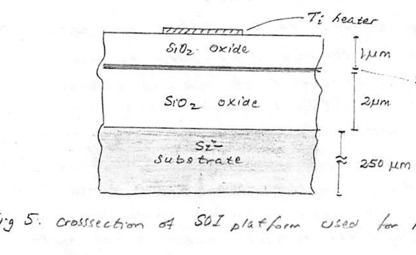

*Fig 5. Cross-section of SOI platform used for routers: Ti heater on 1 $`\mu`$m SiO$`_2`$ oxide; 220 nm Si device layer; 2 $`\mu`$m SiO$`_2`$ buried oxide; $`\approx`$ 250 $`\mu`$m Si substrate.*

One of the MRR-based routers is shown in **Fig 6**. The white (aluminum) traces are used for implementing pads and interconnects to deliver electric power to the Ti microheaters positioned directly above microrings. Note the orientation of the "West" port in relation to the remaining four ports: "Center, North, East, and South". The size of the chip is about $`400 \times 600`$ ($`\mu`$m)$`^2`$. The chip size is influenced in part by the distancing of adjacent ring heaters for minimizing thermal crosstalk.

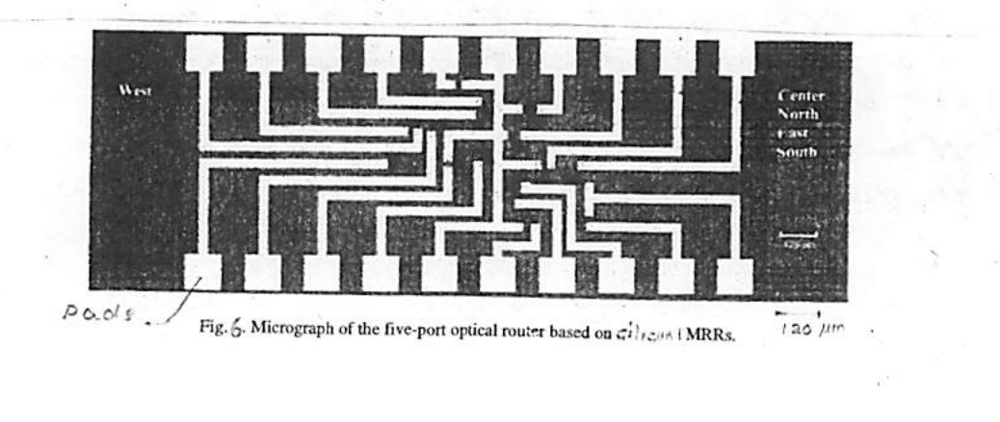

*Fig 6. Micrograph of the five-port optical router based on silicon MRRs (pads visible; scale bar ≈ 120 $`\mu`$m).*

---

## Appendix

### 8.10 Data Packets

The previous sections described data transmission between two linked devices such as modems with a dedicated connection. The modems transmitted each data byte separately, packaged within a data character with additional start, parity, and stop bits. This method is inefficient and time consuming when we need to send large quantities of data. More efficient data transmission occurs over networks of interconnected computers, in which data are packaged into multiple-byte units called **data packets**. A commonly-used structure for data packets contains the five parts, or **fields**, shown in Figure 8.17.

These include:

1. The **address** field contains the routing information about the desired destination and the source return address.
2. The **data length** field indicates the number of bytes in the data section.
3. The **tag** indicates the packet number when the transmitted data occupy more than one packet.
4. The **data** field contains the information to be transmitted.
5. The **cyclic redundancy check (CRC)** field verifies the integrity of the received data by performing error detection.

Let us describe each field separately.

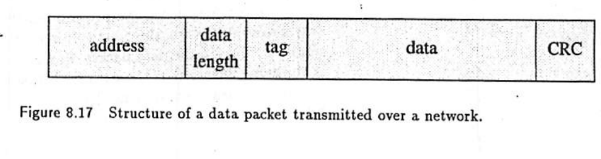

*Figure 8.17. Structure of a data packet transmitted over a network ("datagram"): address | data length | tag | data | CRC.*

**Address.** The address field contains the routing information about the destination and the address of the source. An address is similar to a telephone number in that the network can decode it to find the desired destination. The address usually conforms to some **hierarchy** that directs the packet through the network.

For example, consider the hierarchical structure of the telephone system in a large company. To reach another telephone within the company, employees commonly dial the last 4 digits of the standard 7-digit telephone number. To reach a local outside number, employees must first dial a dedicated number, such as 9, followed by the 7-digit telephone number. For a long-distance call, they must dial 9 usually followed by a 1, a 3-digit area code, and the 7-digit number. The telephone company interprets the leading 1 as a long-distance call. The same way that such dedicated numbers in specific locations indicate the number of digits needed to complete a valid telephone call, dedicated numbers enable the length of the destination address to be variable, yet still indicate the address portion of the packet.

**Data length.** This field indicates the number of bytes in the data section. The length of data is an important consideration for the efficient operation of the computer network. The network can transmit data 1 byte (8 bits) at a time, but this is inefficient because each packet would contain more bits than the data. Large data files, on the other hand, have the disadvantage that they occupy the link between computers for a long time. This delays other computers from communicating over the link. To more equally distribute communication time among computers, large data files are split up into smaller chunks and each chunk is transmitted in a separate **packet**. This prevents a data file from using a communication link for a long time. As a tradeoff, data lengths range between 46 and 1,500 bytes.

**Tag.** The tag field contains a number that indexes the data packet. In a large computer network, multiple paths might exist from the source to the destination. When a large data file is split into many data packets, one packet might encounter a slow path and arrive at the destination after a packet that was transmitted at a later time. The destination must then sort the packets into the correct order based on the tag of the data packet. In simple networks, the tag can be a single byte that takes on the numbers from 0 to 255.

**Data field.** The data field contains the information to be transmitted. For Internet applications (described below), the data segment is approximately 500 bytes. This size tends to travel over most current networks most efficiently. Dividing the information into shorter data segments would require additional packets to be transmitted, while larger data segments would cause delays for access to communication links, slowing the network.

**Cyclic redundancy check (CRC).** The CRC field checks the integrity of the received data by providing error detection. The CRC is usually a 1-byte number between 0 and 255 computed at the source by simply adding up all the 1s bits that are in the data and retaining the smallest 8 bits of the sum. That is, the CRC equals the modulo-256 value of the sum. The data packet transmits this result along with the data. At the destination, the receiver repeats the calculation on the received data and then compares it with the received CRC value. If the two values match, the probability is quite high that the received data contain no errors.

Previously, data packets used a parity bit for error detection. Parity bits are appropriate when errors are rare and mostly single errors occur. When data packets travel over a network, the most common errors are **burst errors**, which affect a large number of bits in the data packet. Burst errors arise when a disturbance occurs that is the same duration as the data packet, such as a lighting strike or the application of power to heavy equipment. The CRC detects burst errors better than the parity bit.

### 8.11 Data Networks

Data networks come in two main types, local and wide area. A **local-area network (LAN)** usually connects computers and peripheral devices, such as printers and large disk memories, within one location where the communication is over short distances, such as a laboratory, office, or factory. A **wide-area network (WAN)** connects devices across the city, state, or nation, where data communication occurs over long distances. The most common WAN is the international network known as the Internet.

Because it is internal to a location, the LAN can use various means, or **protocols**, to transfer data, depending on the data transmitted and the speed required. For example, a bank typically transfers small quantities of data such as account status, while hospitals typically transmit large amounts of data, such as medical images. Because many companies use wide-area networks (WANs), the computer industry has established a standard protocol, as described below.

#### Local-Area Network

Offices tend to interconnect computers with a local-area network, sometimes called an **intranet**. Figure 8.18 shows the three most common intranet configurations, or **architectures**, used to interconnect computers.

**Star architecture.** All the nodes connect to a hub computer, called a **server**, which contains all the information about communicating with each node, such as address and communication speed. In its simplest form, the server receives data, determines the destination node, and forwards the data only to the intended node. As more nodes are added to the system, the possibility increases of two or more data packets arriving simultaneously. The server tries to resolve these conflicts by transmitting the higher priority data packet first. When the destination node accepts a data packet, it sends an acknowledgment to the server. If the destination node is not working or turned off, the server can store the data packet and forward it when the destination node is operational again. Because all communication is performed through the server and accomplished in two hops, the first to the server followed by the second to the node, this star architecture **is fast**. However, all communication stops if the server fails. Also, to add another node, a connection must be made directly to the server, which may be located at some distance and may limit the number of nodes because of server port limitations.

**Bus architecture.** The bus is the **most common LAN**. All the nodes connect to the same data bus and receive the same data. An individual node must recognize which data are meant for it, using the address contained in the received data packet. Each node can also transmit data directly onto the bus. These transmissions occur in spurts and are usually short enough so the probability that two nodes transmit data at the same time is very small. Unlike the star architecture, the bus architecture does not require a separate server but instead places a communication component on each node. The bus architecture has a number of advantages. Additional nodes are added simply by connecting a computer onto the bus. The bus is highly reliable because it remains operational when a node fails or is turned off. Also, because the data packets go to all the nodes simultaneously, the communication is fast, being accomplished in one hop, and independent of the number of nodes on the bus.

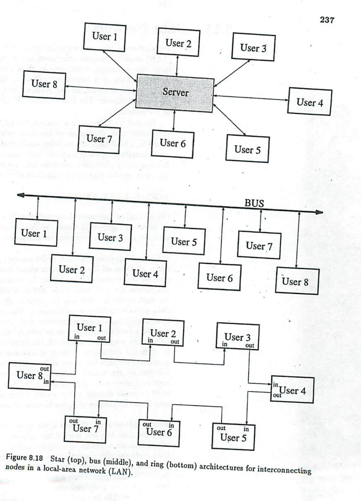

*Figure 8.18. Star (top), bus (middle), and ring (bottom) architectures for interconnecting nodes in a local-area network (LAN).*

**Ring architecture.** Each node connects to its two neighboring nodes so all the nodes form a loop. The data packets flow around the loop in one direction, and each node receives and processes the data. If the packet destination address corresponds to the node address, the node accepts the packet, removes it from the ring, and transmits an acknowledgment. If the packet destination address does not match the node address, the node transmits the data packet to the next node on the ring. Each node has temporary memory, called a **buffer**. When a node wants to transmit a data packet, it stores incoming data packets in the buffer, while it transmits its own packet. Each data packet also contains the address of the originating node. When a data packet returns to the originating node, it is removed from the ring and transmitted again at a later time. Like the bus architecture, the ring architecture does not require a separate server. The ring performs properly only when all the nodes are operational. One malfunctioning node will cause all two-way communications to cease. When a node is turned off, the communications component disconnects the node by connecting its input directly to the output. Because the data packet may go through all but one of the nodes before reaching its destination, the communication delay depends on the number of nodes in the ring. In a ring containing $`N`$ nodes, the average communication occurs in $`N/2`$ hops.

#### Wide-Area Network

A typical wide-area data network is a dynamic changing environment that consists of many switching computers, or **routers**, between the source and the destination, as shown in Figure 8.19. Moving data packets through a wide-area network is called **packet switching**. A large data file is transmitted by splitting the data up into multiple data packets. In a large-area network each individual packet can travel different paths, using a different set of routers to get from source to destination (indicated by the dotted lines).

These routers form multiple redundant communication links with their neighbors. Such a flexible architecture is important to maintain the integrity of the data communication system. Multiple redundant interconnections enable the network to function even when one router or link is not operating. The exact path of a particular packet in the network is often chosen **at random**, because deterministic routing schemes usually cause bottlenecks. More sophisticated networks monitor the traffic and select the fastest paths available. However, monitoring requires additional circuits and time, contributing to a more expensive network.

Because the destination address is part of each packet, data packets can travel over any available path that links the source with the destination. When packets travel by different paths, random delays in each path cause packets to arrive at random times. The tag in the data packet allows the destination to arrange the packets in the proper order (see Fig. 8.17).

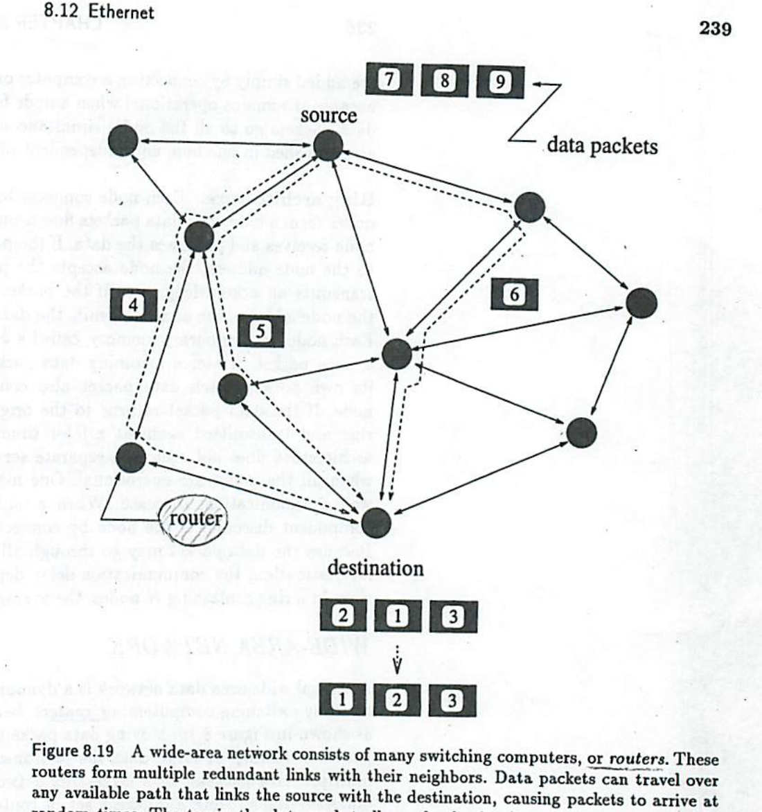

*Figure 8.19. A wide-area network consists of many switching computers, or routers. These routers form multiple redundant links with their neighbors. Data packets can travel over any available path that links the source with the destination, causing packets to arrive at random times. The tag in the data packet allows the destination to arrange the packets in the proper order.*

### 8.12 Ethernet

The most common communication channel for transmitting data packets is called **Ethernet**. Standard Ethernet has a capacity of 10 million bps. As communication capacity requirements increased, **Fast Ethernet**, which has a capacity of 100 million bps, was developed. The even faster **Gigabit Ethernet** (Gig-E) has a capacity of 1 billion bps.

We can achieve such fast data rates with special data signals. These signals use two wires to transmit data and two wires to receive data, in addition to a ground wire. Such data communication is not possible with modems over standard telephone lines. We need dedicated cables (typically coaxial cables or twisted pair) to interconnect computers directly. Ethernet LANs are usually implemented in **bus** architecture. Bridge computers are used to interconnect individual Ethernet LANs into larger WANs.

A computer connects to an Ethernet network through a special **network interface card (NIC)**, which packages the data bytes from the computer into data packets. At the receiving end, typically another computer, an identical NIC receives the data packets, checks the packets for errors, removes the packaging information, and delivers the data bytes. These NICs enable us to transmit a data file over Ethernet as simply as we transfer a data file to disk.

Each data packet on Ethernet contains the following fields:

1. A **preamble** that consists of seven repetitions of 10101010, to synchronize the receiver. (7 bytes)
2. A **start byte** with the value 10101011 to indicate the start of the information fields. (1 byte)
3. A **destination address.** (6 bytes)
4. A **source address.** (6 bytes)
5. A **tag/length** field that indicates the packet number and the length of the data. (2 bytes)
6. **Data** that vary from 46 to 1,500 bytes.
7. A **cyclic redundancy check (CRC)** for error detection. (4 bytes)

Each data packet has an overhead of 26 additional bytes.
