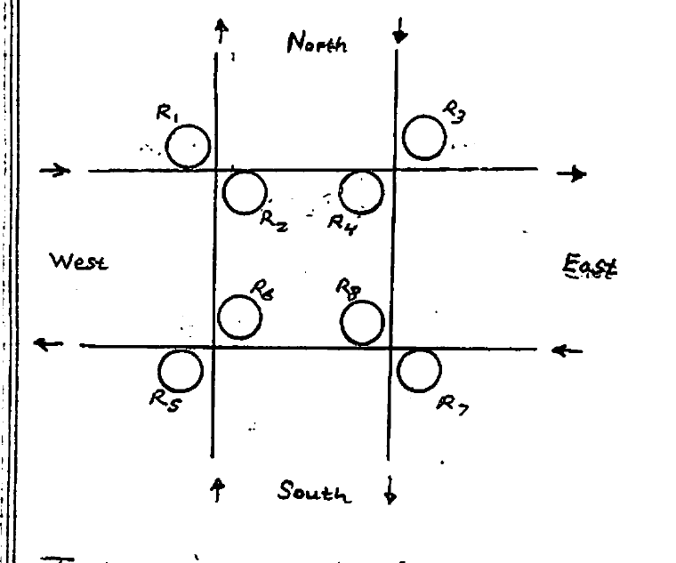
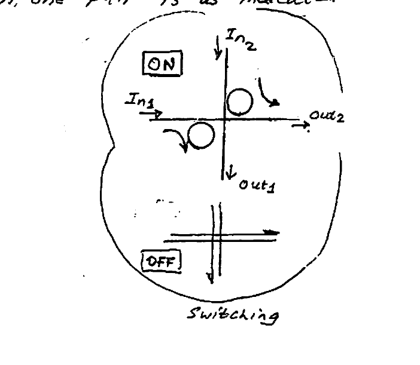
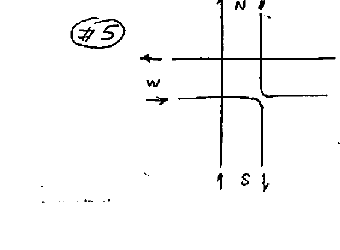
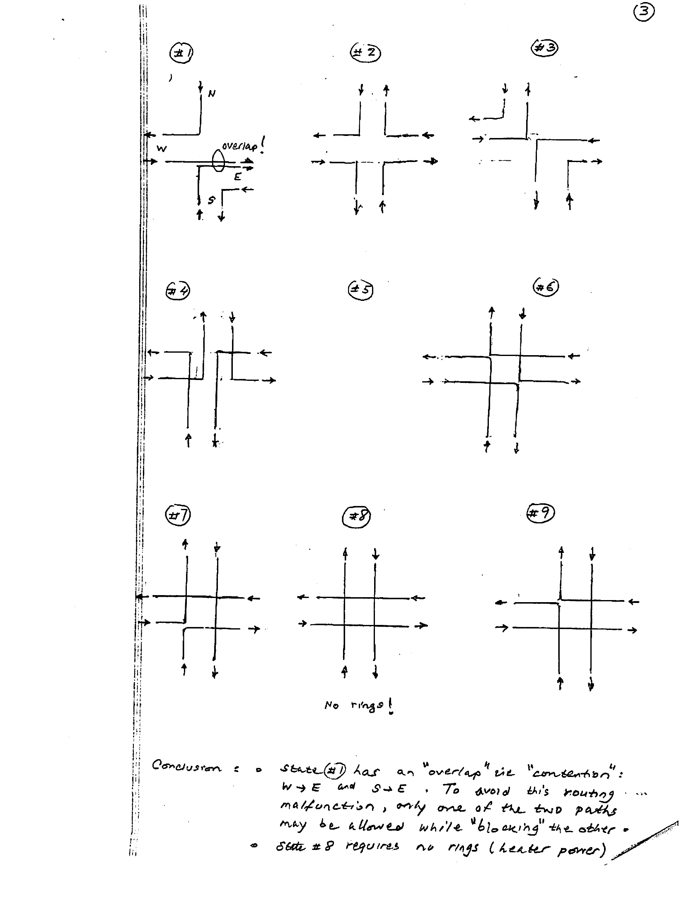

# Lecture 23 — Photonic Routers (Quiz)

**EECE 7398 — Analysis & Design of Photonic Integrated Circuits (PICs)** · Northeastern University, Dept. of Electrical & Computer Engineering · Spring 2023

**— EXERCISE —**

---

## Problem Setup

Consider a simple **4-port router** in which **8 MRR switches** are employed in the topology shown. The four directions (**E, W, N, S**) each have a pair of I–O ports. The MRR switches are implemented by $\times 4$ **"diagonal" pairs of rings** $R_j, R_{j+1}$ ($j = 1, 3, 5, 7$), as shown. The ON/OFF switching of one pair is as indicated in the inset.

*Fig 1. Topology of the 4-port router. Eight microring resonators $R_1$–$R_8$ are arranged as four diagonal pairs at the crossings of the N, S, E, W bidirectional ports.*

*Fig 2. Switching of one ring pair (inset). When **ON**, the rings couple $\text{In}_1 \rightarrow \text{out}_2$ and $\text{In}_2 \rightarrow \text{out}_1$ (the signals turn the corner). When **OFF**, the signals pass straight through without coupling.*

### Task

Investigate the operation & feasibility of the router per the following guidelines.

Prohibited in router operation is a **"return" to the port of origin** (i.e. a U-turn). Thus, each input direction will have available only **3** $(4-1)$ output directions, adding up to a total of $4 \times 3 = 12$ optical paths (see I–O table below).

---

## A) Ring-Pair I–O Table

Complete the table by entering in each empty box the corresponding ring-pair $R_{j,\,j+1}$ ($j = 1, 3, 5, 7$). Shaded diagonal cells are the prohibited U-turns; "none" denotes a straight-through path that requires no ring.

| Output \ Input | **N** | **S** | **E** | **W** |
| --- | --- | --- | --- | --- |
| **N** | — *(U-turn)* | none | $R_{5,6}$ | $R_{1,2}$ |
| **S** | none | — *(U-turn)* | $R_{7,8}$ | $R_{3,4}$ |
| **E** | $R_{3,4}$ | $R_{1,2}$ | — *(U-turn)* | none |
| **W** | $R_{7,8}$ | $R_{5,6}$ | none | — *(U-turn)* |

*I–O Table — ring-pair used for each input→output direction.*

---

## B) The 9-State Table

When the different I–O paths are operated **in parallel** (concurrently) there can be **no overlap** (contention). To investigate this, the 9-state table below is provided. (A **"state"** here is defined by **4 optical paths**.)

Complete the table by entering the multiple ring-pairs used for each state; write these in the order of the input directions given in the table (**N S E W**).

| State | N → | S → | E → | W → | Rings used (N, S, E, W) |
| --- | --- | --- | --- | --- | --- |
| 1 | W | E | S | E | $R_{7,8}$, $R_{1,2}$, $R_{7,8}$, none |
| 2 | W | E | N | S | $R_{7,8}$, $R_{1,2}$, $R_{5,6}$, $R_{3,4}$ |
| 3 | W | E | S | N | $R_{7,8}$, $R_{1,2}$, $R_{7,8}$, $R_{1,2}$ |
| 4 | E | W | S | N | $R_{3,4}$, $R_{5,6}$, $R_{7,8}$, $R_{1,2}$ |
| 5 | E | N | W | S | $R_{3,4}$, none, none, $R_{3,4}$ |
| 6 | E | W | N | S | $R_{3,4}$, $R_{5,6}$, $R_{5,6}$, $R_{3,4}$ |
| 7 | S | E | W | N | none, $R_{1,2}$, none, $R_{1,2}$ |
| 8 | S | N | W | E | none, none, none, none |
| 9 | S | W | N | E | none, $R_{5,6}$, $R_{5,6}$, none |

*I–O Table — each row gives, for inputs N/S/E/W, the chosen output direction and the corresponding ring-pairs.*

---

## C) Generic Diagrams of the Optical Paths

Sketch a **"generic diagram"** depicting the optical paths for each of the 9 states in the above table.

As an example, here is the generic diagram of the optical paths for **state #5**:

*Fig 3. Generic diagram of the optical paths for state #5 (N→E, S→N, E→W, W→S).*

The generic diagrams for all nine states are shown below.

*Fig 4. Generic diagrams of the optical paths for states #1 through #9. State #1 is annotated with the "overlap!" of the W→E and S→E paths; state #8 is annotated "No rings!".*

**Conclusion:**

- State **#1** has an **"overlap"** (i.e. **"contention"**): **W→E** and **S→E**. To avoid this routing malfunction, only one of the two paths may be allowed while **"blocking"** the other.
- State **#8** requires **no rings** (heater power).

---

## D) Analysis of Results

Based on your results in C):

**I)** Is the router **"hitless"** (i.e. nonoverlapping / contentionless)?

- ☐ yes  ☐ No

**II)** If it is not hitless, indicate which state results in an overlap (contention).

**III)** Do two signals originating at different input ports arrive at the same output port?

- ☐ yes  ☐ No

If yes, identify the **"state"** as well as the ports involved.

**IV)** Assume rings are activated by an embedded **microheater**, through the **thermo-optic (T–O) effect**. What is the number of **power-saving I–O paths** requiring **no MRR switches**? What are they?
