# Lecture 24 — Photonic SERDES

**EECE 7398 — The Electronics of High-Speed Digital IC Design** · Northeastern University, Dept. of Electrical & Computer Engineering · Spring 2023

---

## Introduction

With **speed** being the ultimate performance objective, digital building blocks employed for data communication & processing must be designed with this overriding goal in mind. As an example of a high-speed application, shown in Fig 1 is a simple optical data-communication link: a transmitter ($`T_x`$), an optical-fiber channel, and a receiver ($`R_x`$).

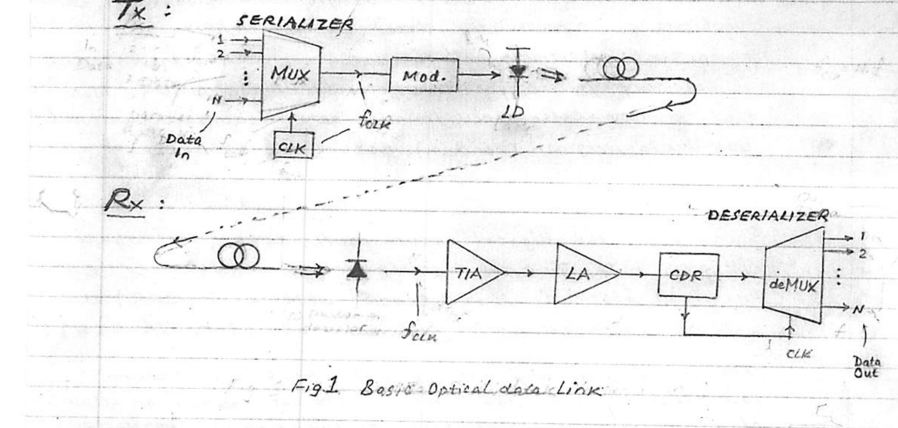

*Fig 1. Basic optical data link.*

### Transmitter ($`T_x`$)

Here, $`N`$-parallel synchronous streams of data are converted into a single hi-speed serial line through the use of an $`N{:}1`$ **MUX** functioning as a **SERIALIZER** driven by a clock ($`f_{clk}`$).

For example: $`N = 8`$ parallel lanes (data lines) @ 5 Gb/s are converted into a single 40 Gb/s ($`= 8 \times 5`$) serial line. To do this would require a clock operating at $`f_{clk} = 20\ \text{GHz}`$.

The serial data is then used to ON/OFF modulate an IR laser (LD), either directly through a driver or indirectly through a modulator. The ON/OFF modulated light then travels through an optical fiber to the receiver ($`R_x`$).

### Receiver ($`R_x`$)

At the other end of the optical fiber, the inverse function is performed by the receiver: a **photodetector (PD)** works to convert the serial stream of light pulses into a corresponding high-speed electrical-current stream. A broad-band **TRANS-IMPEDANCE AMPLIFIER (TIA)** amplifies the minute photo-current pulses into a stream of voltage pulses. A **LIMITING AMPLIFIER (LA)** then limits these pulses to the standard logic swing of the system. Finally, a $`1{:}N`$ **deMUX** functioning as a **DESERIALIZER** recovers the originally transmitted $`N`$ data streams.

A special block, **"CLOCK & DATA RECOVERY" (CDR)**, is required, however, to perform two essential functions:

1. Pass the data to the deMUX, and
2. Importantly, extract from the data the **clock signal**, which is necessary for the synchronous operation of the deMUX.

Note that recovery of the clock from the data stream is a nontrivial task due to the irregular (random) nature of the data.

---

## High-Speed Logic: CMOS vs. CML

Because of the digital nature of the data, the signal chain in both $`T_x`$ & $`R_x`$ requires design of hi-speed logic functional blocks (**MUX, CLOCK, deMUX & CDR**) as well as broadband analog blocks (**Modulator, TIA & LA**).

The use of ordinary "rail-to-rail" **CMOS** logic design to realize the high-speed logic becomes less optimum on account of the steep rise in gate power consumption at GigaHertz clock rates. Recall that, due to the rail-to-rail logic swing of $`(0, V_{DD})`$, a basic CMOS logic gate consumes power given by

```math
P = f_{clk}\, C\, V_{DD}^2
```

where $`C`$ = parasitic load capacitance. Thus, at gigabit clock frequencies ($`f_{clk}`$), the power consumption becomes prohibitively high.

An alternate type of logic, known as **CURRENT-MODE LOGIC (CML)**, has proven itself as a good solution: it can furnish a superior speed performance at a practically clock-independent ($`\approx`$ constant) DC power consumption (Fig 2). Note, however, the obvious advantage of CMOS at lower clock rates (zero power @ DC) compared to an essentially constant $`P_{DC}`$ for CML. More importantly, CML has a distinct speed advantage.

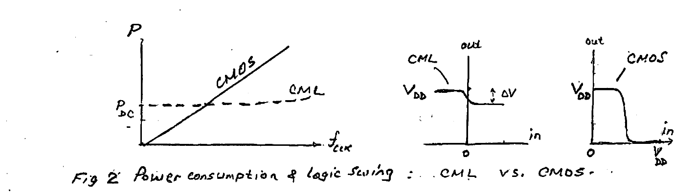

*Fig 2. Power consumption & logic swing: CML vs. CMOS.*

Unlike the rail-to-rail logic swing of CMOS, CML employs a small logic swing ($`\Delta V \approx 0.1\ \text{V}`$), which is a fraction of the DC supply ($`V_{DD}`$) — requiring shorter times to charge/discharge circuit capacitances.

---

## The Differential Pair (Basis of CML)

The basis for CML is the **DIFFERENTIAL PAIR** topology (Fig 3) operated in an **ON–OFF** digital mode: the tail current source $`I_T`$ being **steered** between the two transistors in response to a differential input logic signal ($`V_i`$).

The circuit is shown in both **BIPOLAR & MOS** form and implements an elementary **INVERTER / BUFFER** gate. Here, $`\pm \Delta V_{min}`$ is the minimum differential input "logic swing" required to affect a full current steering of the tail current $`I_T`$ between $`Q_1`$ & $`Q_2`$.

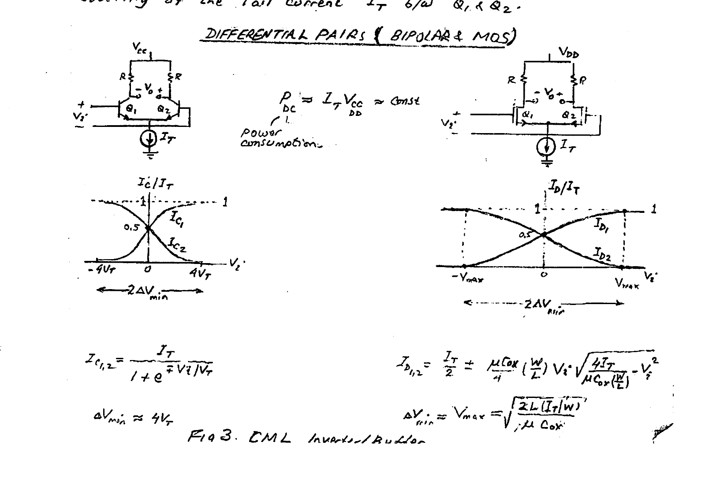

*Fig 3. CML inverter/buffer — differential pairs (bipolar & MOS) and their current-steering transfer characteristics.*

Power consumption (≈ constant):

```math
P_{DC} = I_T V_{CC} \;(\text{or } I_T V_{DD}) \approx \text{const}
```

**Bipolar pair:**

```math
I_{C_{1,2}} = \frac{I_T}{1 + e^{\mp V_i / V_T}}, \qquad \Delta V_{min} \approx 4 V_T
```

**MOS pair:**

```math
I_{D_{1,2}} = \frac{I_T}{2} \pm \frac{\mu C_{ox}}{4}\left(\frac{W}{L}\right) V_i \sqrt{\frac{4 I_T}{\mu C_{ox}\left(\frac{W}{L}\right)} - V_i^2}
```

```math
\Delta V_{min} \approx V_{max} = \sqrt{\frac{2 L\,(I_T / W)}{\mu C_{ox}}}
```

---

## Current-Mode Logic (CML)

In many data communication systems, the very-high data rates may easily exceed the speed–power capabilities of standard CMOS logic — giving way to **CURRENT-MODE LOGIC**. CML is based on **SCL (Source-Coupled Logic)** or **ECL (Emitter-Coupled Logic)**, which offers superior speed-performance.

Typically, a CML logic block requires significant power to accommodate the higher speed, and consumes more chip area compared to CMOS. Unlike CMOS, CML does not lend itself to VLSI applications and (appropriately) is limited to hi-speed applications where CMOS falls short. Two basic features — **"current steering"** and **"small* logic swing"** — give CML a speed edge over CMOS.

In CML circuits — whether MOS- or BJT-based — logic operation is realized by switching a "tail" current source $`I_T`$ between the two transistors in a differential-pair topology. These current-steering transistors operate between **"active"** & **"cutoff"**, avoiding **"triode"** (in MOS) and **"saturation"** (in BJTs) — regions of "slow" operation.

Useful CML logic blocks include combinational & sequential functions: **INVERTER, AND, OR, XOR, MUX, deMUX, LATCH, FLIP-FLOP.**

> \* Small logic swing across parasitic capacitances requires **SHORTER** charge/discharge time!

### Inverter / Buffer

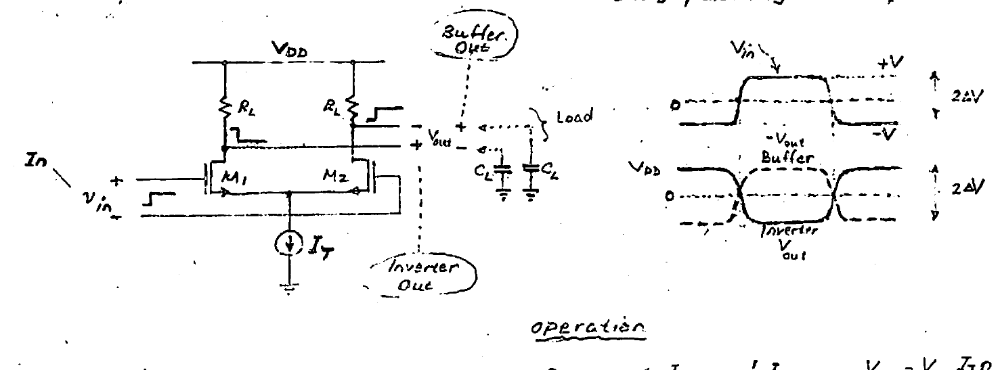

*CML inverter/buffer: schematic ($`M_1`$, $`M_2`$, load resistors $`R_L`$, tail source $`I_T`$, load capacitors $`C_L`$) with buffer and inverter outputs and their waveforms.*

**Operation** (current steering):

| Input | Output | Currents & node voltages |
| --- | --- | --- |
| $`V_{in} = 0`$ | $`V_{out} = 0`$ | $`I_{D_{1/2}} = \tfrac{1}{2} I_T`$, $`\;V_{D_{1/2}} = V_{DD} - \tfrac{I_T}{2} R_L`$ |
| $`V_{in} = -V`$ | $`V_{out} = I_T R_L`$ | $`I_{D_1} = 0,\; I_{D_2} = I_T`$; $`\;V_{D_1} = V_{DD},\; V_{D_2} = V_{DD} - I_T R_L`$ |
| $`V_{in} = +V`$ | $`V_{out} = -I_T R_L`$ | "opposite" |

```math
2\Delta V = 2 I_T R_L \qquad \text{(Logic Swing — small)}
```

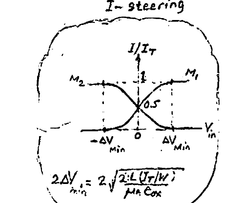

*Current-steering ($`I/I_T`$) transfer characteristic, with $`2\Delta V_{min} = 2\sqrt{\dfrac{2L\,(I_T/W)}{\mu C_{ox}}}`$.*

---

## Speed (Delay $`\tau`$)

Speed (delay $`\tau`$) is governed by the rise/fall times of the output. These originate in the charging/discharging of parasitic load capacitance $`C_L`$ by a small amount ($`\Delta V`$). For switching-speed analysis, digital gates can be viewed as small-signal (S.S.) amplifiers.

### Delay $`\tau`$ of CML Inverter — "Open-Circuit Time-Constant Analysis" (OCTC) [App. 1]

We consider a **HALF-CIRCUIT** biased at the midpoint of the logic swing ($`I_{D_{1,2}} = I_T/2`$).

```math
f_{3dB} \approx \frac{1}{2\pi\tau}, \qquad \tau = b_1 \triangleq \sum_j C_j R_{jj}^{0} \quad\Big\}\ \text{OCTC}
```

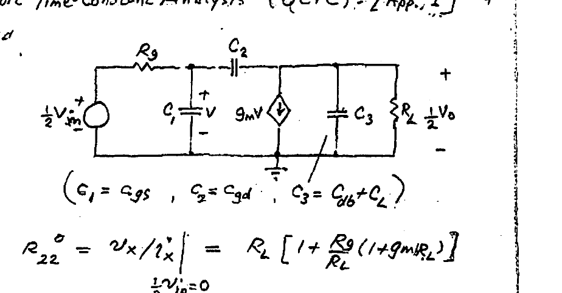

*Half-circuit small-signal model used for the OCTC analysis, with $`C_1 = C_{gs}`$, $`C_2 = C_{gd}`$, $`C_3 = C_{db} + C_L`$.*

The driving-point resistances seen by each capacitance:

```math
R_{11}^{0} = R_g, \qquad R_{33}^{0} = R_L
```

```math
R_{22}^{0} = \left.\frac{v_x}{i_x}\right|_{\frac{1}{2}v_{in}=0} = R_L\left[1 + \frac{R_g}{R_L}\left(1 + g_m R_L\right)\right]
```

Therefore the total delay:

```math
\tau = b_1 \triangleq R_g C_{gs} + R_L\left(C_{db} + C_L\right) + C_{gd} R_L\left[1 + \frac{R_g}{R_L}\left(1 + g_m R_L\right)\right]
```

> \* $`R_{jj}^{0}`$ = **Driving-Point Resistance** seen by $`C_j`$ with remaining $`C`$'s = open.

Equivalently, $`\tau = R_L C_{tot}`$, where

```math
C_{tot} = C_L + C_{db} + C_{gd} + \frac{R_g}{R_L}\left[C_{gs} + (1 + g_m R_L)\,C_{gd}\right]
```

**Note:** if the inverter operates with fanout $`= K`$ (i.e. drives $`K`$ similar inverters), then

```math
C_L = K\left[C_{gs} + (1 + g_m R_L)\,C_{gd}\right] \quad \leftarrow \text{"input Miller cap of one inverter"}
```

### Performance

To minimize the delay $`\tau`$, and thus maximize the data rate ($`R_{b(max)} \approx f_{3dB}`$) that can be reliably handled, small $`R`$'s must be used ($`R_L`$ & $`R_g`$) — where $`R_g`$ = gate resistance ($`M_{1,2}`$).

Note that for full-current-steering action there is a (**minimum**) required "single-ended" logic swing $`\Delta V_{min}`$ dictated by the MOS technology employed. With $`\Delta V_{DD} \propto I_T C_L`$, a higher $`I_T`$ is required to maximize speed. This increase in $`I_T`$ would entail a higher power consumption / dissipation $`P_D = I_T V_{DD}`$ for the gate.

With speed being here the **ultimate goal**, a **FIGURE OF MERIT (FOM)** is defined as the inverse of the "energy-spent per bit":

```math
\text{"Energy per bit"} \triangleq \frac{P_D}{R_b}\ \ (\text{joules/bit}) \quad\longrightarrow\quad \boxed{\;\text{FOM} \triangleq \frac{R_b}{P_D}\ \ (\text{bits/joule})\;}
```

where $`R_b`$ is the max data rate (b/s) for a specified **BER** ("Bit Error Rate").

---

## Functional Blocks

### OR

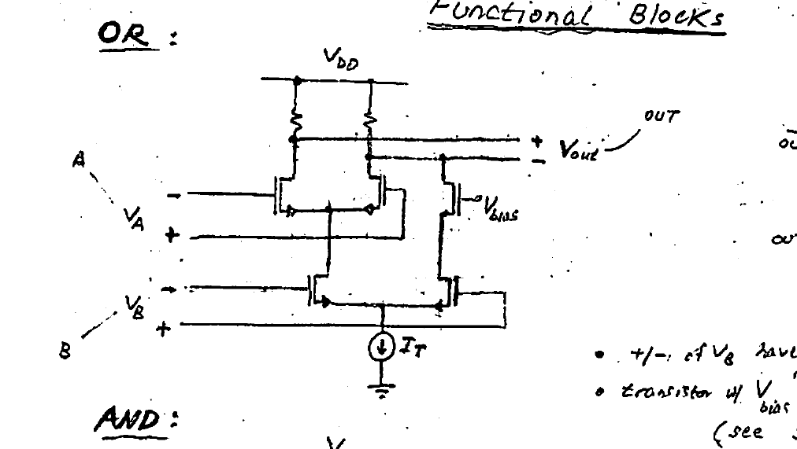

*CML OR gate. Differential inputs $`V_A`$, $`V_B`$ with $`V_{bias}`$; tail source $`I_T`$.*

```math
\overline{out} = \bar{A}\cdot\bar{B} \;\;\downarrow\;\; out = A + B
```

- $`+/-`$ of $`V_B`$ have been level-shifted "down" (see XOR).
- Transistor with $`V_{bias}`$ "equalizes" $`V_{DS}`$, and consequently speed (see Supplement #2: "CM signals in CML").

### AND

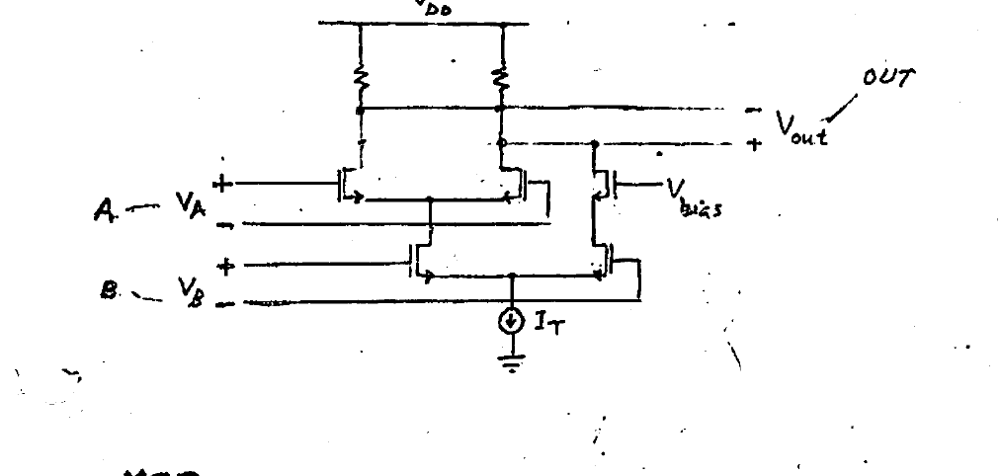

*CML AND gate. Differential inputs $`V_A`$, $`V_B`$ with $`V_{bias}`$; tail source $`I_T`$.*

```math
out = A \cdot B
```

> **NOTE:** OR becomes AND by switching $`V_B`$ signal polarity!

### XOR

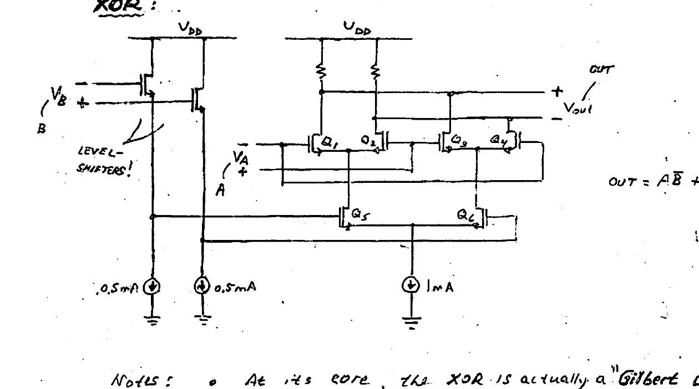

*CML XOR gate with input level-shifters; built from transistors $`Q_1`$–$`Q_6`$ and tail sources (0.5 mA, 0.5 mA, 1 mA).*

```math
out = A\bar{B} + \bar{A}B
```

**Notes:**

- At its core, the XOR is actually a **"Gilbert cell"**.
- By **reversing** the output terminals of $`V_{out}`$ in the above gates, the complementary logic function is obtained: **BUFFER, NOR, NAND, XNOR** (i.e. conveniently — either the logic function or its complement is available).

---

## Selector (2:1 MUX)

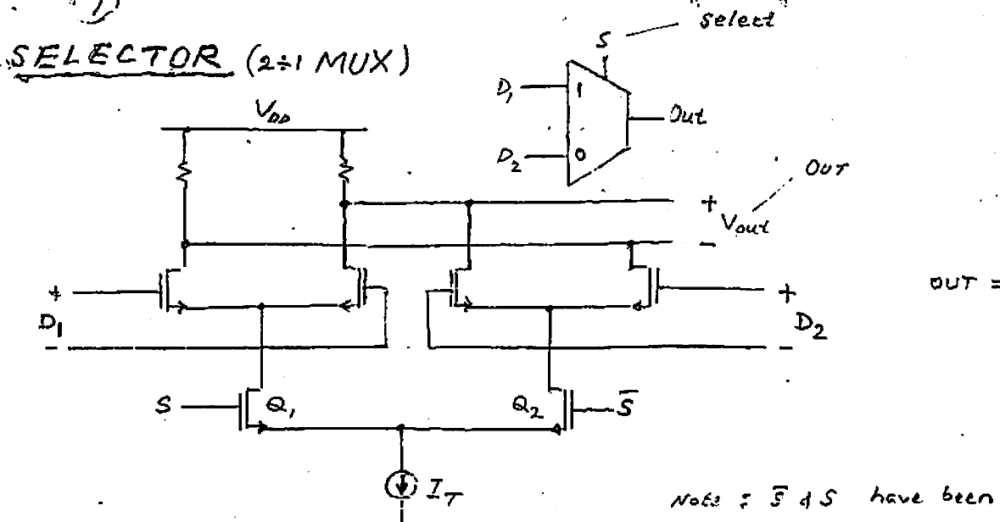

*CML selector (2:1 MUX). Data inputs $`D_1`$, $`D_2`$; select inputs $`S`$, $`\bar{S}`$ ($`Q_1`$, $`Q_2`$); tail source $`I_T`$.*

```math
OUT = S D_1 + \bar{S} D_2
```

> **Note:** $`\bar{S}`$ & $`S`$ have been "downward" level-shifted.

---

## Serializer & Deserializer (Multiplexers & Demultiplexers)

### (I) Multiplexers

Because they enable efficient, economical transmission of multiple parallel streams of data through a single-data **CHANNEL**, MUX's are indispensable as **SERIALIZERS** (SerDes) for hi-speed communications such as Ethernet and optical $`T_x`$'s. For example, a $`16{:}1`$ MUX transforms $`\times 16`$ data lanes @ 1 Gb/s into a single serial stream of data at a high rate of 16 Gb/s ($`\times 16`$ line rate). Thus, MUX's are among the **FASTEST** circuit functions in the signal chain, and as such dictate use of topologies (i.e. **CML**) capable of the highest speed.

We first consider a $`2{:}1`$ MUX, the building block for the higher-order MUXes.

#### $`2{:}1`$ MUX

Is realized using a CML **SELECTOR** with CLK for Select.

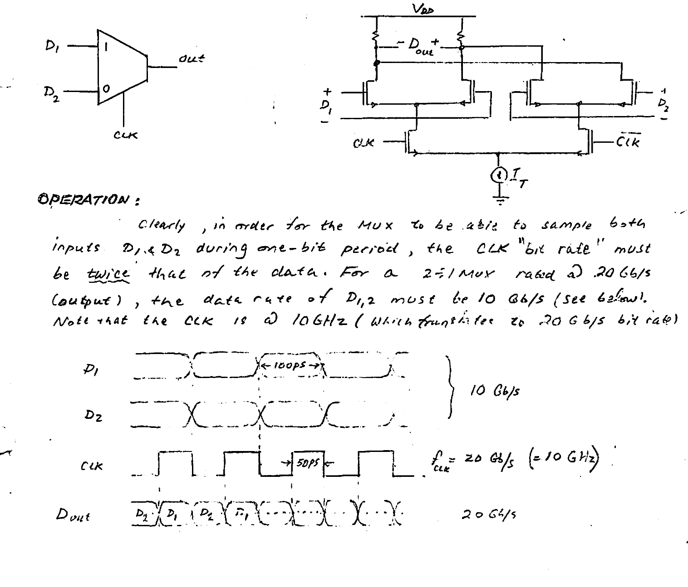

*2:1 MUX: logic symbol, CML schematic ($`D_1`$, $`D_2`$ inputs; CLK, $`\overline{CLK}`$ select; tail source $`I_T`$), and timing waveforms.*

**Operation:**

Clearly, in order for the MUX to be able to sample both inputs $`D_1`$ & $`D_2`$ during one-bit period, the CLK "bit rate" must be **twice** that of the data. For a $`2{:}1`$ MUX rated @ 20 Gb/s (output), the data rate of $`D_{1,2}`$ must be 10 Gb/s (see below). Note that the CLK is @ 10 GHz (which translates to 20 Gb/s bit rate).

| Signal | Rate / period |
| --- | --- |
| $`D_1`$, $`D_2`$ | 10 Gb/s (100 ps bit period) |
| CLK | $`f_{clk} = 20\ \text{Gb/s}\ (= 10\ \text{GHz})`$, 50 ps |
| $`D_{out}`$ | 20 Gb/s |

### Higher-Order MUXes

Typically, substantially more than 2 inputs need to be multiplexed — for e.g. 16 — which requires higher-order MUX's. These typically employ a **"BINARY-TREE"** architecture to produce "MUX expansion".

A $`4{:}1`$ MUX design based on a binary-tree topology is shown below. Notice the different binary-ratioed clocks: CLK & $`\tfrac{1}{2}`$CLK.

#### $`4{:}1`$ MUX

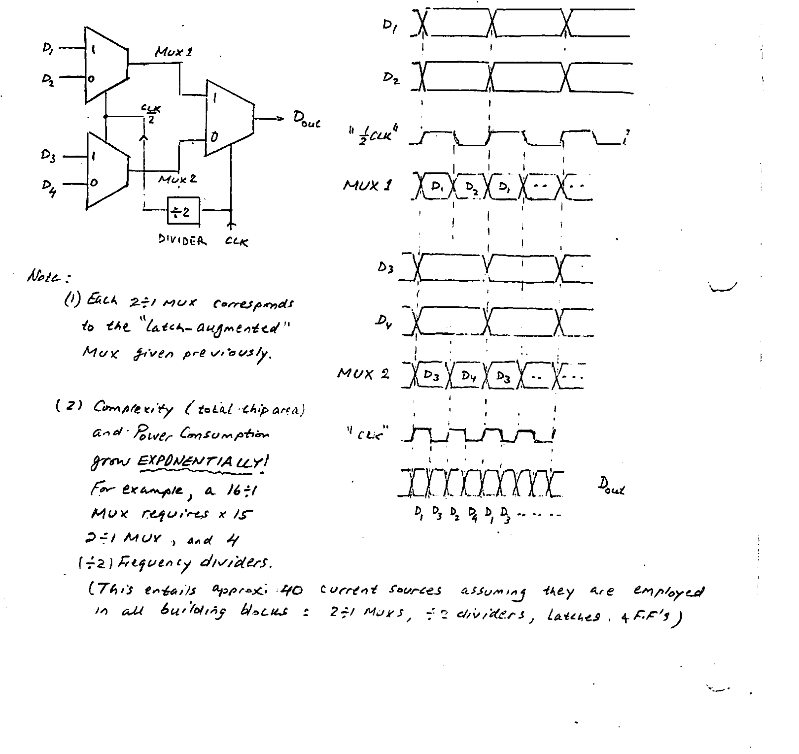

*4:1 MUX: binary-tree architecture (Mux 1 & Mux 2 feeding an output 2:1 MUX, with a $`\div 2`$ divider generating $`\tfrac{CLK}{2}`$) and the corresponding timing waveforms.*

**Notes:**

1. Each $`2{:}1`$ MUX corresponds to the "latch-augmented" MUX given previously.
2. Complexity (total chip area) and power consumption grow **EXPONENTIALLY!** For example, a $`16{:}1`$ MUX requires $`\times 15`$ $`2{:}1`$ MUX, and 4 ($`\div 2`$) frequency dividers. (This entails approx. 40 current sources, assuming they are employed in all building blocks: $`2{:}1`$ MUXes, $`\div 2`$ dividers, latches & F.F's.)

---

## Appendix 1 — Bandwidth Estimation

In a linear circuit whose behavior is modelled by an R–C circuit, use can be made of a powerful technique for estimating the circuit **"bandwidth"**.

The technique is based on **"ZERO-VALUE TIME CONSTANT"** analysis, also known (more appropriately) as the **"OPEN-CIRCUIT TIME-CONSTANT"** analysis.

Not only does the "OCTC" analysis provide a simple means for estimating the BW of a circuit, it also gives guidance as to the means for increasing it. Specifically, the analysis can clearly pinpoint which circuit element most influences (limits) the circuit BW!

It is assumed that the circuit possesses a **"DOMINANT-POLE"**, i.e. a ("baby" pole) whose magnitude is well below all remaining poles & zeroes of the circuit.

Under such conditions, the BW (i.e. $`f_{3dB}`$) is equal to the dominant pole; and the latter is found from the total delay "$`\tau`$" given by the sum-total of circuit "time constants":

```math
f_{3dB} = \frac{1}{2\pi\tau}, \qquad \tau = \sum_k \left(C_k R_{kk}^{0}\right)
```

where,

- $`C_k`$'s = circuit capacitances
- $`R_{kk}^{0}`$ = "Driving-Point Resistance" seen by $`C_k`$ with remaining capacitances opened (i.e. set to zero).

In what follows, mathematical details are provided in support of the "Open-Circuit Time-Constant" analysis (equivalently, the "Zero-Value Time-Constant" analysis).

### "Open-Circuit Time Constant"

In general, the transfer function {e.g. **VOLTAGE GAIN**} of an R–C active circuit — such as a resistively-loaded transistor stage — has the form:

```math
A(s) = \frac{N(s)}{D(s)} = A_0\,\frac{1 + a_1 s + \dots + a_m s^m}{1 + b_1 s + \dots + b_n s^n} \qquad (m \le n)
```

```math
= A_0\,\frac{\left(1 + \frac{s}{z_1}\right)\cdots\left(1 + \frac{s}{z_m}\right)}{\left(1 + \frac{s}{p_1}\right)\cdots\left(1 + \frac{s}{p_n}\right)}
```

where: $`A_0`$ = DC gain, $`\;-z_{1\dots m}`$ = zeros, $`\;-p_{1\dots n}`$ = poles.

#### Dominant Pole

For a large number of circuits (such as C–S & C–E), one of the poles (say $`p_1`$) has a relatively small magnitude compared to all remaining $`p`$'s & $`z`$'s. This allows for the approximation:

```math
A(s) \approx \frac{A_0}{1 + \frac{s}{p_1}}
```

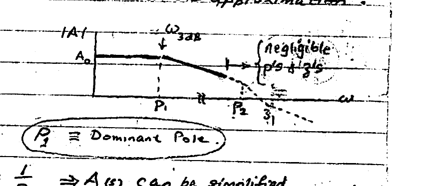

*Dominant-pole approximation: $`p_1 \equiv`$ Dominant Pole; the remaining $`p`$'s & $`z`$'s ($`p_2`$, $`z_1`$, …) are negligible.*

Therefore, $`\omega_{3dB} = p_1`$. ($`p_1 \equiv`$ **Dominant Pole**.)

Since

```math
b_1 = \left(\frac{1}{p_1} + \dots + \frac{1}{p_n}\right) \approx \frac{1}{p_1}\ \Rightarrow\ A(s) \text{ can be simplified}
```

```math
A(s) \approx \frac{A_0}{1 + b_1 s} \quad\rightarrow\quad f_{3dB} \approx \frac{1}{2\pi b_1} \qquad (b_1 \triangleq \tau,\ \text{"Delay"})
```

where $`b_1`$ has units of seconds. It can be shown that in an R–C circuit the coefficient $`b_1`$ is a sum of the R–C time constants associated with the circuit capacitances $`C_k`$:

```math
b_1 \triangleq \tau = \sum_{k=1}^{n} \tau_k, \qquad \text{where } \tau_k = C_k R_{kk}^{0}
```

Here, $`R_{kk}^{0}`$ = "DRIVING-POINT RESISTANCE" seen by $`C_k`$ with remaining $`C`$'s = 0 (i.e. "ZERO" or open-circuit).

**Conclusion:** through identification of the "largest" $`\tau_k`$ affecting $`\tau`$, the designer seeks ways for reducing it and hence broadening the BW.

### Example: BW of C–S Amplifier

$`A(s) = \dfrac{V_{out}}{V_{in}}`$:

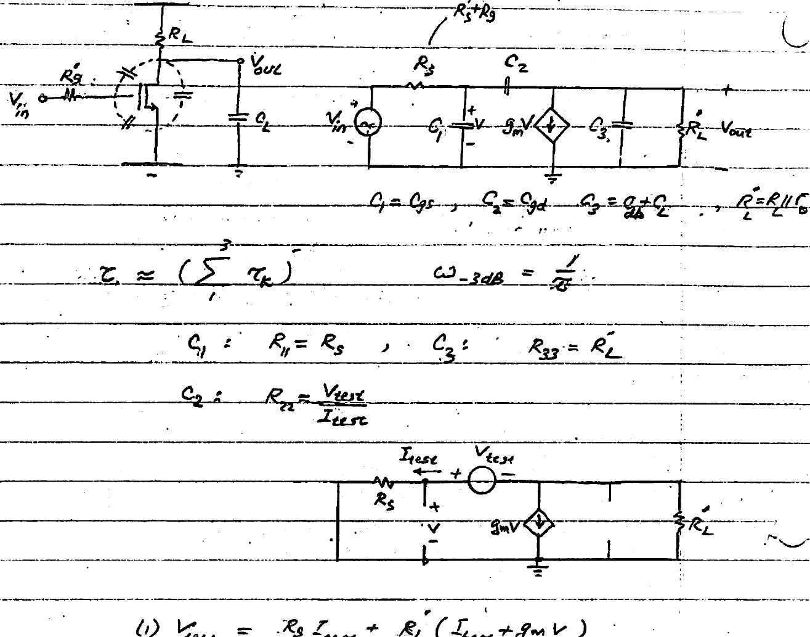

*Common-source (C–S) amplifier: small-signal model ($`C_1 = C_{gs}`$, $`C_2 = C_{gd}`$, $`C_3 = C_{db} + C_L`$, $`R_L' = R_L \| r_o`$) and the test circuit used to find $`R_{22}`$.*

```math
C_1 = C_{gs}, \quad C_2 = C_{gd}, \quad C_3 = C_{db} + C_L, \quad R_L' = R_L \| r_o
```

```math
\tau \approx \sum_{1}^{3} \tau_k, \qquad \omega_{3dB} = \frac{1}{\tau}
```

The driving-point resistances:

```math
C_1{:}\ R_{11} = R_s, \qquad C_3{:}\ R_{33} = R_L'
```

```math
C_2{:}\ R_{22} = \frac{V_{test}}{I_{test}}
```

From the test circuit:

```math
\text{(1)}\quad V_{test} = R_s I_{test} + R_L'\left(I_{test} + g_m V\right)
```

```math
\text{(2)}\quad V = R_s I_{test}
```

Substituting (2) → (1):

```math
R_{22} = R_s + (1 + g_m R_s)\,R_L'
```

Therefore:

```math
\omega_{3dB} = \tau^{-1} \approx \Big[\,C_{gs} R_s + C_{gd}\big[R_s + (1 + g_m R_s)R_L'\big] + (C_{db} + C_L)R_L'\,\Big]^{-1}
```

It is worth noting that this BW equals that obtainable by direct analysis: derivation of the voltage-gain function $`A(j\omega)`$ and solving for $`\omega`$ that makes $`|A| = A_0/\sqrt{2}`$.

It is worthwhile to rewrite $`\omega_{3dB}`$ as:

```math
\omega_{3dB} = \tau^{-1} \approx \Big(\,R_s\big[C_{gs} + C_{gd}(1 + g_m R_L')\big] + (C_{gd} + C_{db} + C_L)R_L'\,\Big)^{-1}
```

Noting that $`g_m R_L'`$ = gate–drain (voltage gain), it is evident that $`C_{gd}`$ produces the largest time constant and hence dominates in setting the circuit bandwidth ($`\omega_{3dB}`$). Reducing the effect of $`C_{gd}`$ is thus key to broadband design — such as the **cascode** topology.
