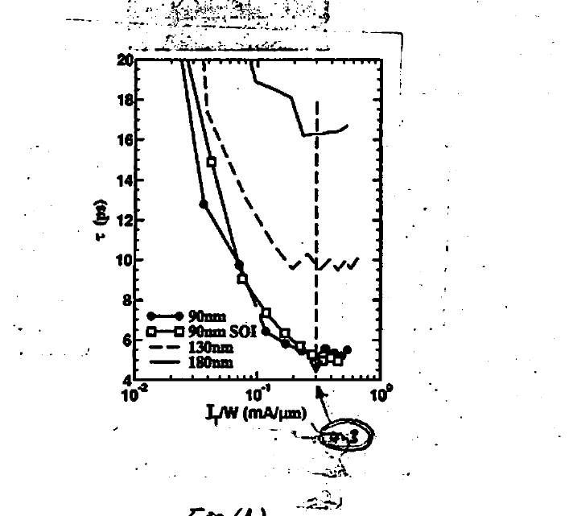
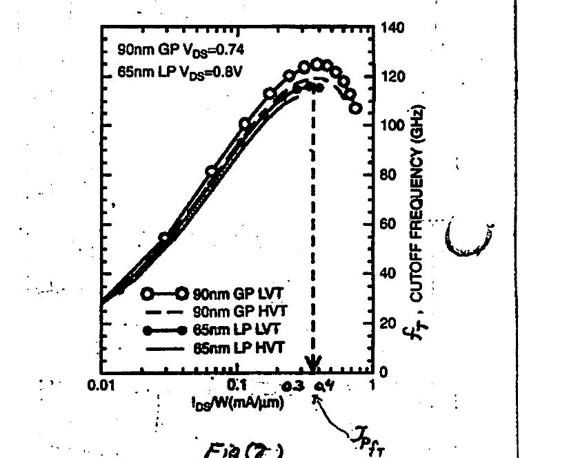
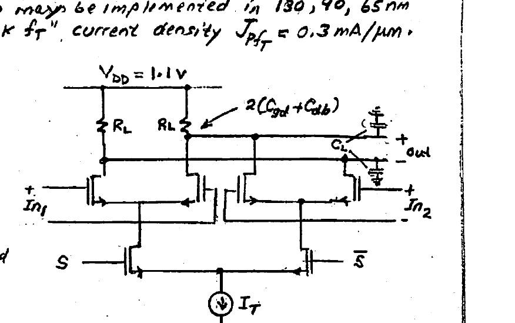
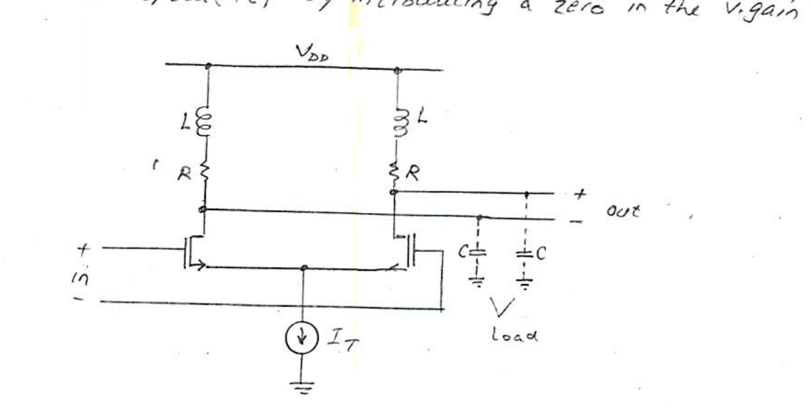

# Lecture 25 — Current Mode Logic (CML)

**EECE 7398 — Analysis & Design of Photonic Integrated Circuits (PICs)** · Northeastern University, Dept. of Electrical & Computer Engineering · Spring 2023

---

## MOS–CML Design: "Current-Density-Centric" Methodology

Here we use the **CML inverter** as a means to demonstrate the design of **high-speed logic**. The objective is to minimize the gate delay $\tau$ (i.e. maximize $f$, the $-3\,\text{dB}$ frequency). The variables involved consist of:

1. **Device gate LENGTH:** for max. speed the minimum length ($L_{min}$) in the technology (fab process) is used.

2. **$I_T$, $R_L$, $W$:** the first two determine the (single-ended) logic swing $\Delta V = I_T R_L$, which for MOSFETs is related to the device **"current density"** $J_D \;(\triangleq I_T/W)$.

3. **Gate DELAY ($\tau$):** being central to gate performance, we re-express the previously derived expression for $\tau$ using the substitutions $(\Delta V / I_T = R_L)$ and $(-g_m R_L = A_V)$ for the s.s. gain (@ O.P. $I_{D1,2} = \tfrac{1}{2} I_T$):

$$\tau = \frac{\Delta V}{I_T/W}\left[\, C'_{gd} + C'_{db} + \left(K + \frac{R_g}{R_L}\right)\!\left[\, C'_{gs} + (1-A_V)\,C'_{gd}\,\right]\right] \qquad (1)$$

> The term $R_g/R_L$ is **negligible** (see note below).

where $C'_{xy} \triangleq C_{xy}/W$ (cap. per unit gate width) is used in order to explicitly show the inverse dependence on the **Current-Density** parameter $I_T/W$ — on which $\Delta V$, $A_V$, and the $C'$ all depend. Note that for a given total gate width $W$ the gate parasitic resistance $R_g$ can be reduced to a negligible value ($< 0.1\,R_L$) by increasing the number of gate fingers.

4. **$\Delta V_{Min}$ (Logic Swing):** this is defined as the min. voltage required to **"fully steer"** the tail current ($I_T$) to one device. Note that $\Delta V_{Min}$ is easily determined for low-current-densities ($I_T/W \lesssim 0.15\ \text{mA}/\mu\text{m}$) from the (then-valid) square-law $I$–$V$ device relation as

$$\Delta V_{Min} = \sqrt{2L\,(I_T/W)/\mu_n C_{ox}}$$

However, for **nano-scale** devices the modified $I$–$V$ relation applicable at high-current densities ($I_T/W \sim 0.3\ \text{mA}/\mu\text{m}$) complicates a similar derivation. Therefore, we shall employ a practical alternative based on the following general definition, which applies independent of the particular device $I$–$V$ model eqns:

$$\Delta V_{Min} \triangleq \left[\, \underbrace{V_{GS}\!\left(J_D = \tfrac{I_T}{W}\right)}_{\text{full-steering}} - \underbrace{V_{GS}\!\left(J_D = \tfrac{I_T/2}{W}\right)}_{\text{Q-point}} \,\right] \qquad (2)$$

---

## Determining Gate Delay from Measured Data

Using $(2)$, $\Delta V_{Min}$ as a function of current-density ($I_T/W$) can be determined from the **measured** $I_D$–$V_{GS}$ for a particular MOSFET technology. This, along with the measured dependence on $I_T/W$ of $A_V$, $C_{gs}$, $C_{gd}$, $C_{db}$, can be used in $(1)$ to determine the **Gate Delay** as a function of $I_T/W$.

Shown below (Fig 1) is the **experimental** dependence of $\tau$ of an nMOS CML inverter (w/ $K=1$) on $I_T/W$ for three MOS technology nodes: $180\ \text{nm}$, $130\ \text{nm}$, $90\ \text{nm}$ (& $90\ \text{nm}$ SOI). It is noteworthy that for all cases there is **no further speed improvement** (reduction in $\tau$) beyond about $I_T/W \approx 0.3\ \text{mA}/\mu\text{m}$. Interestingly, it is found that this value corresponds to the **PEAK $f_T$ current-density** $J_{pf_T}$ for nano-scale n-MOSFETs **irrespective** of the technology node! (Fig 2)

*Fig 1. Experimental gate delay $\tau$ (ps) vs. current density $I_T/W$ (mA/µm) for 90 nm, 90 nm SOI, 130 nm, and 180 nm MOS technology nodes. Minimum delay is reached near $I_T/W \approx 0.3\ \text{mA}/\mu\text{m}$.*

*Fig 2. Cutoff frequency $f_T$ (GHz) vs. $I_{DS}/W$ (mA/µm) for 90 nm GP ($V_{DS}=0.74$) and 65 nm LP ($V_{DS}=0.8\,\text{V}$) devices (LVT & HVT). Peak $f_T$ — i.e. $J_{pf_T}$ — occurs near $0.3\text{–}0.4\ \text{mA}/\mu\text{m}$.*

In practice, to ensure adequate gain* ($|A_V| \ge 1$) of at least $1.5$ for the CML gate, the actual logic swing is increased beyond the minimum in eqn $(2)$ to:

$$\Delta V = 1.5\,\Delta V_{Min} \qquad (3)$$

This value of $\Delta V$ depends on the MOS fab process, and is found to scale w/ the technology node as summarized below:

| MOS Technology node | 180 nm | 130 nm | 90 nm | 65 nm |
| --- | --- | --- | --- | --- |
| $\Delta V$ (mV) $\approx$ | 850 | 600 | 450 | 320 |

> \* This guarantees, for all possible conditions, $|A_V| \ge 1$ — essential for logic gate function.

---

## Example (1) — CML Selector Design

**Design the CML SELECTOR** shown as the "final stage" of an $8 \div 1$ MUX in an OC-768* fiber-optic $T_x$ with max data rate of $43\ \text{Gb/s}$. The selector drives a CML inverter w/ tail current of $12\ \text{mA}$ and a s.s. gain $-2\ \text{V}/\text{V}$. The design may be implemented in 130, 90, 65 nm CMOS — all of which have a **"peak $f_T$"** current density $J_{pf_T} = 0.3\ \text{mA}/\mu\text{m}$.

For simplicity, assume (on the average) the caps per unit gate width for all three processes are:

$$C'_{gs} \approx 1\ \text{fF}/\mu\text{m}, \qquad C'_{db} \approx 0.6\ \text{fF}/\mu\text{m}, \qquad C'_{gd} \approx 0.5\ \text{fF}/\mu\text{m}.$$

**Determine:**

i. in which technology the selector can be designed;
ii. the min. tail current $I_T$ required for achieving the necessary BW;
iii. the device width $W$;
iv. the drain resistor $R_L$ required;
v. calculate the selector power dissipation $P_D$ for a DC supply $V_{DD} = 1.1\ \text{V}$, and the selector FOM: $R_b/P_D$ (bits/joule), or Energy per bit $P_D/R_b$ (pJoule/bit).

*Fig 3. CML selector: differential pairs with loads $R_L$, inputs $In_1$, $In_2$, select transistors $S$ / $\bar S$, tail current source $I_T$, output node loaded by $2(C_{gd}+C_{db})$ and the driven-inverter load $C_L$. $V_{DD}=1.1\ \text{V}$.*

> \* OC = Optical Carrier transmission — a fiber-optic speed standard of SONET (Synchronous Optical Network).

### Solution

Since all MOSFETs are sized to achieve their peak $f_T$ when the entire tail current is steered through them, we find for the inverter and the load $C_L$ it exhibits to the selector:

$$W_{inv} = \frac{I_T}{J_{pf_T}} = \frac{12\ \text{mA}}{0.3\ \frac{\text{mA}}{\mu\text{m}}} = 40\ \mu\text{m}$$

$$\therefore\; C_L = C_{gs} + (1-A_V)\,C_{gd} = C'_{gs}\cdot 40 + (1+2)\,C'_{gd}\cdot 40 = 100\ \text{fF}$$

Finding the total (one-sided) cap. $C_{tot}$ at the output node of the selector requires adding two pairs of transistor cap. to $C_L$, i.e.:

$$C_{tot} = C_L + 2\cdot\big(C'_{gd} + C'_{db}\big)\cdot W = 100 + \left(\frac{3\ \text{fF}}{\mu\text{m}}\right)\!W$$

Since the MOSFETs of the selector are sized to operate at the peak $f_T$ when steering the tail current ($I_D = I_T$), we can write:

$$I_T = J_{pf_T}\cdot W = 0.3\ \frac{\text{mA}}{\mu\text{m}}\times W$$

Also, $R_L$ is related to $I_T$ and logic swing $\Delta V$ by:

$$R_L = \frac{\Delta V}{I_T} = \frac{\Delta V}{(0.3\ \text{mA}/\mu\text{m})\,W}$$

---

To achieve the specified data rate ($43\ \text{Gb/s}$), the $3\,\text{dB}$ bandwidth required* is

$$f_{3\text{dB}} = 0.75 \times 43 = 32.3\ \text{GHz}.$$

This BW implies a gate T.C. of $\tau = 1/2\pi f_{3\text{dB}} = 4.94\ \text{ps}$.

Therefore:

$$\tau = R_L C_{tot} = \left(\frac{\Delta V}{0.3\ \frac{\text{mA}}{\mu\text{m}}\,W}\right)\!\left(100\ \text{fF} + \frac{3\ \text{fF}}{\mu\text{m}}\cdot W\right) = 4.94\ \text{ps}$$

Solving for $W$:

$$W = \frac{100\ \text{fF}\cdot \Delta V}{\left(4.94\ \text{ps}\times 0.3\ \frac{\text{mA}}{\mu\text{m}}\right) - \left(3\ \frac{\text{fF}}{\mu\text{m}}\cdot \Delta V\right)}$$

For a physical solution ($W > 0$), a positive denominator implies $\Delta V < 494\ \text{mV}$. The table of $\Delta V$ for the various technology nodes clearly rules out the first two large nodes (180 & 130) nm — leaving the remaining two (**90 & 65**) nm as candidates. Calculating $W$ and the corresponding $I_T$ for these, we find:

| Tech. node | 90 nm | 65 nm |
| --- | --- | --- |
| $W$ (µm) | 341 | 61.3 |
| $I_T$ (mA) | 102.3 | 18.4 |
| $\Delta V$ (mV) | 450 | 320 |

Selecting the least **"power-hungry"** node (**65 nm**), we find for $R_L$ & $I_T$:

$$R_L = \frac{\Delta V}{I_T} = \frac{320\ \text{mV}}{18.4\ \text{mA}} = 17.4\ \Omega$$

$$P_D = I_T V_{DD} = 18.4 \times 1.1 = 20.2\ \text{mW}$$

$$\text{FOM:}\quad R_b/P_D = \frac{43\ \text{Gb/s}}{20.2\ \text{mW}} = 2.13\ (\text{Terabits}/\text{Joule})$$

$$\therefore\; \text{Energy/bit} \approx 0.5\ \text{pJoule/bit}$$

> \* To limit the magnitude of noise in a broadband circuit, it is customary to select a somewhat reduced BW: by a factor of $0.75$.

---

## L-Peaked CML

For further speed enhancement, **"shunt inductive peaking"** is employed as shown below for the simple case of "buffer/inverter". Two on-chip **"$L$"** are symmetrically added to **extend BW** — and hence speed ($1/\tau$) — by introducing a **zero** in the v. gain Transfer Function.

*Fig 4. L-peaked CML buffer/inverter: two on-chip inductors $L$ in series with the load resistors $R$ provide shunt inductive peaking. Output node loaded by capacitances $C$; tail current source $I_T$.*

**Recall:**

1. **"Maximally Flat Delay"** constraint is employed to ensure good integrity of the data pulse waveform. The required $L$ & $C$ T.C.s were shown to be related in the optimum case ($m = 3.1$) by

$$\frac{L}{R} = \frac{RC}{3.1}, \quad \text{or} \quad L = \frac{R^2 C}{3.1}$$

where $C$ = **"output node cap."** (single-ended) and is given by:

$$C = C_{gd} + C_{db} + C_{in} \quad (\text{driven stage})$$

$$C_{in} = \underbrace{K}_{\text{fanout}}\big(C_{gs} + (1+g_m R)\,C_{gd}\big)$$

2. As a result of adding the $L$, the $3\text{-dB}$ BW is extended by $\approx 1.6$ ($= \text{BWER}$).

**Performance:** As will be demonstrated later, with $L$-peaking a tradeoff b/w bandwidth and $I_T$ is possible. That is, maintaining BW is rewarded with a lower $I_T$ and hence **reduced** power consumption.
