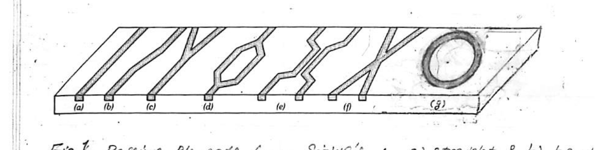
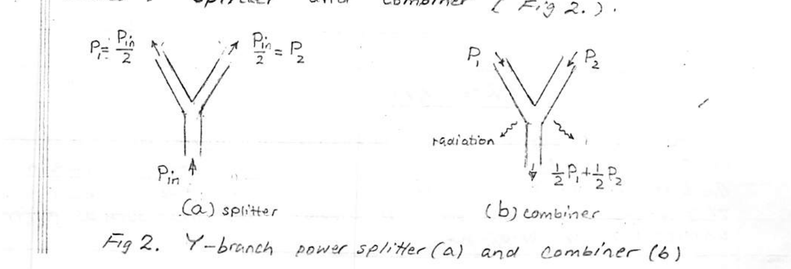
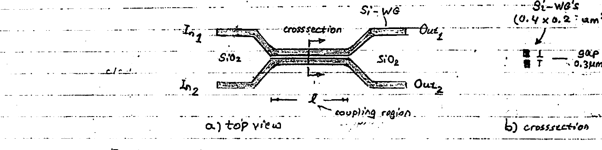
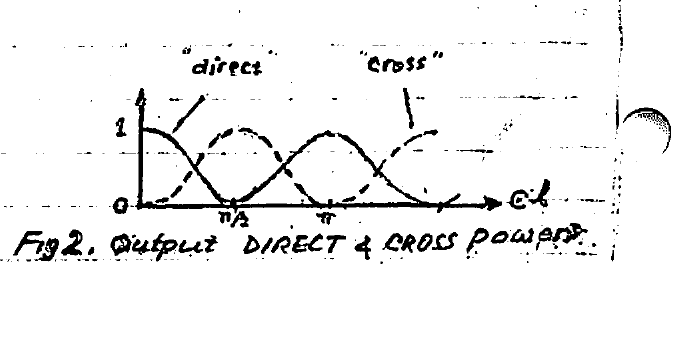
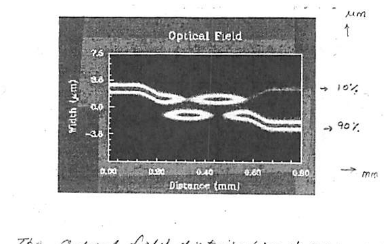
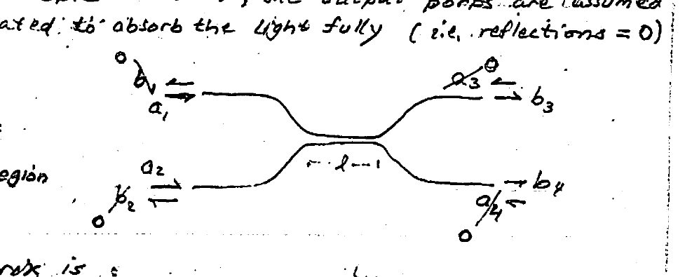
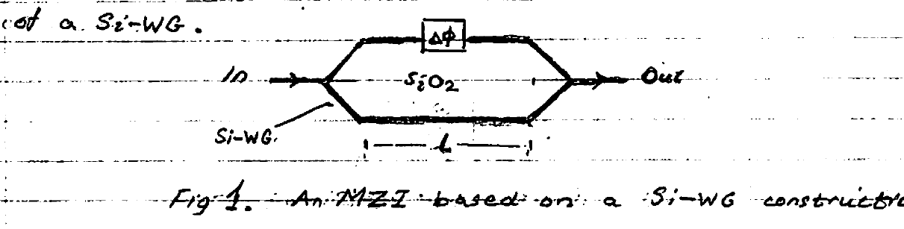
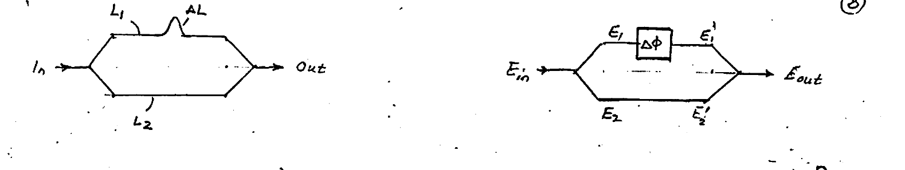
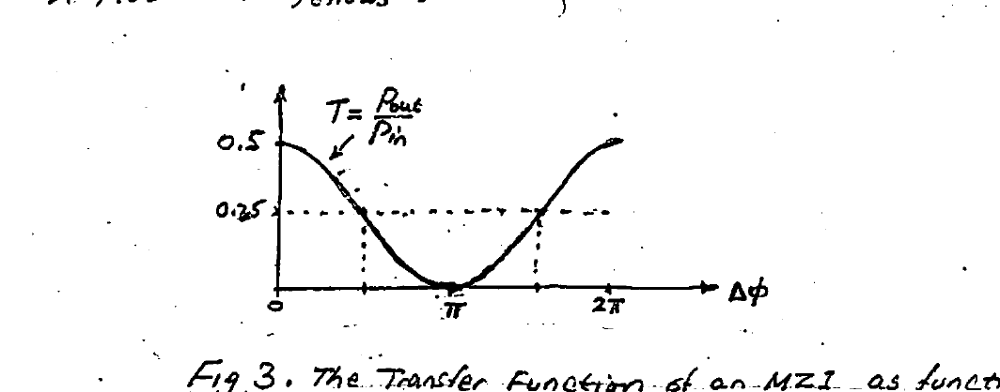
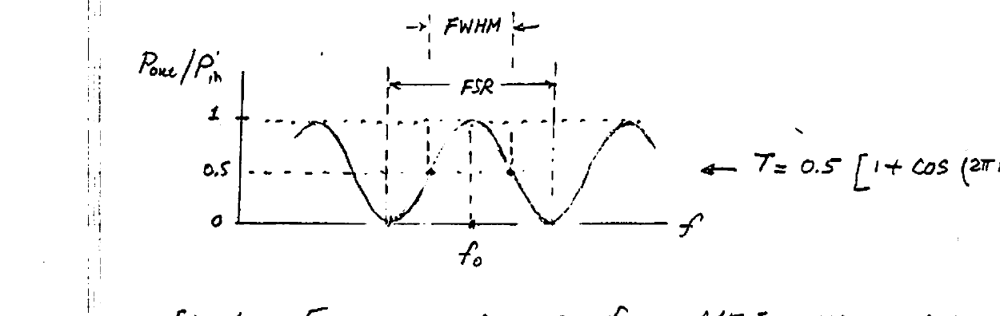

# Lecture 3 — Building Blocks, Couplers, Mach-Zehnder

**PIC Building Blocks** · Northeastern University, Department of Electrical & Computer Engineering · EE 73xx · Spring 2023

---

The design of photonic circuits is based on optical functional blocks of two types: **(I) passive elements**, and **(II) active elements**.

Passive photonic elements are based on Si-WG's, which are employed in various planar configurations to realize useful passive functions (see below). Active elements, on the other hand, offer a higher-level functionality such as modulation, light generation, and amplification.

---

## I. Passive Elements

A variety of passive functional blocks can be realized using special configurations of Si-WG's. In Fig 1 below are shown some of the most widely used passives: straight and bent WG's, Y-branch, interferometer, coupler, crossing, ring resonator.



*Fig 1. Passive elements from Si-WG's: a) straight & b) bent wires, c) Y-branch, d) M-Z interferometer, e) coupler, f) crossing, g) ring resonator.*

---

## Y-Branch

The Y-branch, aka Y-junction, may be employed in one of two modes: **splitter** and **combiner** (Fig 2).



*Fig 2. Y-branch power splitter (a) and combiner (b).*

**Splitter:** provided the fork (bifurcation) angle is small ($`\sim 10°`$), the input power in a symmetric Y-branch splits equally, i.e. 50–50 b/w the two outputs $`\tfrac{1}{2}P_{in}`$, $`\tfrac{1}{2}P_{in}`$ as shown in (a). It is noteworthy that this function is predicated on small fork angles. [For contrast, consider the extreme of $`90°`$ (i.e. a "T"); here, as can be clearly appreciated, a portion of the input power is inevitably lost to backreflection at the flat base of the "T".]

```math
P_1 = P_2 = \tfrac{1}{2}P_{in} \tag{1}
```

where in terms of the optical E-field

```math
P \propto |E|^2 \tag{2}
```

Thus, 50–50 power split implies

```math
E_1 = E_2 = \frac{E_{in}}{\sqrt{2}} \tag{3}
```

**Combiner:** this involves the reverse action where two input optical waves tend to add. Their combining, however, leads to interference and loss of power by radiation. It can be shown through "coupled-mode" theory that only 50% of the total power input appears at the output "funnel", with the remainder lost to radiation, i.e.

```math
P_{out} = \tfrac{1}{2}P_1 + \tfrac{1}{2}P_2 \tag{4}
```

or, in terms of optical E-fields,

```math
E_{out} = \frac{E_1}{2} + \frac{E_2}{2} \tag{5}
```

---

## Crossing

Unlike their electric circuit counterparts, crossings / intersections of planar waveguides result in no interference between the two optical waves being guided by the two waveguides. This obviates any need for 3-D "bypass" structures such as electrical undercrossings or bridges.

---

## Directional Couplers

A directional coupler consists of two parallel optical waveguides placed in very-close proximity so as to permit light energy propagating in one waveguide to "couple" into the adjacent waveguide (Fig 1). The DC has two operating modes: as power **SPLITTER** or **COMBINER**. A typical structure in Si-photonics is shown below.



*Fig 1. A directional coupler — top view (a) and cross-section (b). Si-WG's $`(0.4 \times 0.2\ \mu m^2)`$; gap $`T = 0.3\ \mu m`$.*

The DC in Fig 1 is fabricated in SOI (compatible w/ the SOI CMOS process), and consists of a $`2 \times 2`$ port (a 4-port) structure as shown in (a) and (b). The coupling region $`(\ell)`$ is typically 10 μm long. As would be intuitively expected, for a given wavelength of light the strength of coupling of optical energy b/w the two waveguides can be increased by reducing the separating gap and/or the length $`(\ell)`$ of the coupling region. The length $`(\ell)`$ is an important DC design parameter.

When only one input (say $`In_1`$) is active, input optical power is split b/w outputs in various proportions (%). For example: 50–50, 90–10 and $`(99–1)\%`$. The equal 50–50 type finds wide use as a symmetrical splitter — referred to as a "**3-dB coupler**". It should be noted that, in addition to geometry ($`\ell`$, gap, WG width & height), operation is dependent on the wavelength $`(\lambda)`$ of the IR light and to some extent its "polarization". The influence of wavelength can be made stronger simply by increasing $`\ell`$ (see Assignment #2).

As to polarization (direction of E-field in IR light), the two common directions are parallel (**TE**) and normal (**TM**) to the substrate.

The principle of operation of the directional coupler is based on the "coupled-modes" theory (See Yariv, *"Photonics"*, 2006). While a presentation of the theory is beyond the scope of this course, we shall simply import the result: **SCATTERING MATRIX** of the DC (Appendix A). Ignoring reflections in the WG's, the light E-fields at the two output ports $`(E_{o_1}, E_{o_2})`$ can be related to the corresponding $`E_{i_1}, E_{i_2}`$ at the input ports by the following "reduced" S-matrix:

```math
\begin{pmatrix} E_{o_1} \\ E_{o_2} \end{pmatrix} = [S] \cdot \begin{pmatrix} E_{i_1} \\ E_{i_2} \end{pmatrix} \tag{1}
```

where $`[S]`$ is called the "**scattering matrix**" and is given by:

```math
[S] = e^{-j\beta\ell} \begin{pmatrix} \cos c\ell & -j\sin c\ell \\ -j\sin c\ell & \cos c\ell \end{pmatrix} \tag{2}
```

Here,

- $`\beta`$ = "propagation constant" of the waveguide $`\left( = \dfrac{2\pi n}{\lambda} \right)`$
- $`\lambda`$ = "free-space" wavelength of the (IR) light
- $`c`$ = "coupling coefficient" per unit length (units = $`m^{-1}`$)

Note that the "coupling coefficient" $`(c)`$ is a function of the separating gap, width & height of the pair of Si-waveguides, and the SOI effective refractive index $`n`$ [accounting for the Si-WG ($`n_{Si} = 3.48`$) and the surrounding SiO₂ cladding ($`n_{SiO_2} = 1.44`$)].

Combining (1) & (2) yields the DC's I/O relations:

```math
\begin{cases} E_{o_1} = e^{-j\beta\ell}\left( \cos c\ell\; E_{i_1} - j\sin c\ell\; E_{i_2} \right) \\[4pt] E_{o_2} = e^{-j\beta\ell}\left( -j\sin c\ell\; E_{i_1} + \cos c\ell\; E_{i_2} \right) \end{cases} \tag{3}
```

**Properties:**

- Coupling is "directional": from inputs to outputs.
- Each output contains a "direct" (parallel) component due to its own input, and a "cross" component due to the other input.
- The "direct" and "cross" components are in "quadrature-phase", i.e. when one is maximum the other is at null.
- For $`\ell \rightarrow 0`$ there is practically no coupling, with a vanishing "cross" out.
- For a given input, its "direct" & "cross" output contributions are in "quadrature phase" (orthogonal).
- For a single-input excitation $`E_{i_1}`$ (i.e. $`E_{i_2} = 0`$), the normalized output light powers follow from (3):

```math
\begin{cases} |E_{o_1}|^2 / |E_{i_1}|^2 = \cos^2 c\ell & \text{(direct)} \\[4pt] |E_{o_2}|^2 / |E_{i_1}|^2 = \sin^2 c\ell & \text{(cross)} \end{cases}
```

The "quadrature" ("orthogonal") relationship is evident in Fig 2.



*Fig 2. Output DIRECT & CROSS powers, plotted vs. $`c\ell`$. The "direct" power $`\cos^2 c\ell`$ and "cross" power $`\sin^2 c\ell`$ alternate; maxima of one coincide with nulls of the other (quadrature).*

It's worthwhile examining the intensity distribution of the light field inside the DC for this latter case of a single excitation ($`E_{i_2} = 0`$). Fig 3 below shows, for a 10–90 % DC, the distribution of light intensity along the two paths in the coupler. Note the coincidence of "bright" and "dark" spots. The size of the DC is evident from its "Width" and "Distance" dimensions.



*Fig 3. The optical field distribution inside a DC — 10–90 % splitter with a single input (top left). Note the quadrature-phase difference (coincidence of bright/dark spots).*

A particular case of interest is the popular symmetrical 50–50 directional coupler called appropriately a "**3-dB coupler**". Here $`c\ell`$ is adjusted through the length $`(\ell)`$ of the coupling region to $`c\ell = \pi/4`$. This results in the following symmetrical scattering matrix:

```math
[S] = \frac{e^{-j\beta\ell}}{\sqrt{2}} \begin{pmatrix} 1 & -j \\ -j & 1 \end{pmatrix} \tag{4}
```

which reveals the symmetric and quadrature features of the 3-dB directional coupler. These properties are exploited in the design of optical filters, Mux's and deMux's.

---

## Appendix A — Directional Coupler Scattering Matrix

For the directional coupler shown, the output ports are assumed to be properly terminated to absorb the light fully (i.e. reflections = 0).

Here $`a_{1,2}`$ = inputs and $`b_{3,4}`$ = outputs; $`\ell`$ = coupling-region length.



*Schematic of the 4-port directional coupler with inputs $`a_1, a_2`$ and outputs $`b_3, b_4`$ (reflected ports $`b_1, b_2, a_3, a_4 = 0`$). $`\ell`$ = coupling-region length.*

The 4-port S-matrix is:

```math
\begin{pmatrix} b_1 \\ b_2 \\ b_3 \\ b_4 \end{pmatrix} = [S] \begin{pmatrix} a_1 \\ a_2 \\ a_3 \\ a_4 \end{pmatrix} \;\Rightarrow\; \begin{cases} 0 = S_{11}a_1 + S_{12}a_2 + 0 + 0 & \text{(A.1)} \\ 0 = S_{21}a_1 + S_{22}a_2 + 0 + 0 & \text{(A.2)} \\ b_3 = S_{31}a_1 + S_{32}a_2 + 0 + 0 & \text{(A.3)} \\ b_4 = S_{41}a_1 + S_{42}a_2 + 0 + 0 & \text{(A.4)} \end{cases}
```

(with $`b_1 = b_2 = 0`$ and $`a_3 = a_4 = 0`$.)

Substituting the E-fields for $`a_{1,2}`$ (inputs) and $`b_{3,4}`$ (outputs):

```math
\begin{pmatrix} E_{o_1} \\ E_{o_2} \end{pmatrix} = [S] \begin{pmatrix} E_{i_1} \\ E_{i_2} \end{pmatrix}
```

where,

```math
[S] = e^{-j\beta\ell} \begin{pmatrix} \sqrt{1-\kappa^2} & -j\kappa \\ -j\kappa & \sqrt{1-\kappa^2} \end{pmatrix} \tag{A.5}
```

where $`\kappa`$ = **COUPLING COEFFICIENT**. It can be shown it is related to the per-unit-length coupling coefficient $`c\ (m^{-1})`$:

```math
\left. \begin{aligned} \kappa &= \sin c\ell \\ \sqrt{1-\kappa^2} &= \cos c\ell \end{aligned} \right\} \quad \text{(A.6)} \;\rightarrow\; [S] = e^{-j\beta\ell} \begin{pmatrix} \cos c\ell & -j\sin c\ell \\ -j\sin c\ell & \cos c\ell \end{pmatrix} \tag{A.7}
```

**Note:** for a microring-WG, $`\ell \rightarrow 0`$:

```math
\left. \begin{aligned} \kappa &\approx c\ell \\ \sqrt{1-\kappa^2} &= \sqrt{1-(c\ell)^2} \end{aligned} \right\} \tag{A.8}
```

> \* $`\ell \rightarrow 0`$: $`(c\ell\ \&\ \beta\ell) \rightarrow 0`$, so that $`\sin c\ell \rightarrow c\ell`$ & $`\cos c\ell = \sqrt{1-(c\ell)^2}`$.
> (For $`c\ell = 0.1`$: $`\kappa = 0.1`$ & $`\sqrt{1-\kappa^2} = 0.995`$.)

---

## M-Z Interferometer

The Mach–Zehnder interferometer is a simple photonic device that operates on the principle of interference between two optical beams. A typical MZI is shown in Fig 1 below; it has two Y-branches interfacing with its two arms (length $`L`$). The travel-delay between the two arms is made different by the introduction of a phase-shifter ($`\Delta\phi`$) into one arm. The entire structure is made of a Si-WG.



*Fig 1. An MZI based on a Si-WG construction.*

As is evident from Fig 1, a coherent light input (In) is equally divided by a symmetrical Y-branch splitter into a pair of equal-intensity beams. These beams travel independently: the two beams travel through the two device arms experiencing different delays thanks to the phase shifter ($`\Delta\phi`$). Upon their recombination by the second Y-branch combiner, they undergo interference — constructive ($`\Delta\phi = 2m\pi`$) or destructive ($`\Delta\phi = (2m+1)\pi`$), where $`m = 0, 1, 2, 3, \dots`$. Thus, the output light intensity may fluctuate between a maximum and a zero minimum.

### Phase Control

The phase shift $`\Delta\phi`$ can be simply implemented using unequal arm-lengths $`L_1, L_2`$ in the MZI (Fig 2). The path difference $`\Delta L = L_1 - L_2`$ results in a difference in light travel times $`\Delta t = \Delta L / (c/n)`$, and hence a phase shift $`\Delta\phi = \omega\,\Delta t`$:

```math
\Delta\phi = 2\pi f\left( \frac{\Delta L}{c/n} \right) = 2\pi\left( \frac{\Delta L}{\lambda/n} \right) \tag{1}
```

where

- $`n`$ = effective refractive index of the arms (Si-WG)
- $`\lambda = c/f`$ = free-space wavelength, $`f`$ = optical frequency

Note that here $`\left( \dfrac{\Delta L}{\lambda/n} \right)`$ = number of wavelengths that "fit" in $`\Delta L`$.



*Fig 2. MZI employing $`\Delta L`$, and optical E-fields for determining $`T = \dfrac{P_{out}}{P_{in}}`$.*

### Optical Transfer Function of the MZI: $`P_{out}/P_{in}`$

We seek the ratio of output light to input light powers $`(T)`$. The optical power is proportional to the square of the magnitude of the electric field $`|E|^2`$ of the optical wave, i.e.

```math
T = \frac{P_{out}}{P_{in}} = \frac{|E_{out}|^2}{|E_{in}|^2}
```

```math
E_{out} = \frac{E_1'}{2} + \frac{E_2'}{2} = \frac{E_1}{2}e^{j(\omega t + \Delta\phi)} + \frac{E_2}{2}e^{j(\omega t)} \tag{2} \quad \text{combiner}
```

```math
E_{1,2} = \frac{E_{in}}{\sqrt{2}} \tag{3} \quad \text{splitter}
```

```math
|E_{out}|^2 = E_{out} \cdot E_{out}^{*} = \tfrac{1}{4}\left( E_1 e^{j\Delta\phi} + E_2 \right)\left( E_1^{*} e^{-j\Delta\phi} + E_2^{*} \right)
```

```math
= \frac{|E_1|^2}{4} + \frac{|E_2|^2}{4} + \frac{E_1 E_2^{*}}{4}e^{j\Delta\phi} + \frac{E_1^{*}E_2}{4}e^{-j\Delta\phi}
```

```math
= \frac{|E_{in}|^2}{8} + \frac{|E_{in}|^2}{8} + \frac{|E_{in}|^2}{8}\left( e^{j\Delta\phi} + e^{-j\Delta\phi} \right)
```

```math
\therefore\; |E_{out}|^2 = \frac{|E_{in}|^2}{4}\left( 1 + \cos\Delta\phi \right) \tag{4}
```

```math
\therefore\; T = \frac{P_{out}}{P_{in}} = 0.25\,(1 + \cos\Delta\phi) \tag{5}
```

A plot of $`T`$ follows:



*Fig 3. The transfer function of an MZI as a function of phase shift $`\Delta\phi`$. $`T`$ peaks at $`0.5`$ for $`\Delta\phi = 0, 2\pi`$ and falls to a null at $`\Delta\phi = \pi`$; the half-power value is $`0.25`$.*

### Frequency Response

For the MZI with a $`\Delta L`$, it is evident that $`\Delta\phi`$ will be $`f`$-dependent. Repeating eqn. (1):

```math
\Delta\phi = 2\pi\left( \frac{\Delta L}{\lambda/n} \right) = 2\pi\left( \frac{n\Delta L}{c} \right)\cdot f
```

Thus, the MZI transfer function becomes a periodic function of frequency $`(f)`$ with maxima and null-minima (Fig 4).



*Fig 4. Frequency response of an MZI with period = FSR.*

```math
T = 0.5\left[ 1 + \cos\left( \frac{2\pi n\Delta L}{c} f \right) \right]
```

**Observations:**

- The above figure points to a filter behavior with periodicity in the $`f`$-domain.
- Depending on location of operating frequency $`(f_0)`$, either "bandpass" or "bandstop" (i.e. notch) action may be realized.
- "$`f`$" corresponding to optical range is "extremely" high. For example: for the popular telecom $`\lambda = 1.55\ \mu m`$, $`f \approx 200\ \text{THz}`$!
- The half-power ($`-3`$ dB) bandwidth is simply $`\tfrac{1}{2}`$ FSR. Often the term **FWHM** is used (i.e. Full Width Half Maximum).

The frequency interval spanning two nulls flanking a maximum (@ operating frequency $`f_0`$) is the ultimate (widest) bandwidth available for a data-modulated carrier @ $`f_0`$. It is referred to as the system "**FREE-SPECTRAL RANGE**" (FSR). Note that it is also the "period" of the filter frequency response, and thus:

```math
\boxed{\;\text{FSR} = \frac{c}{n\,\Delta L} \quad (\text{Hz})\;} \tag{6}
```

Note the inverse dependence on the "path-length difference" $`\Delta L`$ of the MZI. For a wider FSR the required $`\Delta L`$ is smaller (which is limited by the resolution of the fabrication process).
