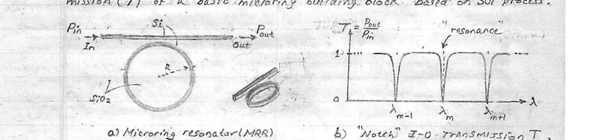
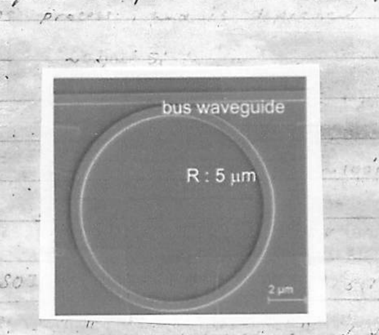
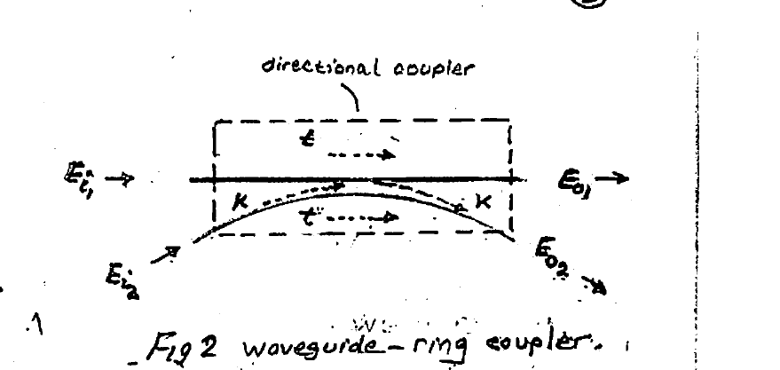
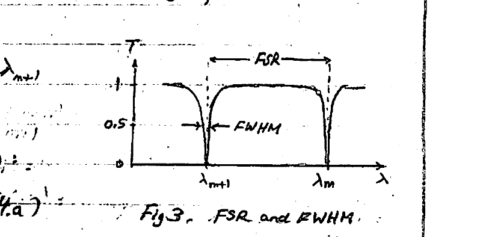
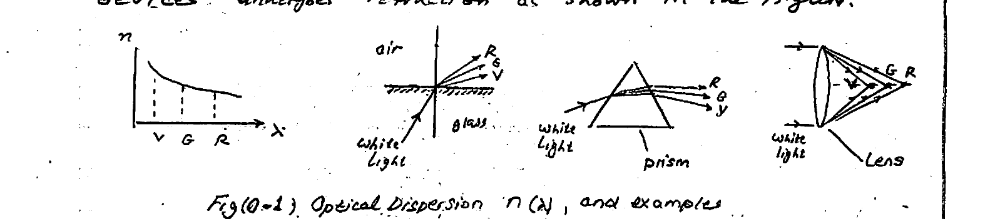
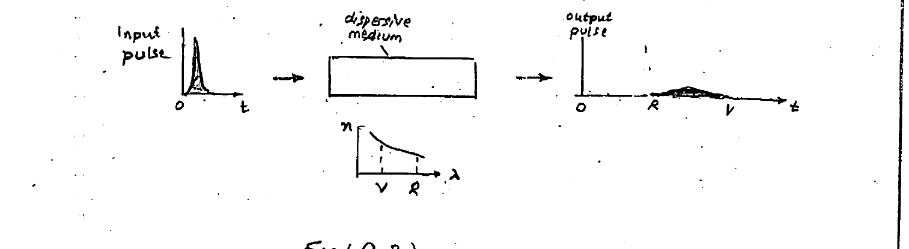

# Lecture 4 — Microring Resonator

**Northeastern University, Dept. of Electrical & Computer Engineering** · Microring Resonators (Lec #4)

---

## Overview

The **microring (MRR)** has established itself as a workhorse in PIC design. Microring resonators are compact photonic devices based on **optical coupling** between a light-carrying waveguide and a microring in very close proximity. Transfer of optical energy between the two has a **$`\lambda`$-selective** nature due to a spatial resonance effect in the microring.

Surprisingly, this makes possible a wide range of processing functions: various **optical filters**, **wavelength-division Mux & deMux**, **switches**, **modulators**, and **biosensors**. Due to a small footprint ($`R \sim 1\ \mu m`$) and a minimal power consumption, MRR's can be easily integrated in large numbers for demanding PIC applications. Fig 1 gives structure and I–O transmission ($`T`$) of a basic microring building block based on the SOI process.



*Fig 1. MRR: structure (a) and I–O optical transmission $`T = P_{out}/P_{in}`$ (b). (a) Microring resonator (MRR); (b) "Notch" I–O transmission $`T`$.*

---

## Operation

The planar MRR structure above works to couple light energy travelling in the straight waveguide (**"bus"**) into the microring. The coupled light propagates along the microring by **total internal reflection**. The amount of light captured by the ring is a function of the **ring–guide separation**, which determines the **"coupling strength"**, and the wavelength $`\lambda`$ of the light.

It is possible for the light coupled into the ring (at "top point"), after travelling a roundtrip, to return to that same point **in-phase** with "new" light entering there. Due to constructive interference the light gets stronger, and after multiple roundtrips grows quickly to a full diversion and **"trapping"** of the light (power $`P_{in}`$) entering the waveguide. This **resonance** phenomenon creates a sharp dip (null) in the "through" light (power $`P_{out}`$), occurring at multiple resonant $`\lambda`$'s: $`\lambda_{m-1},\ \lambda_m,\ \lambda_{m+1}`$. Note that there is a large number of **resonant modes** — each characterized by a particular wavelength ($`\lambda_m`$).

> \* Coupling of light b/w the waveguide and the ring is due to the **evanescent optical field** that always exists outside a light-carrying "wire" — waveguide (WG) or ring.

At resonance, the constructive interference condition requires that the **roundtrip time interval** coincides with an integer multiple ($`m`$) of a cycle period $`T`$ (where $`T = 1/f`$) of the light. That is, $`\dfrac{L}{c/n} = m\,T`$. Using $`c = \lambda f`$:

```math
\frac{L}{c/n} = m\,T \quad\rightarrow\quad \boxed{\ \lambda_r = \frac{nL}{m}\ } \qquad (1)
```

- $`\lambda_r`$ = free-space resonant wavelength of the $`m`$-th mode.
- $`nL`$ = "optical path" ($`L = 2\pi R`$).
- $`n`$ = "effective refractive index" of the Si guide with $`\text{SiO}_2`$ cladding.
- $`m`$ = mode order (typically $`m \gg 1`$).

Eqn (1) indicates how the $`\lambda_r`$ value can be set by **control of fabricated ring size** ($`R`$) and **adjustment of $`n`$**.

### Speed of resonance buildup

It is insightful to compare the speed at which the buildup of constructive interference grows to a "full light trapping", when a resonance occurs for data-carrying modulated light. Assume a moderate ON–OFF keying data rate of 10 Gb/s, a MRR with radius $`R = 10\ \mu m`$, and $`n_f \approx 2.5`$. The roundtrip time, defined by $`L/(c/n)`$, is calculated as

```math
\frac{2\pi \times 10\ \mu m}{c/2.5} = 0.5\ \text{ps}.
```

This is extremely short in comparison with the $`100\ \text{ps}`$ ($`1/10\,\text{GHz}`$) duration of a single bit of the modulated light. We therefore conclude that there is **ample time** for the resonance to reach "steady state". For example, if $`\sim 10`$ roundtrips are required for reaching a steady-state resonance, the time that this would require ($`5\ \text{ps}`$) is still $`\ll 100\ \text{ps}`$.



*A MRR: waveguide–ring topology (top view). $`R : 5\ \mu m`$.*

---

## Analysis

In what follows we formulate the guide/ring interaction in terms of a **4-port directional coupler**. Referring to Fig 2 and using the DC scattering-matrix formulation:

```math
\begin{pmatrix} E_{o_1} \\ E_{o_2} \end{pmatrix} = \begin{pmatrix} t & -jk \\ -jk & t \end{pmatrix} \begin{pmatrix} E_{i_1} \\ E_{i_2} \end{pmatrix} \qquad (2)
```



*Fig 2. Waveguide–ring coupler.*

where

- $`t`$ = "through coefficient"
- $`k`$ = "coupling coefficient"

Control of the coupling ($`k`$) is achieved through the two dimensions of the coupling region: the **waveguide–ring spacing (gap)**, and the **length** of the coupling region.

**Power conservation:**

```math
P_{o_1} + P_{o_2} = P_{i_1} + P_{i_2} \qquad (3)
```
```math
|E_{o_1}|^2 + |E_{o_2}|^2 = |E_{i_1}|^2 + |E_{i_2}|^2
```

where $`|E|^2 = E\cdot E^{*}`$.

Using Eqn (2): $`E_{o_1} = t\,E_{i_1} - jk\,E_{i_2}`$ and $`E_{o_2} = -jk\,E_{i_1} + t\,E_{i_2}`$, we obtain:

```math
t^2 + k^2 = 1 \qquad (4)
```

- $`k^2`$ = power-coupling coefficient
- $`t^2`$ = power-through, $`\;t = \sqrt{1-k^2}`$

In the above, the coupler was assumed **lossless**.

In practice, the MRR can be taken as very low-loss, so one may invoke a **"roundtrip attenuation"** $`a \le 1`$ (with $`a = 1`$ being the lossless case). Note that $`a = e^{-\alpha L}`$ since

```math
E_{i_2} = e^{-j\beta L}\,E_{o_2} = a\,e^{-j\phi}\,E_{o_2} \qquad (5)
```

where

```math
\left.\begin{aligned}
\gamma &= \alpha + j\beta = \text{propagation constant} \\
\phi &= \beta L = \text{roundtrip phase delay} \\
a &= e^{-\alpha L} = \text{"roundtrip attenuation" at } E
\end{aligned}\right\} \qquad (6)
```

From (2), $`E_{o_1} = t\,E_{i_1} - jk\,E_{i_2}`$, and (2) with (5) one finds $`E_{i_2} = \dfrac{-jk\,E_{i_1}}{1 - a t\,e^{-j\phi}}`$, and eventually, for $`E_{o_1}`$:

```math
E_{o_1} = \left[\frac{t - a\,e^{-j\phi}}{1 - a t\,e^{-j\phi}}\right] E_{i_1} \qquad (7)
```

Repeating for $`E_{o_2}`$:

```math
E_{o_2} = \left[\frac{-jk}{1 - a t\,e^{-j\phi}}\right] E_{i_1} \qquad (8)
```

Defining the **"through transmission"** $`\;T_{\text{thru}} = \dfrac{P_{o_1}}{P_{i_1}} = \dfrac{|E_{o_1}|^2}{|E_{i_1}|^2}`$, one arrives (after some algebra) at:

```math
T_{\text{thru}} = \frac{t^2 + a^2 - 2at\cos\phi}{1 + a^2 t^2 - 2at\cos\phi} \qquad (9)
```

and

```math
\frac{|E_{o_2}|^2}{|E_{i_1}|^2} = \frac{P_{o_2}}{P_{i_1}} = \frac{1 - t^2}{1 + a^2 t^2 - 2at\cos\phi} \qquad (10)
```

where the **"coupled power"**

```math
P_{o_2} = |E_{o_2}|^2 \qquad (11)
```

**At resonance ($`\lambda_r`$):** $`\;\phi = \beta L = m\cdot 2\pi \;\rightarrow\; \lambda_r = \dfrac{n_{\text{eff}}\,L}{m}`$ $`\qquad (12)`$

```math
\therefore\quad T_{\text{thru}}(\lambda_r) = \frac{t^2 + a^2 - 2at}{1 + a^2 t^2 - 2at} = \frac{(t-a)^2}{(1-at)^2}
```

Leading, for the so-called **"critical coupling"** ($`k^2 = 1 - a^2`$, or $`t = a`$):

```math
\left.\frac{P_{o_1}}{P_{i_1}}\right|_{\lambda_r} = T_{\text{thru}}(\lambda_r) = \begin{cases} 0 & a < 1 \\ 1 & a = 1\ \text{(lossless)} \end{cases} \qquad (13a)
```

Also,

```math
\left.\frac{P_{o_2}}{P_{i_1}}\right|_{\lambda_r} = \left.\left(\frac{1 - t^2}{1 + a^2 t^2 - 2at}\right)\right|_{t=a} = \frac{1}{1 - a^2} = \begin{cases} > 1 & a < 1 \\ \infty & a = 1\ \text{(lossless)} \end{cases} \qquad (13b)
```

### Comments

- \* For **"critical coupling"** the power coupled into the MRR ($`k^2`$) equals the roundtrip power loss ($`1 - a^2`$). This also implies $`t = a`$.
- At resonance, the $`T_{\text{thru}} = 0`$ outcome can be shown to be due to **destructive ring-to-guide interference**.
- **ALLPASS** behavior $`T_{\text{thru}} = 1`$ results for an ideal (lossless) MRR ($`a = 1`$).
- Interestingly, the counterpart of $`P_{o_1}/P_{i_1} \rightarrow 0`$ is $`P_{o_2}/P_{i_1} > 1`$. Furthermore, for an ideal (lossless) MRR we find (with $`a \rightarrow 1`$), as expected, $`P_{o_2}/P_{i_1} \rightarrow \infty`$.

---

## MRR Performance Parameters

The MRR performance in various applications can be assessed through a number of important parameters: (1) **"Free Spectral Range"** (FSR), (2) **"Full-Width Half Maximum"** (FWHM), (3) **Finesse factor** ($`F`$), (4) **Quality factor** ($`Q`$), (5) **Out-of-band rejection**, and (6) **"Extinction Ratio"** (ER). When used as a modulator, the **"Modulation Depth"** parameter is specified as well.

### Free Spectral Range (FSR)

Being the spectral separation b/w adjacent nulls of the transmission, the FSR measures the range of wavelengths (frequencies) available for utilization with full (unity) transmission (see Fig 3).

In terms of $`\lambda`$:

```math
\text{FSR}_\lambda = \Delta\lambda = \lambda_m - \lambda_{m+1} = L\left(\frac{n_{\text{eff}}(\lambda_m)}{m} - \frac{n_{\text{eff}}(\lambda_{m+1})}{m+1}\right)
```

After some algebra (see Appendix A):

```math
\boxed{\ \text{FSR}_\lambda = \frac{\lambda^2}{n_g\,L}\ } \qquad (14a)
```

where

```math
n_g = n_{\text{eff}} - \lambda\,\frac{dn_{\text{eff}}}{d\lambda} \qquad (14b) \qquad (\,> n_{\text{eff}}\,)
```



*Fig 3. FSR and FWHM.*

Here, $`n_g`$ is the **"group" effective refractive index**, and the definition (14b) indicates its difference from $`n_{\text{eff}}`$ is due to **dispersion** (Appendix O).

In high-throughput optical communication links employing multiple $`\lambda`$'s — specifically **Wavelength-Division-Multiplexing (WDM)** — all the channels ($`\lambda`$'s) should fit within an FSR. A wider FSR, which would accommodate a larger (denser) number of channels, is highly desirable. Importantly, as is evident from (14), this could be realized with **smaller-radius rings**. For example, $`\text{FSR} \approx 70\ \text{nm}`$ requires $`R \approx 1.5\ \mu m`$.

For completeness, the FSR in the $`f`$-domain, $`\text{FSR}_f`$, is found in Appendix B.

### 3-dB Bandwidth — Full-Width Half-Maximum (FWHM)

This is simply the half-power bandwidth of the resonance lineshape — or simply the 3 dB bandwidth expressed in $`\lambda`$ units (Fig 3). It can be shown that the FWHM is given by

```math
\boxed{\ \text{FWHM} = \frac{k^2\,\lambda^2}{\pi\,L\,n_g}\ } \qquad (15)
```

where $`k^2 = 1 - t^2`$ is the coupling coefficient b/w the waveguide ("bus") and the ring. High selectivity (smaller FWHM) can be accomplished using **weaker coupling** (smaller $`k`$). The $`k`$ value is a technology-sensitive parameter, however.

### Finesse (F)

Finesse is determined from the ratio of the FSR and the FWHM parameters:

```math
F = \frac{\text{FSR}}{\text{FWHM}} = \frac{\pi}{k^2} \qquad (16)
```

where the second form of $`F`$ is derived by using (14) and (15). A large Finesse value ($`F`$) implies a large number of channels ($`\lambda`$'s) can be accommodated when WDM techniques are employed to achieve high data throughput. For a single ring $`F \sim 10\text{–}100`$.

### Quality Factor (Q)

The Quality factor of the MRR resonator, similar to electrical circuits, is defined as $`2\pi\times`$ the ratio of light energy stored in the ring at resonance to energy lost in one cycle. Energy losses occur in the (Si) ring material and through radiation leakage from the ring.

```math
Q = \omega_r\left(\frac{\text{Stored Energy}}{\text{Power Loss}}\right) \qquad (17a)
```

where $`\omega_r = 2\pi f_r`$ is the resonant frequency (rad/s) $`= \dfrac{2\pi}{T}`$.

Alternatively, the $`Q`$ measures the frequency (wavelength) **selectivity** of the MRR (sharpness of its response). It is equivalently given by the ratio of its center wavelength (frequency) to FWHM (3 dB bandwidth):

```math
Q = \frac{\lambda_r}{\text{FWHM (}\mu m\text{)}} = \frac{f_r}{\text{FWHM (Hz)}} = F\left(\frac{n_g L}{\lambda_r}\right) \qquad (17b)
```

### Extinction Ratio (ER)

The ER, also called **"ON–OFF ratio"**, is the quotient of $`T_{\max}`$ to $`T_{\min}`$:

```math
ER = \frac{T_{\max}}{T_{\min}} \qquad (18)
```

Ideally, for a loss-free MRR, $`T_{\max} \rightarrow 1`$ and $`T_{\min} \rightarrow 0`$, giving $`ER \rightarrow \infty`$. However, losses in the structure prevent these ideal limits from being reached. Clearly, the less lossy the MRR — the higher is the ER.

> \* $`Q`$ in (17b) is found from a Lorentzian form for $`T_{\text{drop}}`$ (Eqn 24.a) by setting $`|T_{\text{drop}}| = \dfrac{a}{2}`$.

### Example

An SOI MRR has the following parameters: $`R = 10\ \mu m`$, $`n_{\text{eff}} \approx 2.5`$, $`n_g \approx 4`$, $`k = 0.1`$, $`\lambda = 1.550\ \mu m`$ (operation).

**a) $`\lambda_m(m) = ?`$**

```math
\lambda_m = \frac{2\pi R\,n_{\text{eff}}}{m} = \frac{2\pi\cdot 10\ \mu m\cdot 2.5}{m} = \frac{157.08}{m}\ (\mu m)
```

**b) What is $`m`$?**

```math
m = \frac{157.08}{\lambda} \approx 101
```

**c) Find the FSR @ $`\lambda = 1.550\ \mu m`$:**

```math
\text{FSR}_\lambda = \frac{\lambda^2}{n_g L} = \frac{(1.550\ \mu m)^2}{4\cdot 2\pi\cdot 10\ \mu m} = \underline{0.00956\ \mu m}
```

**d) Find the FWHM and hence $`Q`$ ($`\lambda = 1.55\ \mu m`$):**

```math
\text{FWHM} = \frac{k^2\lambda^2}{\pi L\,n_g} = \frac{0.1^2\,(1.55\ \mu m)^2}{\pi\cdot 4\cdot 2\pi\cdot 10\ \mu m} = \underline{0.0304\ \text{nm}}
```

```math
Q = \frac{\lambda}{\text{FWHM}} = \frac{1.55\ \mu m}{0.0304\ \text{nm}} = \underline{5.09\times 10^4}
```

---

## Appendix O — Optical Dispersion

Often, the refractive index ($`n`$) of a material displays a wavelength-dependence as shown in Fig (O-1). As a result, polychromatic light being refracted by various optical devices undergoes refraction as shown in the figure.



*Fig (O-1). Optical dispersion $`n(\lambda)`$, and examples.*

White light (polychromatic) will be resolved into its various colors (wavelengths) by a **prism**, whereas a **lens** will result in different colors focused at different points (**aberration**). Similarly, a short pulse of white light gets broadened after passage in dispersive material (Fig O-2). Because **Red** light travels faster than **Violet** light in the material (Red light sees a smaller refractive index $`n`$), it arrives first.



*Fig (O.2). Pulse broadening in a dispersive medium.*

Because of their dispersive action, dispersive materials are useful as **spectrometers**, showing the frequency (wavelength) content of light sources of various kinds.

---

## Appendix A — Derivation of FSR$`_\lambda`$

By definition,

```math
\text{FSR} \triangleq \lambda_m - \lambda_{m+1} \qquad [A.1]
```

where

```math
\lambda_m = \frac{L}{m}\,n_{\text{eff}}(\lambda_m) \qquad [A.2]
```

Here the notation $`n(\lambda)`$ signifies the presence of **dispersion** — i.e. variation of propagation speed (and hence $`n_{\text{eff}}`$) with wavelength or frequency.

```math
\text{FSR} = L\left[\frac{n_{\text{eff}}(\lambda_m)}{m} - \frac{n_{\text{eff}}(\lambda_{m+1})}{m+1}\right] = \frac{L}{m}\left[n_{\text{eff}}(\lambda_m) - \frac{n_{\text{eff}}(\lambda_{m+1})}{1 + \tfrac{1}{m}}\right]
```

Since typically $`m \gg 1`$: $`\;\dfrac{1}{1 + 1/m} \approx 1 - \dfrac{1}{m}`$,

```math
\text{FSR} = \frac{L}{m}\left[n_{\text{eff}}(\lambda_m) - \left(1 - \tfrac{1}{m}\right)n_{\text{eff}}(\lambda_{m+1})\right] = \frac{L}{m}\left[n_{\text{eff}}(\lambda_m) - n_{\text{eff}}(\lambda_{m+1}) + \frac{n_{\text{eff}}(\lambda_{m+1})}{m}\right]
```

The closeness of $`\lambda_m`$ & $`\lambda_{m+1}`$ justifies treating $`n_{\text{eff}}(\lambda_m) - n_{\text{eff}}(\lambda_{m+1})`$ as a differential:

```math
n_{\text{eff}}(\lambda_m) - n_{\text{eff}}(\lambda_{m+1}) = (\lambda_m - \lambda_{m+1})\frac{dn_{\text{eff}}}{d\lambda} = \text{FSR}\cdot\frac{dn_{\text{eff}}}{d\lambda} \qquad [A.3]
```

```math
\therefore\quad \text{FSR} = \frac{L}{m}\,\text{FSR}\,\frac{dn_{\text{eff}}}{d\lambda} + \frac{L}{m^2}\,n_{\text{eff}}(\lambda_{m+1})
```

```math
\text{FSR} = \frac{\dfrac{L}{m^2}\,n_{\text{eff}}}{1 - \dfrac{L}{m}\dfrac{dn_{\text{eff}}}{d\lambda}} = \frac{\lambda/m}{1 - \dfrac{\lambda}{n_{\text{eff}}}\dfrac{dn_{\text{eff}}}{d\lambda}} = \frac{1}{m}\cdot\frac{\lambda\,n_{\text{eff}}}{n_{\text{eff}} - \lambda\dfrac{dn_{\text{eff}}}{d\lambda}}
```

where use was made of $`\dfrac{L}{m} = \dfrac{\lambda_m}{n_{\text{eff}}(\lambda_m)}`$ from $`[A.2]`$. Finally, using $`\dfrac{1}{m} = \dfrac{\lambda_m}{L\,n_{\text{eff}}(\lambda_m)}`$ we find:

```math
\boxed{\ \text{FSR}_\lambda = \frac{\lambda^2}{n_g\,L}\ },\qquad L = 2\pi R \qquad [A.4]
```

where $`n_g`$ is the **"group effective refractive index"** defined by

```math
n_g \triangleq n_{\text{eff}} - \lambda\,\frac{dn_{\text{eff}}}{d\lambda} \qquad [A.5]
```

Note that $`n_g`$ differs from $`n_{\text{eff}}`$ because of **"dispersion"**, i.e. the variation with $`\lambda`$ of $`n_{\text{eff}}(\lambda)`$. Without dispersion, $`dn_{\text{eff}}/d\lambda = 0`$ and $`n_g = n_{\text{eff}}`$!

### Group Refractive Index ($`n_g`$)

The "group refractive index" $`n_g`$ originates from the concept of **"group velocity"** $`v_g`$:

```math
\text{Group velocity:}\quad v_g \triangleq \left(\frac{d\beta}{d\omega}\right)^{-1} \qquad (A.6)
```

Compared to the **"phase velocity"** $`v_p`$:

```math
v_p \triangleq \left(\frac{\beta}{\omega}\right)^{-1} \qquad (A.7)
```

where $`\beta = \dfrac{2\pi}{\lambda}\,n_{\text{eff}}`$ in our case.

**(1)** For the case of a **dispersionless medium** ($`n_{\text{eff}} = \text{const}`$), we rewrite $`\beta`$ as

```math
\beta = \left(\frac{2\pi f}{c}\right)n_{\text{eff}} = \left(\frac{\omega}{c}\right)n_{\text{eff}},
```

which leads to the equality $`v_g = v_p`$:

```math
v_g = \left(\frac{n_{\text{eff}}}{c}\right)^{-1} = \frac{c}{n_{\text{eff}}}, \qquad v_p = \frac{c}{n_{\text{eff}}}
```

This is the case of ordinary **"free-space"** mode of propagation of light, due to its dispersion-free nature.

**(2)** For many materials, however, $`n_{\text{eff}} = n_{\text{eff}}(\lambda)`$ — i.e. the different frequencies (wavelengths) contained in a complex signal travel in the material at different **phase velocities** (Fig A.2). Hence they arrive at their destination at different times (phases), producing upon addition a **broadened light pulse**. This effect is called **"dispersion"** on account of the different frequency components getting dispersed relative to one another ($`v_p = c/n_{\text{eff}}(\lambda)`$).

This is the case for light propagation in a dispersive material like (Si) making up the ring and waveguide(s) in an MRR.

The **"group velocity"** measures the speed of propagation of a "localized" (narrow-band) group of frequency (wavelength) components. Optical signals fall in this category because of their extremely high frequencies compared to modulation frequencies (data rates). For example, $`200\ \text{THz}`$ ($`\omega`$ at $`\lambda = 1.5\ \mu m`$) as compared to a modulating data rate of $`100\ \text{Gb/s}`$ ($`0.1\ \text{THz}`$).

**Evaluating $`v_g`$:**

```math
v_g = \left(\frac{d\beta}{d\omega}\right)^{-1} = \left(\frac{d}{d\omega}\left(\beta\cdot\frac{d\lambda}{d\omega}\right)\right)^{-1},\qquad \beta = \frac{2\pi}{\lambda}\,n_{\text{eff}}
```

which, when using $`\lambda = 2\pi c/\omega`$, yields after some algebra:

```math
v_g = \frac{c}{n_g} \qquad (A.8), \qquad\text{with}\qquad n_g = n_{\text{eff}} - \lambda\,\frac{dn_{\text{eff}}}{d\lambda} \qquad (A.9)
```

$`v_g`$ in (A.8) is to be contrasted with $`v_p = c/n_{\text{eff}}`$.

---

## Appendix B — Derivation of FSR$`_f`$

Here we complement the previously derived $`\text{FSR}_\lambda`$ with $`\text{FSR}_f`$ in the $`f`$-domain.

### I) Dispersionless medium: $`n = \text{const}`$

The lowest frequency producing resonance in a MR with radius $`R`$ has a wavelength that exactly fits in the ring's circumference, i.e. has a period corresponding to a single ring roundtrip, i.e.:

```math
\text{period}\quad T_1 = \frac{2\pi R}{c/n_{\text{eff}}} \quad\rightarrow\quad f_1 = \frac{c/n_{\text{eff}}}{2\pi R} \qquad (B.1)
```

Higher resonant frequencies $`f_m,\ f_{m+1}`$:

```math
\left.\begin{aligned}
m\,T_m = \frac{2\pi R}{c/n} &\;\rightarrow\; f_m = m\,\frac{c/n}{2\pi R} \\
(m+1)\,T_{m+1} = \frac{2\pi R}{c/n} &\;\rightarrow\; f_{m+1} = (m+1)\,\frac{c/n}{2\pi R}
\end{aligned}\right\} \;\Rightarrow\; f_{m+1} - f_m = \text{FSR}_f = \frac{c}{2\pi R\,n} \qquad (B.2)
```

**Conclusion:** the FSR equals the inverse of the ring's roundtrip travel time!

- **Example 1:** see [Example 1](#example-1) below.
- **Example 2:** $`R = ?`$ for $`\text{FSR} = 300\ \text{GHz}`$ for an MRR fabricated in SOI ($`n_{\text{eff}} = 2.5`$).
  ```math
\text{Ans:}\quad R = \frac{c}{2\pi n_{\text{eff}}\,\text{FSR}_f} = 64\ \mu m
```

### II) Dispersive medium: $`n(f)`$

```math
\left.\begin{aligned}
f_m &= m\,\frac{c/n(f_m)}{2\pi R} \\
f_{m+1} &= (m+1)\,\frac{c/n(f_{m+1})}{2\pi R}
\end{aligned}\right\}\;\rightarrow\; \text{FSR}_f = f_{m+1} - f_m = \,?
```

```math
\therefore\;\text{FSR}_f = f_{m+1} - f_m = \frac{c}{2\pi R}\left(\frac{m+1}{n(f_{m+1})} - \frac{m}{n(f_m)}\right)
```

```math
= \frac{(m+1)\,n(f_m) - m\,n(f_{m+1})}{n(f_m)\,n(f_{m+1})}\cdot\frac{c}{2\pi R} = \frac{n(f_m) - m\,[\,n(f_{m+1}) - n(f_m)\,]}{n(f_m)\,n(f_{m+1})}\cdot\frac{c}{2\pi R}
```

with $`\;n(f_{m+1}) - n(f_m) = (f_{m+1} - f_m)\dfrac{dn}{df} = \text{FSR}_f\,\dfrac{dn}{df}`$.

Using $`m = \dfrac{2\pi R\,f_m}{c/n(f_m)}`$, after some algebra:

```math
\boxed{\ \text{FSR}_f = \frac{c/2\pi R}{n_{\text{eff}} + f\dfrac{dn_{\text{eff}}}{df}} = \frac{c/L}{n_{\text{eff}} + f\dfrac{dn_{\text{eff}}}{df}}\ } \qquad (B.3)
```

**Sanity check:** $`n = \text{const} \;\rightarrow\; \text{FSR}_f = \dfrac{c}{2\pi R\,n_{\text{eff}}}`$ ✓ (with $`L = 2\pi R`$).

### Example 1

Consider a Si microring fabricated in an SOI process with $`n_{\text{eff}} = 2.5`$. Assuming a dispersionless medium, calculate and tabulate the $`\text{FSR}_f`$ obtainable for the following ring sizes.

| $`R`$ (µm) | 1 | 5 | 10 | 15 | 20 | 25 | 30 | 40 | 50 |
| --- | --- | --- | --- | --- | --- | --- | --- | --- | --- |
| $`\text{FSR}_f`$ (THz) | 19.1 | 3.82 | 1.91 | 1.27 | 0.955 | 0.764 | 0.635 | 0.478 | 0.382 |

**Conclusion:** Clearly, a wide FSR — which is required in WDM systems — can be accomplished with reduced ring radius. For example, a $`50\ \mu m`$ ring has a corresponding $`\text{FSR} = 382\ \text{GHz}`$.

### Relationship b/w FSR$`_f`$ & FSR$`_\lambda`$

The $`\text{FSR}_f`$–$`\text{FSR}_\lambda`$ relationship can be demonstrated readily for a non-dispersive medium $`n_{\text{eff}} = \text{const}`$.

Given:

```math
\text{FSR}_\lambda = \frac{\lambda^2}{2\pi R\,n_{\text{eff}}} \qquad\&\qquad \text{FSR}_f = \frac{c}{2\pi R\,n_{\text{eff}}}
```

Obtaining $`\text{FSR}_\lambda`$ from $`\text{FSR}_f`$:

```math
\text{FSR}_\lambda = \lambda_m - \lambda_{m+1} = \frac{c}{f_m} - \frac{c}{f_{m+1}} = \left(\frac{c}{f_m f_{m+1}}\right)\text{FSR}_f \approx \left(\frac{c}{f^2}\right)\text{FSR}_f
```

```math
\rightarrow\quad \frac{\text{FSR}_f}{\text{FSR}_\lambda} = \frac{f^2}{c} = \frac{c}{\lambda^2} \qquad (c = \lambda f)
```

```math
\therefore\quad \text{FSR}_f = \frac{f^2}{c}\cdot\frac{\lambda^2}{2\pi R\,n_{\text{eff}}} = \frac{c}{2\pi R\,n_{\text{eff}}} \;\checkmark
```

**Example.** $`\text{FSR}_\lambda = 5.0\ \text{nm}`$ for $`\lambda = 1.5\ \mu m`$ ($`f = 200\ \text{THz}`$). Find: (1) $`\text{FSR}_f`$, (2) $`R`$ of ring.

```math
\text{FSR}_f = \frac{c}{\lambda^2}\,\text{FSR}_\lambda = \frac{3\times 10^8 \cdot 5\times 10^{-9}}{(1.5\times 10^{-6})^2} = \underline{667\ \text{GHz}}
```

```math
R = \frac{\lambda^2}{2\pi n_{\text{eff}}\,\text{FSR}_\lambda} = \underline{28.6\ \mu m}
```
