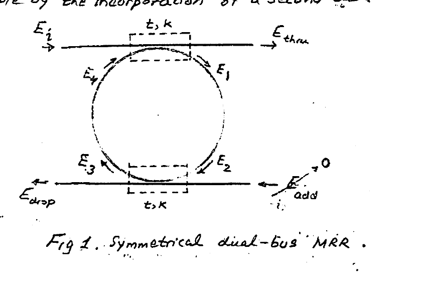
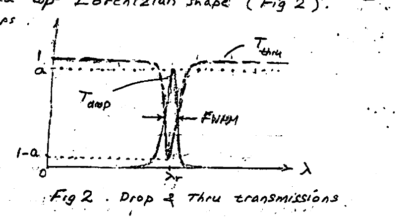
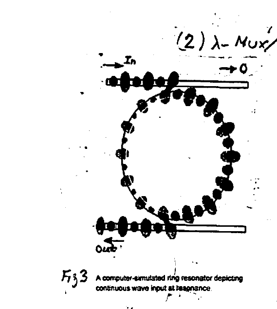
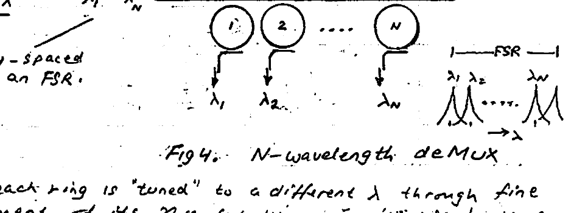
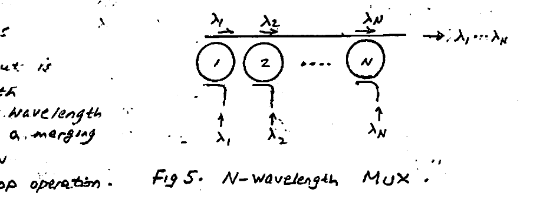
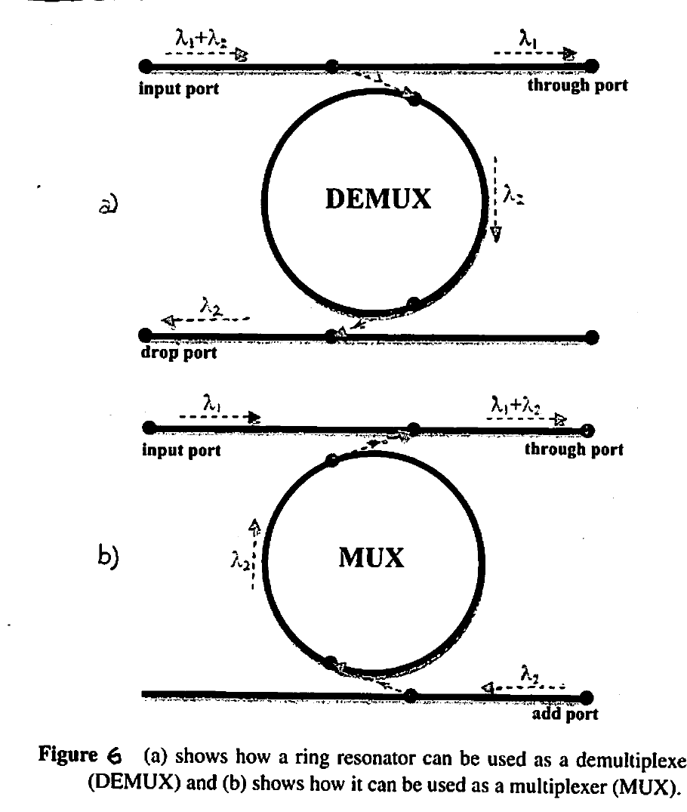
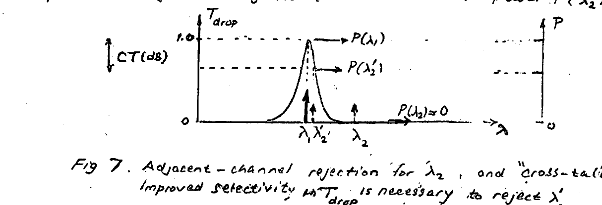
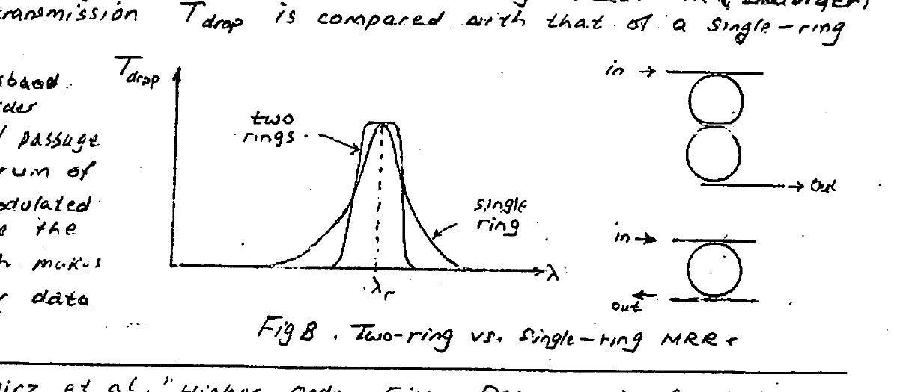
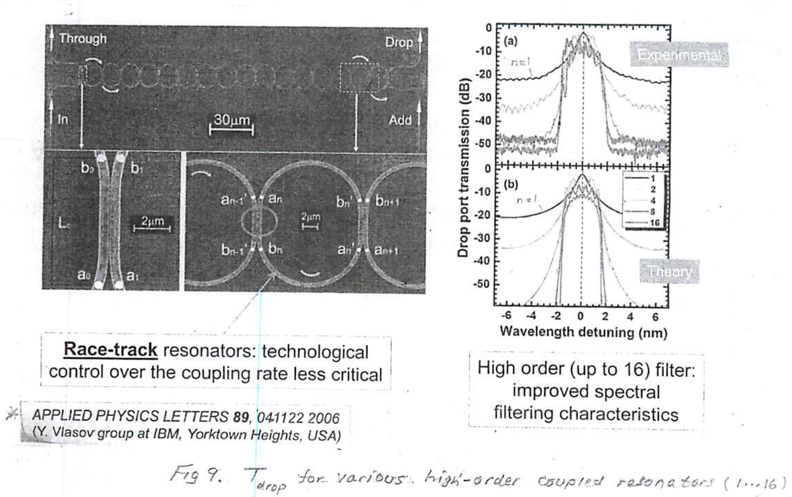
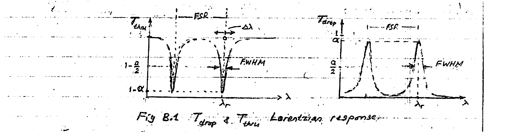

# Lecture 5 — MRR Mux (Microring Resonator Multiplexer)

**EECE 7398 — Analysis & Design of Photonic Integrated Circuits (PICs)** · Northeastern University, Dept. of Electrical & Computer Engineering · Spring 2023

**Topic: DUAL-BUS MRR**

---

## The Dual-Bus MRR (4-Port Device)

New functionalities become possible by the incorporation of a **second bus**. The result is a **4-port optical device** (Fig 1).

Here, a pair of identical couplers (with $`t, k`$ matrices) are responsible for producing the outputs ($`E_{thru}`$ & $`E_{drop}`$). For starters, only one input $`E_i`$ will be active, with $`E_{add} = 0`$.



*Fig 1. Symmetrical dual-bus MRR.*

The two couplers relate the bus and ring fields by:

```math
\begin{pmatrix} E_{thru} \\ E_1 \end{pmatrix} = \begin{pmatrix} t & -jk \\ -jk & t \end{pmatrix} \begin{pmatrix} E_i \\ E_4 \end{pmatrix} \qquad (1)
```

```math
\begin{pmatrix} E_{drop} \\ E_3 \end{pmatrix} = \begin{pmatrix} t & -jk \\ -jk & t \end{pmatrix} \begin{pmatrix} 0 \\ E_2 \end{pmatrix} \qquad (2) \qquad \left[\,0 = E_{add}\,\right]
```

where the half-ring propagation relations are:

```math
\left.\begin{aligned} E_2 &= E_1\,\sqrt{a}\;e^{-j\frac{\phi}{2}} \\[4pt] E_4 &= E_3\,\sqrt{a}\;e^{-j\frac{\phi}{2}} \end{aligned}\right\} \qquad (3)
```

Here, $`\sqrt{a} = e^{-\frac{\alpha L}{2}}`$ and $`\dfrac{\phi}{2} = \dfrac{\beta L}{2}`$ are the optical-field **"half-ring"** attenuation and phase delay. Solving Eqns (1, 2, 3); after some algebra (**Appendix A**):

```math
E_{drop} = \left(\frac{-\sqrt{a}\,k^2\,e^{-j\frac{\beta L}{2}}}{1 - a t^2 e^{-j\beta L}}\right) E_i \quad\rightarrow\quad P_{drop} = \frac{a k^4}{|\text{Denom.}|^2}\,P_i \qquad (4a)
```

```math
E_{thru} = t\left(\frac{1 - a\,e^{-j\beta L}}{1 - a t^2 e^{-j\beta L}}\right) E_i \quad\rightarrow\quad P_{thru} = t^2\left|\frac{1 - a\,e^{-j\beta L}}{\text{Denom.}}\right|^2 P_i \qquad (4b)
```

where use was made of $`P = |E|^2`$ for the various $`E`$'s. Define **"thru"** and **"drop"** transmissions:

```math
T_{drop} = \frac{P_{drop}}{P_i} = \frac{a k^4}{|1 - a t^2 e^{-j\beta L}|^2} \qquad (5a)
```

```math
T_{thru} = \frac{P_{thru}}{P_i} = t^2\,\frac{|1 - a\,e^{-j\beta L}|^2}{|\text{Denom.}|^2} \qquad (5b)
```

For the realistic practical case of a **low-loss microring**, in a narrow band $`\pm\Delta\lambda`$ ($`\Delta\lambda \ll \lambda_r`$) about resonance, $`T_{drop}`$ simplifies (**Appendix B**) to:

```math
T_{drop}(\Delta\lambda) \approx \frac{a}{1 + \left(2Q'\dfrac{\Delta\lambda}{\lambda_r}\right)^2} \qquad (6a)
```

```math
T_{thru}(\Delta\lambda) \approx 1 - \frac{a}{1 + \left(2Q'\dfrac{\Delta\lambda}{\lambda_r}\right)^2} \qquad (6b) \qquad [\text{refer to Appendix B}]
```

In Eqns (6) the practical case of a low-loss resonator ($`a \sim 1`$) and **"weak coupling"** $`k \ll 1`$ (implying $`t \approx 1`$) was considered (**Appendix C**).

---

## Lorentzian Response & Quality Factor

In Eqn (6), $`T_{drop}`$ possesses a **rounded-top Lorentzian** shape (Fig 2). It is noteworthy that for telecom apps such a rounded-top is rather undesirable.



*Fig 2. Drop & Thru transmissions.*

At resonance ($`\Delta\lambda = 0`$):

```math
T_{drop} = a, \qquad T_{thru} = 1 - a
```

which, for an ideal loss-free MRR ($`a = 1`$), yields $`T_{drop} = 1`$ and $`T_{thru} = 0`$.

In other words, at resonance the **entire input power is "polled" into the drop port**, and **none passes thru** the top bus (Fig 3).

**$`Q'`$:** By setting $`T_{drop} = \dfrac{a}{2}`$ in (6a), the quality factor is determined:

```math
Q' = \frac{\lambda_r}{\text{FWHM}} = \frac{f_r}{\text{FWHM}}\;(\text{Hz})
```



*Fig 3. A computer-simulated ring resonator depicting continuous wave input at resonance.*

---

## Applications

### (1) Filters

Highly selective ($`Q \sim 10^4`$) **bandpass (drop)** and **notch ("thru")** filters are obtainable. With the center $`\lambda_r`$ being a sensitive function of $`n_{eff}`$, the MRR is useful as a **biosensor**.

### (2) λ-Mux / deMux

For a **WDM** input with $`N`$ wavelengths ($`\lambda_1, \dots, \lambda_N`$), a large data transfer capacity ($`\sim`$ Tb/s) is achievable:

```math
\text{Capacity} = N \times R_b
```

where $`R_b`$ is the (synchronous) bit rate (bits/s) of the data stream modulating each $`\lambda`$.

#### λ-deMUX

$`\lambda_1, \dots, \lambda_N`$ are **uniformly-spaced** within an FSR.



*Fig 4. N-wavelength deMux.*

Here each ring is **"tuned"** to a different $`\lambda`$ through fine adjustment of its $`n_{eff}`$ (e.g. thru an on-chip microheater: for Si, $`\dfrac{\Delta n_{eff}}{\Delta T} = 1.84\times10^{-4}\ {}^\circ\text{C}^{-1}`$).

#### λ-MUX

Here the unused bottom-bus input is activated as an **"add"** port with a different data-modulated wavelength $`\lambda_1, \lambda_2, \dots, \lambda_N`$. The result is a **merging** of $`N`$ modulated $`\lambda`$'s: $`\lambda_1, \dots, \lambda_N`$.

See Fig 6 for basic add/drop operation.



*Fig 5. N-wavelength MUX.*

---

## λ-MUX & DeMUX (Add-Drop MRR Filter)

Figure 6 shows the case in which we wish to multiplex an optical signal with a wavelength of $`\lambda_2`$ to the through port. In this case, we inject the optical signal at the add port and steady state is reached, in which the through port sees a maximum added power at $`\lambda_2`$. Since ring resonators can be used as a multiplexer by adding a signal to the through port and as a demultiplexer by dropping them to the drop port, this structure is commonly called the **ring resonator add-drop filter**.



*Figure 6. (a) shows how a ring resonator can be used as a demultiplexer (DEMUX) and (b) shows how it can be used as a multiplexer (MUX).*

---

## Adjacent-Channel Cross-Talk (CT)

The selectivity offered by the single-ring add-drop multiplexer becomes a **limiting factor** in high-throughput WDM systems. In such systems, the large number of channels (wavelengths) being crowded in an FSR interval results in an interchannel spacing too small for selective rejection of an adjacent channel.

This is easily seen in Fig 7, where along with the desired drop channel ($`\lambda_1`$), two adjacent channels are shown — one widely-separated ($`\lambda_2`$), the other narrowly-separated ($`\lambda_2'`$). While the former gets safely rejected with insignificant drop power $`P(\lambda_2) \approx 0`$, the latter is **not** rejected and passes through with a significant amount of drop power $`P(\lambda_2')`$.



*Fig 7. Adjacent-channel rejection for $`\lambda_2`$, and "cross-talk" for $`\lambda_2'`$. Improved selectivity in $`T_{drop}`$ is necessary to reject $`\lambda_2'`$.*

To permit rejection of the near-channel $`\lambda_2'`$, higher selectivity is clearly necessary.

It has been demonstrated that higher selectivities are achievable through the use of **multiple coupled rings**.\* Such higher selectivities make possible achieving higher densities of WDM, and hence data throughputs. Multiple-coupled rings (i.e. higher-order ring structures) provide a **flatter passband** with **steeper out-of-band rolloff**. The latter provides superior rejection of adjacent-channel crosstalk. Fig 8 shows the enhanced selectivity obtainable with a **two-ring cascade** (2R, 2nd order). The drop transmission $`T_{drop}`$ is compared with that of a single-ring drop filter.

The flat passband response provides for a faithful passage of the spectrum of a data-modulated signal, while the greater width makes possible higher data rates.



*Fig 8. Two-ring vs. single-ring MRR.*

> \* J. V. Hryniewicz et al., "Higher-Order Filter Response in Coupled Microring Resonators," *IEEE Photonics Technology Letters*, Vol. 12, no. 4, March 2000.
> \*\* S. Papaioannou et al., "On-chip Dual Stream DWDM Eight-channel-Capable SOI-Based Muxs/DeMuxs with 40 GHz Channel Bandwidth," *IEEE Photonics Journal*, Vol. 7, No. 1, Feb 2015.

---

## Higher-Order Multiple-Ring Filters

The increased device complexity introduced in multiple-ring systems is justified by the superior performance obtained. Of notable importance in multi-ring filters is the **inter-ring coupling coefficient**, which should be kept **"weak"** to maintain a flat-top response. Large coupling coefficients cause an undesirable **multiple-hump** response in the passband.

**HIGHER-ORDER MULTIPLE-RING FILTERS:**

By cascading more than two rings, a marked improvement in filter selectivity is obtainable. The example below (Fig 9) demonstrates the performance enhancement when **1, 2, 4, 8, 16** resonant rings are cascaded.



*Fig 9. $`T_{drop}`$ for various high-order coupled resonators (1 … 16). Light filtering with Coupled Resonator Optical Waveguide (CROW) structures. **Race-track** resonators: technological control over the coupling rate is less critical. High-order (up to 16) filter: improved spectral filtering characteristics. (Applied Physics Letters **89**, 041122, 2006 — Y. Vlasov group at IBM, Yorktown Heights, USA.)*

---

## Appendix A — Derivation of Thru & Drop Transmissions

Referring to **Fig 1** in the lecture notes:

```math
E_3 = t\,E_2 - jk\,\underbrace{E_{add}}_{=\,0} = t\sqrt{a}\,e^{-j\frac{\phi}{2}}\,E_1, \qquad E_1 = -jk\,E_i + t\,E_4
```

where

```math
E_2 = \sqrt{a}\,e^{-j\frac{\phi}{2}}\,E_1, \qquad E_4 = \sqrt{a}\,e^{-j\frac{\phi}{2}}\,E_3
```

```math
\therefore\quad E_3 = t\sqrt{a}\,e^{-j\frac{\phi}{2}}\left(-jk\,E_i + t\sqrt{a}\,e^{-j\frac{\phi}{2}}\,E_3\right)
```

**Solving:**

```math
E_3 = \left(\frac{-jk\,t\sqrt{a}\,e^{-j\frac{\phi}{2}}}{1 - t^2 a\,e^{-j\phi}}\right) E_i
```

```math
E_4 = \left(\frac{-jk\,t\cdot a\,e^{-j\phi}}{1 - t^2 a\,e^{-j\phi}}\right) E_i
```

**Now** (with $`k^2 = 1 - t^2`$):

```math
E_{thru} = t\,E_i - jk\,E_4 = \dots = t\left(\frac{1 - a\,e^{-j\phi}}{1 - t^2 a\,e^{-j\phi}}\right) E_i
```

```math
E_{drop} = -jk\,E_2 + t\,\underbrace{E_{add}}_{=\,0}\,, \qquad E_1 = -jk\,E_i + t\,E_4 = \dots = \left(\frac{-jk}{1 - t^2 a\,e^{-j\phi}}\right) E_i
```

```math
\therefore\quad E_{drop} = \left(\frac{-\sqrt{a}\,k^2\,e^{-j\frac{\phi}{2}}}{1 - t^2 a\,e^{-j\phi}}\right) E_i
```

Finally, the above $`E_{thru}`$ & $`E_{drop}`$ lead to the corresponding transmissions, after using $`\phi = \beta L`$:

```math
T_{thru} = \frac{|E_{thru}|^2}{|E_i|^2} = t^2\,\frac{|1 - a\,e^{-j\beta L}|^2}{|1 - t^2 a\,e^{-j\beta L}|^2}
```

```math
T_{drop} = \frac{|E_{drop}|^2}{|E_i|^2} = \frac{a k^4}{|1 - t^2 a\,e^{-j\beta L}|^2}
```

---

## Appendix B — Narrow-Band Behavior of $`T_{drop}`$ & $`T_{thru}`$ Near Resonance

In the vicinity of resonance $`\lambda = \lambda_r + \Delta\lambda`$, where $`\lambda_r`$ = resonant wavelength and $`\Delta\lambda \ll \lambda_r`$ (a slight deviation from resonance). We wish to derive $`T_{drop}`$, which would also give $`T_{thru}`$ by energy conservation ($`T_{thru} = 1 - T_{drop}`$).

$`T_{drop}`$ was determined as (Eqn 5a):

```math
T_{drop} = \frac{a k^4}{|1 - a t^2 e^{-j\beta L}|^2} \qquad (\text{B.1})
```

**Denominator:**

```math
|1 - a t^2 e^{-j\beta L}|^2 = (1 - a t^2 e^{-j\beta L})(1 - a t^2 e^{+j\beta L})
```

```math
= 1 - a t^2 e^{-j\beta L} - a t^2 e^{+j\beta L} + a^2 t^4
```

```math
= 1 + a^2 t^4 - 2 a t^2 \cos\beta L
```

Now near resonance $`\lambda = \lambda_r + \Delta\lambda`$, where $`\Delta\lambda \ll \lambda_r`$, i.e.

```math
\beta L = \frac{2\pi n_{eff} L}{\lambda} = \frac{2\pi n_{eff} L}{\lambda_r + \Delta\lambda} \approx \underbrace{\left(\frac{2\pi n_{eff} L}{\lambda_r}\right)}_{x}\left(1 - \frac{\Delta\lambda}{\lambda_r}\right) \qquad (\text{B.2})
```

```math
\therefore\quad \cos\beta L = \cos\!\left[x\left(1 - \frac{\Delta\lambda}{\lambda_r}\right)\right], \qquad x = \frac{2\pi n_{eff} L}{\lambda_r} = 2\pi m
```

```math
= \cos x \,\cos\!\left(\frac{x\,\Delta\lambda}{\lambda_r}\right) + \sin x \,\sin\!\left(\frac{x\,\Delta\lambda}{\lambda_r}\right)
```

Noting that $`\cos 2\pi m = 1`$ and $`\sin 2\pi m = 0`$:

```math
\therefore\quad \cos\beta L = \cos\!\left(\frac{x\,\Delta\lambda}{\lambda_r}\right) \approx 1 - \frac{1}{2}\left(\frac{\Delta\lambda}{\lambda_r}x\right)^2 \qquad \left[\cos\theta \approx 1 - \tfrac{\theta^2}{2},\ \text{small}\right]
```

```math
\text{Denom.} = 1 + a^2 t^4 - 2 a t^2\left[1 - \frac{1}{2}\left(\frac{\Delta\lambda}{\lambda_r}x\right)^2\right] = (1 - a t^2)^2 + a t^2\left(\frac{\Delta\lambda}{\lambda_r}x\right)^2 \qquad [\text{B.3}]
```

From **Lec #4**:

```math
\frac{k^2 \lambda_r^2}{\pi L n_g} = \text{FWHM} = \frac{\lambda_r}{Q} \;\Rightarrow\; \lambda_r = \frac{\pi L n_g}{k^2 Q}, \qquad x = \frac{2\pi n_{eff} L}{\lambda_r}
```

```math
\therefore\quad \left(\frac{\Delta\lambda}{\lambda_r}x\right)^2 = \left[\frac{\Delta\lambda}{\lambda_r}\left(\frac{2\pi n_{eff} L}{\lambda_r}\right)\right]^2 = \left[\frac{\Delta\lambda}{\lambda_r}\left(\frac{2\pi n_{eff}}{\pi L n_g}\,k^2 Q\right)\right]^2
```

```math
= \left[\left(\frac{\Delta\lambda}{\lambda_r}\right)\left(2 Q k^2\,\frac{n_{eff}}{n_g}\right)\right]^2 = \left(2 Q p\,\frac{\Delta\lambda}{\lambda_r}\right)^2 k^4, \qquad \left[\,p \triangleq \frac{n_{eff}}{n_g}\,\right]
```

*(cont'd)*

For the practical case of low-loss ($`a \approx 1`$) MRR:

```math
\text{Denom.} = k^4\left[1 + \underbrace{a t^2}_{\approx\,1}\left(2 Q p\,\frac{\Delta\lambda}{\lambda_r}\right)^2\right] \quad \xrightarrow{\text{weak coupling } t\approx 1} \quad \approx k^4\left[1 + \left(2 Q p\,\frac{\Delta\lambda}{\lambda_r}\right)^2\right] \qquad [\text{B.4}] \quad (k^2 \ll 1)
```

Using [B.4] in $`T_{drop}`$:

```math
T_{drop} = \frac{a}{1 + \left(2 Q p\,\dfrac{\Delta\lambda}{\lambda_r}\right)^2} = \frac{a}{1 + \left(2 Q'\,\dfrac{\Delta\lambda}{\lambda_r}\right)^2} \qquad [\text{B.5}]
```

where $`Q' \triangleq Q\left(\dfrac{n_{eff}}{n_g}\right)`$.

Finally, conservation of energy dictates $`T_{thru} = 1 - T_{drop}`$:

```math
T_{thru} = 1 - \frac{a}{1 + \left(2 Q'\,\dfrac{\Delta\lambda}{\lambda_r}\right)^2} \qquad [\text{B.6}]
```

The above functional forms are known as **"Lorentzian"**. They are characterized by a sharp, narrow-band peak (notch). Plots for $`T_{drop}`$ & $`T_{thru}`$ are shown in Fig B.1. The sharpness is a result of the low-loss feature, i.e. the characteristically large values of $`Q`$ ($`10^3`$–$`10^4`$).



*Fig B.1. $`T_{drop}`$ & $`T_{thru}`$ Lorentzian response.*

**For FWHM:**

```math
T_{drop} = \frac{a}{2} \;\rightarrow\; \left(2 Q'\,\frac{\Delta\lambda}{\lambda_r}\right)^2 = 1 \;\rightarrow\; \Delta\lambda = \frac{\lambda_r}{2 Q'}
```

```math
\therefore\quad \text{FWHM} = \frac{\lambda_r}{Q'}\;(\text{nm})
```

**Equivalently:**

```math
\left.\begin{aligned} T_{drop} &= \frac{a}{1 + \left(2 Q'\,\dfrac{\Delta f}{f_r}\right)^2} \\[6pt] \text{FWHM} &= \frac{f_r}{Q'}\;(\text{GHz}) \end{aligned}\right\} \qquad [\text{B.7}]
```

---

## Appendix C — Thru & Drop for a Low-Loss MRR

For the practical case of a low-loss MR ($`a \approx 1`$), Eqns (5) simplify to:

```math
T_{thru} \approx \frac{t^2\,|1 - e^{-j\beta L}|^2}{|1 - t^2 e^{-j\beta L}|^2}
```

```math
T_{drop} \approx \frac{k^4}{|1 - t^2 e^{-j\beta L}|^2}
```

With an assumption of **negligible loss** in the MR, **"conservation of power"** must hold: $`|E_{thru}|^2 + |E_{drop}|^2 = |E_{in}|^2`$, or equivalently

```math
T_{thru} + T_{drop} = 1
```

We show this next:

```math
T_{thru} + T_{drop} = \frac{t^2\,|1 - e^{-j\beta L}|^2 + k^4}{|1 - t^2 e^{-j\beta L}|^2} = \frac{\text{Num.}}{\text{Denom.}} \qquad [\,t^2 = 1 - k^2\,]
```

```math
\text{Num.} = t^2(1 - e^{-j\beta L})(1 - e^{+j\beta L}) + k^4 = \dots = 2 - 2k^2 + k^4 - 2(1 - k^2)\cos\beta L
```

```math
\text{Denom.} = (1 - t^2 e^{-j\beta L})(1 - t^2 e^{+j\beta L}) = \dots = 2 - 2k^2 + k^4 - 2(1 - k^2)\cos\beta L
```

That is, $`\text{Num.} = \text{Denom.}`$, and hence $`T_{thru} + T_{drop} = 1`$.

**Resonance and "off-resonance":**

```math
\text{at Resonance:}\quad \beta L = 2\pi\times m \;\rightarrow\; e^{-j\beta L} = 1 \;\rightarrow\; \begin{cases} T_{thru} = 0 \\ T_{drop} = 1 \end{cases}
```

```math
\text{off-Resonance:}\quad \beta L = \pi(2m+1) \;\rightarrow\; e^{-j\beta L} = -1 \;\rightarrow\; \begin{cases} T_{thru} = \dfrac{4t^2}{(1 + t^2)^2} \\[8pt] T_{drop} = \dfrac{k^4}{(1 + t^2)^2} \end{cases}
```

For high $`\lambda`$-selectivity, "off-resonance" should be opposite to "resonance". That is, it is advantageous to **minimize** $`\left(T_{drop}/T_{thru}\right)`$ at "off-resonance" by making $`\dfrac{k^4}{4t^2} \ll 1`$. Since $`t^2 = 1 - k^2`$, a **small $`k`$** is required.

**Conclusion:** $`\boxed{k \ll 1}`$ … **"WEAK COUPLING."**

A weak coupling $`k \ll 1`$ is essential for a highly $`\lambda`$-selective thru/drop action — for example, $`k \sim 0.1`$ (resulting in $`t \approx 0.995`$).
