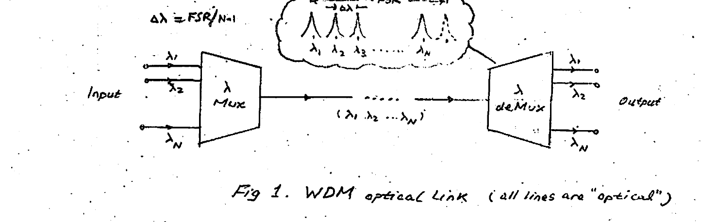
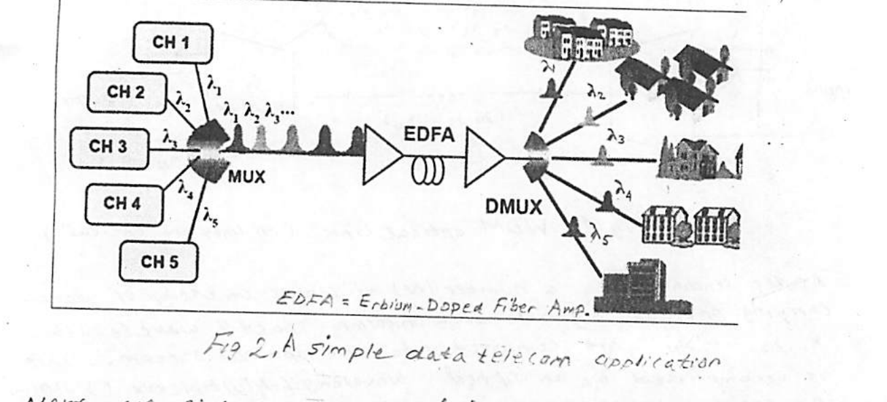
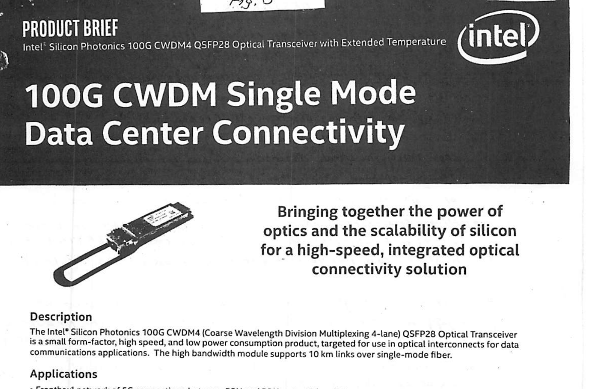
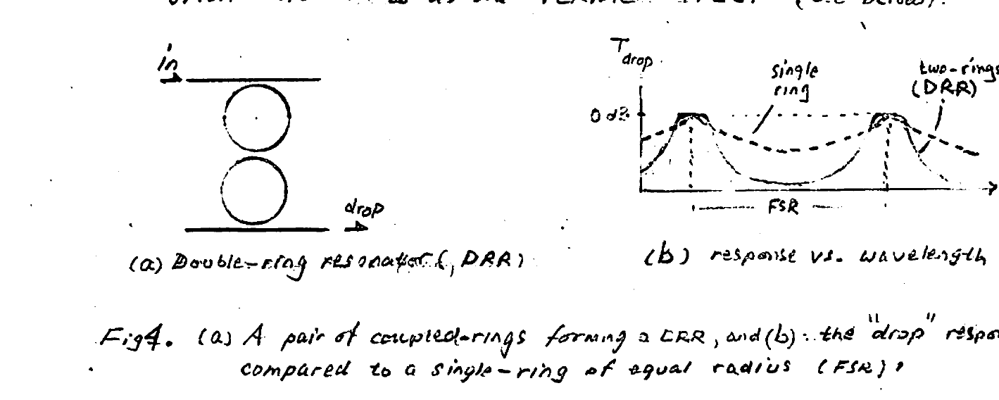
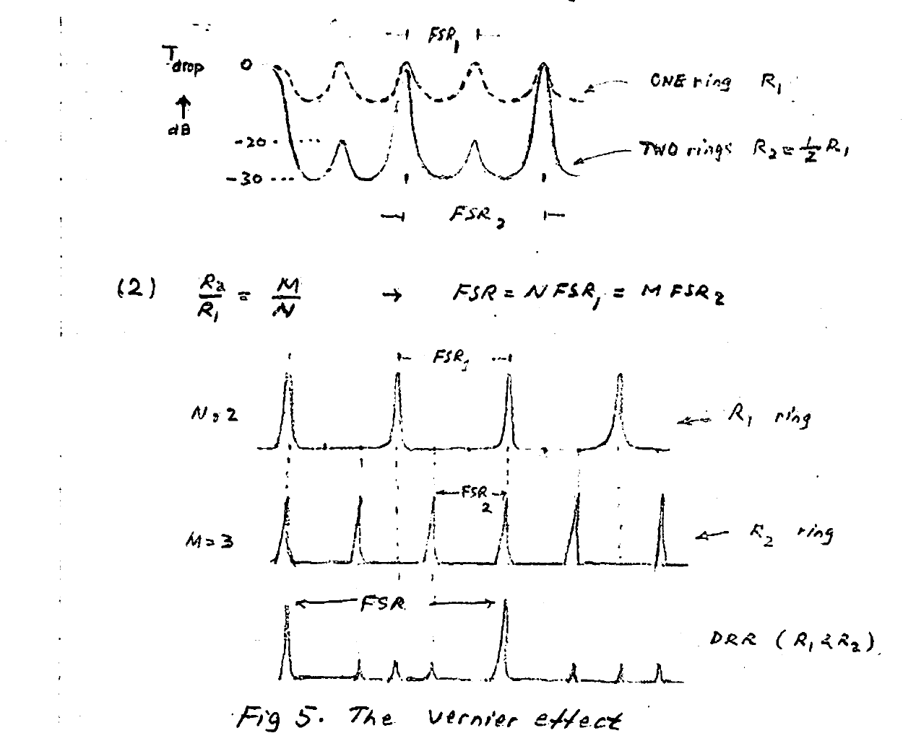
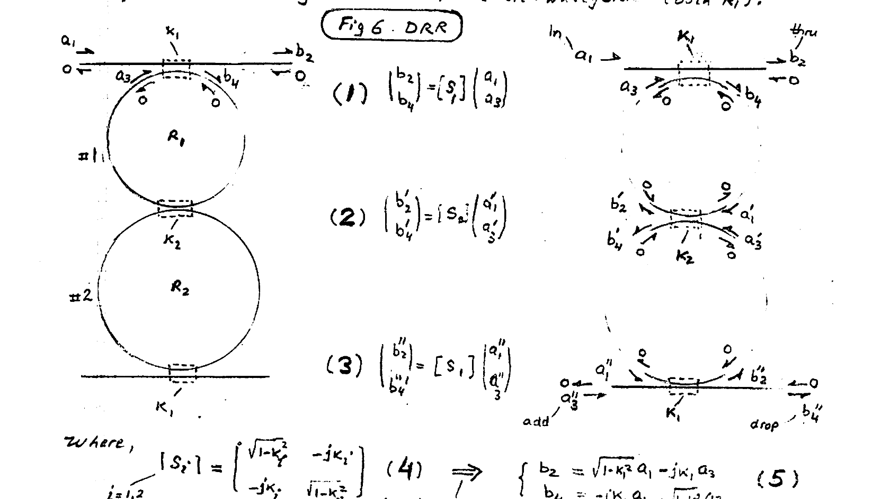
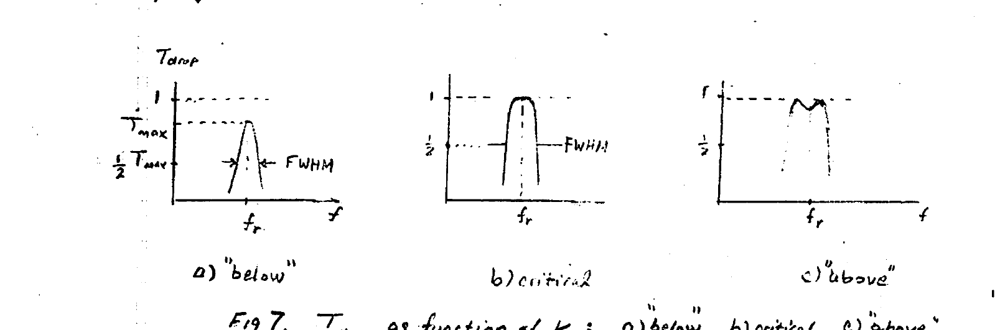

# Lecture 6 — WDM, Double MRR

**EECE 7398 — Analysis & Design of Photonic Integrated Circuits (PICs)** · Department of Electrical & Computer Engineering · Spring 2023

*— Optical Mux & deMux —*

---

## Wavelength Division Multiplexing (WDM)

A most powerful feature of the optical communication link is the ability of transmitting over a single fiber or Si WG a large number of wavelengths of light, with each carrying its own data stream. This permits a many-fold increase in data capacity! Furthermore, the transmission retains the integrity of each data stream without any "crosstalk" or mutual interference (interaction).

The technology making this possible is known as **"Wavelength Division Multiplexing" (WDM)**. For example: a high aggregate (combined) data rate of 100 Gb/s is achievable through use of 4 wavelengths which carry each 25 Gb/s data. A higher 400 Gb/s Ethernet is available (with 1 Tb/s and beyond possible) by using 16 and higher number of wavelengths (**DWDM**).

### Principle

The operating principle of a WDM communication link is straightforward and is described in Fig 1 below. Here, all signal lines in the diagram are **"optical"**. The configuration shown is applicable in the **macroscale** — such as in an optical telecom application — or the **microscale** — such as in a silicon PIC.



*Fig 1. WDM optical link (all lines are "optical").* Channel spacing: $`\Delta\lambda = \dfrac{\text{FSR}}{N-1}`$.

At the sending end, a number ($`N`$) of inputs consisting of data-carrying optical signals with uniformly-spaced wavelengths $`\lambda_1, \lambda_2, \ldots, \lambda_N`$ are combined into one optical stream. This is accomplished by an optical **Wavelength-Multiplexer ($`\lambda`$-MUX)**. At the receiving end, on the other hand, the aggregated optical stream is split back into its original $`N`$-optical signals with wavelengths $`\lambda_1, \lambda_2, \ldots, \lambda_N`$. This splitting function is accomplished by an optical **Wavelength-deMultiplexer ($`\lambda`$-deMUX)** performing the inverse function. Two WDM categories exist depending on $`N`$: **"coarse"** and **"dense"**.

---

## CWDM & DWDM

- **CWDM:** **C**oarse WDM employs a relatively small number of widely-spaced wavelengths (up to 18 @ 20 nm spacing).
- **DWDM:** **D**ense WDM employs a large number of closely-spaced wavelengths (up to 80 @ 0.8 nm spacing).

Typically, DWDM is used for handling higher data rates, with a capacity (aggregate data rate) $`> 1\ \text{Tb/s}`$.

For the purpose of standardization and interoperability, specific wavelength grids were promulgated by the **ITU (International Telecom Union)**. These are listed in tables in Appendix 1.

Fig 2 below is a simple example of a CWDM employed for data telecoms.



*Fig 2. A simple data telecom application. (EDFA = Erbium-Doped Fiber Amp.)*

Next, we give an example of hardware employed in WDM. In Fig 3 shown is a Si-photonic optical transceiver product employing 4-channel CWDM with an aggregate 100 Gb/s data rate (25 Gb/s per channel).



*Fig 3. Intel® Silicon Photonics 100G CWDM Single Mode Data Center Connectivity (Product Brief).*

> **Product brief highlights (Intel® Silicon Photonics 100G CWDM4 QSFP28 Optical Transceiver):**
> - **Description:** A small form-factor, high-speed, low-power-consumption CWDM 4-lane transceiver targeted for optical interconnects in data communications. The high-bandwidth module supports 10 km links over single-mode fiber.
> - **Applications:** Fronthaul network of 5G connections between RRU and BBU up to 10 km; connectivity for large-scale cloud and enterprise data centers; Ethernet switch, router, and client-side telecom interfaces.
> - **Features:** Compliant with 4WDM MSA optical interface spec (reach up to 10 km); compact QSFP28 form factor; compatible with single-mode fiber connectors; CWDM wavelength grid (1271, 1291, 1311, and 1331 nm) for uncooled operation; electrical interface compliant with IEEE 802.3bm CAUI-4; multi-rate support (24.33G CPRI and 25.78G Ethernet, compatible with CPRI rate-7); operating temperature −40 to 85 °C; 3.5 W maximum power dissipation.

---

## Double-Ring Resonators (DRR)

The single-ring drop filter is characterized by a Lorentzian response with curved top and relatively slow rolloff in stopband.

Because of these limitations, the single-ring resonator is not suitable for WDM systems. The performance of the single-ring resonator is limited by the following shortcomings (repeated):

1. Its Lorentzian response varies significantly in the passband, which can result in signal distortion. A flat-top response is essential.
2. Its out-of-band attenuation is insufficient — causing inadequate rejection of adjacent channels in WDM links — and hence increased "crosstalk".
3. High free-spectral range (FSR), which is desirable in WDM systems, is achievable through use of smaller-radius ($`R`$) rings; this, however, can result in higher bending losses (e.g. $`R < 1\ \mu m`$).

A pair of coupled-rings with an input waveguide and an output waveguide (see Fig 4) has superior performance properties that make for a structure suitable for WDM. The structure is often termed **double-ring resonator (DRR)**.

- A **flat-top response** is achievable for a certain ("critical") value of "ring coupling".
- A **steep fall** in response outside the passband leading to a strong attenuation/rejection of adjacent channels, and hence a low crosstalk of WDM links.
- By using rings of different radii, it is possible to obtain significantly **wider FSR**. (This is to be compared to a pair of equal-radius rings whose FSR is that of the constituent rings.) The mechanism by which the FSR extension occurs is often referred to as the **"Vernier effect"** (see below).



*Fig 4. (a) A pair of coupled-rings forming a DRR, and (b) the "drop" response compared to a single-ring of equal radius (FSR).*

---

## Vernier Effect

To demonstrate the extension of the FSR through the "Vernier effect", we examine the resulting drop transmission of a DRR for two combinations of different ring radii $`(R_1, R_2)`$.

**(1)** Ring #2 is smaller, with half the radius of Ring #1 — i.e. $`R_2 = \tfrac{1}{2} R_1`$. Because $`\text{FSR} \propto \dfrac{1}{R}`$, we conclude $`\text{FSR}_2 = 2 \times \text{FSR}_1`$.

**(2)** $`\dfrac{R_2}{R_1} = \dfrac{M}{N} \;\rightarrow\; \text{FSR} = N\,\text{FSR}_1 = M\,\text{FSR}_2`$



*Fig 5. The Vernier effect.*

**Note:**

- Coinciding peaks of the responses of two different-size rings gives a **strong** combined response (both rings @ resonance).
- Non-coinciding peaks result in **weak** attenuated interstitial peaks ("staggered", i.e. offset, resonances).
- A design objective would aim to reduce these undesirable interstitial peaks.
- The resulting FSR of the DRR structure is:

```math
\text{FSR} = N \times \text{FSR}_1 = M \times \text{FSR}_2
```

This can be shown as follows:

For a "drop" optical signal to be produced at a certain $`\lambda`$, then both rings must be at resonance, i.e.

```math
\text{(1)}\quad N\lambda = 2\pi R_1\, n_{\text{eff}} \qquad\qquad \text{(2)}\quad M\lambda = 2\pi R_2\, n_{\text{eff}}
```

whose ratio leads to

```math
\frac{M}{N} = \frac{R_2}{R_1} \qquad (3)
```

Since $`\text{FSR} = \dfrac{\lambda^2}{n_g L}`$, we can express $`L = \dfrac{\lambda^2}{n_g\,\text{FSR}}`$, and hence find $`\dfrac{L_1}{L_2} = \dfrac{\text{FSR}_2}{\text{FSR}_1}`$ (where $`L = 2\pi R`$ is the ring circumference). Equivalently, $`\dfrac{R_2}{R_1} = \dfrac{\text{FSR}_1}{\text{FSR}_2}`$, which when used in (3) yields

```math
\frac{M}{N} = \frac{R_2}{R_1} = \frac{\text{FSR}_1}{\text{FSR}_2} \qquad (4)
```

---

## Double-Ring Resonator — Analysis

Shown in Fig 6 a DRR employing two coupled rings of radii $`R_1, R_2`$ with their individual waveguides. Of interest is the **"drop"** and **"thru"** transmissions of the DRR $`\Rightarrow T_{\text{drop}}`$ & $`T_{\text{thru}}`$.

For the purpose of analysis, the DRR will be viewed as a photonic structure made of three directional couplers (top, middle, bottom), and a set of four half-circle waveguides (propagation regions).

As before, the three directional couplers will be assumed lossless. Furthermore, back-reflections are assumed small and negligible. These are represented by "0" (zero) corresponding waves on the "segmented DRR" (Fig 6, right). Symmetrical coupling is assumed for circle-waveguide (both $`\kappa_i`$).



*Fig 6. DRR. (left) the coupled-ring structure; (right) the segmented DRR represented by three directional couplers.*

The three directional couplers obey the scattering relations:

```math
\text{(1)}\quad \begin{pmatrix} b_2 \\ b_4 \end{pmatrix} = [S_1]\begin{pmatrix} a_1 \\ a_3 \end{pmatrix} \qquad \text{(2)}\quad \begin{pmatrix} b_2' \\ b_4' \end{pmatrix} = [S_2]\begin{pmatrix} a_1' \\ a_3' \end{pmatrix} \qquad \text{(3)}\quad \begin{pmatrix} b_2'' \\ b_4'' \end{pmatrix} = [S_1]\begin{pmatrix} a_1'' \\ a_3'' \end{pmatrix}
```

where,

```math
[S_i] = \begin{pmatrix} \sqrt{1-\kappa_i^2} & -j\kappa_i \\[2pt] -j\kappa_i & \sqrt{1-\kappa_i^2} \end{pmatrix}, \quad i = 1,2 \qquad (4)
```

$`\Rightarrow`$ (for $`i=1`$, for example):

```math
\begin{cases} b_2 = \sqrt{1-\kappa_1^2}\, a_1 - j\kappa_1\, a_3 \\[4pt] b_4 = -j\kappa_1\, a_1 + \sqrt{1-\kappa_1^2}\, a_3 \end{cases} \qquad (5)
```

### Propagation relations on the 4 half-circles

Ring #1:

```math
\text{(6)}\quad a_1' = b_4\, e^{-j\phi_1} \qquad \text{(7)}\quad a_3 = b_2'\, e^{-j\phi_1} \qquad\quad \phi_1 = (\beta - j\alpha)\,\pi R_1
```

Ring #2:

```math
\text{(8)}\quad a_1'' = b_4'\, e^{-j\phi_2} \qquad \text{(9)}\quad a_3' = b_2''\, e^{-j\phi_2} \qquad\quad \phi_2 = (\beta - j\alpha)\,\pi R_2
```

(each is a half-circle propagation phase & loss.)

In the above, the propagation phase constant $`\beta = \left(\dfrac{2\pi}{\lambda}\right) n_{\text{eff}}`$ and the attenuation constant $`\alpha`$ describe the two rings.

### Drop & Thru transmissions

The **DROP** and **THRU** transmissions $`\{T_{\text{drop}}`$ & $`T_{\text{thru}}\}`$ for the DRR are derived by using (1)…(9) for $`a_3' \equiv 0`$ ("add" = 0). After some algebra we arrive at:

```math
T_{\text{drop}} = \left|\frac{b_4''}{a_1}\right|^2 = \left|\frac{j\kappa_1^2 \kappa_2\, e^{-j(\phi_1+\phi_2)}}{1 - \sqrt{(1-\kappa_1^2)(1-\kappa_2^2)}\left(e^{-j2\phi_1} + e^{-j2\phi_2}\right) + (1-\kappa_2^2)\, e^{-j2(\phi_1+\phi_2)}}\right|^2 \qquad (10)
```

```math
T_{\text{thru}} = \left|\frac{b_2}{a_1}\right|^2 = \left|\frac{1}{\sqrt{1-\kappa_1^2}}\left[1 - \frac{\kappa_1^2\left\{\sqrt{(1-\kappa_1^2)(1-\kappa_2^2)}\;\kappa_2\, e^{-j(\phi_1+\phi_2)}\right\}}{1 - \sqrt{(\ \cdots\ )}(\ \cdots\ ) + (1-\kappa_1^2)\, e^{-j2(\ \cdots\ )}}\right]\right|^2 \qquad (11)
```

### "Critical coupling" $`\kappa_2`$

The **"critical coupling"** $`\kappa_2`$ is defined as the ring-coupling that produces an optimum $`T_{\text{drop}} = 1`$ (@ resonance).

Resonance for the DRR system of two rings occurs when **both** rings are independently at resonance, i.e.:

```math
2\phi_1 = N \cdot 2\pi \qquad \& \qquad 2\phi_2 = M \cdot 2\pi \qquad (12)^*
```

Substitution of (12) into (10) yields:

```math
T_{\text{drop}} = \left|\frac{j\kappa_1^2 \kappa_2}{1 - 2\sqrt{(1-\kappa_1^2)(1-\kappa_2^2)} + 1 - \kappa_2^2}\right|^2 \qquad (13)
```

> \* **Note:** Here $`\phi_{1,2}`$ are actually $`\beta\,\pi R_{1,2}`$ (with $`\alpha \sim 0`$).

The optimum magnitude $`\kappa_2`$ which makes $`T_{\text{drop}} = 1`$ at resonance is found from (13) and is referred to as the **critical inter-ring coupling coefficient**:

```math
\kappa_2(\text{crit.}) = \frac{\kappa_1^2}{2 - \kappa_1^2} \qquad (14)
```

It is worthwhile examining the effect of $`\kappa_2`$ on drop action @ 3 cases:

- **i) under-coupling:** $`\kappa_2 < \kappa_2(\text{crit})`$
- **ii) critical:** $`\kappa_2 \approx \kappa_2(\text{crit})`$
- **iii) over-coupling:** $`\kappa_2 > \kappa_2(\text{crit})`$

The resulting $`T_{\text{drop}}`$'s take on different character depending on $`\kappa_2`$ (Fig 7), based on calculations of eqn (10) using a computational program such as MATLAB.



*Fig 7. $`T_{\text{drop}}`$ as a function of $`\kappa_2`$: a) "below", b) critical, c) "above".*

An important attribute of a critically-coupled DRR is (i) a **FLAT-TOP** plot of $`T_{\text{drop}}`$, and (ii) a **sharper drop** in the stopband.

The **flat-top** feature implies absence of signal distortion due to uniformity of processing at the various frequencies of the signal. The **sharp roll-off** outside the passband produces superior rejection of an adjacent channel and hence superior **crosstalk** performance for WDM operation.

---

## Appendix 1 — CWDM/DWDM ITU Channels Guide

CWDM (Coarse Wavelength Division Multiplexing) and DWDM (Dense Wavelength Division Multiplexing) enable carriers to deliver more services over their existing fiber infrastructure by combining multiple wavelengths on a single fiber. FS offers a line of CWDM/DWDM solutions and products that help alleviate your fiber exhaust in a reliable, cost-efficient way.

### CWDM ITU Channels Overview

ITU-T G.694.2 defines 18 wavelengths (C1–C18) for CWDM transport ranging from 1270 to 1610 nm, spaced at 20 nm apart. The complete CWDM grid is shown below. Each CWDM channel is transparent to the speed and type of data, meaning that any mix of SAN, WAN, voice and video services can be transported simultaneously over a single fiber or fiber pair.

Channel spacing: $`\Delta\lambda = 20\ \text{nm}`$.

| ITU Channel No. | Wavelength (nm) | | ITU Channel No. | Wavelength (nm) |
| --- | --- | --- | --- | --- |
| 27 | 1270 | | 45 | 1450 |
| 29 | 1290 | | 47 | 1470 |
| 31 | 1310 | | 49 | 1490 |
| 33 | 1330 | | 51 | 1510 |
| 35 | 1350 | | 53 | 1530 |
| 37 | 1370 | | 55 | 1550 |
| 39 | 1390 | | 57 | 1570 |
| 41 | 1410 | | 59 | 1590 |
| 43 | 1430 | | 61 | 1610 |

**FS CWDM Transceiver Modules Quick View**

FS CWDM transceivers are available with all 18 CWDM wavelengths, including CWDM SFP, CWDM SFP+, CWDM XFP and 3G SDI CWDM SFP modules. These CWDM transceivers can be applied in data transmission spanning 20 km to 120 km.

- **20KM CWDM Modules:** CWDM SFP 20KM, CWDM SFP+ 20KM, CWDM XFP 20KM, 3G SDI CWDM SFP 20KM
- **40KM CWDM Modules:** …

### DWDM ITU Channels Overview

ITU-T G.694.1 standard DWDM region is from 1528.77 nm to 1563.86 nm that resides mostly within the C band. DWDM can have 100 GHz (0.8 nm) wavelength spacing for 40 channels, or 50 GHz (0.4 nm) spacing for 80 channels. The complete channel grid for 100 GHz DWDM is shown below.

Channel spacing: $`\Delta\lambda = 0.8\ \text{nm}`$.

| Channel | Frequency (THz) | Center Wavelength (nm) | | Channel | Frequency (THz) | Center Wavelength (nm) |
| --- | --- | --- | --- | --- | --- | --- |
| C17 | 191.7 | 1563.86 | | C40 | 194.0 | 1545.32 |
| C18 | 191.8 | 1563.05 | | C41 | 194.1 | 1544.53 |
| C19 | 191.9 | 1562.23 | | C42 | 194.2 | 1543.73 |
| C20 | 192.0 | 1561.41 | | C43 | 194.3 | 1542.94 |
| C21 | 192.1 | 1560.61 | | C44 | 194.4 | 1542.14 |
| C22 | 192.2 | 1559.79 | | C45 | 194.5 | 1541.35 |
| C23 | 192.3 | 1558.98 | | C46 | 194.6 | 1540.56 |
| C24 | 192.4 | 1558.17 | | C47 | 194.7 | 1539.77 |
| C25 | 192.5 | 1557.36 | | C48 | 194.8 | 1538.98 |
| C26 | 192.6 | 1556.55 | | C49 | 194.9 | 1538.19 |
| C27 | 192.7 | 1555.75 | | C50 | 195.0 | 1537.40 |
| C28 | 192.8 | 1554.94 | | C51 | 195.1 | 1536.61 |
| C29 | 192.9 | 1554.13 | | C52 | 195.2 | 1535.82 |
| C30 | 193.0 | 1553.33 | | C53 | 195.3 | 1535.04 |
| C31 | 193.1 | 1552.52 | | C54 | 195.4 | 1534.25 |
| C32 | 193.2 | 1551.72 | | C55 | 195.5 | 1533.47 |
| C33 | 193.3 | 1550.92 | | C56 | 195.6 | 1532.68 |
| C34 | 193.4 | 1550.12 | | C57 | 195.7 | 1531.90 |
| C35 | 193.5 | 1549.32 | | C58 | 195.8 | 1531.12 |
| C36 | 193.6 | 1548.51 | | C59 | 195.9 | 1530.33 |
| C37 | 193.7 | 1547.72 | | C60 | 196.0 | 1529.55 |
| C38 | 193.8 | 1546.92 | | C61 | 196.1 | 1528.77 |
| C39 | 193.9 | 1546.12 | | | | |

**FS DWDM Transceiver Modules Quick View**

FS DWDM transceivers are available with all 44 DWDM wavelengths, including DWDM SFP, DWDM SFP+, DWDM XFP and tunable DWDM transceivers that support transmission distance up to 120 km. Tunable DWDM transceivers are able to support a specific channel in a DWDM optical network, allowing for remotely changing wavelengths in software.

- **40KM DWDM Modules:** DWDM SFP 40KM, DWDM SFP+ 40KM, DWDM XFP 40KM
- **80KM DWDM Modules:** DWDM SFP 80KM, DWDM SFP+ 80KM, Tunable DWDM SFP+ 80KM, DWDM XFP 80KM, Tunable DWDM XFP 80KM
