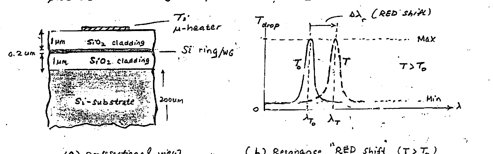
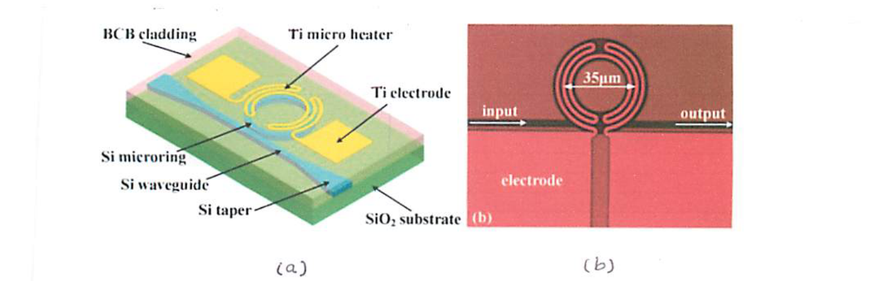
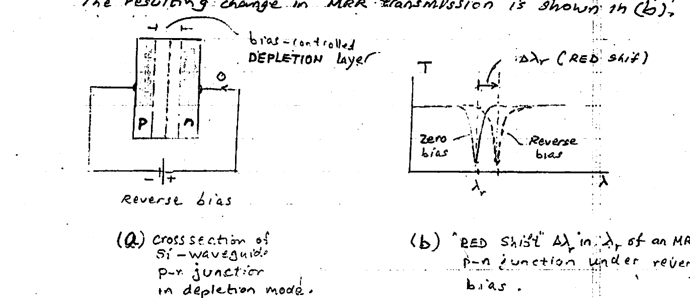
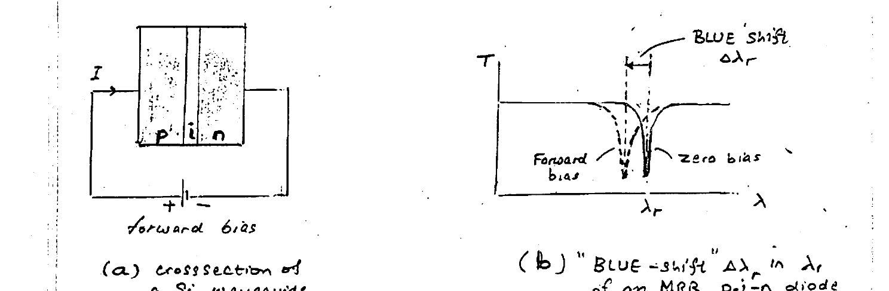
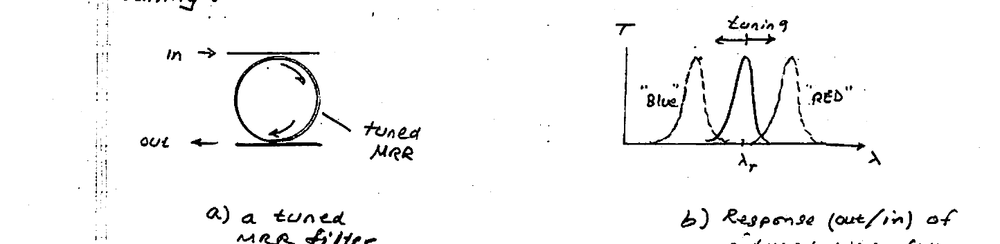
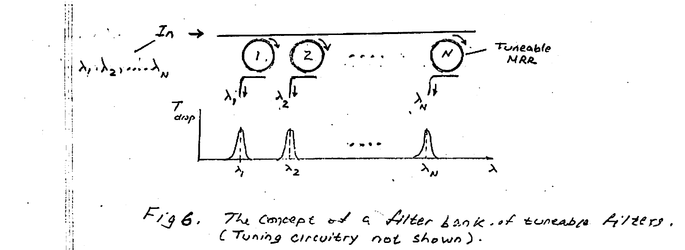
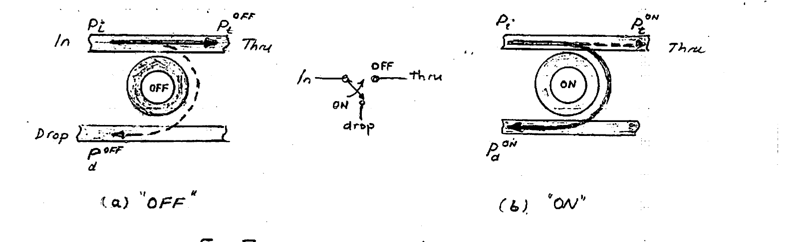
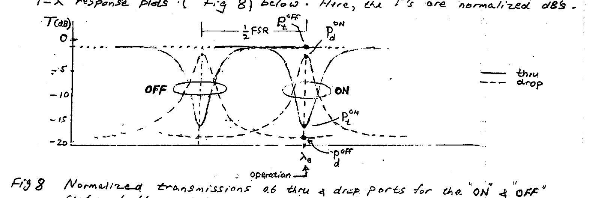

# Lecture 7 — MRR Tuning

**EECE 7398 — Analysis & Design of Photonic Integrated Circuits (PICs)** · Northeastern University, Dept. of Electrical & Computer Engineering · Spring 2023

---

## Intro

We have seen that a tuning capability is indispensable for the operation of an MRR-based filter in various applications. Generally, its extremely-narrow bandwidth (very-high frequency selectivity, $`Q`$) renders the MRR extremely sensitive to fabrication tolerances, temperature, and immediate ring environment. These sensitivities impact directly the various parameters that determine MRR performance: $`f(\lambda_r)`$, FSR, FWHM bandwidth, $`Q`$, etc.

Tuning of an MRR can be based on either: **temperature control** (heating), or **electronic** (charge). To appreciate these, it is worthwhile to examine first the MRR sensitivity.

The following relations will serve as a guide:

```math
\text{i)}\quad \lambda_r = \frac{2\pi R \cdot n_{\text{eff}}}{m} \qquad \text{ii)}\quad \text{FSR} = \frac{\lambda_r^2}{2\pi R\, n_g} \qquad \text{iii)}\quad \text{FWHM} = \frac{\kappa^2 \lambda_r^2}{\pi\, n_g (2\pi R)}
```

### Fabrication tolerance

Dimensional variations inherent to the lithographic (photo- or e-beam) processing step are responsible for deviations in ring radius ($`R`$) and ring-gap, which directly affect: $`\lambda_r`$, FSR, FWHM.

While $`R`$ has a *direct* effect on these parameters, the spacing or gap (b/w ring & WG or rings) has an *indirect* effect through the coupling factor ($`\kappa`$).

### Temperature

The temperature of the microring alters the effective refractive index $`n_{\text{eff}}`$. This is often referred to as the **Thermo-Optic (TO) Effect**. For Si @ $`1.55\ \mu m`$:

```math
\frac{dn_{\text{eff}}}{dT} = 1.86 \times 10^{-4}\ (\,^{\circ}\mathrm{C}^{-1}) \quad (1)
```

For a temperature increase, eqn (1) points to occurrence of a small **RED SHIFT** in resonance $`\lambda_r`$ (see relation i) for $`\lambda_r`$ above). This can actually be put to use for tuning purposes through an embedded on-chip microheater.

### Environment

The immediate environment of the microring — usually $`\text{SiO}_2`$ cladding — still leaves the MR vulnerable to the presence of other substances in its vicinity — for example trace contamination. This has a small effect on $`n_{\text{eff}}`$ of the MR — but more than sufficient to produce a significant change in the operating resonance $`\lambda_r`$ (or $`f_r`$).

This effect can actually be put to use *in reverse* by the design of highly-sensitive MR-based **bio-sensors** and **chemical-sensors**. In this case an "exposed" MR with minimal/no cladding could be used for increased sensitivity.

Next, we discuss the TO and EO techniques for MR tuning.

---

## I) Thermo-Optic Tuning

To take advantage of the **Thermo-Optic Effect (TOE)** — i.e. the variation of $`n_{\text{eff}}`$ with temperature — an integrated electric microheater (Titanium, platinum, nichrome, etc.) is co-fabricated with the MRR. The microheater is embedded above and in very close proximity ($`\sim 1\ \mu m`$) to the MR (Fig 1.a). To show the effect of changing MR temperature, the drop transmissions of a simple one-ring double-bus MR filter are plotted at two ring temperatures in Fig 1.



*Fig 1. Tuneable MR w/ integrated microheater: cross-section (a), and temperature-induced red shift in resonance ($`\lambda_r`$) for $`T > T_0`$, where $`T_0`$ = room temperature (b).*

**Example:** Given an MR (Fig 1) with $`R = 7\ \mu m`$, $`\lambda_{T_0} = 1547\ \text{nm}`$, $`\lambda_T = 1550\ \text{nm}`$ (with 15 mW heater power). Estimate the temperature rise $`\Delta T`$ (°C). Given $`n_{\text{eff}}(T_0) \approx 2.5`$.

```math
\lambda = \left(\frac{2\pi R}{m}\right) n_{\text{eff}} \;\longrightarrow\; \Delta n_{\text{eff}} = \left(\frac{m}{2\pi R}\right)\Delta\lambda = \left(\frac{n_{\text{eff}}}{\lambda}\right)\Delta\lambda = 4.85 \times 10^{-3}
```

```math
\Delta T = \Delta n_{\text{eff}} \big/ 1.86 \times 10^{-4} = 26\ ^{\circ}\mathrm{C}
```

---

## Fabrication

Figure 2(a) shows the schematic diagram of a tunable MRR. The tunable MRR was fabricated in an SOI wafer with a top silicon thickness of 250 nm and a 3-μm buried silicon dioxide. Diluted (1:1 in anisole) electron-beam resist ZEP520A was spin-coated on the wafer to create a ~110-nm thick masking layer. The microring structure was defined in the ZEP520A layer with electron-beam lithography (JEOL JBX-9300FS). The patterns were subsequently transferred to the top silicon layer with inductively coupled plasma reactive ion etching. Then a 550-nm thick benzocyclobuten (BCB) top cladding was spin-coated and subsequently hard-cured. After that, 400 nm of ZEP520A resist and electron-beam lithography were employed again to define the pattern of the micro heater. Evaporation and lift-off techniques were used as the last steps to form 100-nm thick titanium heaters together with contact pads. Figure 2(b) shows an optical microscope picture of the fabricated single MRR with micro heater. The waveguide width is 450 nm and the diameter of the microring is 35 μm. The heater width in the ring area is 1 μm. At both ends of the device, the waveguide is tapered from 450 nm to 4 μm to expand the guided mode for more efficient fiber-to-chip coupling. The insertion loss of the device is ~15 dB, where we estimate the fiber-to-waveguide coupling loss to account for ~14 dB. This loss can be lowered down to ~2 dB using suitable mode converters.



*Fig 2. (a) Schematic diagram of the tunable MRR with micro heater. (b) Top-view microscope picture of the fabricated tunable MRR with micro heater.*

---

## II) Electro-Optic Tuning

The dielectric permittivity $`\varepsilon`$ (hence refractive index) of Si displays a sensitivity to the concentration ($`\text{cm}^{-3}`$) of mobile electron and hole charge carriers $`N_e`$ and $`N_h`$ in the material (semiconductor). The phenomenon is often referred to as the **"PLASMA DISPERSION EFFECT."** This effect can be used to change the refractive index — and thus the MR resonance wavelength ($`\lambda_r`$) — by electronically changing $`N_e`$ & $`N_h`$ in Si.

It is worth noting that concurrently, the optical loss coefficient ($`\alpha`$) of silicon increases with carrier concentrations, which is viewed as an undesirable side effect.

The plasma-dispersion effect for Si is quantified near 1310 nm and 1550 nm as follows*:

**$`\lambda \sim 1310\ \text{nm}`$:**

```math
\left.\begin{aligned}
\Delta n &= -\left(6.2 \times 10^{-22}\,\Delta N_e + 6.0 \times 10^{-18}\,\Delta N_h^{\,0.8}\right) \\[4pt]
\Delta\alpha &= 3.0 \times 10^{-18}\,\Delta N_e + 2.0 \times 10^{-18}\,\Delta N_h
\end{aligned}\right\} \quad (2)
```

**$`\lambda \sim 1550\ \text{nm}`$:**

```math
\left.\begin{aligned}
\Delta n &= -\left(8.8 \times 10^{-22}\,\Delta N_e + 8.5 \times 10^{-18}\cdot\Delta N_h^{\,0.8}\right) \\[4pt]
\Delta\alpha &= 8.5 \times 10^{-18}\,\Delta N_e + 6.0 \times 10^{-18}\,\Delta N_h
\end{aligned}\right\} \quad (3)
```

In the above eqns (2) & (3), $`\Delta N_e`$ & $`\Delta N_h`$ = changes in e's and h's concentrations ($`\text{cm}^{-3}`$), and $`\Delta n`$ and $`\Delta\alpha`$ ($`\text{cm}^{-1}`$) are the changes in index of refraction and optical field loss coefficient, respectively. It is worth noting the greater effectiveness of h's relative to e's due to the higher ratio $`\Delta n / \Delta\alpha`$.

> \* R. A. Soref & B. R. Bennett, "Electro-optical Effect in Silicon," *IEEE Journal of Quantum Electronics*, vol. 23, no. 1, pp. 123–129 (1987).

The carrier concentration changes $`\Delta N_e`$ & $`\Delta N_h`$ are typically produced by operating a Si p–n junction in **i) Reverse depletion** or **ii) forward injection**.

### i) Depletion mode (Fig 3)

By increasing the reverse-bias voltage across a Si-MRR with a built-in p–n junction, the depletion region extent is widened. (The $`+/-`$ bias polarity is responsible for this removal of e's & h's, i.e. $`(\Delta N_e, \Delta N_h) < 0`$.) By the plasma dispersion effect, a slight *increase* $`\Delta n_{\text{eff}}`$ would result, which in turn increases the MRR resonant $`\lambda_r`$ by $`\Delta\lambda_r`$ (a **RED shift**). The resulting change in MRR transmission is shown in (b).



*Fig 3. Cross-section of a p–n junction MRR (a), and the resulting "RED shift" in its (thru) transmission (b) under reverse bias.*

### ii) Injection mode (Fig 4)

Increasing the forward-bias voltage, and hence current, in a PIN junction forming a MRR, produces increased injection of e's & h's into the center undoped (intrinsic) $`i`$-region. (The $`+/-`$ polarity of the bias voltage is responsible for this increase $`\Delta N_e, \Delta N_h > 0`$ in carrier concentrations in the "$`i`$" region.) The plasma dispersion effect leads to a *decrease* $`\Delta n_{\text{eff}} < 0`$, which in turn decreases the MRR resonant $`\lambda_r`$ by $`\Delta\lambda_r`$ (a **"BLUE shift"**). The effect of the blue shift on the MRR (thru) transmission is shown in (b).



*Fig 4. Cross-section of a p–i–n diode MRR (a), and resulting "BLUE shift" in its (thru) transmission under forward bias.*

---

## Applications of Wavelength Tuning

The range of uses of MRR's gets extended when electrical tuning capability of the resonance wavelength $`\lambda_r`$ is incorporated. By permitting adjustment of the resonant wavelength, important key functionalities become possible: **tunable optical filters, optical switches, optical modulators.**

As previously stated, tuning is a critical necessity that permits correcting and compensating for two serious impairments: high sensitivity to temperature, and fabrication-process variations. For example, any variation in the resonant wavelength induced by fab-process variations can be simply corrected and removed by an appropriate **"DC bias"**. Also, to mitigate the MRR high temperature sensitivity, through built-in integrated micro-heaters the ring's temperature can be stabilized by CMOS control circuitry. Importantly, this would allow modifying the resonant wavelength materially, so as to permit operation of the MR resonator as a **TUNEABLE FILTER**, **OPTICAL SWITCH**, and **OPTICAL MODULATOR**.

---

## Tuneable Filter

This is a simple and direct way of putting to use the $`n_{\text{eff}}`$ tuning possible by the Thermo-Optic effect (TOE) or the Electro-Optic effect (EOE). A tuned MRR filter is shown in Fig 5. Repeating the resonant condition:

```math
\lambda_r = \left(\frac{2\pi R}{m}\right) n_{\text{eff}}
```

where $`n_{\text{eff}}`$ is $`n_{\text{eff}}(T)`$ for tuning by TOE, and $`n_{\text{eff}}(\Delta N_e, \Delta N_h)`$ for EOE tuning.



*Fig 5. A tuned MRR filter (a), and effect on filter drop transmission (out/in) of "RED" vs. "BLUE" tuning.*

An important application of tuneable filters is to **FILTER BANKS** (Fig 6). Here, an array of $`N`$ MRR drop filters is used with each tuned to a particular center wavelength $`\lambda_1, \lambda_2, \dots, \lambda_N`$.



*Fig 6. The concept of a filter bank of tuneable filters. (Tuning circuitry not shown.)*

---

## Switch Element

A DB MRR w/ tuneable MR is useful as a **"LIGHT-STEERING"** switch (SPDT switch). A typical MRR-based switch element is shown in Fig 7 in its two operating states: **"OFF"** (a) and **"ON"** (b). The $`P`$'s stand for the optical powers: In, Thru, Drop.



*Fig 7. MRR switch element: OFF & ON.*

### Operation

In the **"OFF"** state, w/ an input signal at a wavelength $`\lambda_0`$ and the MR tuned "off-resonance", the input signal propagates directly to the "thru" port. Here,

```math
P_i = P_t^{\text{OFF}} + P_d^{\text{OFF}} \qquad (\text{with } P_t^{\text{OFF}} \gg P_d^{\text{OFF}}).
```

In the **"ON"** state, w/ the same input signal at $`\lambda_0`$, the MR resonator is now tuned to resonance @ $`\lambda_0`$ and hence the input signal is diverted by coupling to the ring and propagates to the "drop" port. Here,

```math
P_i = P_d^{\text{ON}} + P_t^{\text{ON}} \qquad (\text{with } P_d^{\text{ON}} \gg P_t^{\text{ON}}).
```

It is instructive to examine the switch function in terms of its $`T`$–$`\lambda`$ response plots (Fig 8) below. Here, the $`T`$'s are normalized dB's.



*Fig 8. Normalized transmissions at thru & drop ports for the "ON" & "OFF" states of the switch.*

For the two states (ON, OFF) to be as "distinct" as possible (see below), the operating resonant $`\lambda_0`$ is selected to fall at the middle of the FSR (i.e. $`\tfrac{1}{2}\text{FSR}`$ away from the "untuned" $`\lambda`$ resonance, as shown). Switching is accomplished through modulation of $`n_{\text{eff}}`$, i.e. affecting a suitable change $`\Delta n_{\text{eff}}`$ that results in $`\tfrac{1}{2}\text{FSR}`$ change in resonant $`\lambda`$. As indicated earlier, this can be done employing* the TO- or the EO-effect.

### Performance

We define for the two states (ON, OFF) the following performance parameters: **"Insertion Loss" (IL)** & **"Cross Talk" (CT)**.

```math
IL^{\text{OFF}} = \frac{P_t^{\text{OFF}}}{P_i} \qquad\&\qquad IL^{\text{ON}} = \frac{P_d^{\text{ON}}}{P_i}
```

```math
CT^{\text{OFF}} = \frac{P_d^{\text{OFF}}}{P_t^{\text{OFF}}} \qquad\&\qquad CT^{\text{ON}} = \frac{P_t^{\text{ON}}}{P_d^{\text{ON}}}
```

Employing these IL & CT parameters, the following power relations can be obtained:

```math
P_t^{\text{OFF}} = IL^{\text{OFF}} \cdot P_i \quad (4) \qquad\qquad P_d^{\text{ON}} = IL^{\text{ON}} \cdot P_i \quad (6)
```

```math
P_d^{\text{OFF}} = CT^{\text{OFF}} \cdot P_t^{\text{OFF}} \quad (5) \qquad\qquad P_t^{\text{ON}} = CT^{\text{ON}} \cdot P_d^{\text{ON}} \quad (7)
```

In the above, $`IL^{\text{ON}}`$ is slightly greater than $`IL^{\text{OFF}}`$, due to path-length difference. However, we shall approximate $`IL^{\text{ON}} \approx IL^{\text{OFF}}`$.

In each of the two states of the switch, the two outputs (thru & drop) alternate b/w max. and min. values. The ratios of these define the **"Extinction Ratios"**:

```math
ER_t = \frac{P_t^{\text{OFF}}}{P_t^{\text{ON}}} \qquad\text{and}\qquad ER_d = \frac{P_d^{\text{ON}}}{P_d^{\text{OFF}}}.
```

Employing these ER's in the CT definitions, we find:

```math
CT^{\text{OFF}} = \frac{IL^{\text{ON}}}{IL^{\text{OFF}} \cdot ER_d} \quad (8) \qquad\qquad CT^{\text{ON}} = \frac{IL^{\text{OFF}}}{IL^{\text{ON}} \cdot ER_t} \quad (9)
```

> \* It is worth noting that in regards to switching speed, the E.O. is much faster. The switching times: $`\sim 1\ \mu s`$ (TO) $`\longleftrightarrow`$ $`\sim 1\ \text{ns}`$ (EO).

### Bandwidths

It is worth noting that the bandwidths for the two switching paths of the MRR-based switch are **asymmetrical**: the bandwidth of the direct input–thru path being much larger than that going through the ring for the input–drop path.

### Balanced Design

During the switch element operation, **"balanced"** (symmetrical) switching is essential: steering equal power levels from input to either output (drop / thru), and doing so under equal ER's. In equation form:

```math
P_d^{\text{ON}} \approx P_t^{\text{OFF}} \quad (10) \qquad,\qquad ER_d \approx ER_t \quad (11)
```

Assuming the switching — as a result of $`n_{\text{eff}}`$ tuning (by TO or EO effects) — only shifts the resonance wavelength w/o altering the shape of the transmission curve (function), Eqns (10) & (11) are automatically satisfied. When $`IL^{\text{ON}} \approx IL^{\text{OFF}}`$:

```math
P_d^{\text{ON}} = \left(IL^{\text{ON}} P_i\right) \;\&\; P_t^{\text{OFF}} = IL^{\text{OFF}} P_i \;\longrightarrow\; P_d^{\text{ON}} \approx P_t^{\text{OFF}}
```

```math
ER_t = \frac{P_t^{\text{OFF}}}{P_t^{\text{ON}}} \;\&\; ER_d = \frac{P_d^{\text{ON}}}{P_d^{\text{OFF}}} \;\longrightarrow\; ER_d \approx ER_t
```

> *Note: the final scanned page (PDF page 11) is a faint ink bleed-through of the preceding "Balanced Design" page and contains no additional legible content.* [?]
