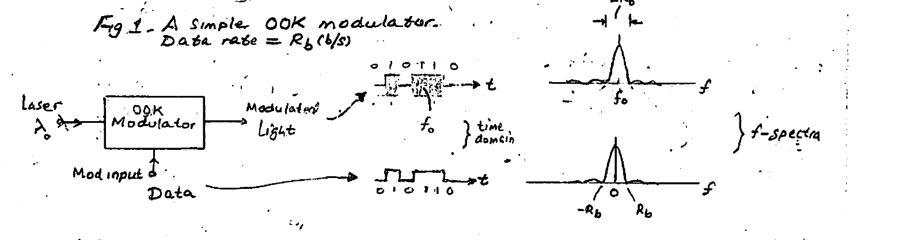
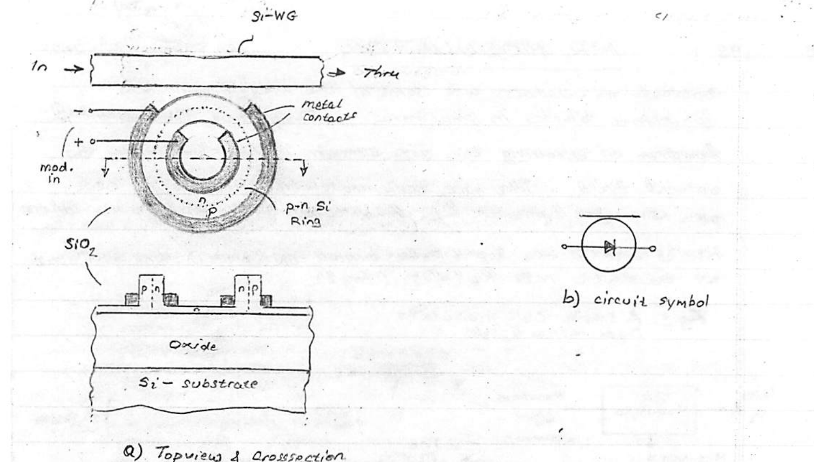
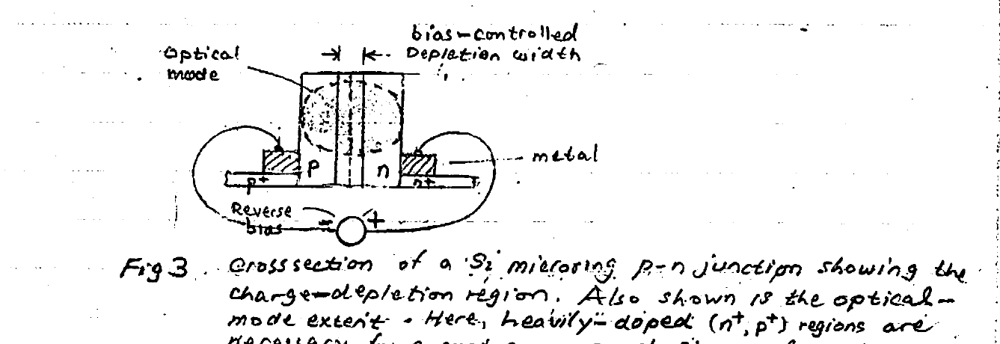
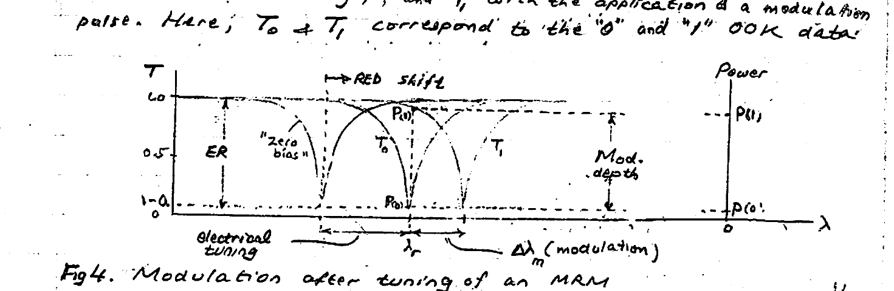
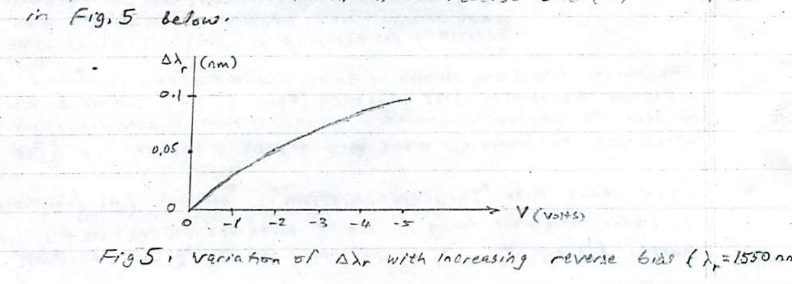
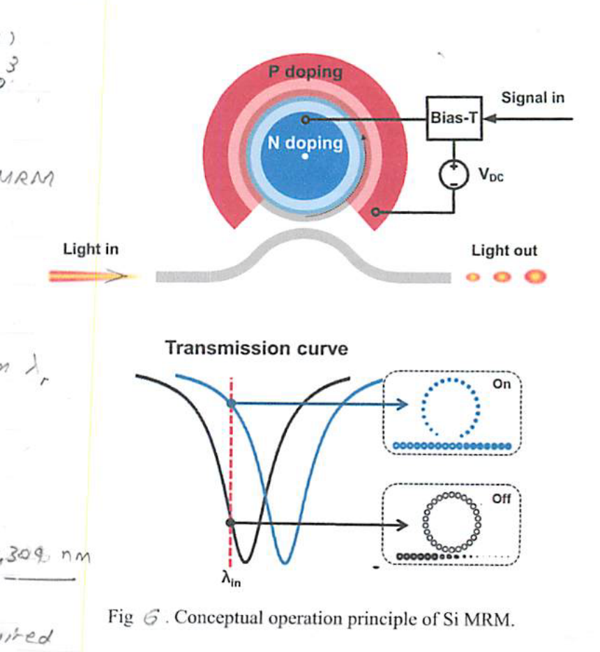
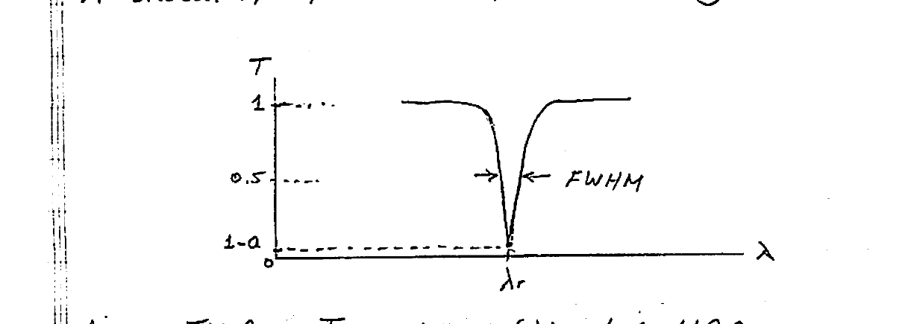
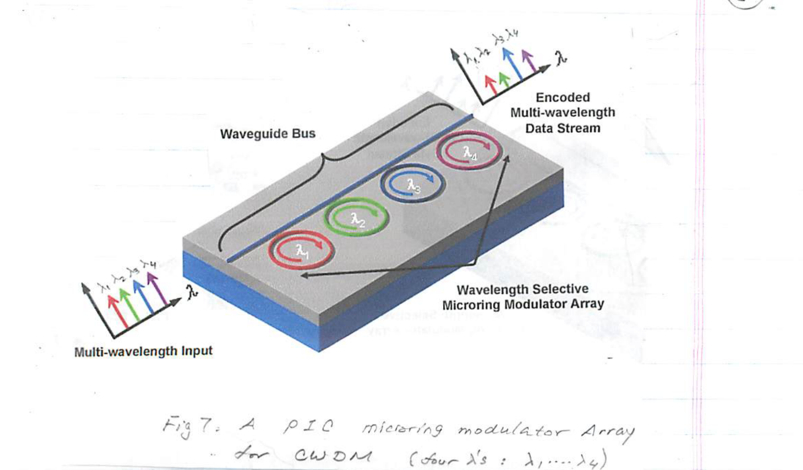
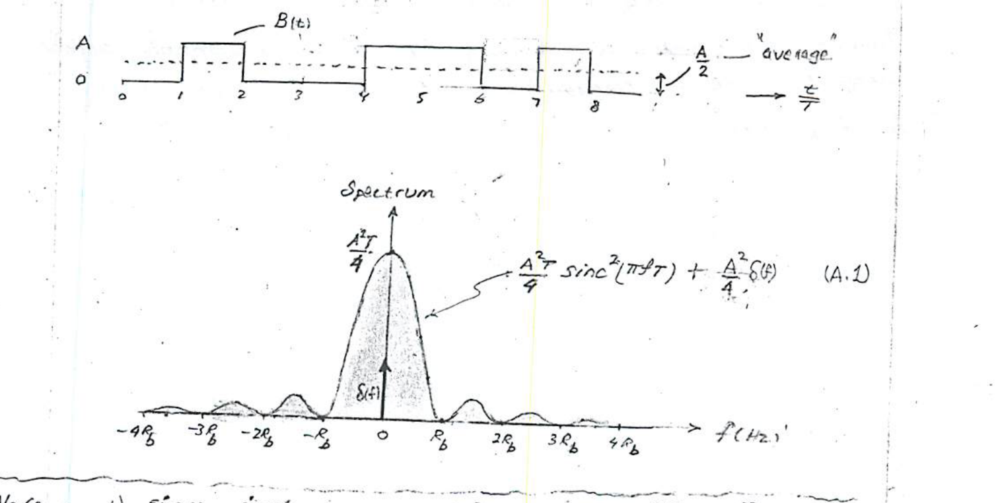
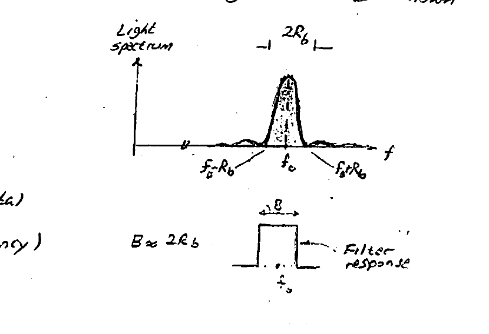

# Lecture 8 — MRR Modulator

**EECE 7398 — Analysis & Design of Photonic Integrated Circuits (PICs)** · Northeastern University, Dept. of Electrical & Computer Engineering · Spring 2023

---

## Introduction

Optical modulators are some of the most important functional blocks in photonics. They serve the essential function of encoding the data stream (information) into the optical field. The most basic modulation format is **OOK** aka **ASK** (see Appendix 1). Amplitude-Shift-Keying or ON-OFF-Keying entails the light to be turned **ON** ($\text{bit}=1$) and **OFF** ($\text{bit}=0$) at the data rate $R_b$ (b/s). (Fig 1).

*Fig 1. A simple OOK modulator. Data rate $= R_b$ (b/s). The block diagram (laser → OOK modulator → modulated light) is shown together with the time-domain waveforms and corresponding frequency spectra.*

Microring modulators make use of the **"plasma dispersion effect"** to change the refractive index $n_{\text{eff}}$ of Silicon — and hence the MRR resonant wavelength $\lambda_{\text{res}}$ — through changing the charge-carrier concentrations in silicon. The carrier concentrations can be changed by either:

1. **injection**, or
2. **depletion**.

These techniques result in two types of modulators: **"injection" type** and **"depletion" type**.

- In the **injection-type**, e's and h's are injected into the intrinsic ($i$) center layer of a $p$–$i$–$n$ Si junction operated in **forward bias**. Injection produces an increase $\Delta N_e$ and $\Delta N_h$ ($>0$) in carrier concentrations in the waveguide core and hence a $\Delta n_{\text{eff}} < 0$, causing the resonant wavelength $\lambda_r$ to get shorter — i.e. a **"BLUE" shift**.
- In the **"depletion" type**, a Si $p$–$n$ junction is operated under **reverse bias**. As the reverse bias is increased, so does the number of e's & h's removed from the junction region. Thus, with $\Delta N_h$ being $< 0$, i.e. $\Delta n_{\text{eff}} > 0$ and hence an **increase** in the resonant wavelength $\lambda_r$, i.e. a **RED shift**.

---

## Depletion Modulator

A microring-based modulator operating in depletion mode is shown in Fig 2 below. The microring modulator (**MRM**) is fabricated in the **SOI** silicon technology.

*Fig 2. Microring Modulator of depletion type. a) SOI structure — topview & crosssection. b) schematic symbol. Typical dimensions: 10 μm radius, 500 nm / 200 nm width/height of ring; 500 nm waveguide width, 300 nm ring–waveguide gap. $p$ & $n$ doping $\sim 10^{17}\ \text{cm}^{-3}$ (compare w/ intrinsic $1.45\times10^{10}\ \text{cm}^{-3}$).*

Due to process tolerances, as-fabricated MR resonance wavelengths deviate from the intended design values. For this reason, a D-C bias voltage (at the "mod. in") is necessary for performing **"tuning"**. The **"plasma dispersion effect"**, which was previously discussed, is the basis for modulator action. The dispersion effect is described by a set of eqns\* for the change in refractive index ($\Delta n$) of Silicon:

$$
\begin{aligned}
(@\ \lambda=1.55\ \mu\text{m}):\quad &\Delta n = -\left(8.8\times10^{-22}\,\Delta N_e + 8.5\times10^{-18}\,\Delta N_h^{\,0.8}\right) \\[4pt]
(@\ \lambda=1.31\ \mu\text{m}):\quad &\Delta n = -\left(6.2\times10^{-22}\,\Delta N_e + 6.0\times10^{-18}\,\Delta N_h^{\,0.8}\right)
\end{aligned}
\qquad (1)
$$

where $\Delta N_e$ and $\Delta N_h$ are, respectively, the changes in e's and h's concentrations (cm⁻³).

> \* R. A. Soref and B. R. Bennett, "Electro-Optical effect in Silicon," *IEEE Journal of Quantum Electronics*, Vol. 23, no. 1, p. 123, 1987.

---

## MRM Operation

Affecting changes $\Delta N_e$ and $\Delta N_h$ in a reversely-biased $p$–$n$ junction is simply accomplished by changing the reverse bias voltage. As the reverse bias is increased in magnitude, more e's and h's are removed from the $p$–$n$ junc. region affecting reductions (depletions) in their concentrations ($\Delta N_e,\ \Delta N_h < 0$). The MRM $p$–$n$ junction crosssection in Fig 2 has been drawn in Fig 3 to indicate the depletion layer under a reverse bias voltage applied to the "mod. in". Also indicated is the $p$–$n$ junction region occupied by the optical "mode" in the ring.

*Fig 3. Crosssection of a Si microring $p$–$n$ junction showing the charge-depletion region. Also shown is the optical-mode extent. Here, heavily-doped ($n^+$, $p^+$) regions are necessary for ensuring good Si–metal contacts.*

The above $\Delta N_e$ & $\Delta N_h$ drops ($<0$) in concentrations, produced by increasing the reverse bias, result (Eqn. 1) in a minute increase $\Delta n$ in the Si refractive index, which in turn causes the resonant wavelength to increase — albeit very slightly (recall $\lambda_r = \dfrac{L\,n_{\text{eff}}}{m}$).

Fig 4 shows three "Thru transmissions": **"zero bias"** (as fabricated), $T_0$ (after electrical tuning), and $T_1$ with the application of a modulation pulse. Here, $T_0$ & $T_1$ correspond to the "0" and "1" OOK data.

*Fig 4. Modulation after tuning of an MRM.*

**Example:** In typical MRM $p$–$n$ junctions a $\Delta N_e \approx 10^{18}\ (\text{cm}^{-3})$ can be affected by reverse biasing. Using eqn (1) a change $\Delta n \approx 2\times10^{-3}$ is produced.

The shift $\Delta\lambda_r$ in resonant wavelength $\lambda_r$ induced by the modulating (reverse) voltage $V$ ($<0$) is obtained by incorporating\*\* the depletion charge expression in an abrupt $p$–$n$ junction:

$$
\Delta\lambda_r = \frac{\lambda_r\,\Gamma\,n_f}{n_g\,W}\sqrt{\frac{2\varepsilon}{q}\left(\frac{N_a N_d}{N_a+N_d}\right)}\left(\sqrt{V_{bi}-V}-\sqrt{V_{bi}}\right)
\qquad (2)
$$

where,

- $N_a, N_d$ = acceptor ($p$) and donor ($n$) doping concentrations (cm⁻³)
- $V_{bi}$ = built-in potential of the junction given by
  $$V_{bi} = \frac{kT}{q}\ln\!\left(\frac{N_a N_d}{n_i^2}\right),$$
  where $n_i = 1.45\times10^{10}\ \text{cm}^{-3}$ is the intrinsic carrier conc. of undoped (pure) Si (at room temperature)
- $W$ = width of the microring; $\varepsilon = 12\,\varepsilon_0$ (Si permittivity)
- $\Gamma$ = **"confinement" factor** describing overlap of the optical mode with Si core
- $n_f$ = numerical constant (cm³)
- $n_g = n_{\text{eff}} - \lambda\left(\dfrac{dn}{d\lambda}\right)$ = **"group" refractive index**

A typical dependence of $\Delta\lambda_r$ on the reverse bias ($V$) is depicted in Fig 5 below.

*Fig 5. Variation of $\Delta\lambda_r$ with increasing reverse bias ($\lambda_r = 1550$ nm).*

**Example:** For an MRM with ($W=0.5\ \mu\text{m}$, $N_a=5\times10^{17}\ \text{cm}^{-3}$, $N_d=1\times10^{18}\ \text{cm}^{-3}$, $\lambda_r=1.550\ \mu\text{m}$) then eqn. (2) gives a good fit to experimental data for the following parameter selection:

$$\Gamma = 0.77,\qquad n_g = 3.98,\qquad n_f = 4.26\times10^{-21}\ \text{cm}^3$$

Also, at room temperature one calculates $V_{bi} = 0.338\ \text{V}$ for the given dopant concentrations.

> \*\* Rui Wu, et al., "Compact Modelling and System Implications of Microring Modulators in Nanophotonic Interconnects," *SLIP '15*, June 6, 2015 (ACM).

---

## Worked Example — p-n Depletion-Type MRM

A microring modulator of the $p$–$n$ depletion type (Fig 6) has the following parameters:

- $\lambda_r = 1309$ nm (as fabricated)
- Radius $= 10\ \mu\text{m}$;  $Q = 10^3$
- and $\text{ER} = 100$.

The transmission of the MRM is described by:

$$T = 1 - \frac{a}{1+\left(2Q\,\dfrac{\Delta\lambda}{\lambda_r}\right)^2}$$

where $\Delta\lambda$ = deviation from $\lambda_r$ (i.e. center).

*Fig 6. Conceptual operation principle of Si MRM.*

### a) Calculate the FWHM

$$\text{FWHM} = \frac{\lambda_r}{Q} = \frac{1309}{10^3} = 1.309\ \text{nm}$$

### b) Electrical tuning

Electrical tuning is required for tuning the resonant wavelength ($\lambda_r$) to the operating (laser) wavelength of 1310 nm. This is accomplished through adjustment of the reverse bias ($V_{DC}$ above). The change $\Delta\lambda_r$ (nm) affected by $V_{DC}$ satisfies the relation

$$\Delta\lambda_r\,(\text{nm}) = 2\times10^{-4}\,\lambda_r\left(\sqrt{0.49+V_{DC}}-\sqrt{0.49}\right).$$

Determine the required tuning bias $V_{DC}$.

$$\Delta\lambda_r = 1310 - 1309 = 1\ \text{nm}$$

$$1 = 2\times10^{-4}\cdot 1309\left(\sqrt{0.49+V_{DC}}-\sqrt{0.49}\right)$$

$$\therefore\quad V_{DC} = -20.1\ \text{V}$$

### c) Modulation

With the MR now tuned (with $V_{DC}$) to the nominal operating wavelength (1310 nm), determine the modulation wavelength change $\Delta\lambda_m$ required for realizing a (normalized) **Modulation Depth**:

$$\frac{P(1)-P(0)}{P(1)} = 0.85$$

$$\frac{P(1)-P(0)}{P(1)} = 1 - \frac{P(0)}{P(1)} = 1 - \frac{T_0}{T_1}\quad\Rightarrow\quad \frac{T_0}{T_1} = 0.15$$

$$
\left\{
\begin{aligned}
T_0 &= 1-a \\[4pt]
T_1 &= 1 - \frac{a}{1+\left(2Q\,\dfrac{\Delta\lambda_m}{\lambda_r}\right)^2} \\[4pt]
\text{ER} &= \frac{T_{\max}}{T_{\min}} = \frac{1}{1-a} = 100
\end{aligned}
\right.
$$

**Solving:**

$$\Delta\lambda_m = 0.2\ \text{nm}$$

### d) Minimum amplitude of the modulating data

Determine the (minimum) amplitude of the required modulating data ($V_m$). Note: $V_m$ is superimposed on the DC bias established in b).

$$\Delta\lambda_r\,(\text{new}) = 1.0\ \text{nm} + \Delta\lambda_m = 1.2\ \text{nm}$$

$$1.2 = 0.26\left(\sqrt{0.49+V_{\text{new}}}-\sqrt{0.49}\right)$$

$$\therefore\quad V_{\text{new}} = 27.8\ \text{V}$$

$$\therefore\quad V_m = 27.8 - 20.1 = 7.7\ \text{V}$$

---

## Transmission $T$

From a previous analysis, it has been shown that Transmission $= \dfrac{\text{Thru}}{\text{In}}$ of the MRR near resonance can be described analytically by a **Lorentzian function**

$$T(\Delta\lambda) = 1 - \frac{a}{1+\left(2Q\,\dfrac{\Delta\lambda}{\lambda_r}\right)^2}\qquad (3)$$

where $\lambda_r$ = resonant wavelength, $\Delta\lambda$ = deviation about $\lambda_r$, $a$ = full-circle attenuation ($\approx 1$), and $Q$ = MR Quality factor defined by the ratio

$$Q = \frac{\lambda_r}{\text{FWHM}}\qquad (4)$$

A sketch of $T(\Delta\lambda)$ is repeated in Fig 6 for convenience.

*Fig 6. Transmission $T(\lambda)$ of a MRR.*

Note that the **Extinction ratio**, ER is given by

$$\text{ER} = \frac{T_{\max}}{T_{\min}} = \frac{1}{1-a}\qquad (5)$$

---

## Modulators for WDM

The frequency-selective response of an MRR, and hence a MRM, permits modulation of multiple wavelengths $\lambda_1, \lambda_2, \dots, \lambda_N$ by $N$ ring modulators each operating (tuned) to one of the wavelengths. Fig 7 is a depiction of a 4-$\lambda$ CWDM modulator.

*Fig 7. A PIC microring modulator Array for CWDM (four $\lambda$'s: $\lambda_1, \dots, \lambda_4$).*

In the CWDM MRM array of Fig 7, four coherent light $\lambda$'s ($\lambda_1 \dots \lambda_4$) produced by a laser source are selectively modulated by four MRMs each tuned (or operating) on one of the $\lambda$'s. The waveguide bus "feeds" each ring with its specific $\lambda$ for modulation as described previously. Not shown in the Figure are the corresponding (four) modulation data inputs.

### Data Rate $R_b$ (b/s)

An estimate of the highest OOK data rate $R_b(\text{max})$ possible with an MRM can be obtained from the FWHM:

$$R_b(\text{max}) \approx \frac{\text{FWHM}}{2}\qquad (6)$$

where FWHM is expressed in (Hz).

---

## Appendix 1 — Spectrum of Binary Data Stream $B(t)$

Unlike a periodic square wave which has a "discrete" frequency spectrum, a random binary stream of data $B(t)$ possesses a **continuous power spectrum**.

Shown below is a binary data stream with amplitude "$A$" and a bit duration "$T$". Since the data can have a value of "$A$" or "0" with equal likelihood, its average value is simply $\dfrac{A}{2}$.

Through appropriate mathematical analysis, it can be shown that the power spectrum ($\text{V}^2/\text{Hz}$) of the random data stream $B(t)$ is as shown below. Note the **nulls** at multiples of the **DATA RATE** $R_b\ (=1/T)$, and the **spike** ("delta function") @ $f=0$ — representing the DC component of power in the signal (due to the average $\dfrac{A}{2}$). Because on the average $B(t)=A$ only 50% of the time, the average power ($\text{V}^2$) in $B(t)$ is $A^2/2$.

*Binary data stream $B(t)$ (amplitude $A$, average $A/2$) and its continuous power spectrum.*

$$\frac{A^2 T}{4}\,\text{sinc}^2(\pi f T) + \frac{A^2}{4}\,\delta(f)\qquad (\text{A.1})$$

> **Note:**
> 1. $\text{sinc}\,x = \dfrac{\sin x}{x}$ &nbsp;&&nbsp; $\text{sinc}^2 x = \left(\dfrac{\sin x}{x}\right)^2$ &nbsp; $\left(\text{Also } \displaystyle\int \text{sinc}^2 x\,dx = \pi\right)$
> 2. Also, can show $\displaystyle\int_{-\infty}^{\infty} \text{"spectrum"}\,df = \frac{A^2}{2} = \text{average power}$

*(contd →)*

---

## Optical Signal Spectrum

When the binary data stream is used to OOK-modulate a coherent optical wave at frequency $f_0$ (wavelength $\lambda_0$), the resulting power spectrum of the modulated light is as shown in the Figure below.

It is worth noting that the **"modulated" spectrum** is essentially an upward shift of the **"baseband" (data) spectrum** by $f_0$ (light frequency).

*Light spectrum centered at $f_0$ with central-lobe width $2R_b$ (nulls at $f_0 - R_b$ and $f_0 + R_b$), and the corresponding filter response of bandwidth $B \approx 2R_b$.*

### Bandwidth, $B$ (Hz)

The central lobe ($\pm R_b$ about $f_0$) is found to contain $\sim 90\%$ of the OOK-modulated signal power. Hence it is often used as a measure of required bandwidth when processing the signal. In order to minimize distortion and ensure reasonable signal integrity, the processing bandwidth should be at least

$$B = 2R_b\ \ (\text{Hz}).$$
