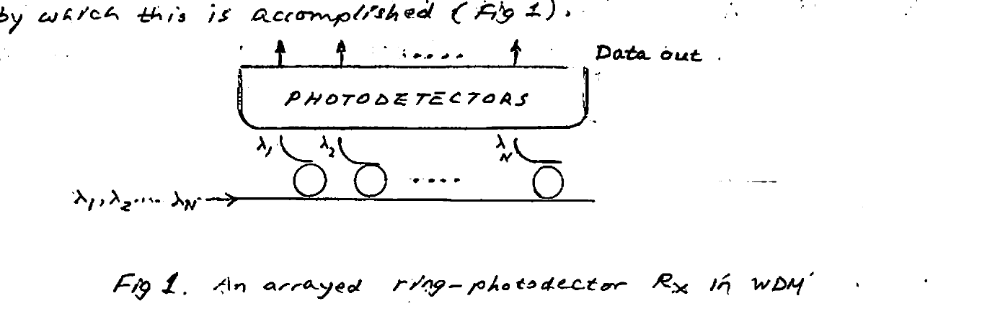
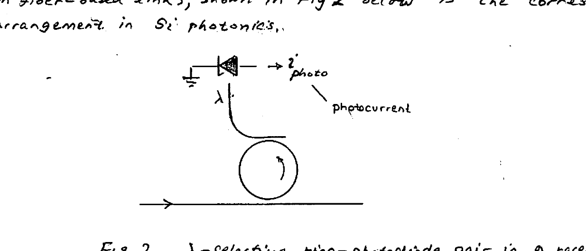
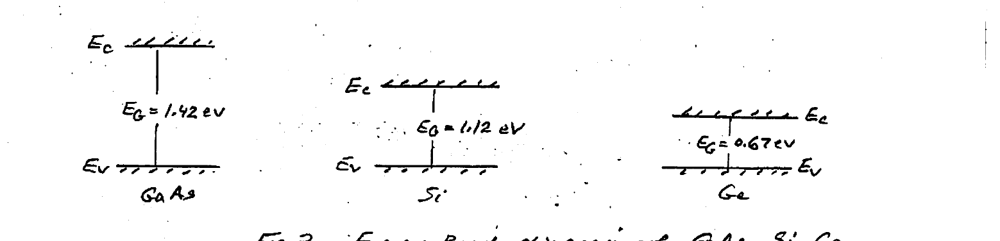
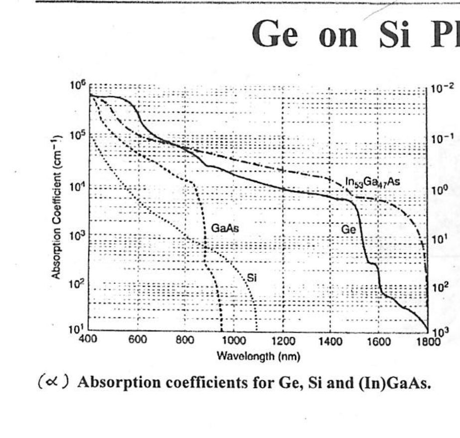
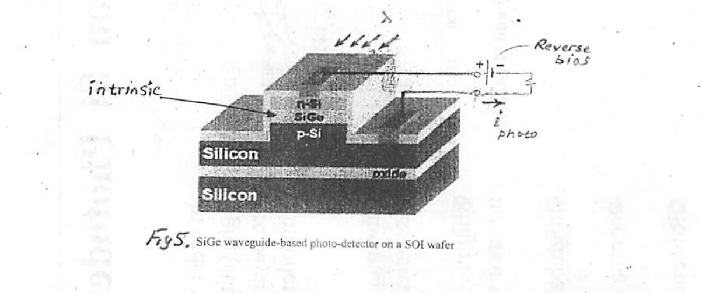
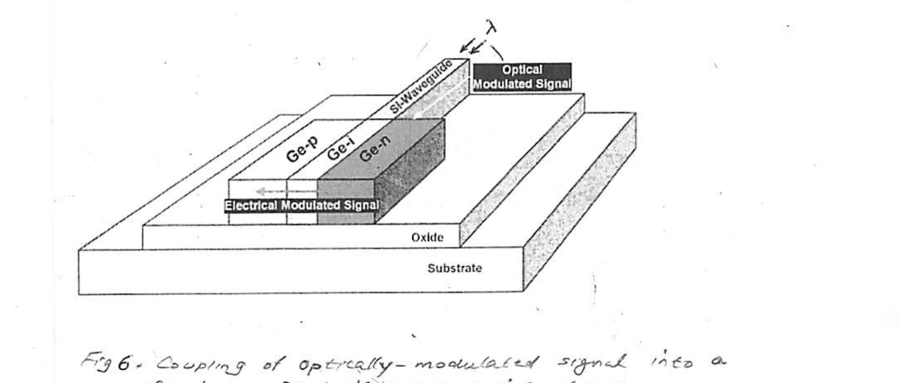
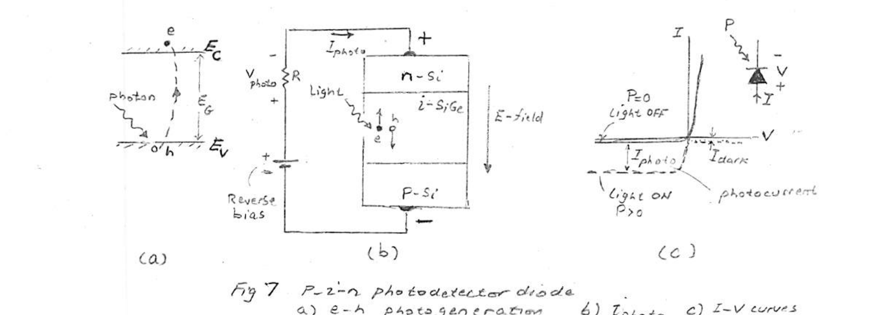
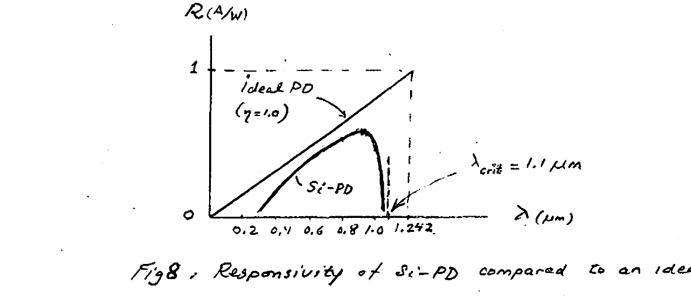
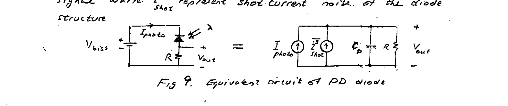

# Lecture 9 — Photodetector

**EECE 7398 — Analysis & Design of Photonic Integrated Circuits (PICs)** · Northeastern University, Dept. of Electrical & Computer Engineering · Sp-2023

---

## Overview

The extraction of the data from the modulated optical signal — and making it available for electronic processing — is the eventual / final step taking place in the receiver. The **photodetector** is the means by which this is accomplished (Fig 1).



*Fig 1. An arrayed ring-photodetector Rx in WDM.*

Fig 1 shows an **N-array** architecture for a WDM Rx, which is based on $`\lambda`$-selective ring–photodetector pairs. As a result of its opto-electronic action, the photodetector array outputs $`N`$ data streams of the modulating data present in the input wavelengths ($`\lambda_1, \cdots, \lambda_N`$).

In parallel with the **ROSA** (Receiver Optical Sub-Assembly) employed in fiber-based links, shown in Fig 2 below, is the corresponding arrangement in Si photonics.



*Fig 2. $`\lambda`$-selective ring–photodiode pair in a receiver.*

In Fig 2, a photodiode is employed as the photodetector to convert the optical data to electronic data. As we shall see, this data is in the form of a **"photocurrent"** $`i_{photo}`$.

Here too, the Si-WG dropping the light to the photodiode must be coupled "tightly" at its end to the photodiode for optimum conversion efficiency.

---

## Photodetector Operating Principle

Photodetector operation is based on the **"photo-electric"** effect applied to a semiconductor.

A brief review of semiconductors is in order at this point. Fig 3 below shows the **"energy band"** diagram that governs the operation of a pure semiconductor such as GaAs, Silicon, or Germanium.

Here, $`E_V`$ = top of **"Valence Band"**, $`E_C`$ = bottom of **"Conduction Band"**, and $`E_C - E_V = E_G`$ is the **"Forbidden Energy Gap"** of the semiconductor:

- $`1.42\ \text{eV}`$ (GaAs)
- $`1.12\ \text{eV}`$ (Si)
- $`0.67\ \text{eV}`$ (Ge)

At absolute zero temperature ($`T = 0\,°K`$), which corresponds to zero thermal energy ($`kT = 0`$), the valence band is "full" w/ bound "valence electrons", while the conduction band is "empty" (of $`e`$'s). At a higher temperature, say room temp. ($`T = 300\,°K`$), thanks to their thermal energy a small number of valence electrons "break" their atomic bonds and become unbound electrons free to move in the semiconductor crystal. Consequently, under application of an electric field (voltage across the semiconductor), these charge carriers contribute to a current. Because they contribute to "conduction" of current (and due to their higher energy), these $`e`$'s now populate the **"conduction band"**.

Electrons leaving the valence band and "migrating" to the conduction band leave behind a "missing electron charge", i.e. a **"hole"** of positive charge equal to that of an electron. This process of creation of **"e–h pairs"** is termed **"e–h Generation"**.

The holes (in the valence band) can also "hop" from one atom to another. This occurs when a bound electron "breaks" away from a nearby atom and "falls" into a "hole" — cancelling the "hole" and leaving behind a new "hole". This is equivalent to a "hole" movement in the **opposite direction** and results in a separate current of holes. Note that $`e`$'s and $`h`$'s produce **additive** currents!



*Fig 3. Energy-Band diagram of GaAs, Si, Ge.*

It is possible that a "free electron" in the conduction band "drops" into the valence band "filling" a hole. This process is termed **"e–h Recombination"**.

For semiconductors in thermal equilibrium the rates of "Generation" and "Recombination" of e–h pairs are in balance — resulting in an equilibrium concentration of electrons $`n\ (\text{cm}^{-3})`$ and $`p\ (\text{cm}^{-3})`$ where $`n = p`$. For a pure (**"INTRINSIC"**) semiconductor this equality is often denoted by $`n_i = p_i`$.

At room temperature $`T\ (300\,°K)`$ the following intrinsic concentrations exist:

```math
\left.
\begin{aligned}
n_i = p_i &= 9 \times 10^{6}\ \text{cm}^{-3} && (\text{GaAs}) \\
n_i = p_i &= 1.45 \times 10^{10}\ \text{cm}^{-3} && (\text{Si}) \\
n_i = p_i &= 2.4 \times 10^{13}\ \text{cm}^{-3} && (\text{Ge})
\end{aligned}
\right\} \quad (1)
```

> Note the increase in $`n_i\ (p_i)`$ as the energy gap decreases!

Next, consider the action of IR light striking the semiconductor surface. Assuming sufficient photon energy ($`E_{photon}`$ greater than $`E_G`$), a photon will generate an e–h pair upon "collision" with a semiconductor atom. The **"critical"** wavelength of light below which e–h production commences is found in straightforward manner:

```math
E_{photon} = E_G \qquad (2)
```

where $`E_{photon} = hf`$ (and $`f = c/\lambda`$).

By substitution into (1), one finds:

```math
\lambda_{critical} = \frac{hc}{E_G} \qquad (3)
```

For $`E_G`$ expressed in (eV) and $`\lambda`$ in (μm), (2) becomes:

```math
\lambda_{critical}\ (\mu m) = \frac{1.242}{E_G\ (\text{eV})} \qquad (3)
```

> $`1\ \text{eV} = 1.6 \times 10^{-19}\ \text{Joules}`$
> $`h = 6.626 \times 10^{-34}\ \text{Joule-sec}`$

Using eqn (3) for GaAs, Si, and Ge, we obtain:

| Material | GaAs | Si | Ge |
| --- | --- | --- | --- |
| $`\lambda_{cr}`$ | 0.87 μm | 1.1 μm | 1.85 μm |

These results demonstrate that photodetectors made of GaAs and Si are well suited for IR light with $`\lambda = 0.85\ \mu m`$ (produced by some lasers).

The results also demonstrate that for IR light w/ $`\lambda > 1.1\ \mu m`$, Si is **not** photosensitive, and thus IR light with such wavelengths is **NOT** absorbed by Si. In other words, Si is **"transparent"** for all IR wavelength bands of transmission windows: O, E, S, C, L, U. This transparency of Si to IR bands makes it very well-suited — excellent **WAVEGUIDE** material.

In comparison, Ge, with its smaller $`E_G`$ and hence longer $`\lambda_{critical}`$ ($`1.85\ \mu m`$) is very well suited as an IR photodetector material. In fact its long $`\lambda_{critical}`$ makes Ge a useful optical detector material for all the IR optical bands O, …, U. Fig 4 shows the variation with wavelength of the absorption coefficient ($`\alpha\ (\text{cm}^{-1})`$) of Ge. Included for comparison are the corresponding curves for Si and GaAs.

---

## Ge on Si Photodetector



*Fig 4. Absorption coefficient $`\alpha\ (\text{cm}^{-1})`$ for Ge, Si, and GaAs.*

In order to sensitively detect the near infrared light (such as 1.31 μm, 1.55 μm), designers are paying attention to the **"Ge on Si"** photodetectors.

**Advantages:**

- excellent optoelectronic properties,
- high responsivity from visible to near-infrared wavelengths,
- high bandwidths,
- compatibility with silicon CMOS circuits,
- low cost and low power consumption.

Since Ge is already being used as SiGe in **HBTs** (used in BiCMOS) — it is a natural material for making **PHOTODETECTORS**. This is accomplished thru **"implantation"** into Si — which has the desirable effect of "shifting" downwards the energy gap of Si and thus making it capable of IR detection.

Figure 5 below shows such a photodetector fabricated on an SOI wafer. Note the **p–i–n** structure in which an "intrinsic" SiGe forms the light-sensitive medium.



*Fig 5. SiGe waveguide-based photo-detector on an SOI wafer.*

Note the p- and n-Si regions of the p–i–n structure are reversely biased by the DC source (battery). The reverse bias is necessary to create an electric field in the i-layer in order to "sweep out" photo-generated e–h pairs to produce a photocurrent ($`i_{photo}`$) in response to the incident IR light ($`\lambda`$).

A typical arrangement for coupling the IR light in Silicon Photonics employs a Si-waveguide. This is shown in Fig 6.



*Fig 6. Coupling of optically-modulated signal into a Ge-based photodetector p–i–n diode.*

---

## Operation

Reference is made here to Fig 7 below.



*Fig 7. P–i–n photodetector diode. a) e–h photogeneration  b) $`I_{photo}`$  c) I–V curves.*

**LIGHT "OFF":** In absence of IR light, the small number of thermally-generated e–h pairs gives rise to a minute (negligible) reverse current ($`I_{dark}`$ on I–V curve).

**LIGHT "ON":** A large number of "photo-generated" e–h pairs are produced by photon–atom interaction. These are swept by the large E-field established across the p–i–n structure by the "Reverse bias" battery. The additive currents they produce thru motion in opposite directions is $`I_{photo}`$, which can be detected as a photo-voltage signal $`V_{photo}`$ across a series resistor $`R`$.

---

## PD Performance Parameters

The performance of a PD diode is measured by several parameters: **Responsivity**, **Quantum Efficiency**, **Bandwidth**, **Noise**, and **Detectivity**.

### Responsivity ($`R`$)

In a photodetector the photocurrent ($`I_{photo}`$), being proportional to the incident optical power ($`P`$), defines a **"Responsivity"**, $`R`$:

```math
R = \frac{I_{photo}}{P} \qquad \left(\frac{A}{W}\right) \qquad (4)
```

Typically, $`R \sim 1\ \text{A/W}`$ — i.e. an optical power of 1 μW produces a 1 μA photocurrent.

### Quantum Efficiency ($`\eta`$)

This is defined as the **PROBABILITY** of creation of an e–h pair by an incident photon of light.

If per-unit-time $`G`$ e–h pairs are generated by a flux $`\phi`$ of incident photons per-unit-time, then $`\eta \triangleq G/\phi`$.

We can express:

```math
G = I_{photo}/q \qquad (5) \qquad q = \text{"e" charge}
```

```math
\phi = P/hf \qquad (6) \qquad hf = \text{photon energy}
```

which lead to $`\eta`$:

```math
\eta = \frac{I_{photo}/q}{P/hf} = R\left(\frac{hf}{q}\right) \qquad (7)
```

Typically $`\eta \approx 0.8\text{–}0.9`$ — a reflection of the possibility that 10%–20% of incident photons get absorbed by processes ineffective in producing e–h — such as vibrational energy of atoms of the semiconductor.

The above $`\eta`$ can be used to re-express the Responsivity:

```math
R = \eta\,\frac{q}{hf} = \eta\left(\frac{\lambda\,(\mu m)}{1.242}\right) \qquad (8)
```

The actual Responsivity of a photodiode differs from the ideal $`\lambda`$-proportional behavior in eqn (8). As an example, we show in Fig 8 a comparison of the Responsivity of a Si-photodiode with an ideal photodiode with $`\eta = 1`$. Notice the marked drop in Responsivity of the Si-PD as the wavelength $`\lambda`$ approaches the critical wavelength $`\lambda_{crit} = 1.1\ \mu m`$.



*Fig 8. Responsivity of Si-PD compared to an ideal PD.*

### Bandwidth & Response Speed

The speed of response of a PD to a change in light power may be limited by two main effects: diode (junction) capacitance ($`C_D`$) and "transit time" of charge carriers crossing the intrinsic region width. These two factors limit the response speed of the PD. Often, however, the transit time is extremely short and the junction capacitance becomes the dominant factor affecting the speed thru the circuit R–C time constant.

Shown below is a typical biasing circuit of a PD along with the equivalent circuit. Here $`I_{photo}`$ is the optical signal while $`\overline{i^2_{shot}}`$ represents "shot-current" noise of the diode structure.



*Fig 9. Equivalent circuit of PD diode.*

The Bandwidth $`B\ (\text{Hz})`$ is limited by the R–C of the circuit:

```math
B\ (\text{Hz}) = \frac{1}{2\pi R C_D} \qquad (9)
```

Clearly for wide BW the $`R C_D`$ product must be kept small — through small $`C_D`$ (PD design) or reduced $`R`$. Clearly, a trade-off exists b/w Bandwidth and Output since $`V_{out} = I_{photo}\cdot R`$.

### Noise

The noise produced by the photodiode is **"SHOT NOISE"** with a **"white spectrum"** and Spectral Density:

```math
S_i = 2qI_{photo}
```

where $`I_{photo}`$ = signal current. Because of reverse-current operation $`S_i`$ is typically small. For e.g., if $`I_{photo} = 10\ \mu A`$, one computes $`S_i = 3.2 \times 10^{-24}\ \text{A}^2/\text{Hz}`$.

Assuming the BW of a Broadband amplifier employed to amplify the signal $`V_{out}`$ has a $`BW = 40\ \text{GHz}`$, this translates to a mean-square shot-noise current of:

```math
\overline{i^2_n} = 12.8 \times 10^{-14}\ \text{A}^2 \quad (= S_i \times BW), \qquad \text{i.e.}\ i_n(\text{rms}) = 0.36\ \mu A
```

The SNR can be estimated roughly by $`\text{SNR} = \dfrac{I_{photo}}{i_n(\text{rms})}`$ — giving a value of $`\text{SNR} = 28`$ (or 29 dB). This calculation suggests a small contribution by the PD when the overall noise performance of a Receiver front end including the amplifier used for boosting the photocurrent signal $`I_{photo}`$.

### Detectivity ($`D`$)

The detectivity of a photodiode is a measure of its ability to detect weak signals. Thus, $`D`$ is defined as the inverse of the **Minimum Detectable Optical Signal Power (MDS)**, which by definition corresponds to a $`\text{SNR} = 1`$. This implies a ratio $`I_{photo}/i_n(\text{rms}) = 1`$.

Thus:

```math
D = \frac{1}{P(\text{MDS})} = \frac{R}{I_{photo}(\text{MDS})} = \frac{R}{i_n(\text{rms})} \qquad (W^{-1})
```

where $`i_n(\text{rms}) = \sqrt{S_i\,B} = \sqrt{2q}\,\sqrt{I_{photo}\,B}`$:

```math
D = \frac{R}{\sqrt{2q\,I_{photo}\,B}} \qquad (10)
```

---

## The Photocurrent

The current $`i_{photo}`$ produced by the photodiode is expressible as:

```math
i_{photo} = R \cdot P \qquad (11)
```

where $`P`$ is the optical power of the incident light flux. In terms of the electric field phasor $`E(t)`$, the optical power is given by:

```math
P = \tfrac{1}{2}\,\text{Re}\left(E \cdot E^*\right) \qquad (12)
```

For OOK-modulated optical signal*:

```math
E(t) = B(t)\,e^{j\omega_0 t} \qquad (13)
```

where $`B(t)`$ = digital bit stream, and $`\dfrac{\omega_0}{2\pi}`$ is the optical frequency.

Substitution of (13) into (12) yields:

```math
\begin{aligned}
i_{photo} &= \tfrac{1}{2} R \cdot \text{Re}\left[E \cdot E^*\right] \\
i_{photo} &= \tfrac{1}{2} R \cdot \text{Re}\left[B^2_{(t)}\,e^{j\omega t}\cdot e^{-j\omega t}\right] \\
&= \tfrac{1}{2} R\, B^2_{(t)} \qquad (5) \quad (\text{Units of } B^2 = \text{Watts})
\end{aligned}
```

This result reflects an important feature of the physics of the response of the PD to the modulated light: the mobile charge carriers, i.e. $`e`$'s & $`h`$'s, respond to all frequency components contained in the optical signal, **except** the optical frequency ($`\omega_0`$). The latter (typically in 100's THz) is simply "too fast" for $`e`$'s & $`h`$'s to follow. Thus for 100 Gb/s bit rate of $`B(t)`$, Eqn (5) indicates a photocurrent at the 100 Gb/s data rate.

> \* For $`B(t)`$ a bitstream (e.g. `0 1 0 1 1 0`), the OOK-modulated $`E(t)`$ is the same bit pattern impressed on the optical carrier.
